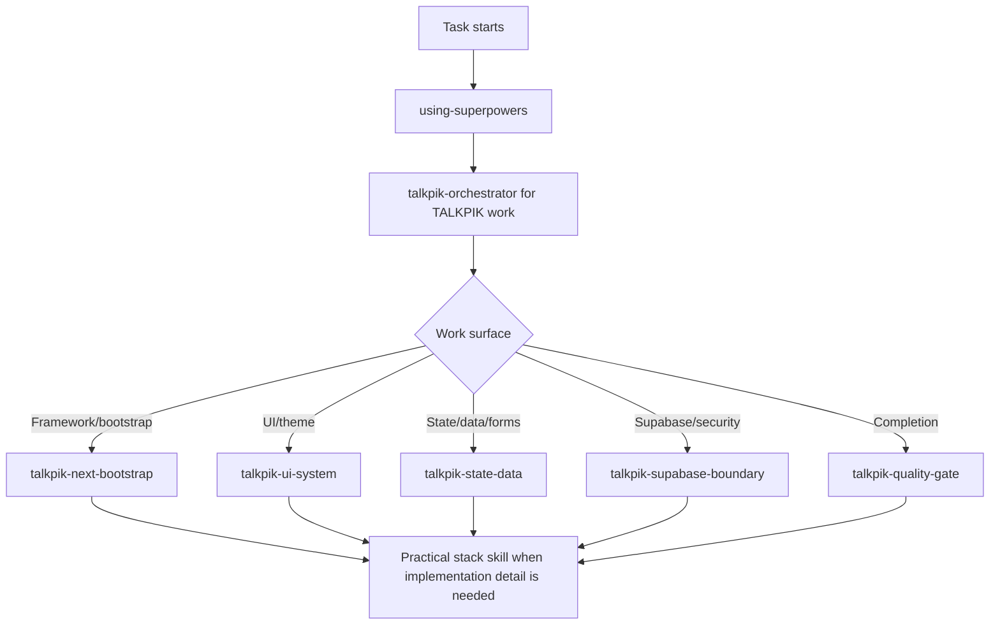

# Agent Skills Catalog

This directory contains the project-owned AI skill sources for TALKPIK AI.
These files are versioned so Codex, Claude Code, and future agent hosts can
follow the same workflow contract.

## Source Of Truth

| Path | Role | Versioned? | Notes |
| --- | --- | --- | --- |
| `.agents/skills/talkpik-*/SKILL.md` | TALKPIK project-specific skills | yes | Product, stack, UI, state, Supabase, and quality gates. |
| `.agents/skills/<practical-skill>/` | Practical development skills | yes | Project-local implementation guidance for the approved stack. Some skills include helper files, not only `SKILL.md`. |
| `.agents/superpowers/skills/*/SKILL.md` | Superpowers workflow skills | yes | Startup, planning, TDD, debugging, review, and verification discipline. |
| `skills-lock.json` | Practical skill install lock | yes | Records installer source, source path, and computed hash for installed practical skills. |
| `.codex/skills/*` | Codex runtime mirror | no | Generated by `node scripts/sync-agent-skills.mjs`. Do not edit directly. |
| `.claude/skills/*` | Claude Code runtime mirror | no | Generated by `node scripts/sync-agent-skills.mjs`. Do not edit directly. |
| `.agents/skills/gstack/` | Optional local GStack fallback | no | Local fallback assets only. If unavailable, use the documented degraded-mode fallback. |

After editing any versioned skill, run:

```bash
node scripts/sync-agent-skills.mjs
node scripts/sync-agent-skills.mjs --check
```

## TALKPIK Project Skills

| Skill | Use When |
| --- | --- |
| `talkpik-orchestrator` | Starting any TALKPIK implementation, refactor, bug fix, UI, backend, AI, deployment, or quality task. Routes the agent through project docs and project-local skills before editing. |
| `talkpik-next-bootstrap` | Creating or changing the Next.js App Router foundation, source tree, package scripts, TypeScript setup, Tailwind setup, Ant Design providers, or initial app bootstrap. |
| `talkpik-ui-system` | Building or changing UI, Ant Design components, Tailwind utility usage, theme tokens, light/dark appearance, layout, visual states, or design-system consistency. |
| `talkpik-state-data` | Implementing or reviewing React state, Zustand stores, TanStack Query usage, server data ownership, URL state, forms, React Hook Form, or Zod validation. |
| `talkpik-supabase-boundary` | Working on Supabase Auth, Postgres schema, RLS policies, Storage, server/client Supabase clients, profile data, admin roles, migrations, or database security. |
| `talkpik-quality-gate` | Verifying work, reviewing code, checking tests, validating UI flows, preparing final reports, or claiming TALKPIK work complete. |

## Practical Development Skills

These are advisory implementation skills for the approved stack. Use them under
the relevant `talkpik-*` guardrail; they do not override project docs.

| Surface | Skills |
| --- | --- |
| Next, React, Vercel | `next-best-practices`, `next-cache-components`, `next-upgrade`, `vercel-composition-patterns`, `vercel-react-best-practices`, `vercel-react-view-transitions`, `deploy-to-vercel`, `vercel-cli-with-tokens`, `web-design-guidelines`, `vercel-react-native-skills` |
| Supabase and Postgres | `supabase`, `supabase-postgres-best-practices` |
| UI, forms, and tests | `ant-design`, `react-hook-form-zod`, `vitest-testing`, `playwright-skill` |

Use `next-upgrade`, `deploy-to-vercel`, `vercel-cli-with-tokens`, and
`playwright-skill` only for matching tasks because they can imply broader or
side-effectful workflows. `playwright-skill` is constrained to local QA usage
unless an explicit approved task says otherwise.

## Superpowers Skills

| Skill | Use When |
| --- | --- |
| `using-superpowers` | Starting any conversation or task. Establishes skill discovery and requires relevant skills before response or action. |
| `brainstorming` | Before creative work: creating features, building components, adding functionality, or modifying behavior. |
| `writing-plans` | A spec or requirements exist for a multi-step task and implementation should be planned before editing. |
| `test-driven-development` | Implementing a feature or bug fix before writing implementation code. |
| `systematic-debugging` | Encountering a bug, test failure, or unexpected behavior before proposing fixes. |
| `requesting-code-review` | Completing tasks, implementing major features, or preparing to merge and needing independent verification. |
| `receiving-code-review` | Processing review feedback before implementing suggestions, especially when feedback is unclear or technically questionable. |
| `verification-before-completion` | About to claim work is complete, fixed, or passing. Requires evidence before success claims. |
| `finishing-a-development-branch` | Implementation is complete, tests pass, and the agent must decide merge, PR, or cleanup steps. |
| `dispatching-parallel-agents` | There are two or more independent tasks without shared state or sequential dependencies. |
| `subagent-driven-development` | Executing implementation plans with independent tasks in the current session. |
| `executing-plans` | A written implementation plan exists and should be executed with review checkpoints. |
| `using-git-worktrees` | Starting feature work that needs isolation from the current workspace or before executing implementation plans. |
| `writing-skills` | Creating, editing, or verifying skills before deployment. |

## Skill Selection Flow



For the full AI workflow, use `AGENTS.md`.
