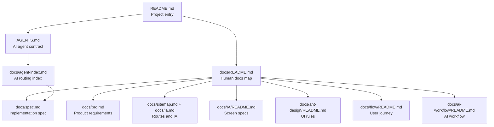

# TALKPIK AI Project Guide

TALKPIK AI is an AI-assisted study workspace for TOPIK preparation.

The repository is currently pre-implementation. There is no stable `src/` or
`package.json` yet, so `docs/` is the source of truth for product, IA, design,
implementation, and AI-agent workflow decisions.

## Document Map

## Main Entry Points

| Need | Start here |
| --- | --- |
| Implementation stack, dependencies, backend, auth, AI boundary, deployment, environment variables, testing | [docs/spec.md](./docs/spec.md) |
| Product scope, user value, business rules | [docs/prd.md](./docs/prd.md) |
| Routes and navigation | [docs/sitemap.md](./docs/sitemap.md), [docs/ia.md](./docs/ia.md) |
| Specific screen requirements | [docs/IA/README.md](./docs/IA/README.md) |
| UI system, Ant Design patterns, theme rules | [docs/ant-design/README.md](./docs/ant-design/README.md) |
| User journey and transitions | [docs/flow/README.md](./docs/flow/README.md) |
| AI-agent workflow, ledgers, reports | [docs/ai-workflow/README.md](./docs/ai-workflow/README.md) |
| AI document routing | [docs/agent-index.md](./docs/agent-index.md) |

## How To Ask An AI Agent

Natural language is enough, but include the target docs when you know them.

| Goal | Example request |
| --- | --- |
| Build a feature | "`docs/spec.md` 기준으로 글쓰기 제출 흐름을 구현해줘." |
| Check the implementation stack | "`docs/spec.md` 기준으로 Auth와 AI 경계를 다시 검토해줘." |
| Build a screen | "`docs/IA`와 `docs/ant-design` 기준으로 대시보드 화면을 만들어줘." |
| Check a user flow | "`docs/flow/user-flow.md` 기준으로 학습 플로우가 자연스러운지 검토해줘." |
| Manage AI workflow | "`docs/ai-workflow` 기준으로 context ledger를 만들고 진행해줘." |

## Current Project State

| Item | State |
| --- | --- |
| Implementation status | Pre-implementation. `src/` and `package.json` do not exist yet. |
| Single implementation spec | [docs/spec.md](./docs/spec.md) |
| Product source of truth | [docs/prd.md](./docs/prd.md) |
| UI source of truth | [docs/ant-design/README.md](./docs/ant-design/README.md), [docs/IA/README.md](./docs/IA/README.md) |
| AI workflow source of truth | [AGENTS.md](./AGENTS.md), [docs/agent-index.md](./docs/agent-index.md), [docs/ai-development-workflow.md](./docs/ai-development-workflow.md), [docs/ai-workflow/README.md](./docs/ai-workflow/README.md) |

## Operating Rule

Do not invent behavior from scratch. Read the smallest relevant active docs,
check for conflicts, make changes against those docs, and report the verification
evidence.
