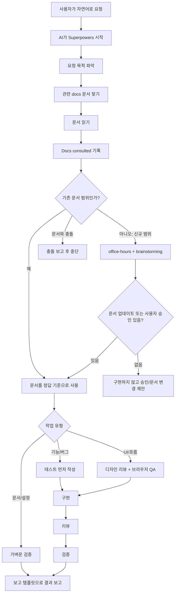
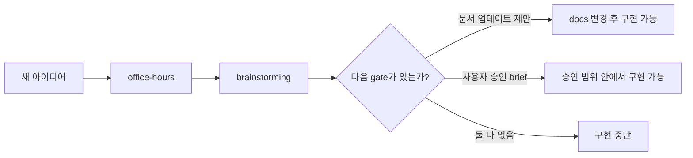
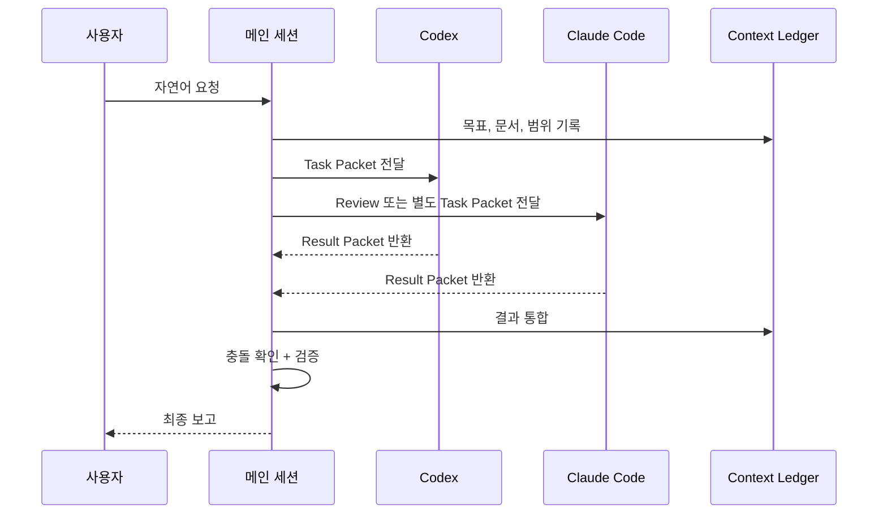
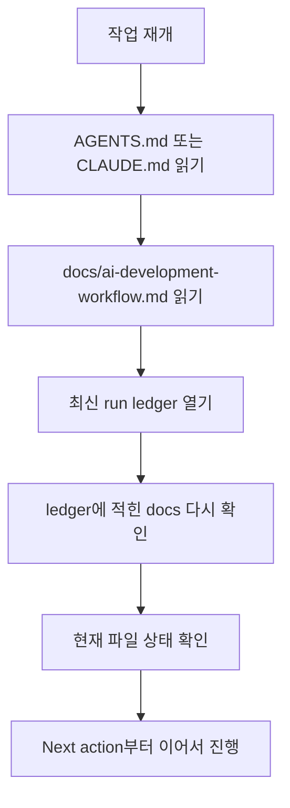
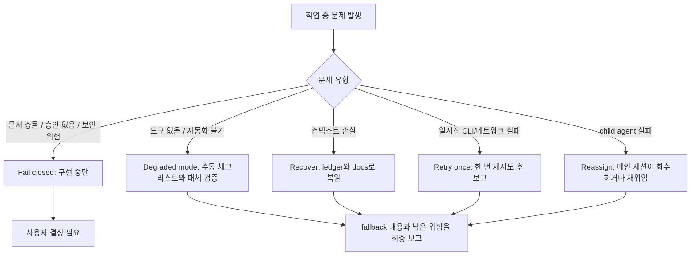

# TOPIK Project v13 AI 워크플로우 안내

이 프로젝트는 **AI가 마음대로 코드를 만들지 않도록** 설계된 작업 흐름을 사용합니다.
Codex와 Claude Code를 함께 쓰더라도, 둘 다 같은 규칙을 따라야 합니다.

비개발자나 바이브코더 관점에서 한 문장으로 말하면:

> "AI에게 바로 만들라고 시키는 대신, 먼저 프로젝트 문서를 읽게 하고, 계획을 세우게 하고, 검증하게 만드는 안전장치입니다."

---

## 이 프로젝트의 현재 상태

이 저장소는 현재 **pre-implementation**, 즉 본격 구현 전 상태입니다.

- `src/`, `package.json` 같은 앱 코드가 아직 없습니다.
- 실제 제품 방향은 `docs/` 문서에 들어 있습니다.
- AI는 코드를 만들기 전에 반드시 관련 문서를 먼저 읽어야 합니다.
- 문서와 사용자 요청이 충돌하면, AI는 멋대로 새 방향을 만들면 안 됩니다.

---

## AI에게는 이렇게 말하면 됩니다

자연어로 말하면 됩니다. 단, 좋은 요청은 아래처럼 목적과 범위를 같이 줍니다.

| 원하는 일 | 이렇게 말하면 좋습니다 |
| --- | --- |
| 기능 만들기 | "`docs/spec.md` 기준으로 로그인 흐름을 구현해줘." |
| 화면 만들기 | "TOPIK 대시보드 화면을 문서 기준으로 만들어줘." |
| 버그 수정 | "이 에러를 원인 분석하고 테스트까지 추가해서 고쳐줘." |
| 새 아이디어 검토 | "이 기능이 현재 문서 범위에 맞는지 검토해줘." |
| 문서 정리 | "AI 워크플로우를 비개발자도 이해하게 README로 설명해줘." |

AI는 요청을 받으면 바로 구현하지 않고, 먼저 **이 요청이 기존 문서에 있는 일인지** 확인합니다.

---

## 전체 흐름 한눈에 보기



---

## 핵심 규칙 5가지

| 규칙 | 쉽게 말하면 | 왜 필요한가 |
| --- | --- | --- |
| 1. 문서 먼저 | AI는 `docs/`를 먼저 읽습니다. | 제품 방향을 즉흥적으로 만들지 않게 합니다. |
| 2. 신규 범위는 바로 구현 금지 | 문서에 없는 새 기능은 승인 gate가 필요합니다. | 아이디어와 구현이 섞여 제품이 흔들리는 일을 막습니다. |
| 3. 테스트 우선 | 코드 변경은 실패하는 테스트부터 시작합니다. | "작동하는 척"을 줄입니다. |
| 4. 리뷰 필수 | Codex 또는 Claude가 구현하면 다른 쪽이 검토합니다. | 놓친 버그와 과한 변경을 줄입니다. |
| 5. 컨텍스트 ledger | 긴 작업은 작업 기록 파일을 남깁니다. | AI가 중간에 맥락을 잃어도 복원할 수 있습니다. |

---

## docs가 왜 중요한가요?

이 프로젝트에서는 `docs/`가 제품의 기준입니다.

AI는 다음처럼 요청 목적에 맞는 문서를 골라 읽습니다.

| 요청 목적 | AI가 읽어야 하는 문서 |
| --- | --- |
| 제품 범위, 사용자 가치, 비즈니스 규칙 | `docs/prd.md` |
| 기능 동작, 검증, 데이터 처리 | `docs/spec.md` |
| 페이지 구조, 라우트 | `docs/ia.md`, `docs/sitemap.md` |
| 사용자 흐름 | `docs/flow/user-flow.md` |
| UI, 디자인 시스템, Ant Design | `docs/ant-design/README.md` |
| 특정 페이지 화면 | `docs/IA/<page>/description.md` |

중요한 점:

- `docs/flow/user-flow.md`가 현재 사용자 흐름의 정본입니다.
- `docs/user-flow.md`는 과거 관측 자료라서 참고용입니다.
- 문서와 요청이 충돌하면 AI는 구현하지 않고 충돌을 보고해야 합니다.

---

## 신규 아이디어는 어떻게 처리하나요?

새로운 기능이나 문서에 없는 범위는 바로 만들지 않습니다.



즉, AI가 "좋아 보이니까 바로 만들겠습니다"라고 하면 안 됩니다.
먼저 다음 중 하나가 있어야 합니다.

- 어떤 문서를 어떻게 바꿔야 하는지 제안
- 사용자가 승인한 구현 brief와 acceptance criteria

---

## Codex와 Claude Code를 같이 쓰는 방식

두 AI를 같이 쓴다고 해서 둘이 마음대로 움직이는 구조가 아닙니다.
항상 **메인 세션**이 작업의 중심입니다.



### Task Packet이란?

AI 하위 작업자에게 주는 작업 지시서입니다.

포함 내용:

- 목적
- 읽은 문서
- 요구사항
- 건드려도 되는 파일
- 건드리면 안 되는 파일
- 필요한 검증
- 결과 보고 형식

### Result Packet이란?

하위 작업자가 메인 세션에 돌려주는 결과 보고서입니다.

포함 내용:

- 읽은 파일
- 바꾼 파일
- 내린 결정
- 실행한 테스트
- 막힌 점
- 가정한 점
- 다음에 해야 할 일

---

## Context Ledger란?

Context Ledger는 AI의 작업 일지입니다.

긴 작업이나 멀티 에이전트 작업에서는 AI의 대화 맥락이 길어져서 일부가 압축되거나 사라질 수 있습니다.
그래서 중요한 정보는 대화창 안에만 두지 않고 파일로 남깁니다.

위치:

```text
docs/ai-workflow/runs/YYYYMMDD-HHMM-task-slug.md
```

기록되는 내용:

| 항목 | 설명 |
| --- | --- |
| User goal | 사용자가 원한 것 |
| Accepted scope | 이번 작업에 포함되는 범위 |
| Docs consulted | AI가 실제로 읽은 문서 |
| Decisions | 작업 중 내린 중요한 결정 |
| Active files | 읽거나 바꾼 파일 |
| Agent assignments | Codex/Claude/하위 에이전트 작업 배정 |
| Verification state | 테스트, 빌드, 리뷰 상태 |
| Risks | 남은 위험과 미검증 영역 |

---

## 작업이 중간에 끊기면 어떻게 이어가나요?

AI는 다음 순서로 복원합니다.



이 방식 덕분에 AI가 이전 대화를 완벽히 기억하지 못해도,
파일에 남은 기록으로 다시 이어갈 수 있습니다.

---

## 도구가 실패하면 어떻게 하나요?

fallback은 "대충 넘어가기"가 아닙니다.
정상 도구가 실패했을 때 **같은 수준의 증거를 다른 방법으로 확보하거나, 안전하게 멈추는 절차**입니다.



| 실패 상황 | AI가 해야 할 일 |
| --- | --- |
| 관련 문서를 못 찾음 | 가장 가까운 active doc을 읽고, 신규 범위 gate로 이동 |
| GStack이나 Superpowers가 실행되지 않음 | project-local skill 문서를 직접 읽고 수동 체크리스트로 대체 |
| 테스트 명령이 없음 | lint, typecheck, build, static inspection, manual QA 중 가능한 검증 사용 |
| 브라우저 QA가 안 됨 | 수동 flow checklist와 blocker 기록 |
| child agent가 결과를 안 줌 | 메인 세션이 scope를 회수하거나 result packet을 다시 요청 |
| GitHub push 실패 | 로컬 커밋까지만 보고하고 remote 실패 원인과 재시도 명령 기록 |
| 문서와 사용자 요청 충돌 | 구현하지 않고 충돌 문서와 필요한 결정을 보고 |

---

## 사용자가 확인해야 할 것

대부분은 자연어로 말하면 됩니다.
다만 중요한 결정을 할 때는 사용자의 승인이 필요합니다.

| 상황 | 사용자가 할 일 |
| --- | --- |
| 기존 문서에 있는 기능 구현 | 자연어로 요청하면 됩니다. |
| 문서에 없는 새 기능 | 승인하거나, 먼저 문서 업데이트를 요청하세요. |
| AI가 충돌을 보고함 | 기존 문서를 따를지, 문서를 바꿀지 결정하세요. |
| AI가 완료 보고함 | `Docs consulted`, 검증 결과, 남은 위험을 확인하세요. |
| Codex와 Claude를 같이 씀 | 한쪽은 구현, 다른 쪽은 리뷰로 쓰는 것이 안전합니다. |

---

## 최종 보고서는 이렇게 나와야 합니다

AI는 작업이 끝났다고 말하기 전에 다음을 보고해야 합니다.

- 무엇을 바꿨는지
- 어떤 문서를 읽었는지
- 문서에서 뽑은 요구사항은 무엇인지
- 어떤 skill과 gate를 사용했는지
- 어떤 테스트나 검증을 했는지
- context ledger 경로는 무엇인지
- 남은 위험이나 생략한 검증은 무엇인지

보고 템플릿:

```text
docs/ai-workflow/report-template.md
```

---

## 주요 파일 지도

| 파일/폴더 | 역할 |
| --- | --- |
| `AGENTS.md` | 모든 AI가 따라야 하는 최상위 운영 계약 |
| `CLAUDE.md` | Claude Code용 프로젝트 지침 |
| `docs/ai-development-workflow.md` | 전체 AI 개발 워크플로우 |
| `docs/ai-workflow/report-template.md` | 최종 보고 템플릿 |
| `docs/ai-workflow/context-ledger-template.md` | 작업 일지 템플릿 |
| `docs/ai-workflow/agent-packets.md` | 멀티 에이전트 작업 지시/결과 템플릿 |
| `docs/ai-workflow/runs/` | 실제 작업별 context ledger 저장 위치 |
| `.codex/skills/` | Codex용 프로젝트-local skills |
| `.claude/skills/` | Claude Code용 프로젝트-local skills |
| `.agents/skills/gstack/` | 공용 GStack fallback assets |

참고: `.codex/`, `.claude/`, `.agents/`, `.omx/`는 로컬 AI harness 설치물과 런타임 산출물입니다.
용량이 크고 실행 환경별로 달라지므로 공개 Git 저장소에는 포함하지 않습니다.
이 저장소에는 해당 설치물을 어떻게 사용해야 하는지에 대한 운영 계약과 문서만 보관합니다.

---

## 비개발자용 요약

이 프로젝트의 AI 워크플로우는 AI를 "즉흥적인 개발자"가 아니라
**문서를 읽고, 계획하고, 검증하고, 보고하는 작업자**로 쓰기 위한 장치입니다.

사용자는 자연어로 요청하면 됩니다.
AI는 내부적으로 다음을 지켜야 합니다.

1. 관련 문서를 찾는다.
2. 문서를 읽고 요구사항을 뽑는다.
3. 새 범위면 바로 만들지 않고 승인 gate를 거친다.
4. 코드 변경은 테스트와 리뷰를 거친다.
5. 긴 작업은 context ledger에 기록한다.
6. 최종 보고에서 검증 결과와 남은 위험을 밝힌다.

이 구조의 목적은 속도를 늦추는 것이 아니라,
AI가 빠르게 움직이더라도 **프로젝트 방향과 품질을 잃지 않게 만드는 것**입니다.
