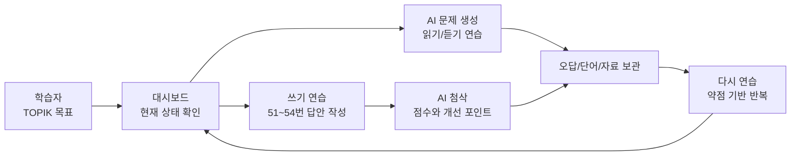
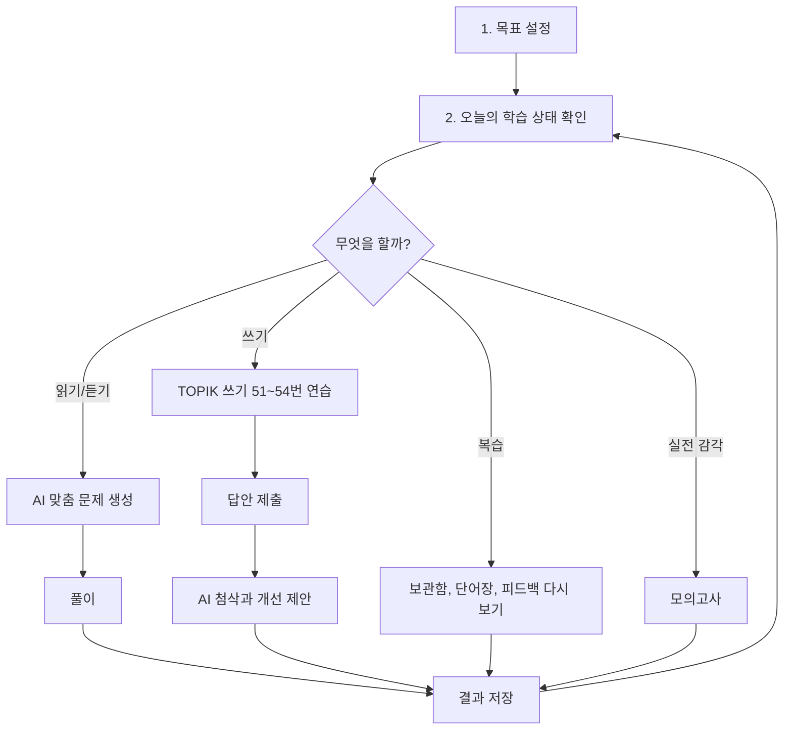
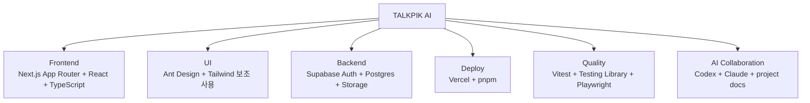
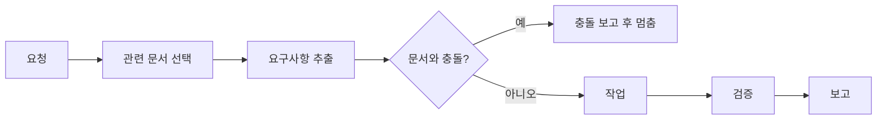
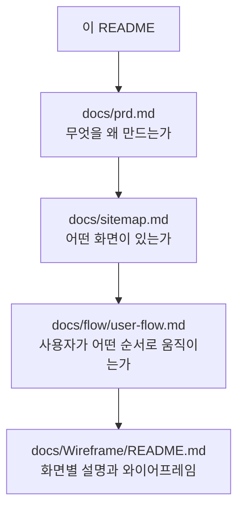
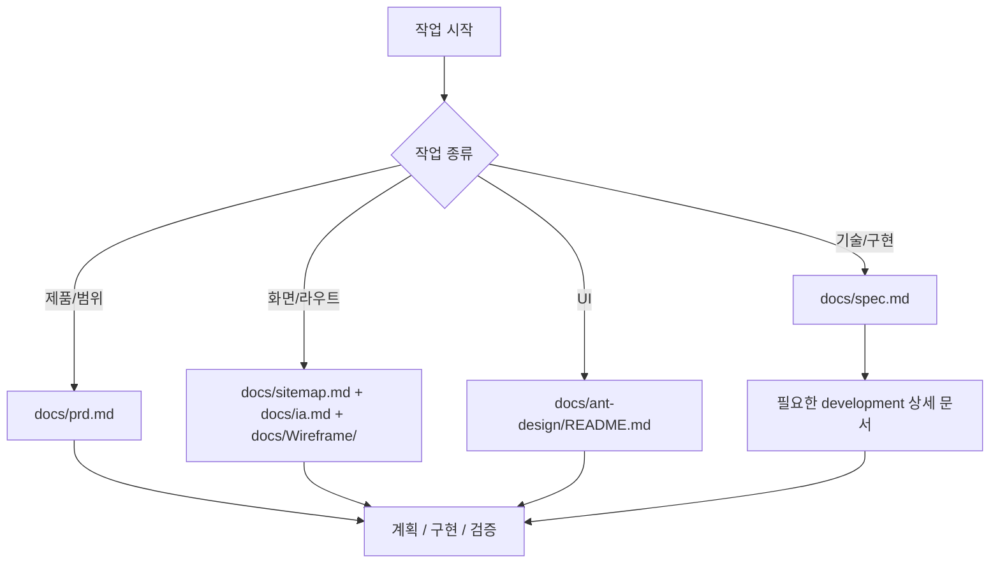
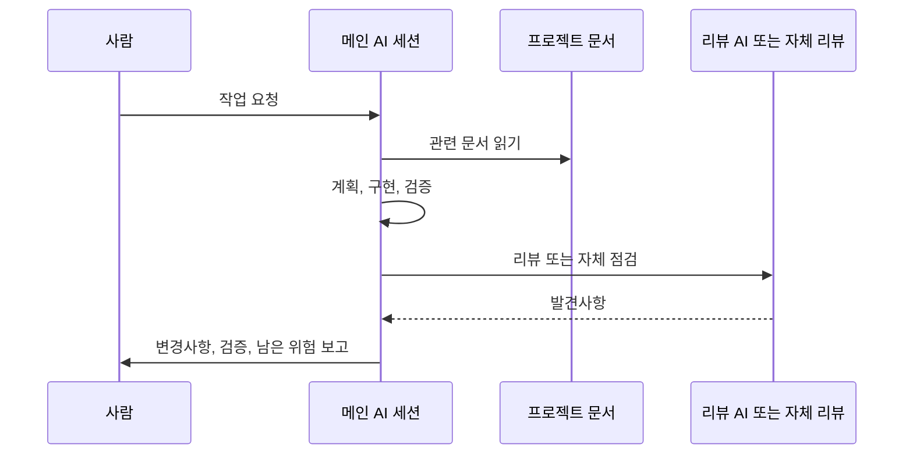
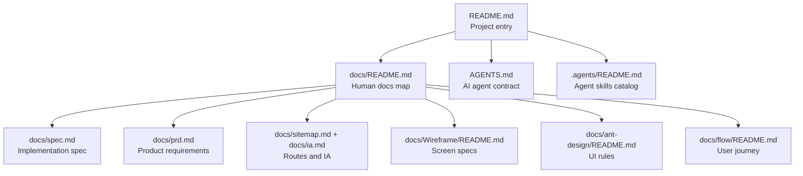

# TALKPIK AI 프로젝트 안내서

TALKPIK AI는 TOPIK 한국어능력시험을 준비하는 학습자를 위한 AI 학습 작업실입니다.
대시보드에서 현재 실력을 보고, 읽기/듣기 문제를 풀고, 쓰기 답안을 작성한 뒤, AI 피드백으로 다시 고치는 흐름을 하나의 제품으로 묶습니다.

이 README는 세 종류의 독자를 위해 썼습니다.

| 대상 | 이 문서를 읽으면 알 수 있는 것 |
| --- | --- |
| 바이브 코더 | AI에게 어떤 문서를 읽히고 어떤 식으로 일을 시켜야 하는지 |
| 비개발자인 외부인 | 이 프로젝트가 무엇을 만들고 있고 현재 어디까지 와 있는지 |
| 함께 개발할 협업자 | 제품 문서, 기술 문서, AI 작업 규칙을 어디서부터 보면 되는지 |

## 한 장으로 보는 프로젝트

TALKPIK AI를 "TOPIK 공부를 위한 개인 트레이닝 센터"로 보면 이해하기 쉽습니다.

비유하면 다음과 같습니다.

| 제품 안의 요소 | 비유 |
| --- | --- |
| 대시보드 | 오늘의 운동 기록판 |
| AI 문제 생성 | 개인 맞춤 문제 출제 코치 |
| 쓰기 연습 | 답안을 써보는 연습장 |
| AI 첨삭 | 옆에서 빨간펜으로 고쳐주는 선생님 |
| 보관함/단어장 | 다시 봐야 할 자료 상자 |
| 모의고사 | 실제 시험처럼 시간을 재는 리허설 |

## 현재 상태

| 항목 | 상태 |
| --- | --- |
| 구현 상태 | 기반 구현 진행 중 — `src/` + `package.json` 존재. App Router 라우트 scaffold + 인증 흐름 + 테마 시스템 + Supabase 스키마/RLS 마이그레이션 완료. 쓰기 제출·피드백 화면과 mock 피드백 경로도 일부 구현됨. 실제 LLM 기반 AI 첨삭·문제 생성은 단계적으로 추가 중. |
| 현재 기준 | `docs/`가 제품, 화면, AI 작업 방식의 source of truth. 인증 영역은 추가로 [`docs/development/auth-overview.md`](./docs/development/auth-overview.md) 가 코드 + 운영 정책 정본. |
| 구현 방식 | Next.js App Router 기반. 인증·테마·DB 스키마는 구현됨, 학습 기능은 단계적 추가. |
| 협업 방식 | 사람과 AI가 같은 문서 세트를 읽고, 변경 근거와 검증 결과를 남깁니다. |

지금 이 저장소는 골조와 일부 인프라 (인증, 테마, DB 스키마/RLS) 가 올라간 공사장입니다. 쓰기 제출·피드백 화면과 mock 피드백 경로는 일부 올라갔고, 실제 LLM 첨삭과 문제 생성은 단계적으로 추가 중입니다. 인증·보안 영역은 골조 + 다른 AI 검토까지 받은 상태. 문서가 여전히 source of truth 라는 점은 변하지 않습니다.

## 만들고 있는 것

TALKPIK AI의 핵심 흐름은 학습자의 반복 학습입니다.

주요 기능 범위는 다음과 같습니다.

| 영역 | 설명 |
| --- | --- |
| 학습 대시보드 | 목표 등급, 학습 시간, 약점, 다음 행동을 한눈에 보여줍니다. |
| AI 문제 생성 | TOPIK 단계, 영역, 문제 유형에 맞춰 연습 문제를 만듭니다. |
| 쓰기 연습 | TOPIK 쓰기 51, 52, 53, 54번 유형을 연습합니다. |
| AI 피드백 | 제출한 답안에 점수, 총평, 단계별 첨삭, 다음 연습 제안을 제공합니다. |
| 보관함과 단어장 | 저장한 문제, 자료, 단어를 다시 복습합니다. |
| 모의고사 | 실제 시험처럼 시간을 두고 문제를 풀 수 있게 합니다. |
| 게시판/공지 | 학습 공지, 이벤트, 운영 안내를 제공합니다. |

## 기술 방향

기술 스택은 이미 정해져 있습니다. 새로운 라이브러리를 기분으로 추가하지 않고, 문서화된 기준을 먼저 봅니다.

| 분야 | 결정 |
| --- | --- |
| 앱 프레임워크 | Next.js App Router |
| UI 런타임 | React |
| 언어 | TypeScript |
| UI 시스템 | Ant Design, `ConfigProvider`, theme tokens |
| 보조 스타일링 | Tailwind CSS, 제한적 유틸리티 레이어 |
| 백엔드 | Supabase |
| 데이터베이스 | Supabase-hosted Postgres |
| 인증 | Supabase Auth |
| 저장소 | Supabase Storage |
| 배포 | Vercel |
| 패키지 매니저 | pnpm |

## 협업 원칙

이 프로젝트에서 문서는 지도, AI는 작업자, 검증은 안전모입니다.

1. 먼저 지도를 봅니다: 아래 문서 맵에서 시작합니다.
2. 작은 범위로 일을 나눕니다: 기능, 화면, 백엔드, UI, QA 중 무엇인지 분명히 합니다.
3. AI에게 "관련 문서를 먼저 읽고 진행하라"고 요청합니다.
4. 변경 후에는 무엇을 바꿨고, 어떤 문서를 근거로 삼았고, 무엇을 검증했는지 남깁니다.
5. 문서와 요청이 충돌하면 구현하지 않고 충돌을 먼저 보고합니다.

## 바이브 코더를 위한 사용법

AI에게 긴 명령을 한 번에 던지기보다, 문서와 검증 조건을 같이 주면 결과가 안정적입니다.

| 하고 싶은 일 | 좋은 요청 예시 |
| --- | --- |
| 기능 만들기 | "`docs/spec.md`를 먼저 읽고, 쓰기 제출 흐름을 구현 계획으로 정리한 뒤 진행해줘." |
| 화면 만들기 | "`docs/Wireframe/README.md`와 `docs/ant-design/README.md` 기준으로 대시보드 화면을 구현해줘. 모바일/데스크톱 검증도 포함해줘." |
| 기술 결정 확인 | "`docs/spec.md` 기준으로 Supabase Auth와 AI 기능의 경계가 맞는지 검토해줘." |
| 문서 정리 | "루트 README를 비개발자도 이해할 수 있게 고치고, 다른 문서와 충돌이 있으면 같이 보고해줘." |

피해야 할 요청도 있습니다.

| 피해야 할 요청 | 이유 |
| --- | --- |
| "그냥 알아서 예쁘게 만들어줘" | 현재 문서와 다른 제품이 될 수 있습니다. |
| "필요한 라이브러리 마음대로 추가해" | 기술 스택은 `docs/spec.md`에 고정되어 있습니다. |
| "테스트는 나중에" | 이 프로젝트는 검증 근거를 남기는 방식으로 협업합니다. |
| "문서 안 보고 바로 구현해" | 문서가 현재 source of truth입니다. |

## 비개발자인 외부인을 위한 읽는 순서

개발 용어가 낯설다면 아래 순서로 보면 됩니다.

구현 기준은 항상 `docs/spec.md`, `docs/sitemap.md`의 Target React Route Map, `docs/Wireframe/`, `docs/flow/user-flow.md` 같은 현재 기준 문서를 우선합니다. 인증·로그인·회원가입 흐름의 코드 + 운영 정책 한 페이지 정리본은 [`docs/development/auth-overview.md`](./docs/development/auth-overview.md) 에 있습니다.

## 개발 협업자를 위한 읽는 순서

개발자가 바로 기억해야 할 규칙은 짧습니다.

| 규칙 | 의미 |
| --- | --- |
| `docs/` 먼저 | 현재는 코드보다 문서가 기준입니다. |
| 현재 기준 문서 우선 | `docs/spec.md`, `docs/sitemap.md`, `docs/Wireframe/`, `docs/flow/user-flow.md`를 기준으로 봅니다. |
| 작은 변경 | unrelated refactor를 섞지 않습니다. |
| 검증 후 완료 | 테스트, 체크, 수동 검증 중 가능한 근거를 남깁니다. |

## AI 에이전트와 함께 일하는 방식

이 프로젝트는 Codex와 Claude를 함께 쓰는 것을 전제로 합니다. 둘 다 같은 프로젝트 문서와 남아 있는 실무 스킬을 보도록 맞춰져 있습니다.

스킬 계층은 다음 순서입니다.

| 층 | 역할 | 예 |
| --- | --- | --- |
| 프로젝트 가드레일 | TALKPIK 문서, 금지사항, 품질 기준, 보안 경계 강제 | `AGENTS.md`, `docs/README.md`, `docs/spec.md` |
| 실무 기술 스킬 | 특정 프레임워크/라이브러리 구현 패턴 제공 | Next/React, Supabase/Postgres, Ant Design, Vitest/Playwright, RHF/Zod |
| 작업 흐름 스킬 | 계획, TDD, 리뷰, 검증 같은 일하는 방식 제공 | Superpowers, GStack skills |

프로젝트 가드레일이 항상 실무 기술 스킬보다 우선합니다. 예를 들어 어떤 외부 스킬이 shadcn/ui나 Redux를 추천해도, `docs/spec.md`가 승인하지 않았으면 사용하지 않습니다.

## Document Map

아래 인덱스는 기존 루트 README의 문서 맵을 유지한 것입니다. 길을 잃으면 여기로 돌아오면 됩니다.

## Main Entry Points

| Need | Start here |
| --- | --- |
| 프로젝트 전체를 사람 관점에서 이해하기 | [docs/README.md](./docs/README.md) |
| Implementation stack, dependencies, backend, auth, AI boundary, deployment, environment variables, testing | [docs/spec.md](./docs/spec.md) |
| Product scope, user value, business rules | [docs/prd.md](./docs/prd.md) |
| Routes and navigation | [docs/sitemap.md](./docs/sitemap.md), [docs/ia.md](./docs/ia.md) |
| Specific screen requirements | [docs/Wireframe/README.md](./docs/Wireframe/README.md) |
| UI system, Ant Design patterns, theme rules | [docs/ant-design/README.md](./docs/ant-design/README.md) |
| User journey and transitions | [docs/flow/README.md](./docs/flow/README.md) |
| AI agent skills catalog and sync model | [.agents/README.md](./.agents/README.md) |
| Auth flow, login/signup/callback/error pages, operational policy (cleanup cron, rate limits, env vars) | [docs/development/auth-overview.md](./docs/development/auth-overview.md) |

## 현재 기준 문서

| 기준 | 문서 |
| --- | --- |
| 단일 구현 기준 | [docs/spec.md](./docs/spec.md) |
| 제품 목적과 범위 | [docs/prd.md](./docs/prd.md) |
| 화면과 라우트 | [docs/sitemap.md](./docs/sitemap.md), [docs/ia.md](./docs/ia.md), [docs/Wireframe/README.md](./docs/Wireframe/README.md) |
| 사용자 흐름 | [docs/flow/user-flow.md](./docs/flow/user-flow.md) |
| UI 규칙 | [docs/ant-design/README.md](./docs/ant-design/README.md) |
| AI 협업 규칙 | [AGENTS.md](./AGENTS.md), [.agents/README.md](./.agents/README.md) |
| 인증 흐름과 운영 정책 | [docs/development/auth-overview.md](./docs/development/auth-overview.md) |

## 운영 규칙

Do not invent behavior from scratch.
새 기능, 화면, 기술 결정을 상상으로 만들지 말고, 가장 작은 관련 문서를 읽고, 충돌이 있는지 확인하고, 변경 근거와 검증 결과를 남깁니다.
