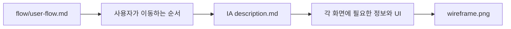

# IA 문서 안내

이 폴더는 TALKPIK AI의 화면 설계서 모음입니다.
IA는 Information Architecture의 줄임말이고, 쉽게 말하면 "앱 화면의 구조와 화면 안에 무엇이 들어가는지"를 정리한 문서입니다.

각 화면 폴더에는 보통 두 가지가 있습니다.

| 파일 | 의미 |
| --- | --- |
| `description.md` | 화면에 어떤 영역, 버튼, 정보, 상태가 있어야 하는지 설명합니다. |
| `wireframe.png` | 화면의 대략적인 배치 그림입니다. |

## Flow와 IA의 관계

사용자 흐름은 [../flow/user-flow.md](../flow/user-flow.md)가 기준입니다.
그 흐름에 등장하는 화면 하나하나의 상세 설명은 이 폴더의 `description.md` 파일을 봅니다.

## 화면 문서 목록

| 단계 | 화면 | 문서 |
| --- | --- | --- |
| 시작 | 회원가입 | [01 A-01 sign-up](./01-A-01-sign-up/description.md) |
| 시작 | 로그인 | [02 A-02 login](./02-A-02-login/description.md) |
| 시작 | 학습 목표 설정 | [03 A-03 learning-goal-setup](./03-A-03-learning-goal-setup/description.md) |
| 홈 | 홈 대시보드 | [04 B-01 home-dashboard](./04-B-01-home-dashboard/description.md) |
| 문제 선택 | 문제 유형 추천 | [05 C-01 problem-type-recommendations](./05-C-01-problem-type-recommendations/description.md) |
| 문제 선택 | 문제 목록 | [06 C-02 problem-list](./06-C-02-problem-list/description.md) |
| 문제 선택 | 다시 풀기 모달 | [07 C-03 retry-modal](./07-C-03-retry-modal/description.md) |
| 답안 작성 | 51번 단답 작성 | [08 D-01 short-answer-writing-51](./08-D-01-short-answer-writing-51/description.md) |
| 답안 작성 | 52번 답안 작성 | [09 D-02 answer-writing-52](./09-D-02-answer-writing-52/description.md) |
| 답안 작성 | 53번 장문 작성 | [10 D-03 long-form-writing-53](./10-D-03-long-form-writing-53/description.md) |
| 답안 작성 | 54번 에세이 작성 | [11 D-04 essay-writing-54](./11-D-04-essay-writing-54/description.md) |
| 답안 작성 | 제출 확인 모달 | [12 D-M1 submission-confirmation-modal](./12-D-M1-submission-confirmation-modal/description.md) |
| 답안 작성 | AI 분석 로딩 | [13 D-M2 ai-analysis-loading](./13-D-M2-ai-analysis-loading/description.md) |
| 피드백 | 단답 피드백 | [14 E-01 short-answer-feedback](./14-E-01-short-answer-feedback/description.md) |
| 피드백 | 장문 피드백 | [15 E-02 long-form-feedback](./15-E-02-long-form-feedback/description.md) |
| 리포트 | 비교 리포트 | [16 R-01 comparison-report](./16-R-01-comparison-report/description.md) |
| 리포트 | 다음 문제 추천 | [17 R-02 next-problem-recommendation](./17-R-02-next-problem-recommendation/description.md) |
| 보관함 | 내 서재 | [18 F-01 my-library](./18-F-01-my-library/description.md) |
| 보관함 | PDF 내보내기 모달 | [19 F-M1 pdf-export-modal](./19-F-M1-pdf-export-modal/description.md) |
| 설정 | 언어 설정 | [20 G-01 language-settings](./20-G-01-language-settings/description.md) |
| 관리자 | 관리자 문제 관리 | [21 H-01 admin-problem-management](./21-H-01-admin-problem-management/description.md) |
| 작성 보조 | 자동저장 경고 | [22 D-M3 autosave-warning](./22-D-M3-autosave-warning/description.md) |
| 확장 | 제품 랜딩 | [23 X-01 product-landing](./23-X-01-product-landing/description.md) |
| 확장 | 성장 대시보드 | [24 X-02 growth-dashboard](./24-X-02-growth-dashboard/description.md) |
| 확장 | Paywall | [25 X-03 paywall](./25-X-03-paywall/description.md) |
| 확장 | 구독 관리 | [26 X-04 subscription-management](./26-X-04-subscription-management/description.md) |
| 확장 | 프로필 편집 | [27 X-05 profile-editing](./27-X-05-profile-editing/description.md) |
| 확장 | 비밀번호 재설정 | [28 X-06 password-reset](./28-X-06-password-reset/description.md) |
| 확장 | 약점 기반 추천 | [29 X-07 weakness-based-recommendations](./29-X-07-weakness-based-recommendations/description.md) |
| 확장 | 기관 관리자 대시보드 | [30 X-08 organization-admin-dashboard](./30-X-08-organization-admin-dashboard/description.md) |
| 확장 | 알림 설정 | [31 X-09 notification-settings](./31-X-09-notification-settings/description.md) |
| 확장 | 관리자 사용자 관리 | [32 X-10 admin-user-management](./32-X-10-admin-user-management/description.md) |

## AI에게 지시할 때

> `docs/IA/README.md`에서 관련 화면을 찾고, 해당 `description.md`와 `wireframe.png`를 기준으로 구현해줘.

화면 이름을 바꾸거나 새 화면을 추가할 때는 [../flow/user-flow.md](../flow/user-flow.md), [../sitemap.md](../sitemap.md), 이 README의 목록을 함께 맞춰야 합니다.
