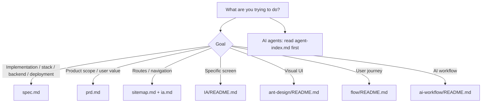

# TALKPIK AI Docs Guide

This folder contains the active documentation for TALKPIK AI. Use it to align
product decisions, implementation work, UI design, user journeys, and AI-agent
workflow.

## Reading Order

Read the entry document first, then only the detailed docs it routes to. Reading
every document by default increases the chance of missing the important one.

## Document Map

| Document | Plain meaning | Use when |
| --- | --- | --- |
| [spec.md](./spec.md) | Single implementation spec and development router. | Implementing features, choosing packages, working with backend/auth/AI/deployment/env vars/tests. |
| [prd.md](./prd.md) | Product purpose, user value, and scope. | Checking product direction, personas, priorities, and business rules. |
| [agent-index.md](./agent-index.md) | AI routing index. | Asking an AI agent to select the correct docs for a task. |
| [sitemap.md](./sitemap.md) | Target route map. | Checking URLs, route hierarchy, and page navigation. |
| [ia.md](./ia.md) | Information architecture. | Understanding screen groups, menus, and content structure. |
| [flow/README.md](./flow/README.md) | User journey folder entry. | Checking the order of signup, study, writing, feedback, and review flows. |
| [IA/README.md](./IA/README.md) | Page-level screen specs and wireframes. | Building or reviewing a specific screen. |
| [ant-design/README.md](./ant-design/README.md) | UI implementation rules. | Designing or implementing UI with Ant Design. |
| [development/README.md](./development/README.md) | Detailed implementation specs. | Reading stack, backend/auth, AI boundary, deployment, or deferred-scope details after `spec.md` routes you there. |
| [ai-workflow/README.md](./ai-workflow/README.md) | AI-agent workflow and evidence rules. | Managing Codex/Claude work, ledgers, reports, and verification. |
| [ia-pages/README.md](./ia-pages/README.md) | Legacy observed HTML page notes. | Historical reference only. Active docs win on conflicts. |

## Example Requests

| Goal | Good request |
| --- | --- |
| Implement a feature | "`docs/spec.md` 기준으로 글쓰기 제출 흐름을 구현해줘." |
| Check stack/auth/AI/deployment | "`docs/spec.md` 기준으로 Auth와 AI 경계를 검토해줘." |
| Build a screen | "`docs/IA`와 `docs/ant-design` 기준으로 홈 대시보드를 만들어줘." |
| Check user flow | "`docs/flow/user-flow.md` 기준으로 학습 플로우가 맞는지 봐줘." |
| Write an AI work report | "`docs/ai-workflow` 기준으로 이번 작업 보고서를 작성해줘." |

## Active And Legacy Docs

Active docs govern implementation, QA, and review:

- `prd.md`
- `spec.md`
- `sitemap.md`
- `ia.md`
- `IA/README.md` and matching `IA/<page>/description.md`
- `flow/user-flow.md`
- `ant-design/README.md`
- `development/*.md` when routed from `spec.md`

Legacy docs are reference only:

- `user-flow.md`
- `ia-pages/`
- legacy static route notes inside `sitemap.md`

If active and legacy docs conflict, active docs win. If active docs conflict
with a user request, stop and report the conflict before implementing.
