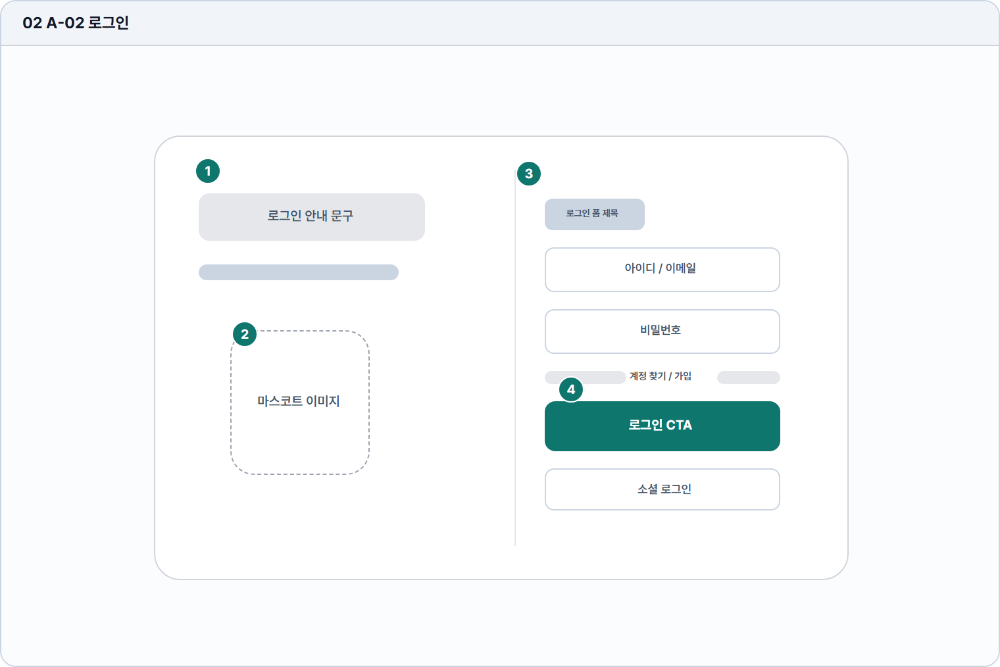

# 로그인

- Source: 02 A-02 로그인
- Code: A-02
- Wireframe: 

## Wireframe Number Map

| No. | Area | Description |
| --- | --- | --- |
| 1 | 환영/브랜드 영역 | 재방문 사용자가 서비스에 돌아왔음을 인지하는 메시지 영역. |
| 2 | 마스코트 안내 | 로그인 전 긴장감을 낮추고 학습 보조 캐릭터를 상기시킴. |
| 3 | 로그인 입력 폼 | 이메일과 비밀번호로 기존 계정 인증을 수행하는 핵심 영역. |
| 4 | 로그인 CTA/계정 링크 | 로그인 성공 시 홈으로 이동하고 계정 찾기/가입 경로를 제공. |

## Detailed Description
### 02 A-02 로그인
1

■ 환영/브랜드 영역

▣ 설명

• 재방문 사용자가 서비스에 돌아왔음을 인지하는 메시지 영역.

▣ 제약 조건: 제목 24자, 보조문 70자/2줄, 실제 로그인 문구 기준 검수.

▣ 예외: 장기 미방문/휴면 사용자는 복귀 안내 문구로 대체. (추후 정책 확정시 변경 가능)

2

■ 마스코트 안내

▣ 설명

• 로그인 전 긴장감을 낮추고 학습 보조 캐릭터를 상기시킴.

▣ 제약 조건: 안내 카피 60자 이하, 이미지 대체 텍스트 필수.

▣ 예외: 이미지 로드 실패 시 기본 캐릭터와 텍스트 안내 노출.

3

■ 로그인 입력 폼

▣ 설명

• 이메일과 비밀번호로 기존 계정 인증을 수행하는 핵심 영역.

▣ 제약 조건: ID 4-80자, PW 8-64자, blur 후 형식 검증.

▣ 예외: 오류 문구는 각 필드 하단. 잠금은 Supabase 서버 측 rate-limit (`over_request_rate_limit`) 으로 강제되며, 클라이언트는 X-11 카드로 안내. 클라이언트 측 실패 카운터는 보안 장치가 아닌 UX 힌트로만 동작 (3회 실패 후 "잠시 후 다시 시도" 안내). Codex P4 D5 결정 (2026-05-29) 근거: `docs/ai-workflow/runs/2026/05/29/p4-codex-delegation/D5-lockout-spec-clarify.md`.

4

■ 로그인 CTA/계정 링크

▣ 설명

• 로그인 성공 시 홈으로 이동하고 계정 찾기/가입 경로를 제공.

▣ 제약 조건: 필수값 충족 전 CTA 비활성, 클릭 후 중복 요청 차단.

▣ 예외: 휴면/탈퇴 계정, 서버 오류, 세션 만료는 인라인 안내.

화면 목적 / 분기 / 피드백 / 예외 상황

목적

기존 사용자를 인증해 홈으로 진입시킨다.

분기

로그인 성공, 계정 찾기, 회원가입, 소셜 로그인으로 분기.

피드백

입력 오류, 실패 횟수, 잠금/캡차 상태를 즉시 안내.

예외

예외: 휴면/탈퇴 계정, 서버 오류, 세션 만료.

## Navigation

- 진입 경로: X-01 제품 랜딩의 로그인 CTA, A-01 회원가입의 로그인 링크, 세션 만료 리다이렉트 `/login?reason=session_expired`.
- 이탈 경로: 학습자 로그인 성공 시 B-01 홈 대시보드, 관리자 로그인 성공 시 X-15 관리자 인덱스, 회원가입은 A-01, 계정 찾기는 X-06, 매직 링크/복구 링크는 `/auth/callback`으로 이동한다.
- 화면 내부 동작: 이메일/비밀번호 로그인, 매직 링크 발송, 소셜 로그인, 입력 오류와 인증 오류 표시.
