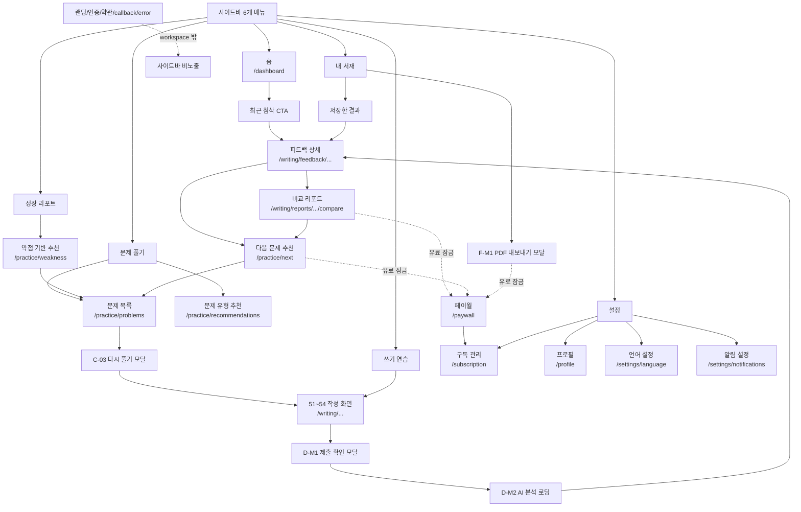

# 사이드바 제외 route의 문맥 배치

- 기준 문서: [`description.md`](./description.md), [`user-flow.md`](../../../flow/user-flow.md), [`sitemap.md`](../../../flow/sitemap.md)
- 관련 판단: [`sidebar-navigation-decision-summary.md`](./sidebar-navigation-decision-summary.md)

## 목적

사이드바에서 빠지는 route는 삭제 대상이 아니다.

이 route들은 사용자가 반복적으로 직접 누르는 상위 메뉴가 아니라, 학습 결과, 잠금 상태, 피드백, 모달 host 화면에서 이어지는 문맥 진입점이다. 따라서 사이드바는 큰 입구만 유지하고, 세부 route는 CTA, deep link, modal host, 잠금 흐름에 붙인다.

## 기본 원칙

1. 사이드바 상위 메뉴는 `홈`, `문제 풀기`, `쓰기 연습`, `내 서재`, `성장 리포트`, `설정` 6개로 유지한다.
2. 피드백 상세, 비교 리포트, 다음 문제 추천, 페이월은 직접 메뉴가 아니라 CTA 또는 deep link로 진입한다.
3. 인증, 랜딩, 약관, callback, error 화면은 workspace 사이드바 밖의 흐름으로 둔다.
4. 모달과 일시 상태는 독립 메뉴가 아니라 host 화면의 사이드바 상태를 따른다.
5. 사이드바 active 상태는 사용자가 보고 있는 화면의 문맥을 기준으로 잡는다.

## route 배치표

| route/화면 | 붙는 위치 | 사이드바 active 상태 | 처리 이유 |
| --- | --- | --- | --- |
| `/practice/next` | 피드백 상세의 `다음 문제 추천` CTA, 비교 리포트의 `다음 문제` CTA, 대시보드의 추천 학습 카드 | `문제 풀기` 또는 `성장 리포트` 문맥 | 반복 진입 메뉴보다 학습 결과 다음 행동에 가깝다. |
| `/paywall` | 비교 리포트, 다음 문제 추천, PDF 내보내기 등 유료 기능 잠금 지점 | 직접 메뉴 없음 | 사용자가 먼저 선택하는 화면이 아니라 잠금 결과 화면이다. |
| `/writing/feedback/short/[id]` | 제출 후 AI 분석 완료, 대시보드 `최근 첨삭`, 내 서재 저장 결과 | `쓰기 연습` 문맥 | 작성 결과에서 이어지는 상세 화면이다. |
| `/writing/feedback/long/[id]` | 제출 후 AI 분석 완료, 대시보드 `최근 첨삭`, 내 서재 저장 결과 | `쓰기 연습` 문맥 | 작성 결과에서 이어지는 상세 화면이다. |
| `/writing/reports/[id]/compare` | 피드백 상세 안의 `비교 리포트` CTA | `쓰기 연습` 또는 `성장 리포트` 문맥 | 결과 분석 화면이므로 직접 메뉴보다 피드백에서 진입하는 편이 자연스럽다. |
| 랜딩/인증/약관/callback/error 화면 | 랜딩, 회원가입, 로그인, 약관 링크, Supabase callback/error 처리 흐름 | 사이드바 비노출 | workspace 진입 전 또는 시스템 처리 흐름이다. |
| 모달 화면 | 문제 목록의 다시 풀기 모달, 작성 화면의 제출 확인/자동저장 경고, 내 서재의 PDF 모달 | host 화면의 active 상태 사용 | 독립 페이지가 아니라 현재 화면 위에 뜨는 일시 상태다. |

## Mermaid 흐름도

## 구현 시 확인할 active 상태

| 현재 화면 | 기대 active 상태 |
| --- | --- |
| 피드백 상세 | `쓰기 연습` |
| 비교 리포트 | `쓰기 연습` 또는 제품 판단에 따라 `성장 리포트` |
| 다음 문제 추천 | `문제 풀기` 또는 제품 판단에 따라 `성장 리포트` |
| 페이월 | 직접 메뉴 선택 없음. 이전 문맥을 유지하거나 잠금 화면으로 처리 |
| 모달 | host 화면의 active 상태 유지 |
| 공개/인증/약관/error/callback | 사이드바 없음 |

