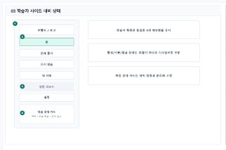

# 학습자 사이드 내비 상태

- Source: 03 학습자 사이드 내비 상태
- Code: SHARE-03
- Wireframe: 

## Wireframe Number Map

| No. | Area | Description |
| --- | --- | --- |
| 1 | 브랜드/로고 | 서비스 정체성과 현재 앱 영역을 표시하고 홈 이동을 제공함. |
| 2 | 학습자 기본 메뉴 | 홈, 문제 풀기, 쓰기 연습, 내 서재, 성장 리포트, 설정을 고정함. |
| 3 | 상태별 표시 규칙 | 활성, 기본, 잠금 상태를 메뉴명 변경이 아닌 스타일 차이로 표현. |
| 4 | 학습 상태 카드 | 목표, 오늘 학습량, 연속 학습일을 하단에 요약함. |

## Detailed Description

### 03 학습자 사이드 내비

1

■ 브랜드/로고

▣ 설명

• 서비스 정체성과 현재 앱 영역을 표시하고 홈 이동을 제공함.

▣ 제약 조건: 로고 영역 1개, 텍스트 로고 14자 이하, 클릭 영역 44px.

▣ 예외: 로고 이미지 실패 시 텍스트 워드마크로 대체.

2

■ 학습자 기본 메뉴

▣ 설명

• 홈, 문제 풀기, 쓰기 연습, 내 서재, 성장 리포트, 설정을 고정함.

▣ 제약 조건: 메뉴 순서 고정, 활성 메뉴 1개, 긴 메뉴명 말줄임.

▣ 예외: 권한 없는 메뉴는 비활성 및 잠금 사유 표시.

3

■ 상태별 표시 규칙

▣ 설명

• 활성, 기본, 잠금 상태를 메뉴명 변경이 아닌 스타일 차이로 표현.

▣ 제약 조건: 상태 3종 기본, 색상 외 아이콘/텍스트 보조 제공.

▣ 예외: 접근성 모드에서는 대비 강화 스타일을 적용.

4

■ 학습 상태 카드

▣ 설명

• 목표, 오늘 학습량, 연속 학습일을 하단에 요약함.

▣ 제약 조건: 정보 3항목, 본문 2줄 이하, 진행률 숫자 병기.

▣ 예외: 목표 미설정/데이터 없음은 설정 CTA와 빈 상태 표시.

목적 / 분기 / 피드백 / 예외

목적

학습자 사이드 내비의 메뉴명, 순서, 상태 표현을 유지합니다.

분기

홈, 문제 풀기, 쓰기 연습, 내 서재, 성장 리포트, 설정으로 이동합니다.

피드백

활성, 잠금, 빈 상태를 구분합니다.

예외

권한 제한 또는 목표 미설정은 해당 번호별 Description에서 보정합니다.
