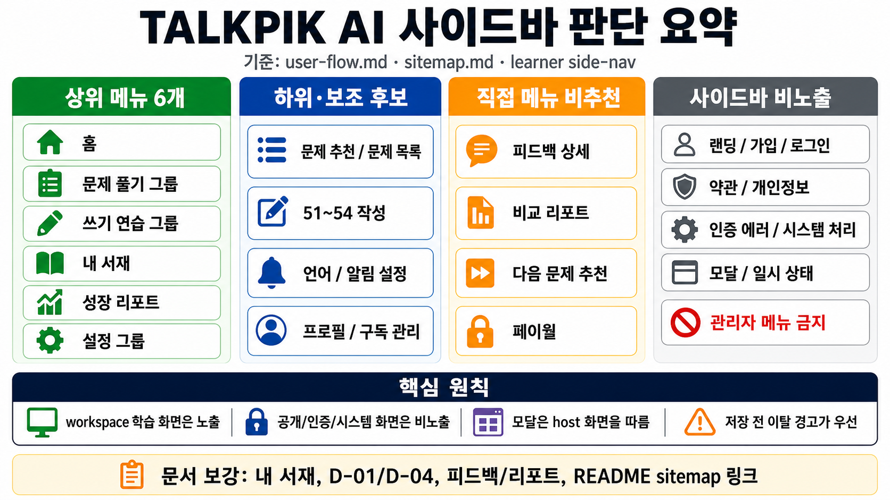

# 학습자 사이드바 내비게이션 판단 요약

- 작성일: 2026-06-16
- 기준 문서: [`description.md`](./description.md), [`user-flow.md`](../../../flow/user-flow.md), [`sitemap.md`](../../../flow/sitemap.md)
- 참고 구현: [`src/lib/routes.ts`](../../../../src/lib/routes.ts)
- 검토 방식: `gpt-5.5` 에이전트 3개로 `user-flow`, `sitemap`, 비판 관점 검토 후, 이미지 1차본을 별도 에이전트가 검수하고 보정함.

## 한 장 요약

## 핵심 결론

`sitemap.md`에 있는 모든 페이지를 사이드바 메뉴로 넣거나, 모든 페이지에 같은 방식으로 사이드바를 노출하면 안 된다.

사이드바는 로그인 후 학습자가 사용하는 workspace 학습 화면의 기본 내비게이션이다. 반대로 랜딩, 인증, 약관, callback, OAuth 후처리, 인증 에러, 모달, 일시 상태는 사이드바 직접 메뉴 대상이 아니다.

## 판단 기준

| 기준 | 내용 |
| --- | --- |
| 사실 | `03-learner-side-nav-state`는 학습자 기본 메뉴를 `홈`, `문제 풀기`, `쓰기 연습`, `내 서재`, `성장 리포트`, `설정`으로 고정한다고 명시한다. |
| 사실 | `user-flow.md`는 현행 사용자 플로우의 정본이며, `sitemap.md`는 이 흐름을 보기 쉽게 재정리한 문서다. |
| 해석 | 로그인 후 학습자 workspace 안에서 반복적으로 쓰는 화면은 사이드바 노출을 기본값으로 본다. |
| 해석 | 사이트맵의 모달, 인증 처리, 공개 문서, 시스템 처리는 페이지처럼 보이더라도 직접 사이드바 메뉴로 보지 않는다. |
| 금지 | 관리자 메뉴와 관리자 route는 이 저장소 범위가 아니다. 사이드바에 추가하지 않는다. |

## 권장 사이드바 구조

| 레벨 | 메뉴 | 기본 이동 또는 성격 | 연결 화면 | 판정 |
| --- | --- | --- | --- | --- |
| 상위 | 홈 | `/dashboard` | B-01 홈 대시보드 | 필수 |
| 상위 | 문제 풀기 | 문제 풀이 그룹 | C-01 문제 유형 추천, C-02 문제 목록 | 필수 |
| 하위 | 문제 유형 추천 | `/practice/recommendations` | C-01 | 허용 |
| 하위 | 문제 목록 | `/practice/problems` | C-02, C-03 host | 허용 |
| 하위/주의 | 다음 문제 추천 | `/practice/next` | R-02 | 직접 진입 시 empty/loading/error 상태 보강 필요 |
| 하위/주의 | 약점 보강 | `/practice/weakness` | X-07 | 문제 풀기 하위 또는 성장 리포트 하위 모두 해석 가능 |
| 상위 | 쓰기 연습 | 쓰기 그룹 | D-01~D-04 | 필수 |
| 하위/주의 | 51~54 작성 | `/writing/...` | D-01~D-04 | 직접 메뉴화 시 C-03 문제 선택 흐름을 우회하므로 정책 보강 필요 |
| 상위 | 내 서재 | `/library` | F-01, F-M1 host | 필수 |
| 상위 | 성장 리포트 | `/growth` | X-02 | 필수 |
| 문맥 | 비교 리포트 | 결과 상세 | R-01 | 직접 메뉴 비추천, CTA/deep link 권장 |
| 상위 | 설정 | 설정 그룹 | G-01, X-09, X-05, X-04 | 필수 |
| 하위 | 언어 설정 | `/settings/language` | G-01 | 허용 |
| 하위 | 알림 설정 | `/settings/notifications` | X-09 | 허용 |
| 하위 권장 | 프로필 | `/profile` | X-05 | 현재 구현에는 상위 메뉴지만, 문서상 6개 고정 메뉴 기준으로는 설정/계정 하위가 자연스러움 |
| 하위/문맥 | 구독 관리 | `/subscription` | X-04 | 설정/계정 하위 또는 페이월 CTA 후 진입 권장 |
| 문맥 전용 | 페이월 | `/paywall` | X-03 | 상시 메뉴 비추천, 유료 잠금에서 진입 |
| 하단 액션 | 로그아웃 | `POST /auth/sign-out` | A-02 로그인으로 이동 | 메뉴가 아니라 사이드바 하단 액션 |

## Sitemap 노출 판정

| 그룹 | 화면 | 사이드바 노출 판단 |
| --- | --- | --- |
| 랜딩/공개 | X-01, X-13, X-14 | 비노출 |
| 인증 | A-01, A-02, X-06, X-11, X-12, X-16, X-17, X-18, `/auth/callback`, `/auth/post-auth` | 비노출 |
| 온보딩 | A-03 학습 목표 설정 | 정책 결정 필요. 제품 흐름상 앱 진입 전 단계라 비노출이 자연스럽지만, 현재 route 구조상 workspace layout에 포함될 수 있음 |
| 홈/학습 | B-01, C-01, C-02, D-01~D-04 | 노출 |
| 모달/일시 상태 | C-03, D-M1, D-M2, D-M3, F-M1 | 독립 노출 아님. host 화면의 사이드바를 따름 |
| 피드백/복습 | E-01, E-02, R-01, R-02, X-07, F-01 | 화면 노출은 가능하나 직접 메뉴화는 선별 필요 |
| 설정/계정/결제 | X-02, G-01, X-05, X-09, X-04 | 노출 |
| 페이월 | X-03 | 직접 메뉴 비추천. 유료 잠금 문맥에서 진입 권장 |
| 관리자 | 없음 | 이 저장소 범위 금지 |

## 문서와 구현의 차이

| 항목 | 현재 관찰 | 보정 필요 |
| --- | --- | --- |
| 상위 메뉴 수 | 공유 문서는 6개 고정 메뉴를 말한다. | 하위 메뉴 허용 목록과 상위 메뉴 목록을 분리해 문서화하는 것이 좋다. |
| 현재 구현 | `SIDEBAR_ITEMS`에는 `practice`, `writing`, `settings` 하위 메뉴와 `profile` 상위 메뉴가 있다. | `profile`을 상위 메뉴로 둘지, 설정/계정 하위로 둘지 정책 결정이 필요하다. |
| 쓰기 직접 진입 | 51~54 작성 화면을 사이드바에서 바로 열 수 있으면 C-03 문제 선택 흐름을 우회한다. | 직접 진입을 공식 UX로 인정할지, 문제 목록 필터로 보낼지 결정해야 한다. |
| 저장 전 이탈 | 작성/설정 화면은 저장 전 이탈 경고가 필요하다. | 사이드바 클릭보다 dirty/unsaved guard가 우선한다는 규칙을 명시해야 한다. |
| 페이월/구독 | 페이월은 유료 잠금 결과 화면이고, 구독 관리는 설정/프로필/페이월에서 진입한다. | 페이월은 contextual-only, 구독 관리는 설정/계정 하위로 분류하는 것이 안전하다. |
| 관리자 | `role` 기반 확장 지점은 있지만 관리자 route는 이 앱 범위가 아니다. | `app_role`을 이유로 사용자 앱 사이드바에 admin 메뉴를 추가하지 않는다. |

## 문서 보강 필요 항목

- F-01 `내 서재`: 기본 메뉴에 포함되지만 화면 문서에서 사이드 내비 명시가 약하다.
- D-01, D-04: D-02, D-03과 같은 쓰기 화면인데 사이드 내비 명시가 일관되지 않다.
- E-01, E-02, R-01, R-02: workspace 학습/복습 화면이지만 직접 메뉴인지 문맥 화면인지 명확히 나눠야 한다.
- X-03 `페이월`: 보호 route이지만 직접 메뉴 노출이 아니라 유료 잠금 문맥 화면으로 정의하는 편이 안전하다.
- README의 sitemap 링크: 2026-06-16 문서 정합성 검수에서 `docs/flow/sitemap.md`로 정정했다.

## 최종 원칙

1. 상위 메뉴는 `홈`, `문제 풀기`, `쓰기 연습`, `내 서재`, `성장 리포트`, `설정` 6개를 기준으로 둔다.
2. 하위 메뉴는 상위 메뉴를 보조하는 반복 접근 화면만 둔다.
3. 피드백 상세, 비교 리포트, 다음 문제 추천, 페이월은 직접 메뉴보다 CTA 또는 deep link 중심으로 다룬다.
4. 공개/인증/시스템 화면은 사이드바 비노출로 본다.
5. 모달과 일시 상태는 독립 메뉴가 아니라 host 화면의 사이드바 상태를 따른다.
6. 관리자 메뉴는 이 사용자 앱 범위에 포함하지 않는다.
7. 저장 전 이탈 경고가 필요한 화면에서는 사이드바 클릭보다 이탈 확인 흐름이 우선한다.
