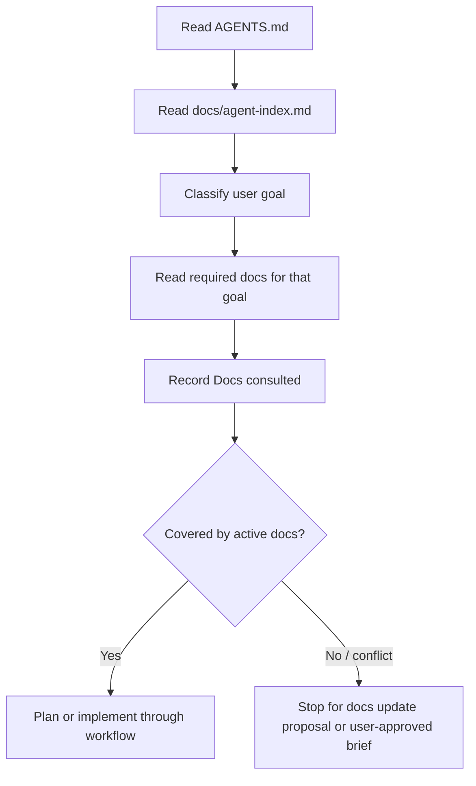

# AI Agent Index

This is the mandatory routing index for AI agents. Read this file after `AGENTS.md` and before planning or editing.

Purpose: make document access predictable as the project grows. Do not read every document by default. Select the smallest required set by task goal, then record the exact files in `Docs consulted`.

## Startup Algorithm

## Index Groups

| Index | Group | Entry point | Use for |
| --- | --- | --- | --- |
| `ROOT-00` | Human project map | [../README.md](../README.md) | Human-friendly project overview |
| `DOCS-00` | Docs map | [README.md](README.md) | Human + AI navigation across `docs/` |
| `AGENT-00` | AI routing | [agent-index.md](agent-index.md) | Required AI document selection |
| `FLOW-00` | AI workflow | [ai-development-workflow.md](ai-development-workflow.md) | Mandatory execution workflow |
| `WF-00` | AI workflow folder | [ai-workflow/README.md](ai-workflow/README.md) | Ledgers, reports, packets, plans |
| `HARNESS-00` | Harness and skills | [ai-workflow/harness-and-skills.md](ai-workflow/harness-and-skills.md) | TALKPIK, practical skills, GStack, Superpowers, host-specific skill names |
| `PRODUCT-00` | Product requirements | [prd.md](prd.md) | Product scope, users, value, business rules |
| `SPEC-00` | Implementation spec | [spec.md](spec.md) | Development baseline, behavior, validation, framework, backend, auth, AI boundary, deployment |
| `DEV-10` | Development details | [development/README.md](development/README.md) | Detailed technical specs selected through `SPEC-00` |
| `UI-00` | Design system | [ant-design/README.md](ant-design/README.md) | UI implementation, tokens, components, motion |
| `IA-00` | Information architecture | [ia.md](ia.md), [sitemap.md](sitemap.md) | Page hierarchy, routes, navigation |
| `IA-10` | Screen specs | [IA/README.md](IA/README.md) | Specific page descriptions and wireframes |
| `JOURNEY-00` | User journey | [flow/user-flow.md](flow/user-flow.md) | Step order, transitions, entry/exit states |
| `LEGACY-00` | Legacy observations | [ia-pages/README.md](ia-pages/README.md), [user-flow.md](user-flow.md) | Historical context only |

## Goal-To-Doc Routing

| User goal | Required docs | Conditional docs | Notes |
| --- | --- | --- | --- |
| Product scope, user value, roles, business direction | `PRODUCT-00` | `SPEC-00`, `JOURNEY-00` | Do not invent new product direction. |
| Functional behavior, validation, data handling, acceptance criteria | `SPEC-00` | `PRODUCT-00`, `JOURNEY-00` | Use for implementation and tests. |
| Framework, package, dependency, backend, auth, deployment, env vars, deferred billing | `SPEC-00` | Matching `DEV-10` detail file | Start at `spec.md`; do not read all development details by default. |
| Navigation, routes, page hierarchy | `IA-00` | `JOURNEY-00`, `IA-10` | Use Target React Route Map, not legacy route notes. |
| User journey, screen order, transitions, entry/exit states | `JOURNEY-00` | `IA-10`, `SPEC-00` | `docs/user-flow.md` is legacy context only. |
| Visual UI, layout, components, tokens, motion | `UI-00` | `IA-10`, `JOURNEY-00` | Run design review before user-facing implementation. |
| Specific page or screen | `IA-10` matching page | `UI-00`, `JOURNEY-00`, `SPEC-00` | Read the matching `description.md` and inspect `wireframe.png`. |
| AI workflow, context, reports, fallback, multi-agent work | `FLOW-00`, `WF-00` | `HARNESS-00` | Required for workflow or harness changes. |
| Historical page composition | `LEGACY-00` | Active docs above | Reference only. Active docs win. |

## Development Detail Routing

Use this table only after reading [spec.md](spec.md).

| Development goal | Read |
| --- | --- |
| Frontend framework, package choice, runtime, UI library, forms, validation, charts, tests | [development/stack.md](development/stack.md) |
| Supabase, Auth, Postgres, RLS, Storage, server-only keys | [development/backend-auth.md](development/backend-auth.md) |
| Vercel, environments, deployment gates, environment variables, rollback, CI, preview links | [development/deployment.md](development/deployment.md) |
| Billing, subscription, paywall, payment provider, deferred scope | [development/deferred-scope.md](development/deferred-scope.md) |

## Active Vs Legacy Rule

Active docs govern implementation, QA, and review:

- [prd.md](prd.md)
- [spec.md](spec.md)
- [ant-design/README.md](ant-design/README.md)
- [sitemap.md](sitemap.md) Target React Route Map
- [ia.md](ia.md)
- [IA/README.md](IA/README.md) and matching `docs/IA/<page>/description.md`
- [flow/user-flow.md](flow/user-flow.md)

Legacy docs are reference only:

- [user-flow.md](user-flow.md)
- [ia-pages/README.md](ia-pages/README.md)
- Legacy HTML Route Map sections inside [sitemap.md](sitemap.md)

If active and legacy docs conflict, active docs win. If active docs conflict with the user request, stop and report the conflict.

## Ledger Requirement Index

Create or update a run ledger under `docs/ai-workflow/runs/` when any of these apply:

| Trigger | Required |
| --- | --- |
| Non-trivial work | Yes |
| Implementation work | Yes |
| UI, route, flow, or integration changes | Yes |
| Net-new scope or doc conflict | Yes |
| Multi-agent work | Yes |
| Work likely to resume later | Yes |
| Tiny docs/config-only edit with no behavior change, no conflict, no multi-agent work, no resume risk | May skip with reason |

Use [ai-workflow/context-ledger-template.md](ai-workflow/context-ledger-template.md).

For consistency, classify the work as non-trivial when it changes workflow-governing files, automation, scripts, CI, routes, UI, auth, database, API, dependencies, deployment behavior, test strategy, or AI-service boundaries. Multi-file changes are non-trivial by default unless they are purely mechanical docs/config updates and the final report states the lightweight exception.

When a ledger is required, update it before final verification and include it in the dirty scope, commit trailers, PR body, or final report as applicable.

## Output Requirement

Every plan, handoff, or final report must include:

- `Docs consulted`: exact files read.
- `Extracted requirements`: concrete requirements taken from those docs.
- `Doc conflicts`: `none` or exact conflict references.
- `Untouched relevant docs`: docs that seemed related but were not read, with reason.
- `Context ledger`: path or allowed lightweight exception.
