# AI Development Workflow

This workflow is mandatory for AI agents working in this project. It combines the validated project docs, Superpowers for discipline and TDD, and GStack for plan review, code review, QA, and shipping gates.

This project intentionally skips a fresh grill-me/domain-discovery step. The domain and product context already lives in `docs/`.

## Workflow Diagram

```mermaid
flowchart TD
    A["Task starts"] --> B["Run using-superpowers"]
    B --> C["Infer user goal"]
    C --> D["Map goal to relevant docs"]
    D --> E["Read selected docs"]
    E --> F["Record Docs consulted"]
    F --> F2{"Context ledger required?"}
    F2 -->|"Yes"| F3["Create or update docs/ai-workflow/runs ledger"]
    F2 -->|"No"| G{"Request covered by docs?"}
    F3 --> G

    G -->|"Yes"| H["Use docs as accepted product/domain context"]
    G -->|"No: new scope"| I["office-hours + brainstorming"]
    G -->|"Conflict with docs"| Z["Stop and report conflict with document references"]

    H --> J["Check applicable GStack and Superpowers skills"]
    I --> I2{"Docs update or user-approved brief exists?"}
    I2 -->|"Yes"| J
    I2 -->|"No"| I3["Create docs update proposal or approval request"]
    I3 --> ZZ
    Z --> ZZ["Wait for direction before implementation"]

    J --> K{"Task type"}
    K -->|"Docs or config only"| L["Lightweight path"]
    K -->|"Bug fix"| M["systematic-debugging"]
    K -->|"Feature or behavior change"| N["writing-plans"]
    K -->|"UI or user flow"| O["writing-plans + design review required"]

    M --> P["test-driven-development"]
    N --> Q{"Meaningful architecture or data-flow risk?"}
    O --> R["plan-design-review"]
    R --> Q
    Q -->|"Yes"| S["plan-eng-review"]
    Q -->|"No"| P
    S --> P

    P --> T["RED: write failing test"]
    T --> U["Confirm expected failure"]
    U --> V["GREEN: minimal implementation"]
    V --> W["Confirm test passes"]
    W --> X["Refactor while green"]
    X --> Y["Focused tests"]

    Y --> AA{"Both Codex and Claude available?"}
    AA -->|"Yes"| AB["Main session coordinates bounded agents"]
    AA -->|"No"| AC["Same agent runs review gate"]

    AB --> AB2["Collect result packets and integrate context"]
    AB2 --> AB3["Write result packets to ledger"]
    AB3 --> AD["requesting-code-review or GStack review"]
    AC --> AD
    AD --> AE{"Review feedback?"}
    AE -->|"Yes"| AF["receiving-code-review, fix, retest"]
    AF --> Y
    AE -->|"No"| AG{"UI or integration flow changed?"}

    AG -->|"Yes"| AH["GStack QA or browser visual QA"]
    AG -->|"No"| AI["verification-before-completion"]
    AH --> AI

    L --> AJ["Edit"]
    AJ --> AK["Inspect or narrow verification"]
    AK --> AI

    AI --> AIL{"Ledger required?"}
    AIL -->|"Yes"| ALed["Compare ledger with file state"]
    AIL -->|"No"| AL["Run tests, lint, typecheck, or build"]
    ALed --> AL
    AL --> AM{"Release-sized change?"}
    AM -->|"Yes"| AN["ship gate"]
    AM -->|"No"| AO["Final report using docs/ai-workflow/report-template.md"]
    AN --> AO
```

## 0. Session Start

Every agent must begin by activating Superpowers:

- Claude Code: invoke `using-superpowers`.
- Codex: use native skill discovery when available; otherwise read `.codex/skills/using-superpowers/SKILL.md` enough to follow it.

Then load the project source of truth. The agent must infer the user's goal, map that goal to relevant docs, read those docs, and record the result before planning. Use only the relevant files, but do not plan implementation without checking the docs that govern the requested surface:

- Product requirements: `docs/prd.md`
- Functional specification: `docs/spec.md`
- Information architecture: `docs/ia.md`
- Site map: `docs/sitemap.md`
- User flows: `docs/flow/user-flow.md`
- Design system guidance: `docs/ant-design/README.md` and the relevant files in `docs/ant-design/`
- Page-level IA: `docs/IA/README.md` and the matching page folder under `docs/IA/`
- Legacy or alternate IA pages when relevant: `docs/ia-pages/`

Goal-to-doc mapping:

- Product scope, user value, personas, monetization, or core product requirements: `docs/prd.md`
- Functional behavior, validation, data handling, permissions, or acceptance details: `docs/spec.md`
- Navigation, routes, page hierarchy, and information architecture: `docs/ia.md`, `docs/sitemap.md`
- User journey, step order, transitions, entry/exit states, and lifecycle: `docs/flow/user-flow.md`. Use `docs/user-flow.md` only as legacy observation context.
- Visual UI implementation, layout, component rules, theme tokens, motion, or Ant Design usage: `docs/ant-design/README.md` plus relevant `docs/ant-design/*.md`
- Specific page or screen implementation: `docs/IA/README.md`, the matching `docs/IA/<page>/description.md`, and the matching `wireframe.png` when present
- Legacy or alternate page notes: relevant files under `docs/ia-pages/`

Required plan evidence:

- `Docs consulted`: exact files read.
- `Extracted requirements`: the concrete requirements pulled from those files.
- `Doc conflicts`: any mismatch between user request and docs, or `none`.
- `Untouched docs`: relevant docs not read and why they were not needed.
- `Context ledger`: path to the run ledger when required, or the reason it is not required.

Then choose the smallest valid lane:

- Docs/config-only: use skill check, make the change, verify by inspection.
- Bug fix: use `systematic-debugging`, then `test-driven-development`.
- Feature or behavior change: use planning, TDD, review, and verification.
- UI/user flow: add design review and browser/visual QA.
- Request covered by docs: treat docs as accepted context; do not rerun domain discovery.
- New scope or product pivot: use GStack office-hours and Superpowers brainstorming, then stop at a docs update proposal or an explicit user-approved implementation brief. Do not implement directly from office-hours output.
- Request that conflicts with docs: stop and report the conflict with exact document references before implementation.

## 1. Frame The Work

Use this before implementation:

- Work already specified in `docs/`:
  - Do not use grill-me.
  - Cite the relevant docs in the implementation plan.
  - Convert documented requirements into acceptance criteria.
- New product idea, unclear feature, scope question, or explicit deviation from `docs/`:
  - Codex: `gstack-office-hours` plus `brainstorming`
  - Claude Code: `office-hours` plus `brainstorming`
  - Required gate after this step: produce either a docs update proposal listing exact files to change, or a user-approved implementation brief with acceptance criteria. Implementation starts only after one of those exists.
- Clear implementation request:
  - Use `writing-plans` for the implementation plan.
- Architecture, data flow, or meaningful risk:
  - Codex: `gstack-plan-eng-review`
  - Claude Code: `plan-eng-review`
- UX, visual design, or user-facing workflow:
  - Codex: `gstack-plan-design-review`
  - Claude Code: `plan-design-review`
- Product scope or business tradeoff:
  - Codex: `gstack-plan-ceo-review`
  - Claude Code: `plan-ceo-review`

Required output before coding:

- Docs consulted.
- Problem statement.
- Files likely to change.
- Test strategy.
- Known risks.
- Acceptance criteria.

For very small changes, this may be a short checklist in the agent response. For larger work, save the plan under `docs/ai-workflow/plans/` (see that folder's `README.md` for naming and required sections).

## 2. Implement With TDD

For code changes, `test-driven-development` is mandatory.

The required loop is:

1. Write or update the smallest failing test.
2. Run it and verify it fails for the expected reason.
3. Write the minimal implementation.
4. Run the focused test until it passes.
5. Refactor only while tests stay green.
6. Run broader verification.

Allowed TDD exceptions:

- Documentation-only changes.
- Configuration-only changes.
- Generated artifacts.
- No existing runnable test surface.

When an exception applies, the agent must state the exception and use the nearest practical verification, such as lint, typecheck, build, static inspection, or manual flow testing.

## 3. Use Codex And Claude Together

When both Codex and Claude Code are available, use a two-agent handoff:

- Implementer: writes tests, code, and focused verification.
- Reviewer: runs review skills, checks plan compliance, and challenges missing tests or regressions.

Preferred pairing:

- Codex implements, Claude reviews with `requesting-code-review` or GStack `review`.
- Claude implements, Codex reviews with `requesting-code-review` or GStack `gstack-review`.

The implementer must not mark the task complete until reviewer findings are addressed or explicitly documented as rejected with a reason.

## 3b. Multi-Agent Context Management

The main session is the coordinator and durable context owner. Child agents are execution surfaces, not the source of truth for the task. This follows the managed-agent principle of keeping the session log and orchestration layer separate from individual execution environments.

Before spawning or asking another agent to work, the main session must prepare a task packet using `docs/ai-workflow/agent-packets.md`:

- User goal and accepted scope.
- Docs consulted and extracted requirements.
- Exact write scope or read-only scope.
- Expected output format.
- Verification the child agent should run.
- Known constraints, conflicts, and files not to touch.

Child agents must return a result packet using `docs/ai-workflow/agent-packets.md`:

- Files inspected or changed.
- Summary of decisions made.
- Tests, checks, or commands run.
- Blockers, conflicts, and assumptions.
- Recommended follow-up, if any.

The main session must then integrate the result packet into the central context ledger before continuing. It must not assume that a child agent's hidden context, branch, or worktree is durable. For parallel implementation, assign disjoint write scopes where possible; if write scopes overlap, the main session resolves the conflict before any final verification.

## 3c. Context Ledger

For non-trivial work, create a run ledger under `docs/ai-workflow/runs/` using `docs/ai-workflow/context-ledger-template.md`. Name the file `YYYYMMDD-HHMM-task-slug.md`.

The ledger is required for:

- Any multi-agent work.
- Any implementation task.
- UI, route, user-flow, or integration changes.
- Any task with doc conflicts or net-new scope.
- Any work likely to span multiple sessions or context compaction.

The ledger may be skipped only for tiny docs/config/non-behavioral edits. If skipped, the plan or final report must state why.

The main session must update the ledger:

- After selecting docs and extracting requirements.
- After each material decision.
- Before delegating to a child agent.
- After each child result packet.
- After changing implementation scope.
- Before final verification.

Before claiming completion, compare the ledger with current file state:

- Files changed match the accepted scope.
- Docs consulted match the implemented behavior.
- Child result packets are integrated.
- Verification state is current.
- Remaining risks are listed.

## 3d. Resume And Compaction Recovery

When resuming work after a pause, context compaction, or a new agent session, restore context in this order:

1. Read `AGENTS.md` or `CLAUDE.md`, depending on the host.
2. Read `docs/ai-development-workflow.md`.
3. Open the latest relevant run ledger in `docs/ai-workflow/runs/`.
4. Re-read the ledger's `Docs consulted` files when they govern the next action.
5. Inspect current file state for paths listed in the ledger.
6. Resume from the ledger's `Next action` and `Verification state`.

If a required ledger is missing, report `context ledger missing`, create one from `docs/ai-workflow/context-ledger-template.md`, reconstruct the known state from docs and current files, then continue.

## 4. Review Gate

Every code change must pass review before completion:

- Superpowers review:
  - `requesting-code-review`
  - `receiving-code-review` when review feedback exists
- GStack review:
  - Codex: `gstack-review`
  - Claude Code: `review`

Review must check:

- Behavior matches the accepted plan.
- Tests cover the changed behavior.
- No unrelated refactors or broad rewrites.
- Error states, empty states, and edge cases are handled.
- User-facing text and UI remain coherent.

## 5. QA Gate

Use QA for user-facing, browser, interaction, or integration work:

- Codex: `gstack-qa` or `gstack-qa-only`
- Claude Code: `qa` or `qa-only`

QA must include:

- Starting the local app when applicable.
- Exercising the changed user path.
- Checking responsive layout when UI changed.
- Capturing failures as reproducible notes.
- Adding regression coverage when possible.

If browser automation is unavailable, state the blocker and run the closest alternative verification.

## 6. Finish

Before saying done, run:

- `verification-before-completion`
- Focused tests for changed behavior.
- Broader tests, lint, typecheck, or build when available.
- GStack ship gate for release-sized work:
  - Codex: `gstack-ship`
  - Claude Code: `ship`

Final response must follow `docs/ai-workflow/report-template.md` and include, at minimum:

- What changed.
- Exact docs consulted and requirements extracted.
- Context ledger path when required.
- Skills/workflow gates used.
- Verification commands and results.
- Known risks or skipped checks.

## 7. Lightweight Path

For a tiny docs/config/non-behavioral change, the minimum workflow is:

1. `using-superpowers`
2. Skill applicability check
3. Edit
4. Inspect or run the narrowest relevant verification
5. Report checks and risks

This path is not allowed for production behavior changes.

This path may skip a context ledger only when all of these are true:

- No code behavior changes.
- No multi-agent work.
- No user-flow, route, UI, or integration change.
- No doc conflict or net-new scope.
- The task can be fully understood from the current session.
