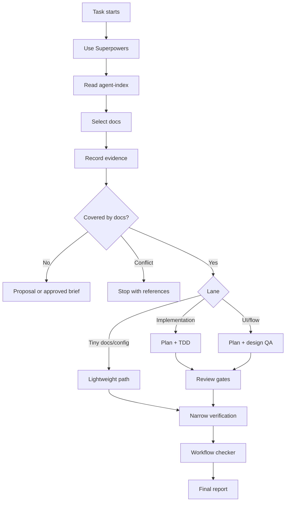

# AI Development Workflow

Entry point for every AI agent working in this repository. **Read this file first, then follow the links to the sub-doc that governs your current task.** Detailed rules live in the four sub-docs listed at the bottom — they are not duplicated here.

## Mandatory Startup

1. Invoke `using-superpowers` (Claude Code) or read its canonical SKILL file (other hosts). If host mirrors are stale, run `node scripts/sync-agent-skills.mjs` and retry.
2. Read [`docs/agent-index.md`](agent-index.md), classify your goal, and select the smallest matching docs.
3. Record `Docs consulted`, `Extracted requirements`, `Doc conflicts`, `Untouched relevant docs`, and `Context ledger` in your plan or ledger.
4. Run `node scripts/ai-workflow-check.mjs --repo .` before final reporting when Node is available. PRs run the same checker via `.github/workflows/ai-workflow-check.yml`.

## Workflow Diagram

## Lane Selection

| Work type | First action | Rules live in |
| --- | --- | --- |
| Tiny docs/config, no behavior change | Lightweight Path below | this file §Lightweight |
| Bug fix | `systematic-debugging` → TDD | [`review-gates.md`](ai-workflow/review-gates.md) |
| Feature / behavior change | `writing-plans` → TDD → review gates | [`planning-contracts.md`](ai-workflow/planning-contracts.md), [`review-gates.md`](ai-workflow/review-gates.md) |
| UI / user flow | `writing-plans` + design review → TDD → UX/UI Consistency Pass → audience별 QA | same as above + design review; Audience rules 아래 참조; [`review-gates.md#uxui-consistency-pass`](ai-workflow/review-gates.md#uxui-consistency-pass) |
| Net-new scope or doc pivot | `office-hours` + `brainstorming` → docs update proposal OR approved brief | [`planning-contracts.md`](ai-workflow/planning-contracts.md) |
| Conflict with active docs | Stop. Report conflict with exact references. Do not implement. | this file §Mandatory Startup |
| Multi-agent / phase work | Plan + Light Spec + Ledger + cross-model review | [`planning-contracts.md`](ai-workflow/planning-contracts.md), [`context-and-packets.md`](ai-workflow/context-and-packets.md) |

### Audience rules (UI / user-flow 차선 + 모든 phase 작업에 적용)

UI · 사용자 흐름 · phase 단위 작업은 시작 시점에 audience를 명시해야 한다. Audience 분류는 UI/권한 분기 한정 — 비대화형 시스템 작업(`cron`, `system`, `external partner` 등)은 별도 축으로 추후 도입한다.

- **`user`**: 일반 사용자 화면. RLS는 `auth.uid()` 기반 자기 row 한정.
- **`admin`**: 관리자 화면. `requirePlatformAdmin / requireContentAdmin / requireOrgAdmin` 같은 페이지 가드 의무 + 모든 권한 변경/발행 토글은 `admin_audit_logs` 기록 의무.
- **`both`**: user/admin이 같은 phase에 들어감. user/admin **task를 각각의 행으로 분리**해 plan task table에 적고, 각 행에 자체 audience 명시. Light Spec에 user/admin 분기 폴더 경계(예: `src/app/admin/...` vs `src/app/library/...`)를 한 줄씩 명시.

audience 명시·검증 지점: [`planning-contracts.md`](ai-workflow/planning-contracts.md) Light Spec Domain Boundary + task table audience 열, [`agent-packets.md`](ai-workflow/agent-packets.md) Task/Result Packet audience 필드, [`review-gates.md#architecture-pass`](ai-workflow/review-gates.md#architecture-pass) audience 경계 항목, [`fallback-and-recovery.md`](ai-workflow/fallback-and-recovery.md) audience-mismatch fail-closed.

## Core Invariants

These are mandatory for any non-lightweight change. **The linked sub-doc is the authoritative source** — this list exists so an agent reading only the entry file does not miss them.

- **TDD** (RED → confirm fail → GREEN → confirm pass → refactor while green). Allowed exceptions are docs-only, config-only, generated artifacts, or no runnable test surface. Full loop and exceptions: [`review-gates.md#tdd`](ai-workflow/review-gates.md).
- **Cross-model review is mandatory** for every code change and every non-trivial plan or doc change. When only one model is available, record `Cross-model review: degraded — <reason>` in the ledger. [`review-gates.md#cross-model-review`](ai-workflow/review-gates.md#cross-model-review).
- **Plan-Review PASS Gate** — if a pre-implementation review (`plan-eng-review`, `codex consult`, etc) returns FAIL, revise the plan AND re-run the same review until PASS or until each remaining concern is recorded as "accepted with reason" in the ledger. [`review-gates.md#plan-review-pass-gate`](ai-workflow/review-gates.md).
- **Architecture Pass** at phase completion: route handlers have no leaked business logic, folder/name boundaries match `docs/domain-glossary.md`, no single concept is implemented in two places. [`review-gates.md#architecture-pass`](ai-workflow/review-gates.md).
- **UX/UI Consistency Pass** when changed files match UI patterns (`src/app/**`, `src/components/**`, `src/features/**`, `src/lib/ui/**`, `src/styles/**`, `*.css`, `theme*`, etc.). 4-line evidence(Tokens · Components · A11y · Responsive) in ledger, machine-checked. Test-only changes auto-exempt. [`review-gates.md#uxui-consistency-pass`](ai-workflow/review-gates.md).
- **CSS Variable Scoping Gate** when changed files include `src/theme/**`, `src/styles/**`, `app/layout.tsx`, or any file containing `--app-*` declarations: verify the five constraints in [`docs/ant-design/06-ai-development-workflow.md#css-variable-scoping`](ant-design/06-ai-development-workflow.md) and run `scripts/ai-workflow-check.mjs`. The gate is machine-enforced for the following patterns: `--app-*: var(--ant-*)` chains, bare `@theme {` without `inline`, and `getAppTheme` at module scope. [`docs/ant-design/08-theme-architecture.md#css-variable-architecture-contract`](ant-design/08-theme-architecture.md).
- **Light Spec + Out of Scope + Smallest Buildable Unit + Subagent-eligible column** are mandatory plan/light-spec sections, machine-checked by `scripts/ai-workflow-check.mjs`. [`planning-contracts.md`](ai-workflow/planning-contracts.md).
- **Context ledger** is required for any non-trivial work (multi-file, implementation, UI/route/auth/database/API/dependency/test-strategy/AI-boundary change, multi-agent work, work likely to resume across sessions, **or any change to workflow-governing files — `AGENTS.md`, `CLAUDE.md`, `docs/agent-index.md`, `docs/ai-development-workflow.md`, files under `docs/ai-workflow/`, `scripts/`, `.github/`**). [`context-and-packets.md`](ai-workflow/context-and-packets.md).
- **Fallback Protocol** — fallback never weakens a quality gate. Classify failures (fail-closed, degraded-mode, recover, retry-once, reassign) and record evidence in the ledger. [`fallback-and-recovery.md`](ai-workflow/fallback-and-recovery.md).

## Required Evidence (Before Final Report)

- `Docs consulted` — exact files read
- `Extracted requirements` — concrete requirements pulled from those files
- `Doc conflicts` — `none` or exact file references
- `Untouched relevant docs` — and why they were not read
- `Context ledger` — path or allowed lightweight exception
- Verification commands run and results
- Git publication decision per [`git-publication-decision.md`](ai-workflow/git-publication-decision.md)

Final response must follow [`report-template.md`](ai-workflow/report-template.md).

## Lightweight Path

For a tiny docs/config/non-behavioral change with no multi-agent work, no UI/flow change, no doc conflict, and no resume risk:

1. `using-superpowers`
2. Skill applicability check
3. Edit
4. Narrowest relevant verification (lint/typecheck/inspection)
5. Report checks and risks

A context ledger may be skipped only if every condition above is satisfied. State the exception in the final report. This path is **not allowed for production behavior changes**.

## Sub-docs (depth lives here)

- [`docs/ai-workflow/planning-contracts.md`](ai-workflow/planning-contracts.md) — Light Spec, Out of Scope/Intentional Cuts, Smallest Buildable Unit, Subagent-eligible column, task-table contract
- [`docs/ai-workflow/context-and-packets.md`](ai-workflow/context-and-packets.md) — Context ledger template, agent task/result packets, multi-agent integration, resume/compaction recovery
- [`docs/ai-workflow/review-gates.md`](ai-workflow/review-gates.md) — TDD loop, Cross-model review, Plan-Review PASS Gate, Architecture Pass, QA gate, finish gate
- [`docs/ai-workflow/fallback-and-recovery.md`](ai-workflow/fallback-and-recovery.md) — Failure classes, fallback matrix, degraded-mode reporting
