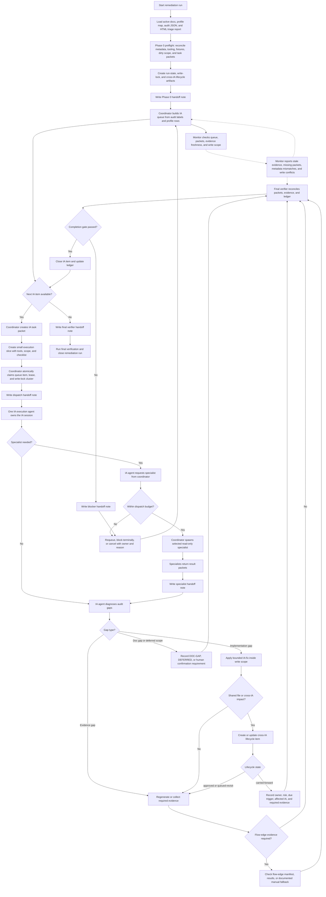

# IA Remediation Multi-Agent Plan: Agents, Tools, And Workflow

## Agent Model

One root coordinator owns durable context and the ledger.

Only the root coordinator may spawn IA execution agents, specialists, monitors, or final verifiers. IA execution agents must not spawn, delegate, or recursively call specialists. They may request a specialist by reporting the reason, required scope, and proposed packet back to the coordinator.

For each IA item or approved cluster, the coordinator assigns one IA execution agent. That IA execution agent owns the main IA session for the assigned write scope.

- Planning/product specialist.
- Development specialist.
- UX/UI specialist.
- Security/data specialist.
- Operations/policy specialist.
- Additional checklist-specific specialists from [specialist-checklists](./specialist-checklists/README.md) when the profile requires them.

A separate monitor agent watches queue health, packet completeness, stale evidence, and cross-IA lifecycle items. The monitor is read-only and reports to the coordinator.

The reconciliation final verifier is coordinator-owned and separate from the IA execution agent. IA execution agents cannot close their own IA items.

When `humanConfirmationRequired` is true, the coordinator may delegate the human-confirmation gate to a separate GPT-5.5 reviewer agent. This reviewer is a delegated human-confirmation reviewer, not an IA execution agent and not the final verifier. It must run in a separate session from the IA execution agent and must return an auditable result packet before the IA item can close.

Each agent uses its own session. When its assigned packet is complete and reported, that session closes.

## Tool, MCP, Plugin, And Skill Policy

Every task packet must declare the tools the agent may use. Agents must not assume tool access from the coordinator session.

Required tool fields in every packet:

- `allowedTools`
- `requiredSkills`
- `requiredMcpOrPlugins`
- `toolPreflightStatus`
- `toolFallbacks`
- `toolUseEvidence`

`toolPreflightStatus` allowed values:

- `pass`: every required tool, skill, MCP server, plugin, fixture, and command has evidence in `toolUseEvidence`.
- `blocked_terminal`: a required tool or fixture is missing and no fallback artifact is defined by this plan.
- `degraded_with_defined_fallback`: the packet names the missing tool, the exact fallback artifact schema defined by this plan, the closure boundary, and the residual risk.

`toolUseEvidence` must include command output, source path, version, installed path, plugin/MCP identifier, or fixture provenance as applicable. Empty values, `available`, `looks ok`, `same as coordinator`, or placeholder text are not PASS evidence. The final verifier must reject closure if a required tool status is missing, stale, unsupported by evidence, or using a fallback not defined in this plan.

Host parity rule:

- Project-local skill mirrors are checked with `node scripts/sync-agent-skills.mjs --check`, but that command does not prove host-global skills such as `ui-ux-pro-max`.
- A tool or skill PASS in Codex cannot be copied to Claude, or the reverse, unless the packet records that host's source path, installed path, version or commit, and refresh result.
- When a required skill exists in only one host, the coordinator must route only the dependent packets to that host or block those packets. The whole remediation run is not blocked unless every remaining queue item depends on the missing host-specific skill.

Default tool policy by role:

| Role | Required or allowed tools | Must not do |
| --- | --- | --- |
| Coordinator | File/search tools, workflow checker, native subagent tools, skill installer, ledger and packet writes. | Do not perform IA implementation work while acting as coordinator. |
| IA execution agent | Repo-local file/search tools, bounded file edits in its write lock, test commands listed in its packet, browser automation only when the packet requires visual, console-log, or flow evidence. | Do not spawn agents, install tools, or use tools outside its packet without coordinator approval. |
| Planning/product specialist | Active docs, audit artifacts, profile map, checklist docs. | Do not change source files or redefine product scope. |
| Development specialist | Repo-local code search, official docs only when dependency behavior is current or uncertain. | Do not add dependencies or broaden implementation scope. |
| UX/UI specialist | Must use `ui-ux-pro-max` for UI structure, visual design, interaction, accessibility, responsive, or perceived-quality review when the packet depends on UX/UI specialist judgment. May also use project `ant-design`, `talkpik-ui-system`, browser, screenshot, console-log capture, and visual QA tools when assigned. If the assigned host lacks `ui-ux-pro-max`, the coordinator must route the packet to a host that has it or block that packet unless a trusted install packet exists. | Do not approve UI/UX work without recording the host-specific `ui-ux-pro-max` source path or the packet-level blocked/fallback decision. |
| Security/data specialist | Active backend/auth docs, security checklist, local fixtures, Supabase tooling only when scoped to the approved project and packet. | Do not mutate production data, secrets, auth policy, or external services without explicit coordinator authorization. |
| Operations/policy specialist | Policy docs, automation docs, notification/deferred-scope docs, local automation artifacts. | Do not create recurring automations or external notifications unless the packet explicitly asks for them. |
| Monitor | Read-only access to run state, locks, packets, ledger, audit artifacts, and file-state summaries. | Do not edit implementation files or close IA items. |
| Delegated human-confirmation reviewer | GPT-5.5 separate session, active docs, current IA task packet, regenerated evidence, screenshots, console-log artifacts, or manual evidence artifacts, and the exact human-confirmation question. | Do not edit files, spawn agents, act as final verifier, or satisfy the gate from a broad "looks good" summary. |
| Final verifier | Read-only comparison tools plus verification commands listed in the run state. | Do not fix issues directly; return findings to coordinator. |

If a required tool is unavailable:

- Mark the affected queue item `blocked_terminal` when the missing tool is required for final evidence.
- Use a documented manual-evidence fallback only when this plan defines one.
- Record the missing tool, attempted install or discovery command, fallback, and remaining risk in the handoff note and ledger.

Security/data packets must include:

- `environment`: `local`, `preview`, or `staging`
- `productionAllowed`: `false` unless a user-approved exception is recorded before dispatch
- `supabaseProjectRef`
- `allowedCredentials`: read-only by default
- `serviceRoleUse`: `forbidden` unless packet-specific and coordinator-approved
- `mutationAllowed`: `false` unless exact operation, rollback, and data boundary are listed
- `fixtureProvenance`: storage state, seeded users, admin role claims, wrong-owner fixtures, stale-token fixtures, and service-role-dependent fixtures
- `fixtureManifestPath`: `<auditRunDirectory>/supabase-fixture-manifest.json` when the packet touches auth, data, owner scope, storage, RBAC, admin audit, persistence, Supabase, or fixtures
- `requiredFixtureKeys`: exact keys from the fixture manifest required by the IA profile row and task packet
- `fixtureSeedStatus`: `not_required`, `verified_existing`, `seeded_for_run`, `blocked_terminal`, or `degraded_with_defined_fallback`
- `seedCommand`, `verifyCommand`, and `cleanupCommand` when fixture mutation is allowed
- `rollbackOrResetBoundary`: exact reset, cleanup, or rollback boundary for seeded data
- `fixtureFreshnessCheckedAt`
- `expectedRlsCases`
- `authStateFixtures`, `ownerScopeFixtures`, `wrongOwnerFixtureIds`, `adminRoleMatrix`, `storageObjectFixtures`, and `adminAuditFixtures` as applicable
- `serviceRoleUseJustification` when service-role use is not `forbidden`
- `productionSafetyDisposition`: environment classification and reason

If project ref, environment, credential type, service-role use, mutation boundary, or fixture provenance cannot be verified, mark the item `blocked_terminal`. Never infer production safety from local variable names alone.

## Workflow Diagram

