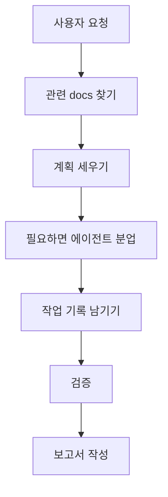

# AI Workflow 문서 안내

이 폴더는 AI가 이 프로젝트에서 어떻게 일해야 하는지 정리한 운영 문서입니다.
Codex, Claude Code, 멀티 에이전트 작업을 사용할 때 "AI가 놓치면 안 되는 절차"를 담고 있습니다.

## 한눈에 보는 역할

## 이 폴더의 문서들

| 문서 | 쉽게 말하면 | 언제 보나요 |
| --- | --- | --- |
| [../ai-development-workflow.md](../ai-development-workflow.md) | 워크플로우 entry point (88줄). 매 세션 시작 시 읽음. | 항상 — 작업 시작 전 가장 먼저 |
| [planning-contracts.md](./planning-contracts.md) | Plan 필수 섹션, Light Spec 6 sections, Out of Scope/SBU/Subagent-eligible 컬럼 규칙. | 새 plan/light-spec 작성 또는 phase 진입 직전 |
| [context-and-packets.md](./context-and-packets.md) | Context ledger 룰, 멀티 에이전트 packet, resume/compaction 복구. | 긴 작업 / 다중 에이전트 / 세션 재개 |
| [review-gates.md](./review-gates.md) | TDD / Cross-model review / Plan-Review PASS Gate / Architecture Pass / QA / Finish. | 리뷰 게이트 직전 |
| [fallback-and-recovery.md](./fallback-and-recovery.md) | 실패 분류 + fallback matrix + degraded mode 기록 룰. | 도구 부재, 권한 막힘, 외부 의존 실패 |
| [agent-packets.md](./agent-packets.md) | 여러 AI에게 일을 나눠줄 때 쓰는 작업지시서 양식. | Codex와 Claude Code를 같이 쓰거나 하위 에이전트를 만들 때 |
| [context-ledger-template.md](./context-ledger-template.md) | 긴 작업의 작업일지 양식. | 작업 시작 시 ledger 생성할 때 |
| [harness-and-skills.md](./harness-and-skills.md) | GStack, Superpowers, Codex, Claude Code의 skill 이름과 harness 구조. | AI 실행 환경이나 skill 라우팅을 점검할 때 |
| [report-template.md](./report-template.md) | AI가 마지막에 보고할 때 쓰는 양식. | 작업 완료 보고를 표준화할 때 |
| [git-publication-decision.md](./git-publication-decision.md) | GitHub 공개 저장소 관련 결정 기록. | 저장소 공개/배포 이력을 확인할 때 |
| [plans/README.md](./plans/README.md) | 큰 계획 문서를 넣는 곳의 안내서. | 실행 전 계획을 파일로 남길 때 |
| [runs/README.md](./runs/README.md) | 실제 작업일지를 넣는 곳의 안내서. | 작업별 진행 기록을 찾을 때 |

## 비개발자를 위한 이해

AI 작업은 말로만 주고받으면 중간에 맥락이 흐려질 수 있습니다.
그래서 이 폴더는 AI에게 다음 세 가지를 강제합니다.

| 장치 | 왜 필요한가요 |
| --- | --- |
| 작업지시서 | 여러 AI가 같은 목표를 보고 움직이게 합니다. |
| 작업일지 | 작업이 길어져도 이전 결정과 근거를 잃지 않게 합니다. |
| 완료 보고서 | 무엇을 했고, 무엇을 검증했고, 남은 위험이 무엇인지 확인하게 합니다. |

## AI에게 이렇게 말하면 됩니다

> 이번 작업은 길어질 수 있으니 `docs/ai-workflow` 기준으로 context ledger를 만들고 진행해줘.

> Codex가 구현하고 Claude Code가 리뷰하는 방식으로 agent packet을 만들어줘.

> 완료 보고는 `docs/ai-workflow/report-template.md` 형식으로 해줘.
## IA Remediation Docs

| Document | Use |
| --- | --- |
| [ia-remediation-multi-agent-execution-plan.md](./ia-remediation-multi-agent-execution-plan.md) | Separate execution plan for fixing IA/page audit findings after verification. |
| [ia-specialist-checklists/README.md](./ia-specialist-checklists/README.md) | Specialist review criteria used by IA execution agents. |
| [ia-review-profiles/README.md](./ia-review-profiles/README.md) | IA-to-specialist and IA-to-pack routing map. |
