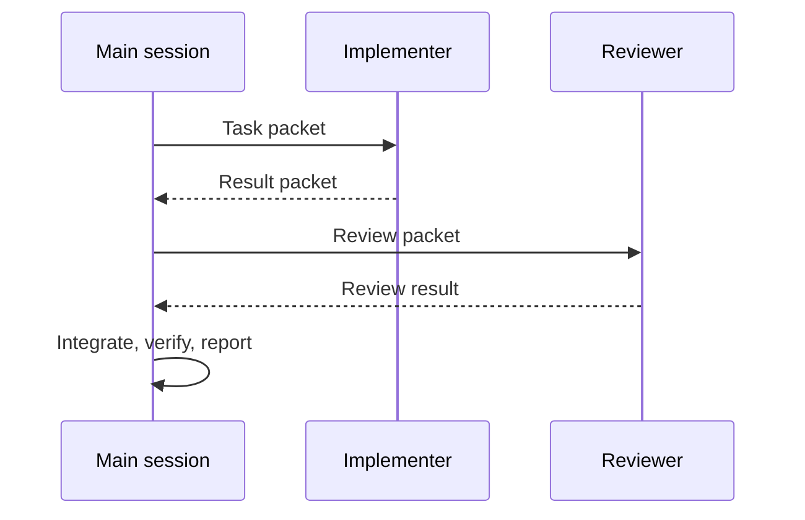

# Harness And Skills Reference

This reference holds details that used to make `AGENTS.md` too large. Agents should read this file only when the task involves skills, harness setup, host differences, fallback, or multi-agent coordination.

## Harness Layout

| Path | Owner | Purpose |
| --- | --- | --- |
| `.claude/skills/` | Claude Code | Project-local GStack short-name skills and Superpowers skills |
| `.codex/skills/` | Codex | Project-local GStack prefixed skills and Superpowers skills |
| `.codex/superpowers/` | Codex | Bundled Superpowers source tree |
| `.agents/skills/gstack/` | Generic fallback | Shared GStack assets for agents without a host-specific folder |
| `.omx/` | OMX runtime | Local runtime deps, logs, and state. Do not edit by hand. |

Primary skills live under the host-specific folder. Use `.agents/skills/gstack/` only as a fallback mirror.

## Required Startup Skill

Every agent starts with Superpowers:

| Host | Required action |
| --- | --- |
| Claude Code | Invoke `using-superpowers`. |
| Codex | Use native skill discovery when available; otherwise read `.codex/skills/using-superpowers/SKILL.md` enough to follow it. |

## Project-Local Skill Names

Use project-local skills. Do not install global copies for this project.

### Codex GStack

- `gstack-office-hours`
- `gstack-plan-ceo-review`
- `gstack-plan-design-review`
- `gstack-plan-eng-review`
- `gstack-review`
- `gstack-qa`
- `gstack-ship`

### Claude Code GStack

- `office-hours`
- `plan-ceo-review`
- `plan-design-review`
- `plan-eng-review`
- `review`
- `qa`
- `ship`

### Superpowers

- `brainstorming`
- `writing-plans`
- `test-driven-development`
- `systematic-debugging`
- `requesting-code-review`
- `receiving-code-review`
- `verification-before-completion`
- `finishing-a-development-branch`

## Skill Routing

| Work type | Use |
| --- | --- |
| New product idea, unclear scope, or product pivot | GStack office-hours plus Superpowers brainstorming |
| Implementation plan with engineering risk | GStack engineering review |
| UX, visual design, user-facing workflow | GStack design review |
| Product/business tradeoff | GStack CEO review |
| Bug or regression | Superpowers systematic-debugging |
| Behavior implementation | Superpowers test-driven-development |
| Code review | Superpowers requesting-code-review or GStack review |
| UI/browser verification | GStack QA or equivalent browser/visual QA |
| Completion claim | Superpowers verification-before-completion |
| Release-sized change | GStack ship |

## Host Pairing

When both Codex and Claude Code are available, prefer one implementer and one reviewer:

Use [agent-packets.md](agent-packets.md) for packet templates.

## Fallback Notes

If a required skill or tool is unavailable:

1. Do not skip the quality gate.
2. Use the closest equivalent manual checklist or local verification.
3. Record degraded mode in the context ledger and final report.
4. Fail closed for doc conflicts, missing approval, destructive actions, secret exposure risk, and security uncertainty.

The full fallback protocol lives in [../ai-development-workflow.md](../ai-development-workflow.md).
