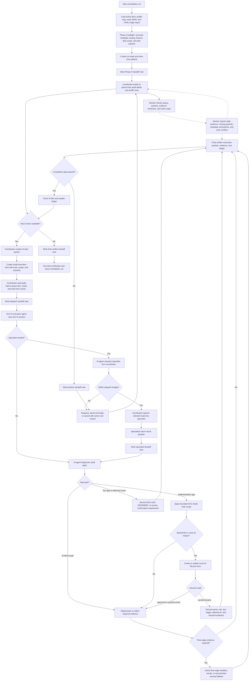

# IA Remediation Multi-Agent Execution Plan

## Purpose

Use this plan to remediate IA/page verification findings after the audit run has already identified gaps.

This is a separate execution document. It does not modify or replace [ia-implementation-verification-execution-plan.md](./ia-implementation-verification-execution-plan.md), which remains the upstream audit execution plan.

## Source Priority

Use active docs and audit artifacts in this order:

1. `docs/sitemap.md`, `docs/IA/README.md`, IA `description.md`, and `docs/flow/user-flow.md`.
2. [ia-page-implementation-verification.md](./ia-page-implementation-verification.md).
3. Audit JSON from the selected run directory.
4. Generated markdown summaries from the same run.
5. HTML report from the same run as human-readable triage only.

The HTML report can influence prioritization and issue discovery. It cannot be the sole proof for final IA labels.

## Current Audit Input

The first remediation run uses:

- HTML report: `reports/ia-verification/runs/20260528-141731/ia-audit-report.html`
- Expected machine-readable source: `reports/ia-verification/runs/20260528-141731/ia-implementation-audit.json`

Known audit impact:

- The report affects queue ordering, cluster discovery, and reviewer context.
- The JSON evidence controls final label evidence, regenerated labels, and closeout.
- Route metadata, audience, route type, modal host, and required packs come from active docs and the IA review profile map.
- If the HTML and JSON disagree, open a reconciliation item before implementation.
- If audit JSON metadata conflicts with active docs or the profile map, keep the label evidence from JSON but open a reconciliation item for the metadata mismatch.

## Risk-Lowering Execution Contract

This plan is execution-ready only when the coordinator can prove these controls before dispatch:

- State machines are closed: every queue item, cross-IA lifecycle item, and reconciliation item is in an allowed state with an owner, timestamp, next action, and terminal rule.
- Wait states are bounded: every `pending`, `waiting_specialist`, `verifying`, `requeue_requested`, `manual-human`, `security-fixture`, and `blocked_terminal` item has an aging threshold and an explicit coordinator action.
- Claims and write locks are one coordinator-owned operation: a queue claim cannot stand without the matching write-lock reservation, and a write-lock reservation cannot stand without the matching queue claim.
- Fallbacks are command-specific: manual evidence is allowed only where this plan defines an artifact schema and closure boundary.
- External and privileged tooling is fail-closed: unpinned tool installation, unknown Supabase project identity, production data mutation, service-role ambiguity, or missing fixture provenance blocks the affected item.

If any control above is missing, the coordinator must stop before IA dispatch, write a handoff note, and mark affected queue items `blocked_terminal` or `pending` with the missing prerequisite.

## Reconciliation Items

When the plan says to open a reconciliation item, the coordinator must create or update `<auditRunDirectory>/reconciliation-items.json`.

Required fields per item:

- `reconciliationId`
- `source`
- `affectedIaCodes`
- `routeOrHostRoute`
- `conflictType`: `html-json`, `json-doc`, `profile-doc`, `manifest-profile`, `manual-evidence`, or `other`
- `sourceEvidence`
- `expectedAuthority`
- `owner`
- `status`
- `createdAt`
- `updatedAt`
- `agingDueAt`
- `resolution`
- `requiredEvidenceBeforeClosure`

Allowed statuses:

| From | To |
| --- | --- |
| `proposed` | `accepted`, `rejected`, `blocked_terminal` |
| `accepted` | `in_progress`, `blocked_terminal`, `carried_forward` |
| `in_progress` | `resolved`, `blocked_terminal`, `carried_forward` |
| `resolved` | `verified`, `reopened` |
| `reopened` | `in_progress`, `blocked_terminal`, `carried_forward` |
| `verified` | `closed` |
| `carried_forward` | `reopened` |

A queue item affected by an `accepted`, `in_progress`, `resolved`, or `reopened` reconciliation item cannot close. A run can close with `carried_forward` reconciliation only when the item records owner, risk, due trigger, affected IA list, and required evidence.

## Phase 0 Preflight

Before assigning remediation work, the coordinator must run a Phase 0 preflight. This phase is allowed to create run-control artifacts and fresh task packets. It must not start IA implementation work.

Preflight checks:

- Reconcile `ia-manifest.json`, the IA review profile map, audit JSON metadata, `docs/sitemap.md`, `docs/IA/README.md`, and the source commit.
- Fail closed on metadata conflicts that affect route, audience, route type, modal host, required packs, or security evidence.
- Compare profile `humanConfirmationRequired` against manifest/audit evidence requirements. If the profile says human confirmation is not required, record `manual-review: N/A` or regenerate the manifest before queue build.
- Confirm flow-edge tooling and artifacts: `package.json` script, validator script, manifest, and result JSON.
- If flow-edge tooling is absent, mark flow-edge-dependent work as `blocked_terminal` or require the manual flow-edge evidence artifact defined below.
- Confirm required agent tools, MCP servers, plugins, and skills before dispatch. Record availability, version or source path when available, and fallback decision in the ledger.
- Confirm `ui-ux-pro-max` skill availability before assigning UX/UI review. If it is missing in the active host, do not auto-install it during remediation. Mark UX/UI-dependent items `blocked_terminal` unless a separate coordinator-authored tool-install packet records trusted source URL, pinned commit or release, checksum or equivalent integrity evidence, install command, installed path/version, host refresh result, and rollback or removal path.
- Discover hosted-surface triggers from source before rerunning hosted-surface browser checks.
- Verify storage-state, seeded users, admin role claims, wrong-owner fixtures, stale-token fixtures, and service-role-dependent fixtures before assigning security/navigation IA work.
- Verify environment identity before any security/data work: environment, Supabase project ref, credential type, productionAllowed flag, serviceRoleUse flag, mutationAllowed flag, and fixture provenance.
- Generate fresh IA task packets. Do not reuse stale dispatch references when `agent-packets/tasks/` is absent or incomplete.
- Snapshot the initial dirty worktree and classify files as baseline dirty, run-owned, or out of scope.
- Create a Phase 0 handoff note after queue, lock, tool, and packet preflight. This note is the resume point if the coordinator session dies before IA work starts.

The output of Phase 0 is `<auditRunDirectory>/remediation-run-state.json`, `<auditRunDirectory>/write-lock-registry.json`, and fresh task packet paths.

## Agent Model

One root coordinator owns durable context and the ledger.

Only the root coordinator may spawn IA execution agents, specialists, monitors, or final verifiers. IA execution agents must not spawn, delegate, or recursively call specialists. They may request a specialist by reporting the reason, required scope, and proposed packet back to the coordinator.

For each IA item or approved cluster, the coordinator assigns one IA execution agent. That IA execution agent owns the main IA session for the assigned write scope.

- Planning/product specialist.
- Development specialist.
- UX/UI specialist.
- Security/data specialist.
- Operations/policy specialist.
- Additional checklist-specific specialists from [ia-specialist-checklists](./ia-specialist-checklists/README.md) when the profile requires them.

A separate monitor agent watches queue health, packet completeness, stale evidence, and cross-IA lifecycle items. The monitor is read-only and reports to the coordinator.

The reconciliation final verifier is coordinator-owned and separate from the IA execution agent. IA execution agents cannot close their own IA items.

When `humanConfirmationRequired` is true, the coordinator may delegate the human-confirmation gate to a separate GPT-5.5 reviewer agent. This reviewer is a delegated human-confirmation reviewer, not an IA execution agent and not the final verifier. It must run in a separate session from the IA execution agent and must return an auditable result packet before the IA item can close.

Each agent uses its own session. When its assigned packet is complete and reported, that session closes.

## Tool, MCP, Plugin, And Skill Policy

Every task packet must declare the tools the agent may use. Agents must not assume tool access from the coordinator session.

Required tool fields in every packet:

- `allowedTools`
- `requiredSkills`
- `requiredMcpOrPlugins`
- `toolPreflightStatus`
- `toolFallbacks`
- `toolUseEvidence`

`toolPreflightStatus` allowed values:

- `pass`: every required tool, skill, MCP server, plugin, fixture, and command has evidence in `toolUseEvidence`.
- `blocked_terminal`: a required tool or fixture is missing and no fallback artifact is defined by this plan.
- `degraded_with_defined_fallback`: the packet names the missing tool, the exact fallback artifact schema defined by this plan, the closure boundary, and the residual risk.

`toolUseEvidence` must include command output, source path, version, installed path, plugin/MCP identifier, or fixture provenance as applicable. Empty values, `available`, `looks ok`, `same as coordinator`, or placeholder text are not PASS evidence. The final verifier must reject closure if a required tool status is missing, stale, unsupported by evidence, or using a fallback not defined in this plan.

Default tool policy by role:

| Role | Required or allowed tools | Must not do |
| --- | --- | --- |
| Coordinator | File/search tools, workflow checker, native subagent tools, skill installer, ledger and packet writes. | Do not perform IA implementation work while acting as coordinator. |
| IA execution agent | Repo-local file/search tools, bounded file edits in its write lock, test commands listed in its packet, browser automation only when the packet requires visual, console-log, or flow evidence. | Do not spawn agents, install tools, or use tools outside its packet without coordinator approval. |
| Planning/product specialist | Active docs, audit artifacts, profile map, checklist docs. | Do not change source files or redefine product scope. |
| Development specialist | Repo-local code search, official docs only when dependency behavior is current or uncertain. | Do not add dependencies or broaden implementation scope. |
| UX/UI specialist | Must use `ui-ux-pro-max` for UI structure, visual design, interaction, accessibility, responsive, or perceived-quality review; may also use project `ant-design`, `talkpik-ui-system`, browser, screenshot, console-log capture, and visual QA tools when assigned. | Do not approve UI/UX work without recording whether `ui-ux-pro-max` was used or why it was unavailable. |
| Security/data specialist | Active backend/auth docs, security checklist, local fixtures, Supabase tooling only when scoped to the approved project and packet. | Do not mutate production data, secrets, auth policy, or external services without explicit coordinator authorization. |
| Operations/policy specialist | Policy docs, automation docs, notification/deferred-scope docs, local automation artifacts. | Do not create recurring automations or external notifications unless the packet explicitly asks for them. |
| Monitor | Read-only access to run state, locks, packets, ledger, audit artifacts, and file-state summaries. | Do not edit implementation files or close IA items. |
| Delegated human-confirmation reviewer | GPT-5.5 separate session, active docs, current IA task packet, regenerated evidence, screenshots, console-log artifacts, or manual evidence artifacts, and the exact human-confirmation question. | Do not edit files, spawn agents, act as final verifier, or satisfy the gate from a broad "looks good" summary. |
| Final verifier | Read-only comparison tools plus verification commands listed in the run state. | Do not fix issues directly; return findings to coordinator. |

If a required tool is unavailable:

- Mark the affected queue item `blocked_terminal` when the missing tool is required for final evidence.
- Use a documented manual-evidence fallback only when this plan defines one.
- Record the missing tool, attempted install or discovery command, fallback, and remaining risk in the handoff note and ledger.

Security/data packets must include:

- `environment`: `local`, `preview`, or `staging`
- `productionAllowed`: `false` unless a user-approved exception is recorded before dispatch
- `supabaseProjectRef`
- `allowedCredentials`: read-only by default
- `serviceRoleUse`: `forbidden` unless packet-specific and coordinator-approved
- `mutationAllowed`: `false` unless exact operation, rollback, and data boundary are listed
- `fixtureProvenance`: storage state, seeded users, admin role claims, wrong-owner fixtures, stale-token fixtures, and service-role-dependent fixtures

If project ref, environment, credential type, service-role use, mutation boundary, or fixture provenance cannot be verified, mark the item `blocked_terminal`. Never infer production safety from local variable names alone.

## Workflow Diagram



## Run State And Queue Artifact

The coordinator must maintain `<auditRunDirectory>/remediation-run-state.json`.

Required top-level fields:

- `runId`
- `sourceCommit`
- `createdAt`
- `updatedAt`
- `schemaVersion`
- `queue`
- `activeClaims`
- `retryPolicy`
- `dispatchBudget`
- `coordinatorHeartbeatAt`
- `coordinatorOwner`
- `terminalSummary`

Queue item fields:

- `iaCode`
- `clusterId`
- `status`
- `attempt`
- `maxAttempts`
- `owner`
- `claimedBy`
- `claimedAt`
- `heartbeatAt`
- `leaseExpiresAt`
- `blockedReason`
- `blockedOwner`
- `agingDueAt`
- `nextCoordinatorAction`
- `packetPath`
- `resultPacketPath`
- `requiredEvidence`
- `writeLocks`
- `version`

Allowed queue statuses:

- `pending`: discovered but not preflight-ready.
- `ready`: eligible for coordinator claim.
- `claimed`: coordinator assigned owner and lease, but work has not started.
- `in_progress`: IA execution agent is active.
- `waiting_specialist`: work is waiting for a coordinator-spawned specialist result.
- `verifying`: final verifier is reconciling evidence.
- `requeue_requested`: the current attempt did not close and needs coordinator decision.
- `done`: IA item is closed.
- `blocked_terminal`: IA item cannot be retried until the prerequisite changes and a new coordinator-authored packet exists.
- `cancelled`: coordinator intentionally removed the item from the run.

Allowed transitions:

| From | To |
| --- | --- |
| `pending` | `ready`, `blocked_terminal`, `cancelled` |
| `ready` | `claimed`, `blocked_terminal`, `cancelled` |
| `claimed` | `in_progress`, `blocked_terminal`, `cancelled` |
| `in_progress` | `waiting_specialist`, `verifying`, `requeue_requested`, `blocked_terminal`, `cancelled` |
| `waiting_specialist` | `in_progress`, `blocked_terminal`, `cancelled` |
| `verifying` | `done`, `requeue_requested`, `blocked_terminal`, `cancelled` |
| `requeue_requested` | `ready`, `blocked_terminal`, `cancelled` |

Default retry policy:

- `maxAttempts: 2` per IA item unless the coordinator records a specific exception in the ledger.
- `blocked_terminal` cannot be retried without a new coordinator-authored packet and a changed prerequisite.
- Queue items must be claimed atomically with their write-lock reservation by updating `claimedBy`, `claimedAt`, `leaseExpiresAt`, write-lock owner/status, and `version` as one coordinator-owned operation.
- A queue item whose `version` changed since packet creation must be re-read before work continues.

Requeue mechanics:

1. Before any `requeue_requested -> ready` transition, increment `attempt`.
2. If the incremented `attempt` is greater than or equal to `maxAttempts`, move the item to `blocked_terminal`.
3. Clear `claimedBy`, `claimedAt`, `heartbeatAt`, `leaseExpiresAt`, and stale `resultPacketPath` unless the result packet is retained as failure evidence.
4. Release all write locks held by the attempt and record `releasedAt`.
5. Invalidate the previous task packet by recording `supersededBy` or `staleReason`.
6. Generate a fresh coordinator-authored packet before the item can become `ready`.
7. Record `blockedOwner`, `blockedReason`, `agingDueAt`, and `nextCoordinatorAction` when the item becomes `blocked_terminal`.

Requeue is forbidden when the same prerequisite is still missing. Use `blocked_terminal` until the prerequisite changes.

Atomic claim and write-lock sequence:

1. Read the current run-state file and queue item `version`.
2. Read the write-lock registry and verify every required lock is available.
3. Write proposed run-state and write-lock registry updates to temporary files in the same directory.
4. Replace the write-lock registry with its temporary file using an atomic rename.
5. Replace the run-state file with its temporary file using an atomic rename.
6. Re-read both files.
7. Continue only if `claimedBy`, `leaseExpiresAt`, incremented `version`, lock owner, lock status, and preimage hashes all match the coordinator's intended claim.
8. If either file differs, immediately roll back any matching partial lock owned by the failed claim, re-read both files, and retry once.
9. If the retry fails, leave the item `ready` only when no lock remains reserved. Otherwise move it to `requeue_requested` with a P0 monitor alert.

## Dispatch Budget

- Only the root coordinator may spawn IA execution agents, specialists, monitor agents, or final verifiers.
- Max active IA execution agents: `2` by default.
- Max active IA execution agents may increase to `3` only when write-lock clusters are disjoint and the ledger records the reason.
- Max active specialists per IA item: `2`.
- Additional specialists require a coordinator packet update and ledger rationale.
- IA execution agents cannot recursively delegate or spawn agents.
- Monitor agents do not consume the IA execution budget.
- Final verifiers do not share ownership with IA execution agents.

## Heartbeat, Timeout, And Stale Session Policy

- The coordinator must update `coordinatorHeartbeatAt` at least every 10 minutes while the run has any non-terminal queue item.
- A coordinator run is stale after 15 minutes without `coordinatorHeartbeatAt` movement. A replacement coordinator must use the latest handoff note and run-state files to reclaim or terminally block affected work.
- Active IA execution agents must update `heartbeatAt` at least every 10 minutes while active.
- An IA execution session is stale after 15 minutes without heartbeat.
- An IA execution lease expires after 45 minutes unless the coordinator extends it with a ledger reason.
- Specialist sessions time out after 20 minutes unless the coordinator extends them with a ledger reason.
- Final verifier sessions time out after 20 minutes unless the coordinator extends them with a ledger reason and updates `agingDueAt`.
- The monitor is read-only and non-blocking except for P0 alerts.
- Coordinator action for stale sessions is one of: reclaim the lease, reassign with a fresh packet, or mark `blocked_terminal`.
- If a specialist times out while an IA item is `waiting_specialist`, the coordinator must release the specialist slot, record the timeout in the result-packet area or ledger, and move the IA item to `requeue_requested` or `blocked_terminal`.
- If a final verifier times out while an IA item is `verifying`, the coordinator must move the item to `requeue_requested` or `blocked_terminal`, release verifier ownership, and write a blocker handoff note.

Aging thresholds:

| State or lane | Aging threshold | Required coordinator action |
| --- | --- | --- |
| `pending` | 30 minutes | Convert to `ready`, `blocked_terminal`, or `cancelled` with reason. |
| `claimed` | 10 minutes without `in_progress` | Reclaim claim or move to `blocked_terminal`. |
| `waiting_specialist` | 20 minutes | Release specialist slot, then return to `in_progress`, `requeue_requested`, or `blocked_terminal`. |
| `verifying` | 20 minutes | Reassign final verifier, requeue, or block terminally. |
| `requeue_requested` | 15 minutes | Apply requeue mechanics or block terminally. |
| `manual-human` lane | 1 business day | Record owner, due trigger, and whether the run can carry forward. |
| `security-fixture` lane | 30 minutes | Verify fixture provenance or block terminally. |
| `blocked_terminal` | 1 business day | Produce aging summary with owner, changed prerequisite needed, and next allowed action. |
| Cross-IA item not `closed`, `rejected`, or `carried-forward` | 30 minutes | Move to a valid terminal/carry-forward state or reopen affected queue items. |

P0 alerts must be handled within 10 minutes. Handling means the coordinator records one of: resolved, reclaimed, reassigned, requeued, `blocked_terminal`, or escalated with owner and due trigger.

P0 monitor alerts:

- Missing active claim owner.
- Expired lease on a write-locked item.
- Shared write-lock collision.
- Stale evidence after a relevant file change.
- Missing result packet for a `verifying` item.
- Timed-out specialist while an IA item is `waiting_specialist`.
- Timed-out final verifier while an IA item is `verifying`.
- Stale coordinator heartbeat while non-terminal queue items exist.
- Invalid queue transition or lifecycle state.
- Metadata conflict affecting route, audience, route type, modal host, required packs, or security evidence.

## Handoff Notes

Because this workflow uses multiple sessions, the coordinator must write handoff notes at fixed checkpoints. A handoff note is a short resume document. It must let a new coordinator continue without reading the entire conversation history.

Handoff path:

- `<auditRunDirectory>/handoffs/<timestamp>-<scope>-handoff.md`

Required checkpoints:

- After Phase 0 preflight.
- After each queue item is claimed and before the IA execution agent starts.
- Before requesting a specialist.
- After every specialist result packet.
- Before lease extension, requeue, reassignment, or `blocked_terminal`.
- After cross-IA lifecycle item creation or state change.
- Before final verifier starts.
- After final run closeout.

Required handoff fields:

- `handoffId`
- `createdAt`
- `createdBy`
- `scope`
- `runStatePath`
- `writeLockRegistryPath`
- `queueItemsInScope`
- `activeAgents`
- `openLeases`
- `lastHeartbeatAt`
- `toolsAvailable`
- `toolsMissing`
- `requiredSkillsUsed`
- `decisionsSinceLastHandoff`
- `filesChangedSinceLastHandoff`
- `evidenceProduced`
- `screenshotArtifacts`
- `consoleLogArtifacts`
- `blockers`
- `nextCoordinatorAction`

If an agent or coordinator session dies, the replacement coordinator must read the latest handoff note, re-read `remediation-run-state.json`, re-read `write-lock-registry.json`, and then either reclaim expired leases or mark the item `blocked_terminal`.

## Execution Slice And Workslop Controls

The full workflow document is the policy source. It is not the execution prompt for every agent.

To reduce workslop, the coordinator must create a short execution slice for each agent. The slice is part of the task packet and must contain only the sections needed for that agent's role.

Execution slice rules:

- Max 1 IA item or approved cluster per IA execution agent.
- Max 2 primary goals per packet.
- Max 10 checklist items copied into the packet. Link to the full checklist for reference instead of pasting the whole document.
- Include exact route, host route, IA code, write scope, required evidence, required tools, and stop conditions.
- Browser or visual execution slices must name the expected screenshot artifacts, browser console-log artifacts, and network or runtime error observations to capture.
- Include `mustReadSections` with heading names from this document and checklist docs.
- Include `mustNotDo` so agents do not expand product scope, edit unowned files, or skip evidence.
- Include a `definitionOfDone` that maps to the completion gate.
- Every result packet must answer each checklist item as `PASS`, `PARTIAL`, `FAIL`, `BLOCKED`, `N/A`, `DOC-GAP`, or `DEFERRED`.

No agent may claim completion from a broad summary such as "looks good" or "implemented". Claims must point to evidence files, commands, screenshots, browser console logs, or source lines.

## Monitor Agent Packet And Result

The monitor is not an IA execution agent and does not edit files. It runs with read-only scope over the queue, ledger, task packets, result packets, audit artifacts, and current file-state summary.

Minimum monitor cadence:

- At remediation run start after queue creation.
- After each IA task packet is assigned.
- After each IA task closes, blocks, or creates a cross-IA lifecycle item.
- Before final run closeout.

The coordinator may request additional monitor checks when write conflicts, stale evidence, or cross-IA flow risk appears.

Monitor packets extend the standard [agent packet](./agent-packets.md) contract. The monitor has `Audience: n/a`, `Exact write scope: none`, and a read-only scope that is limited to orchestration artifacts and file-state summaries.

Monitor task packet template:

```markdown
## Task Packet

- Agent:
- Role: read-only monitor
- Objective:
- Audience: n/a
- Accepted scope:
- Out of scope:
- Docs consulted:
- Extracted requirements:
- Exact read scope:
- Exact write scope: none
- Files not to touch:
- Constraints:
- Required verification:
- Expected output:
- Context ledger path:
- Handoff note path:
- Allowed tools:
- Required skills:
- Required MCP/plugins:
- Tool preflight status:
- Tool fallbacks:

## Monitor Fields

- readOnlyScope:
- queueSnapshot:
- ledgerPath:
- taskPacketPaths:
- resultPacketPaths:
- auditRunDirectory:
- profileMapPath:
- currentChangedFiles:
- crossIaLifecyclePath:
- escalationThresholds:
```

Monitor result packet template:

```markdown
## Result Packet

- Agent:
- Role: read-only monitor
- Objective completed:
- Audience verified: n/a - monitor is read-only and has no product audience boundary.
- Files inspected:
- Files changed: none
- Decisions made:
- Tests/checks run:
- Results:
- Blockers:
- Assumptions:
- Scope concerns:
- Recommended follow-up:
- Context ledger updates needed:
- Handoff note updates needed:
- Tools used:
- Required skills used:
- MCP/plugins used:
- Tool failures or fallbacks:

## Monitor Results

- queueHealth:
- missingPackets:
- staleEvidence:
- crossIaAging:
- writeConflictAlerts:
- metadataMismatchAlerts:
- humanConfirmationGaps:
- recommendedCoordinatorActions:
- blockers:
```

Escalate to the coordinator when:

- A required packet is missing or lacks a standard packet field.
- A file changed after the task packet preimage hash.
- Regenerated evidence predates the latest relevant file change.
- A cross-IA item is still `proposed`, `approved`, `queued-revisit`, or `applied` when an affected IA is being closed.
- Audit JSON metadata conflicts with the profile map or active route docs.

## Required IA Task Packet Fields

IA task packets extend the standard [agent packet](./agent-packets.md) contract. Every IA packet must include all standard task packet fields plus IA-specific fields.

Required packet template:

```markdown
## Task Packet

- Agent:
- Role: IA execution agent
- Objective:
- Audience:
- Accepted scope:
- Out of scope:
- Docs consulted:
- Extracted requirements:
- Exact read scope:
- Exact write scope:
- Files not to touch:
- Constraints:
- Required verification:
- Expected output:
- Context ledger path:
- Handoff note path:
- Allowed tools:
- Required skills:
- Required MCP/plugins:
- Tool preflight status:
- Tool fallbacks:
- Execution slice:
- Must-read sections:
- Must-not-do:
- Definition of done:

## IA Remediation Fields

- iaCode:
- screenName:
- profileRow:
- requiredSpecialists:
- requiredChecklistDocs:
- requiredPacks:
- requiredEvidence:
- auditRunDirectory:
- auditJsonPath:
- htmlReportPath:
- sourceDocs:
- allowedWriteScope:
- readOnlyScopes:
- baseCommit:
- preimageHashes:
- crossIaImpacts:
- humanConfirmationRequired:
- deferredScopeGuards:
- verificationCommands:
- environment:
- productionAllowed:
- supabaseProjectRef:
- allowedCredentials:
- serviceRoleUse:
- mutationAllowed:
- fixtureProvenance:
- toolUseEvidence:
```

The IA-specific fields must include:

- `iaCode`
- `screenName`
- `profileRow` from [ia-review-profile-map.json](./ia-review-profiles/ia-review-profile-map.json)
- `requiredSpecialists`
- `requiredChecklistDocs`
- `requiredPacks`
- `requiredEvidence`
- `auditRunDirectory`
- `auditJsonPath`
- `htmlReportPath`
- `sourceDocs`
- `allowedWriteScope`
- `readOnlyScopes`
- `baseCommit`
- `preimageHashes` for files in write scope
- `crossIaImpacts`
- `humanConfirmationRequired`
- `deferredScopeGuards`
- `verificationCommands`
- `environment`, `productionAllowed`, `supabaseProjectRef`, `allowedCredentials`, `serviceRoleUse`, `mutationAllowed`, and `fixtureProvenance` when the packet touches security, data, auth, storage, Supabase, owner scope, admin scope, or fixtures
- `allowedTools`, `requiredSkills`, `requiredMcpOrPlugins`, `toolPreflightStatus`, `toolFallbacks`, and `toolUseEvidence`
- `handoffNotePath`
- `executionSlice`, `mustReadSections`, `mustNotDo`, and `definitionOfDone`

IA result packets must include:

- `iaCode`
- `queueItemStatus`
- `toolsUsed`
- `requiredSkillsUsed`
- `mcpOrPluginsUsed`
- `toolFailuresOrFallbacks`
- `handoffNotesWritten`
- `checklistResults`
- `evidenceFiles`
- `screenshotArtifacts`
- `consoleLogArtifacts`
- `commandsRun`
- `filesChanged`
- `crossIaLifecycleUpdates`
- `remainingBlockers`
- `recommendedNextCoordinatorAction`

## Queue Rules

1. Build the queue from audit JSON labels and profile rows.
2. Use HTML report ordering only as a triage hint.
3. Build lane classification before dispatch:
   - `implementable`: source and evidence prerequisites exist, and code/docs work is likely needed.
   - `evidence-refresh`: implementation may already satisfy docs, but audit artifacts are stale or missing.
   - `manual-human`: human confirmation or manual evidence is required before closeout.
   - `security-fixture`: storage state, seeded user, role, wrong-owner, stale-token, or service-role fixture is missing.
   - `blocked-prerequisite`: a required script, artifact, fixture, trigger, or source decision is absent.
4. Prefer `FAIL` before `PARTIAL`, `PARTIAL` before `BLOCKED` only inside the same lane.
5. Do not dispatch `blocked-prerequisite` items until the prerequisite changes.
6. Group related hosted surfaces with their host IA when flow evidence would otherwise be duplicated.
7. Never run two IA execution agents that can write the same route, component, test, or shared flow file at the same time.
8. Use active docs and profile rows for route, audience, route type, modal host, and required pack metadata.
9. For `PARTIAL` rows whose audit markdown says `none`, extract actionable work from `manual-review.json`, `agent-integration-results.json`, and generated result packets before dispatch.
10. Fresh task packets are required for every queue item. Missing task packets are a P0 monitor alert.

## Delegated Human Confirmation

Use this section when the profile row has `humanConfirmationRequired: true` or required evidence includes `human-confirmation-record`.

The default path is delegated review by a separate GPT-5.5 reviewer agent. The coordinator must still record that the user delegated this authority for the run. If there is no user delegation record, the item remains in the `manual-human` lane until the user supplies one or the coordinator marks the item `blocked_terminal`.

The delegated reviewer must be independent:

- It must be a separate GPT-5.5 session from the IA execution agent.
- It must not be the agent that implemented or refreshed the IA evidence.
- It must not be the reconciliation final verifier.
- It must be read-only.
- It must receive a bounded task packet from the coordinator.

The task packet must include:

- `delegationSource`: user message, run policy, or handoff note that authorizes GPT-5.5 delegated human confirmation
- `delegatedReviewerModel`: `gpt-5.5`
- `iaCode`
- `screenName`
- `routeOrHostRoute`
- `humanConfirmationQuestion`
- `requiredHumanEvidence`
- `deferredScopeGuards`
- `sourceDocs`
- `evidenceFiles`
- `screenshotsOrManualArtifacts`
- `decisionOptions`: `PASS`, `FAIL`, `BLOCKED`, or `DEFERRED`
- `mustNotDecide`: items outside the exact human-confirmation question

The delegated reviewer result packet must include:

- `delegationAccepted`: yes/no with the delegation source
- `modelUsed`
- `iaCode`
- `questionAnswered`
- `decision`: `PASS`, `FAIL`, `BLOCKED`, or `DEFERRED`
- `evidenceReviewed`
- `rationale`
- `limitations`
- `residualRisk`
- `reviewedAt`
- `reviewerId`

Closure rules:

- `PASS` may satisfy `human-confirmation-record` only when `delegationAccepted` is yes, `modelUsed` is GPT-5.5, evidence reviewed is listed, and the decision directly answers the packet question.
- `FAIL` moves the IA item to `requeue_requested` or `blocked_terminal` with owner and reason.
- `BLOCKED` keeps the IA item in `manual-human` or `blocked_terminal` with the missing prerequisite.
- `DEFERRED` can close the current IA only when the plan allows `carried-forward` and the item records owner, risk, due trigger, affected IA list, and required evidence.
- A generic AI judgment, self-review, code review, or final-verifier note cannot satisfy `human-confirmation-record`.

## Cross-IA Flow Handling

When one IA fix affects another IA or a page-to-page transition, create a cross-IA lifecycle item:

| State | Meaning |
| --- | --- |
| `proposed` | A specialist or IA execution agent identified the impact. |
| `approved` | Coordinator accepted it as in scope for the current run. |
| `queued-revisit` | Affected IA must be reopened or checked after the current fix. |
| `applied` | The implementation or docs change was made. |
| `evidence-regenerated` | Audit or test evidence was refreshed for every affected IA. |
| `closed` | Final verifier accepted the evidence. |
| `rejected` | Coordinator rejected the item with rationale. |
| `carried-forward` | Coordinator accepted that the item cannot close in the current run and recorded owner, risk, affected IA, due trigger, and evidence needed. |

Cross-IA items must record source IA, target IA, route or host route, evidence, owner, and final disposition.

`carried-forward` is allowed only when it is outside the accepted scope of the current IA task or blocked by a documented prerequisite. It must include a named owner, explicit risk, due trigger, affected IA list, and the evidence required before closure.

Operational rules:

- `approved` and `queued-revisit` must create or update queue items immediately.
- `approved`, `queued-revisit`, and `applied` cannot remain open when an affected IA item closes.
- A run may close with `carried-forward` only when each item has owner, risk, due trigger, affected IA list, and required evidence.
- `carried-forward` is a run-level decision, not an IA execution-agent decision.

Allowed cross-IA lifecycle transitions:

| From | To |
| --- | --- |
| `proposed` | `approved`, `rejected`, `carried-forward` |
| `approved` | `queued-revisit`, `rejected`, `carried-forward` |
| `queued-revisit` | `applied`, `rejected`, `carried-forward` |
| `applied` | `evidence-regenerated`, `rejected`, `carried-forward` |
| `evidence-regenerated` | `closed`, `rejected`, `queued-revisit` |
| `closed` | none |
| `rejected` | none |
| `carried-forward` | `queued-revisit` only after the due trigger occurs and a coordinator-authored packet exists |

Closure guards:

- An affected IA item cannot close while any related cross-IA item is `proposed`, `approved`, `queued-revisit`, `applied`, or `evidence-regenerated`.
- `carried-forward` is allowed only when the item is outside the accepted scope or blocked by a documented prerequisite.
- The final verifier must compare cross-IA items against run state and reject closure if an open impact is missing an owner, risk, due trigger, affected IA list, or required evidence.

## Flow-Edge Gate

For page-to-page and hosted-surface flow changes, final closure requires:

- `<auditRunDirectory>/flow-edge-manifest.json`
- `<auditRunDirectory>/flow-edge-results.json`
- Command output for the flow-edge validation command.

Current prerequisite warning: `pnpm test:ia:flow-edges` and `scripts/audit-setup/validate-flow-edges.mjs` are not established by this document. If they are absent, flow-edge remediation remains `BLOCKED` or must be scoped to documented manual evidence.

Manual fallback artifact:

- Path: `<auditRunDirectory>/manual-flow-edge-evidence.json`
- Required fields:
  - `flowEdgeId`
  - `sourceIaCode`
  - `targetIaCode`
  - `route`
  - `hostRoute`
  - `trigger`
  - `scenario`
  - `steps`
  - `viewport`
  - `authRole`
  - `storageStateArtifact`
  - `expectedResult`
  - `actualResult`
  - `label`
  - `evidenceFiles`
  - `consoleLogFiles`
  - `reviewer`
  - `reviewedAt`
  - `limitations`
  - `verifierDisposition`

Manual flow-edge evidence may close only the scoped flow-edge gap. It must not upgrade unrelated `BLOCKED` security, storage, owner, RBAC, or fixture evidence to `PASS`.

Command-specific fallback policy:

| Command or evidence | Manual fallback allowed? | Closure boundary |
| --- | --- | --- |
| `pnpm test` | No for behavior changes. | Block unless an equivalent focused test command is listed and passes. |
| `pnpm test:e2e` | Degraded only with owner acceptance. | Cannot close security, navigation, auth, owner, storage, or RBAC evidence. |
| `pnpm test:ia:flow-edges` | Yes, only with `<auditRunDirectory>/manual-flow-edge-evidence.json`. | Closes only the scoped flow-edge gap named in the artifact. |
| Storage, owner, RBAC, auth, service-role, or fixture evidence | No generic fallback. | Block unless this plan defines a specific artifact schema and final verifier accepts it. |
| Browser/visual evidence | Degraded only with screenshots, browser console logs, and manual steps listed in the packet. | Cannot close auth, data ownership, or security evidence. |

The final verifier must reject any IA closure that uses generic notes, chat summaries, or unstructured manual observations as substitute evidence for commands or fixtures listed above.

## Specialist Routing

Use [ia-review-profile-map.json](./ia-review-profiles/ia-review-profile-map.json) for minimum routing.

The IA execution agent may request additional specialists when evidence reveals:

- Data ownership, role, token, PII, or storage risk.
- Hosted modal/state behavior.
- Form, validation, retry, or error-recovery risk.
- AI analysis, recommendation, feedback, report, or async-state risk.
- Deferred billing, notification transport, email, rate-limit, audit, or policy risk.

Specialists are read-only by default. Implementation work stays with the IA execution agent unless the coordinator assigns a bounded write scope.

## Write Lock Registry

The coordinator must maintain `<auditRunDirectory>/write-lock-registry.json`.

Required fields per lock:

- `lockId`
- `clusterId`
- `owner`
- `paths`
- `routeOrHostRoute`
- `iaCodes`
- `status`
- `claimedAt`
- `releasedAt`
- `preimageHashes`

Shared lock clusters must cover:

- Hosted route clusters, such as writing routes plus `D-M1`, `D-M2`, and `D-M3`.
- Export clusters, such as `/library`, feedback routes, report routes, and `F-M1`.
- Shared components.
- Shared tests.
- Route middleware.
- Auth utilities.
- Audit scripts.
- Report-generation scripts.

No two active queue items may hold overlapping paths or cluster IDs. If overlap is discovered after dispatch, the second lease is reclaimed and the item moves to `requeue_requested` or `blocked_terminal`.

## Write Conflict Rules

- The coordinator owns shared queue and ledger files.
- One IA execution agent owns one IA write scope at a time.
- Shared components, shared tests, route middleware, auth utilities, and audit scripts require coordinator approval before edit.
- If a claimed write-scope file changed since the task packet preimage hash, the IA execution agent stops and reports a conflict.
- Pre-existing dirty files must be classified during Phase 0 as baseline dirty, run-owned, or out of scope.
- Untracked files require explicit ownership before they are included in a write scope.
- Do not revert unrelated dirty worktree changes.

## Completion Gate

An IA item can close only when:

- Required specialists returned result packets or have justified `N/A`.
- The final verifier applied the shared rubric.
- The final verifier is coordinator-owned and separate from the IA execution agent.
- Regenerated JSON evidence supports the final label.
- HTML observations are either backed by source evidence or rejected with rationale.
- Cross-IA impacts are `closed`, `rejected`, or `carried-forward` with owner, risk, due trigger, affected IA, and required evidence.
- Human confirmation is recorded when required.
- The ledger contains docs consulted, commands, results, decisions, and remaining risk.
- Browser or visual claims include screenshot artifacts and browser console-log artifacts, or a scoped reason why console capture was not applicable.
- Repo-level gates are recorded when implementation changed user behavior: TDD status, cross-model review, code/doc review, UX/UI Consistency Pass, QA Gate, and workflow checker result.
- Run closeout requires every queue item to be `done`, `blocked_terminal`, or `cancelled`.
- No `claimed`, `in_progress`, `waiting_specialist`, `verifying`, expired lease, or stale session may remain at run closeout.
- The final verifier must compare run state, write-lock registry, task packets, result packets, audit JSON, manual evidence, regenerated artifacts, screenshots, browser console-log artifacts, and current file state.

## Verification Commands

Run after documentation updates:

```bash
node scripts/ai-workflow-check.mjs --repo .
rg -n "ia-specialist-checklists|ia-review-profiles" docs/ai-workflow
rg -n "TODO|TBD|fill in|later" docs/ai-workflow/ia-specialist-checklists docs/ai-workflow/ia-review-profiles
```

Run after remediation implementation:

```bash
node scripts/ai-workflow-check.mjs --repo .
pnpm test
pnpm test:e2e
pnpm test:ia:flow-edges
```

If a command is unavailable, use the policy below. Do not accept generic manual evidence.

Unavailable command policy:

- Use the command-specific fallback table in the Flow-Edge Gate section.
- A missing command is not automatically degraded.
- If the missing command is required for final evidence and no defined fallback artifact exists, mark the queue item `blocked_terminal`.
- If a defined fallback exists, the packet must name the artifact path, schema, closure boundary, reviewer, reviewedAt, limitations, and residual risk.

## Docs Consulted

- `docs/agent-index.md`
- `docs/user-communication-style.md`
- `docs/ai-development-workflow.md`
- `docs/ai-workflow/context-and-packets.md`
- `docs/ai-workflow/agent-packets.md`
- `docs/ai-workflow/review-gates.md`
- `docs/ai-workflow/fallback-and-recovery.md`
- `docs/ai-workflow/ia-page-implementation-verification.md`
- `docs/IA/README.md`
- `docs/sitemap.md`
