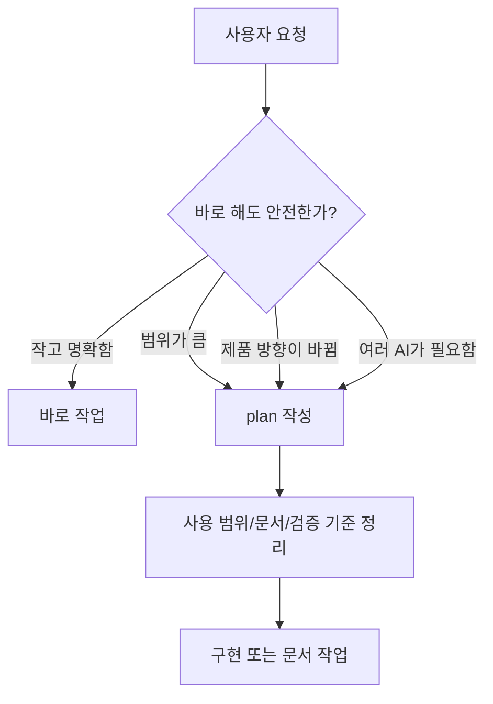

# Plans 안내

이 폴더는 큰 작업을 시작하기 전에 계획서를 저장하는 곳입니다.
쉽게 말하면 "바로 만들기 전에, 무엇을 어떤 순서로 할지 정리하는 종이"입니다.

## 계획이 필요한 경우



## 계획서에 들어가야 하는 내용

| 항목 | 쉽게 말하면 |
| --- | --- |
| User goal | 사용자가 원하는 최종 결과 |
| Accepted scope | 이번에 하기로 한 범위 |
| Docs consulted | 읽은 기준 문서 |
| Test strategy | 어떻게 검증할지 |
| Agent assignments | 여러 AI에게 일을 나누는 방식 |
| Verification plan | 완료라고 말하기 전 확인할 것 |
| Risks | 남아 있는 위험이나 미확정 사항 |

파일 이름은 run ledger와 같은 방식으로 씁니다.

```text
YYYYMMDD-HHMM-task-slug.md
```
