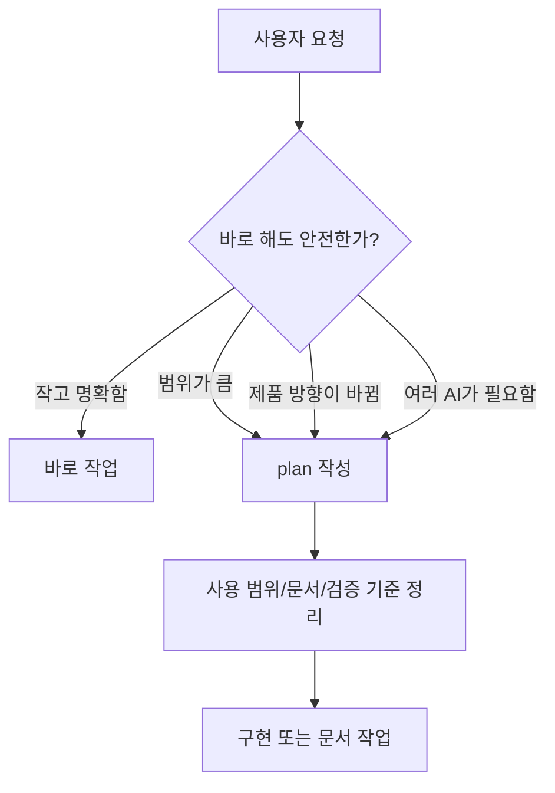

# Plans 안내

이 폴더는 큰 작업을 시작하기 전에 계획서를 저장하는 곳입니다.
쉽게 말하면 "바로 만들기 전에, 무엇을 어떤 순서로 할지 정리하는 종이"입니다.

## 계획이 필요한 경우



## 계획서에 들어가야 하는 내용

| 항목 | 쉽게 말하면 |
| --- | --- |
| User goal | 사용자가 원하는 최종 결과 |
| Accepted scope | 이번에 하기로 한 범위 |
| Docs consulted | 읽은 기준 문서 |
| Test strategy | 어떻게 검증할지 |
| Agent assignments | 여러 AI에게 일을 나누는 방식 |
| Verification plan | 완료라고 말하기 전 확인할 것 |
| Risks | 남아 있는 위험이나 미확정 사항 |

파일 이름은 run ledger와 같은 방식으로 씁니다.

```text
YYYYMMDD-HHMM-task-slug.md
```

## 필수 섹션 (검사기로 강제)

`scripts/ai-workflow-check.mjs`는 `docs/ai-workflow/plans/` 아래의 plan 파일이 다음 두 섹션을 빈 본문 없이 가져야 통과합니다 (`README.md`, `*-template.md`는 예외).

- `## Out of Scope — Intentional Cuts` — 이번 작업에서 일부러 빼는 항목과 그 이유. "빼기 강제" 게이트.
- `## Smallest Buildable Unit` — 이 plan을 가장 작게 잘랐을 때의 최소 단위. 점진 도입의 첫 PR이 무엇인지.

`## Tasks` 섹션이 존재하면 그 안에 마크다운 표가 있어야 하고, 표 헤더에 `Subagent-eligible` 문구를 포함한 컬럼이 필수입니다(권장 표기: `Subagent-eligible? (Y/N + reason)`). 컬럼 위치는 자유이며, 각 데이터 행은 그 컬럼 셀에 `Y — <reason>` 또는 `N — <reason>` 형식을 가져야 합니다 (em-dash 또는 하이픈 허용).

```text
| # | Task | Files | Subagent-eligible? (Y/N + reason) |
| --- | --- | --- | --- |
| 1 | DB schema | src/db/*.ts | Y — 독립 모듈 |
| 2 | UI wiring | src/app/*.tsx | N — Task 1 결과에 의존 |
```

## 어떤 plan이 phase plan인가

파일명이 `development-phases-and-bootstrap.md`로 끝나는 plan은 Phase Contract 표를 가집니다. 이 경우 검사기는 표의 모든 데이터 행의 `Completion Gate` 셀에 `Architecture Pass` 문자열이 포함됐는지 검사합니다.

## 관련 문서

- 빼기/SBU/서브에이전트 컬럼 강제 이유는 [docs/ai-development-workflow.md](../../ai-development-workflow.md)의 "Light Spec" 절과 "Architecture Pass" 절 참고.
- 라이트 스펙 가이드: [../light-specs/README.md](../light-specs/README.md)
