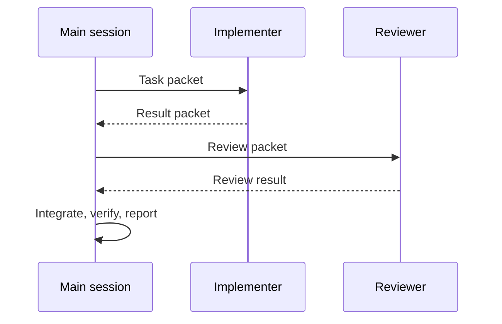

# Harness And Skills Reference

This reference holds details that used to make `AGENTS.md` too large. Agents should read this file only when the task involves skills, harness setup, host differences, fallback, or multi-agent coordination.

## Harness Layout

| Path | Owner | Purpose |
| --- | --- | --- |
| `.agents/skills/talkpik-*/` | Shared | Canonical TALKPIK project skill source |
| `.agents/skills/<practical-skill>/` | Shared | Canonical project-local practical development skill source |
| `.agents/superpowers/skills/` | Shared | Canonical Superpowers skill source |
| `.claude/skills/` | Claude Code | Host-specific skill mirror generated from `.agents`, plus local Claude skills |
| `.codex/skills/` | Codex | Host-specific skill mirror generated from `.agents`, plus local Codex skills |
| `skills-lock.json` | Shared | Installed practical skill source and hash lock generated by the skill installer |
| `.agents/skills/gstack/` | Generic fallback | Optional local GStack fallback mirror for agents without a host-specific folder; not versioned as project source |
| `.omx/` | OMX runtime | Local runtime deps, logs, and state. Do not edit by hand. |

Primary TALKPIK skills live under `.agents/skills/talkpik-*`. Host-specific
copies under `.codex/skills/talkpik-*` and `.claude/skills/talkpik-*` are
local generated mirrors for runtime discovery and are not the source of truth.
Practical development skills live under `.agents/skills/<practical-skill>/`.
Superpowers skills live under `.agents/superpowers/skills/*`. All are mirrored
into `.codex/skills/` and `.claude/skills/` for host-native discovery. Do not
edit host mirrors directly. After changing canonical skills, run:

```bash
node scripts/sync-agent-skills.mjs
node scripts/sync-agent-skills.mjs --check
```

Use `.agents/skills/gstack/` only as an optional local fallback mirror for
GStack assets. The project does not treat GStack assets as versioned source; if
a GStack skill is unavailable, follow the fallback protocol and record degraded
mode instead of blocking on a host-specific install.

Skill precedence is fixed:

1. `docs/spec.md` and active project docs.
2. `talkpik-*` project guardrail skills.
3. Project-local practical development skills.
4. Model general knowledge or host-global advisory skills.

Practical skills are implementation aids. They do not authorize stack changes,
new dependencies, secret exposure, production actions, or bypassing TALKPIK
quality gates.

## Required Startup Skill

Every agent starts with Superpowers:

| Host | Required action |
| --- | --- |
| Claude Code | Invoke `using-superpowers` after host mirrors are synced. |
| Codex | Use native skill discovery when available after host mirrors are synced; otherwise read `.agents/superpowers/skills/using-superpowers/SKILL.md` enough to follow it. |
| Any other host | Read `.agents/superpowers/skills/using-superpowers/SKILL.md` and follow the closest equivalent workflow. |

## Project-Local Skill Names

Use project-local skills. Do not install global copies for this project.

### TALKPIK Shared Skills

These skills are authored once under `.agents/skills/` and mirrored locally into
both `.codex/skills/` and `.claude/skills/` when a host needs its native skill
folder. They are the project-local execution contract for TALKPIK work and take
precedence over globally installed advisory skills.

- `talkpik-orchestrator`
- `talkpik-next-bootstrap`
- `talkpik-ui-system`
- `talkpik-state-data`
- `talkpik-supabase-boundary`
- `talkpik-quality-gate`

### Practical Development Skills

These skills are installed project-locally under `.agents/skills/` and mirrored
into both Codex and Claude host folders. Use them only after the relevant
`talkpik-*` guardrail skill has established the project boundary.

Next, React, and Vercel:

- `next-best-practices`
- `next-cache-components`
- `next-upgrade`
- `vercel-composition-patterns`
- `vercel-react-best-practices`
- `vercel-react-view-transitions`
- `deploy-to-vercel`
- `vercel-cli-with-tokens`
- `web-design-guidelines`
- `vercel-react-native-skills`

Backend and data:

- `supabase`
- `supabase-postgres-best-practices`

UI, forms, and testing:

- `ant-design`
- `react-hook-form-zod`
- `vitest-testing`
- `playwright-skill`

Notes:

- `vercel-react-native-skills` is installed as part of the Vercel skill pack,
  but it is out of scope unless an approved product decision adds React Native
  or Expo.
- `next-upgrade`, `deploy-to-vercel`, `vercel-cli-with-tokens`, and
  `playwright-skill` can drive broader or side-effectful workflows. Use them
  only when the user task and project gates call for that surface.
- `playwright-skill` came from a community source and scanner output reported
  elevated risk. Treat it as a constrained local QA aid: do not pass secrets,
  do not use it for authenticated production targets, and prefer existing
  Browser/GStack QA when that is enough.

### Codex GStack

- `gstack-office-hours`
- `gstack-plan-ceo-review`
- `gstack-plan-design-review`
- `gstack-plan-eng-review`
- `gstack-review`
- `gstack-qa`
- `gstack-ship`

### Claude Code GStack

- `office-hours`
- `plan-ceo-review`
- `plan-design-review`
- `plan-eng-review`
- `review`
- `qa`
- `ship`

### Superpowers

- `brainstorming`
- `writing-plans`
- `test-driven-development`
- `systematic-debugging`
- `requesting-code-review`
- `receiving-code-review`
- `verification-before-completion`
- `finishing-a-development-branch`

## Skill Routing

| Work type | Use |
| --- | --- |
| Any TALKPIK implementation, refactor, bug fix, UI, backend, AI, deployment, or quality task | `talkpik-orchestrator` |
| Next.js setup, app structure, package scripts, framework bootstrap | `talkpik-next-bootstrap` |
| Ant Design, Tailwind, theme, layout, component styling | `talkpik-ui-system` |
| React state, forms, validation, server/client data ownership | `talkpik-state-data` |
| Supabase Auth, Postgres, RLS, Storage, SSR clients, env security | `talkpik-supabase-boundary` |
| Completion checks, tests, review, QA, report evidence | `talkpik-quality-gate` |
| Next.js and React implementation patterns | `talkpik-next-bootstrap` plus `next-best-practices`, `vercel-react-best-practices`, or `vercel-composition-patterns` |
| Next.js Cache Components, PPR, or cache behavior | `talkpik-next-bootstrap` plus `next-cache-components` |
| Next.js upgrade work | `next-upgrade` only when an approved upgrade or stack-change task exists |
| Ant Design component implementation | `talkpik-ui-system` plus `ant-design` |
| Supabase or Postgres implementation details | `talkpik-supabase-boundary` plus `supabase` or `supabase-postgres-best-practices` |
| React Hook Form or Zod implementation details | `talkpik-state-data` plus `react-hook-form-zod` |
| Unit or component test implementation | `talkpik-quality-gate` plus `vitest-testing` |
| Playwright browser QA | `talkpik-quality-gate` plus `playwright-skill` only when constrained local browser automation is appropriate |
| New product idea, unclear scope, or product pivot | GStack office-hours plus Superpowers brainstorming |
| Implementation plan with engineering risk | GStack engineering review |
| UX, visual design, user-facing workflow | GStack design review |
| Product/business tradeoff | GStack CEO review |
| Bug or regression | Superpowers systematic-debugging |
| Behavior implementation | Superpowers test-driven-development |
| Code review | Superpowers requesting-code-review or GStack review |
| UI/browser verification | GStack QA or equivalent browser/visual QA |
| Completion claim | Superpowers verification-before-completion |
| Release-sized change | GStack ship |

## Host Pairing

When both Codex and Claude Code are available, prefer one implementer and one reviewer:



Use [agent-packets.md](../contracts/agent-packets.md) for packet templates.

## Fallback Notes

If a required skill or tool is unavailable:

1. Do not skip the quality gate.
2. Use the closest equivalent manual checklist or local verification.
3. Record degraded mode in the context ledger and final report.
4. Fail closed for doc conflicts, missing approval, destructive actions, secret exposure risk, and security uncertainty.

The full fallback protocol lives in [../../ai-development-workflow.md](../../ai-development-workflow.md).
