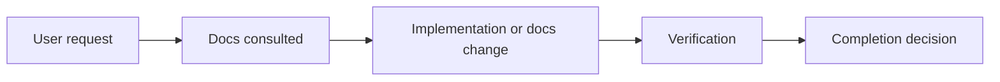

# AI Workflow Report Template

Use this template for implementation plans, final reports, and handoffs when the
workflow requires durable context. Keep small reports concise, but do not remove
the evidence fields. Prefer tables, short status labels, and diagrams when they
make the report easier to scan.

Readability rule: do not pack long evidence values into one inline sentence.
When a field has multiple file paths, commands, requirements, risks, or checks,
format it as a vertical bullet list or a compact table. Keep inline text for
single short values only.

Preferred:

```markdown
Docs consulted:

- `.agents/superpowers/skills/using-superpowers/SKILL.md`
- `docs/agent-index.md`
- `docs/spec.md`
```

Avoid:

```markdown
Docs consulted: `.agents/...`, `docs/agent-index.md`, `docs/spec.md`
```

## 1. Status Dashboard

| Field | Status |
| --- | --- |
| Completion decision | `complete` / `not complete` / `blocked` |
| User goal |  |
| Scope |  |
| Out of scope |  |
| Context ledger | required path, or allowed lightweight exception reason |
| Resume state | new run / resumed from ledger / ledger reconstructed |
| Overall risk | `low` / `medium` / `high` |
| Next action | `none` / exact follow-up / blocker owner |

## 2. Workflow Gates Evidence Matrix

| Gate | Result | Evidence |
| --- | --- | --- |
| Docs consulted | `pass` / `gap` | exact files read |
| Doc conflicts | `none` / `found` | conflict references or `none` |
| Skills used | `pass` / `degraded` | Superpowers, GStack, TALKPIK skills, and practical skills when applicable |
| TDD status | `red-green-refactor` / `not applicable` / `degraded` | test names or exception |
| Review status | `pass` / `self-review` / `blocked` | reviewer, review skill, or checklist |
| QA status | `pass` / `not applicable` / `blocked` | browser, visual, or manual QA evidence |
| Workflow check | `pass` / `fail` / `not run` | command output summary |
| Fallback status | `none` / `used` / `blocked` | fallback evidence and remaining risk |

## 3. Work Map

Use a diagram for non-trivial work. Delete this section only for tiny reports.



## 4. Docs Consulted

Use vertical lists in the `Details` column when more than one file or
requirement is present. Do not comma-pack long paths into a single line.

| Type | Details |
| --- | --- |
| Exact files read |  |
| Extracted requirements |  |
| Doc conflicts | `none`, or list conflicts with file references |
| Untouched relevant docs | relevant docs not read and why |

## 5. Implementation Summary

| Area | Changed? | Details |
| --- | --- | --- |
| Files changed | yes/no |  |
| Behavior changed | yes/no |  |
| UI, routes, or flows changed | yes/no |  |
| Data or contracts changed | yes/no |  |
| Security/auth/deployment changed | yes/no |  |

## 6. Multi-Agent Work

| Field | Details |
| --- | --- |
| Main session role | coordinator / implementer / reviewer |
| Child agents used | `none`, or role, objective, and write scope |
| Task packets sent | path or summary |
| Child result packets received | path or summary |
| Integration conflicts | `none`, or details |
| Ledger integration status | current / stale / not applicable |

## 7. Verification

| Check | Command or method | Result | Evidence |
| --- | --- | --- | --- |
| Focused tests |  | pass/fail/not run |  |
| Lint |  | pass/fail/not run |  |
| Typecheck |  | pass/fail/not run |  |
| Build |  | pass/fail/not run |  |
| UI or browser QA |  | pass/fail/not applicable |  |
| Skill mirror sync | `node scripts/sync-agent-skills.mjs --check` | pass/fail/not run |  |
| AI workflow checker | `node scripts/ai-workflow-check.mjs --repo .` | pass/fail/not run |  |
| Ledger/file-state consistency | manual comparison | pass/fail/not applicable |  |

Skipped checks and reason:

| Skipped check | Reason | Risk |
| --- | --- | --- |
|  |  |  |

## 8. Git Publication Decision

| Field | Details |
| --- | --- |
| Decision | `no-commit` / `local-commit` / `push-and-pr` / `blocked` |
| Reason |  |
| Branch |  |
| Upstream |  |
| Dirty scope |  |
| Review status |  |
| Verification status |  |
| Ledger |  |
| Fallback status |  |
| Next git action |  |

## 9. Fallbacks

| Field | Details |
| --- | --- |
| Normal path that failed | `none`, or exact path |
| Failure class | fail-closed / degraded-mode / recover / retry-once / reassign / none |
| Fallback used |  |
| Evidence collected |  |
| Completion allowed | yes/no and why |

## 10. Risks And Follow-Up

| Type | Details |
| --- | --- |
| Remaining risks |  |
| Assumptions |  |
| Follow-up needed |  |

## 11. Completion Decision

| Field | Details |
| --- | --- |
| Complete | yes/no |
| Reason |  |

Use this final section to state the decision plainly. Do not claim completion
when verification failed, output was not read, or remaining risk is unknown.
