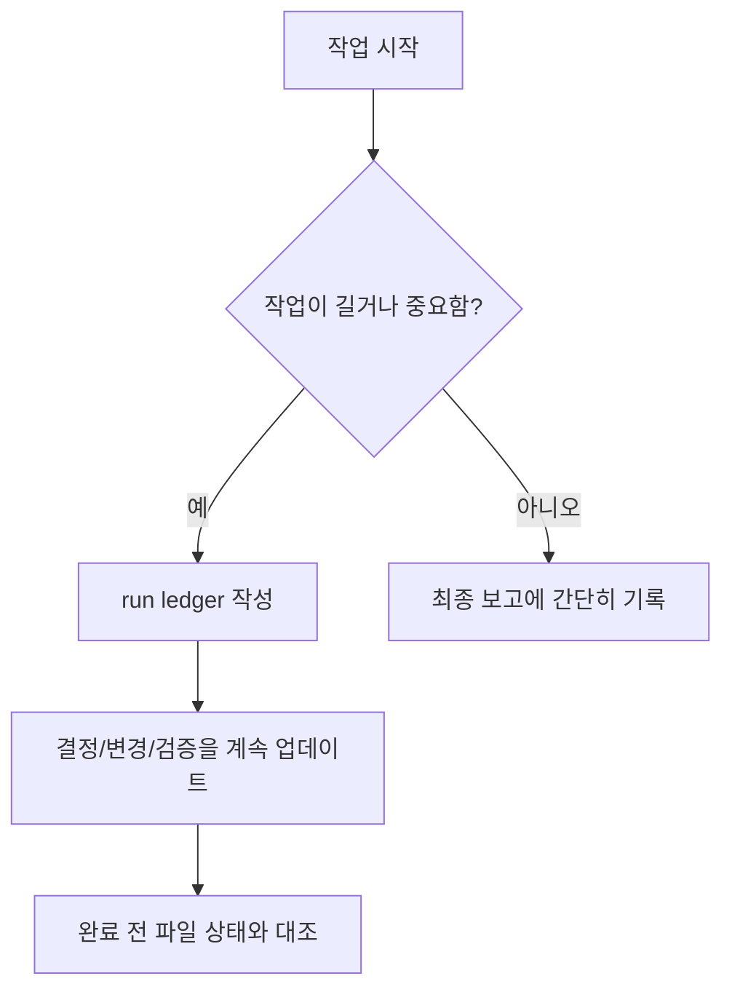

# Run Ledgers 안내

이 폴더는 AI 작업일지를 저장하는 곳입니다.
쉽게 말하면 "AI가 이번 작업에서 무엇을 읽고, 무엇을 결정하고, 무엇을 검증했는지 남기는 기록장"입니다.

## 언제 필요한가요?



Run ledger가 필요한 경우:

| 상황 | 이유 |
| --- | --- |
| 멀티 에이전트 작업 | 여러 AI의 결과를 하나로 합쳐야 하기 때문입니다. |
| 구현 작업 | 어떤 문서 기준으로 만들었는지 남겨야 합니다. |
| UI, 라우트, 사용자 흐름 변경 | 화면과 흐름은 제품 방향에 큰 영향을 줍니다. |
| 새 범위 또는 문서 충돌 | 사용자의 승인이나 문서 업데이트가 필요할 수 있습니다. |
| 나중에 이어서 할 가능성이 있는 작업 | AI가 이전 맥락을 복원해야 합니다. |

## 파일 이름 규칙

```text
YYYYMMDD-HHMM-task-slug.md
```

예시:

```text
20260519-1014-docs-readme-map.md
```

새 작업일지는 [../context-ledger-template.md](../context-ledger-template.md)를 복사해서 만듭니다.
