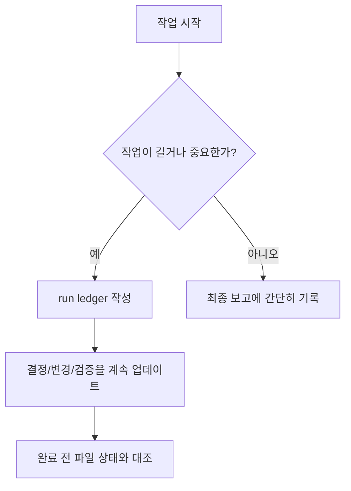

# Run Ledgers 안내

이 폴더는 AI 작업일지를 저장하는 곳입니다.
쉽게 말하면 "AI가 이번 작업에서 무엇을 읽고, 무엇을 결정하고, 무엇을 검증했는지" 남기는 기록장입니다.

## 언제 필요한가



Run ledger가 필요한 경우:

| 상황 | 이유 |
| --- | --- |
| 여러 AI 에이전트 작업 | 여러 AI의 결과를 하나로 합치기 때문입니다. |
| 구현 작업 | 어떤 문서 기준으로 만들었는지 남겨야 합니다. |
| UI, 라우트, 사용자 흐름 변경 | 화면과 흐름은 제품 방향에 영향을 줍니다. |
| 새 범위 또는 문서 충돌 | 사용자의 승인이나 문서 업데이트가 필요할 수 있습니다. |
| 나중에 이어질 가능성이 있는 작업 | AI가 이전 맥락을 복원해야 합니다. |

## 저장 위치

작업일지는 연도, 월, 일 폴더를 만들고 그 안에 저장합니다.

```text
docs/ai-workflow/runs/YYYY/MM/DD/YYYYMMDD-HHMM-task-slug.md
```

예시:

```text
docs/ai-workflow/runs/2026/05/19/20260519-1014-docs-readme-map.md
```

## 작성 방법

1. [../context-ledger-template.md](../context-ledger-template.md)를 복사합니다.
2. 작업 날짜에 맞춰 `YYYY/MM/DD` 폴더를 만듭니다.
3. 파일명은 `YYYYMMDD-HHMM-task-slug.md` 형식으로 둡니다.
4. 작업 중 결정, 변경, 검증 결과를 계속 갱신합니다.
5. 완료 전 실제 파일 상태와 ledger 내용을 대조합니다.

## 기존 루트 파일

이전에는 ledger 파일을 `docs/ai-workflow/runs/` 바로 아래에 저장했습니다.
새 작업은 반드시 날짜 폴더 아래에 저장해야 합니다.
