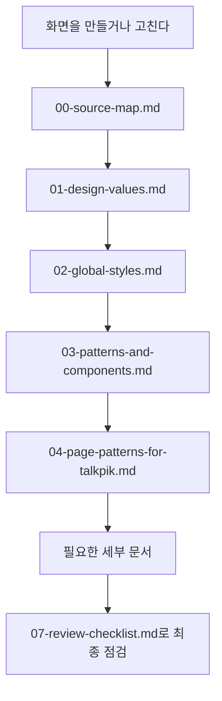

# Ant Design 문서 안내

이 폴더는 TALKPIK AI 화면을 만들 때 따라야 하는 UI 디자인 규칙입니다.
쉽게 말하면 "AI가 화면을 만들 때 어떤 버튼, 색, 간격, 카드, 표, 피드백 방식을 써야 하는가"를 정리한 곳입니다.

## 먼저 보는 흐름

## 문서 목록

| 문서 | 쉽게 말하면 | 언제 보나요 |
| --- | --- | --- |
| [00-source-map.md](./00-source-map.md) | Ant Design 공식 문서와 이 프로젝트 문서가 어떻게 연결되는지 보여줍니다. | AI가 근거 문서를 찾을 때 |
| [01-design-values.md](./01-design-values.md) | TALKPIK AI 화면이 지켜야 할 디자인 가치입니다. | 화면 방향을 잡을 때 |
| [02-global-styles.md](./02-global-styles.md) | 색, 글자, 간격, 그림자 같은 기본 스타일 규칙입니다. | CSS나 테마를 정할 때 |
| [03-patterns-and-components.md](./03-patterns-and-components.md) | 버튼, 폼, 테이블, 알림 같은 UI 부품 사용법입니다. | 실제 컴포넌트를 고를 때 |
| [04-page-patterns-for-talkpik.md](./04-page-patterns-for-talkpik.md) | TALKPIK AI 페이지별 화면 패턴입니다. | 대시보드, 문제풀이, 피드백 화면을 만들 때 |
| [05-visual-motion-illustration.md](./05-visual-motion-illustration.md) | 차트, 움직임, 시각 자료 규칙입니다. | 그래프, 로딩, 애니메이션이 필요할 때 |
| [07-review-checklist.md](./07-review-checklist.md) | 화면 완성 전 체크리스트입니다. | 제출 전 마지막 확인 때 |
| [08-theme-architecture.md](./08-theme-architecture.md) | 테마 구조와 관리 방식입니다. | 디자인 토큰을 코드에 적용할 때 |

## 비개발자를 위한 핵심

화면을 만들 때 AI에게 "예쁘게 해줘"라고만 말하면 결과가 흔들릴 수 있습니다.
이 폴더를 기준으로 삼으면 AI가 같은 스타일의 화면을 계속 만들 수 있습니다.

| 요청 예시 | AI가 봐야 할 문서 |
| --- | --- |
| "문제 풀이 화면을 만들어줘." | `04-page-patterns-for-talkpik.md`, `03-patterns-and-components.md` |
| "버튼과 입력폼이 어색한지 봐줘." | `03-patterns-and-components.md`, `07-review-checklist.md` |
| "전체 색감과 간격을 통일해줘." | `02-global-styles.md`, `08-theme-architecture.md` |

## AI에게 지시할 때

> `docs/ant-design/README.md`의 순서대로 필요한 문서를 읽고, TALKPIK AI 화면 규칙에 맞게 구현해줘.
