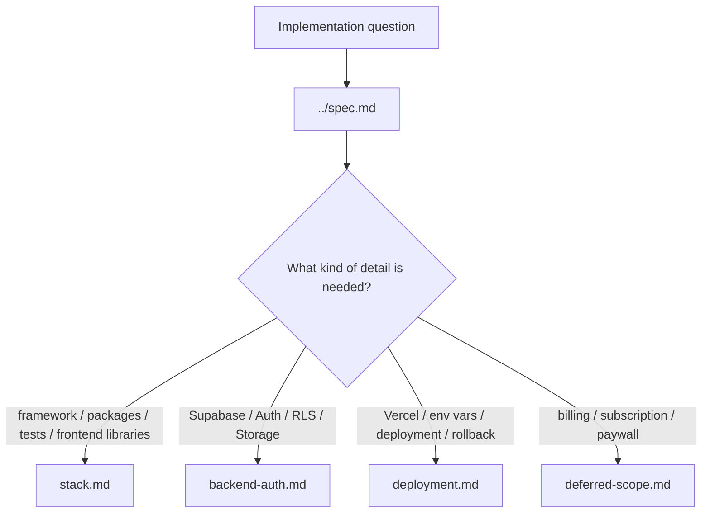

# Development Detail Docs

This folder contains detailed implementation specs for TALKPIK AI.

Always read [`../spec.md`](../spec.md) first. It is the single implementation
spec and routes you to the specific detail file needed for the task. Do not read
every file in this folder by default.

## Selection Map

## Files

| File | Purpose | Use when |
| --- | --- | --- |
| [stack.md](./stack.md) | Framework, package, frontend stack, and test tooling. | Choosing or changing packages, scripts, frontend libraries, or test setup. |
| [backend-auth.md](./backend-auth.md) | Supabase, Auth, RLS, Storage, and server-only key rules. | Implementing login, database access, storage, profiles, or admin roles. |
| [deployment.md](./deployment.md) | Vercel environments, build settings, preview gates, rollback. | Working on preview links, production deploys, CI, env vars, or rollback. |
| [deferred-scope.md](./deferred-scope.md) | Billing and other deferred areas. | Discussing subscriptions, paywall, Stripe, pricing, or intentionally postponed features. |

## Non-Negotiable Reminder

- `spec.md` is the required entry point.
- This folder contains details selected by `spec.md`.
- Billing remains deferred unless scope is explicitly reopened.
- Secrets must never be exposed in browser-visible variables.
