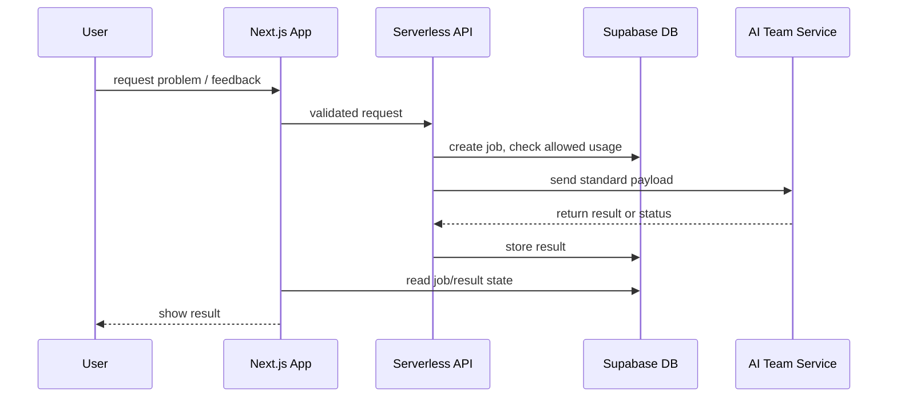

# AI And Problem Generation Boundary

> Last updated: 2026-05-19

Problem generation and AI features will later involve another department.
Therefore the main application must not couple UI or core data directly to a
specific model provider.

## Fixed Approach

- The app owns user identity, plan/quota placeholders, request history, result storage, and UI state.
- The AI/problem-generation team owns generation logic, model prompts, grading logic, and provider selection.
- Integration happens through serverless API contracts and database-backed job records.
- Direct browser-to-AI provider calls are rejected.

## AI Libraries

| Area | Fixed Choice | Version Policy | Reason |
| --- | --- | --- | --- |
| AI SDK facade | `ai` | latest stable major | Useful for streaming/structured output when app-owned AI endpoints are needed. |
| Schema validation | `zod` | `4.x` | AI request/response contracts must be typed and validated. |
| Async execution | defer | decide when AI contract is written | Do not introduce a queue before the AI ownership boundary is finalized. |

If async jobs are required, the first candidate is `Upstash QStash` or a
Vercel-compatible queue/workflow service. This is not installed by default.

## Contract Rule

Before implementing AI integration, create or update a contract that defines:

- request payload,
- response payload,
- status lifecycle,
- error format,
- ownership by team,
- storage table or job record,
- verification strategy.
