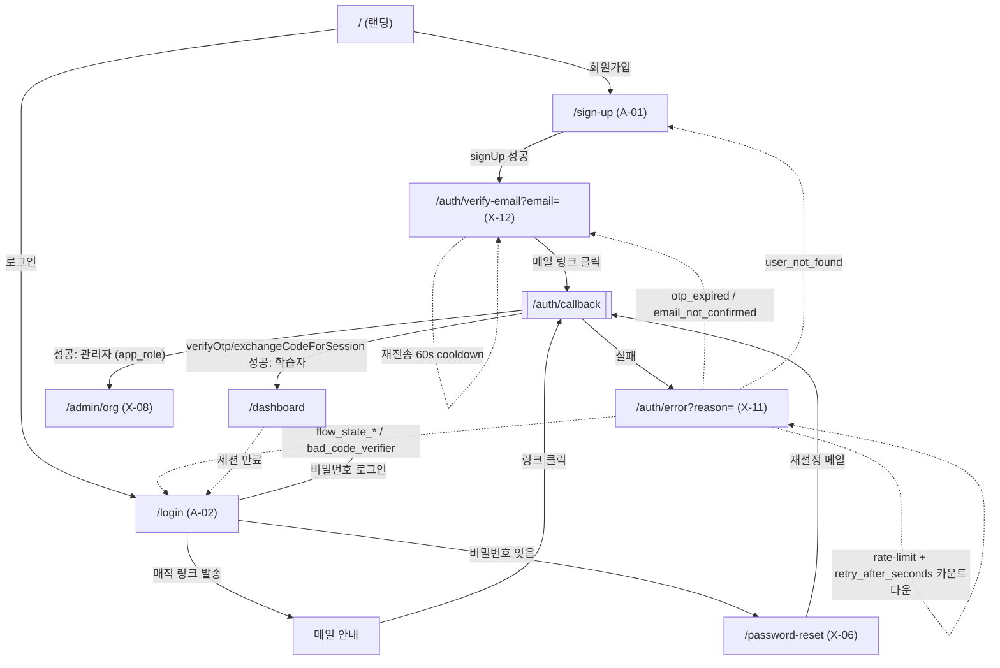

# 인증 한눈에 보기 (로그인 · 회원가입 · 콜백)

> Last updated: 2026-05-27
> 이 문서는 TALKPIK AI 의 **인증 흐름 + 운영 정책 + 코드 매핑 + 관리 포인트** 를
> 한 페이지로 모은 정리본입니다. 새 도입 문서가 아니라 흩어져 있는 정본을 묶은
> 인덱스 + 요약입니다. 더 자세한 내용은 각 섹션에 표시된 정본 링크를 따라가세요.

> **주의:** 루트 `CLAUDE.md` 의 pre-implementation 표기는 stale. 이 문서는 2026-05-27 현재 worktree 구현 기준.

## Docs consulted

| 영역 | 정본 위치 |
| --- | --- |
| 화면 명세 (회원가입/로그인/콜백/에러/메일 안내/비밀번호 재설정) | [`docs/IA/01-A-01-sign-up`](../IA/01-A-01-sign-up/description.md), [`02-A-02-login`](../IA/02-A-02-login/description.md), [`28-X-06-password-reset`](../IA/28-X-06-password-reset/description.md), [`33-X-11-auth-error`](../IA/33-X-11-auth-error/description.md), [`34-X-12-auth-verify-email`](../IA/34-X-12-auth-verify-email/description.md) |
| 사용자 플로우 (정본) | [`docs/flow/user-flow.md`](../flow/user-flow.md) |
| 백엔드/Auth 정책 | [`docs/development/backend-auth.md`](./backend-auth.md) |
| Auth 관련 마이그레이션 | [`supabase/migrations/INDEX.md`](../../supabase/migrations/INDEX.md) (#17, #22, #23, #24) |
| 환경 변수 | [`.env.example`](../../.env.example) |

---

## 1) 한 줄 결론

이메일 + 비밀번호 / 매직 링크 / 비밀번호 재설정 흐름 전부 **Supabase Auth** 한
곳에서 처리하고, **PKCE 콜백 (`/auth/callback`)** 으로 들어오는 토큰을 서버에서
교환한 다음 학습자/관리자 라우트로 분기시킨다. **`profiles` 행 생성·역할 부여·
미인증 계정 정리** 는 전부 Postgres 안에서 일어난다 (DB 트리거 + SECURITY DEFINER
+ pg_cron).

---

## 2) 큰 그림 — 사용자 흐름



> 진짜 정본 다이어그램은 [`docs/flow/user-flow.md`](../flow/user-flow.md). 위
> 다이어그램은 인증 영역만 잘라낸 요약본.

---

## 3) 화면 ↔ 라우트 ↔ 코드 매핑

| IA 코드 | 화면 이름 | Next.js 라우트 | 핵심 컴포넌트 |
| --- | --- | --- | --- |
| A-01 | 회원가입 | [`src/app/sign-up/page.tsx`](../../src/app/sign-up/page.tsx) | [`SignUpForm.tsx`](../../src/components/auth/SignUpForm.tsx) |
| A-02 | 로그인 (비밀번호 + 매직 링크 탭) | [`src/app/login/page.tsx`](../../src/app/login/page.tsx) | [`LoginForm.tsx`](../../src/components/auth/LoginForm.tsx) |
| X-06 | 비밀번호 재설정 요청 | [`src/app/password-reset/page.tsx`](../../src/app/password-reset/page.tsx) | [`PasswordResetRequestForm.tsx`](../../src/components/auth/PasswordResetRequestForm.tsx) |
| X-06 | 비밀번호 재설정 확정 | [`src/app/password-reset/confirm/page.tsx`](../../src/app/password-reset/confirm/page.tsx) | [`PasswordResetConfirmForm.tsx`](../../src/components/auth/PasswordResetConfirmForm.tsx) |
| (라우트) | 인증 콜백 | [`src/app/auth/callback/route.ts`](../../src/app/auth/callback/route.ts) (Route Handler) + [`src/app/auth/callback-fragment/page.tsx`](../../src/app/auth/callback-fragment/page.tsx) | [`CallbackFragmentFallback.tsx`](../../src/components/auth/CallbackFragmentFallback.tsx) (fragment fallback 페이지에서 사용) |
| X-11 | 인증 에러 | [`src/app/auth/error/page.tsx`](../../src/app/auth/error/page.tsx) | [`AuthErrorCard.tsx`](../../src/components/auth/AuthErrorCard.tsx) |
| X-12 | 인증 메일 확인 안내 | [`src/app/auth/verify-email/page.tsx`](../../src/app/auth/verify-email/page.tsx) | [`VerifyEmailCard.tsx`](../../src/components/auth/VerifyEmailCard.tsx) |

### 인증 도우미 (서버 전용)

| 파일 | 역할 |
| --- | --- |
| [`src/lib/auth/session.ts`](../../src/lib/auth/session.ts) | `getCurrentUser()`, `requireUser()` — 세션 강제 |
| [`src/lib/auth/profile.ts`](../../src/lib/auth/profile.ts) | `getCurrentProfile()`, `bootstrapProfile()`, `requireRole()`, `getSessionAndProfile()` |
| [`src/lib/auth/admin-guard.ts`](../../src/lib/auth/admin-guard.ts) | `requirePlatformAdmin()`, `requireContentAdmin()`, `requireOrgAdmin()` |
| [`src/lib/auth/roles.ts`](../../src/lib/auth/roles.ts) | `AppRole` 타입 + `ADMIN_ROLES` 상수 (client-safe) |
| [`src/lib/auth/error-mapping.ts`](../../src/lib/auth/error-mapping.ts) | Supabase `error.code` → canonical `reason` 매핑, 메시지/CTA 테이블, `sanitizeNext`, `sanitizeRetryAfterSeconds`, `parseAuthFragment` |
| [`src/lib/auth/redirect-url.ts`](../../src/lib/auth/redirect-url.ts) | `buildAuthRedirectUrl()` — 항상 절대 URL, dev는 `http://127.0.0.1:3000`, prod는 `NEXT_PUBLIC_SITE_URL` 필수 |
| [`src/proxy.ts`](../../src/proxy.ts) | Next.js middleware. 비공개 라우트 anon 접근 시 `/login` 으로 redirect. 만료 세션 쿠키 있으면 `?reason=session_expired` |
| [`src/lib/routes.ts`](../../src/lib/routes.ts) | `PUBLIC_PATHS` (middleware 허용 목록) — `/sign-up`, `/login`, `/password-reset`, `/auth/callback`, `/auth/error`, `/auth/verify-email` |

---

## 4) 흐름별 상세 — "어디서 무엇이 일어나는가"

### 4.1 회원가입 (A-01 → X-12 → 콜백 → A-03)

1. 폼 제출 → `supabase.auth.signUp({ email, password, options: { data: { display_name }, emailRedirectTo } })`
2. 성공하면 즉시 `router.push('/auth/verify-email?email=...')`
3. X-12 페이지에서 60초 cooldown + `auth.resend({ type: 'signup' })` 로 재전송
4. 사용자가 메일 링크 클릭 → `/auth/callback?token_hash=...&type=signup&next=/onboarding/learning-goal`
5. 콜백 서버에서 `verifyOtp({ token_hash, type })` → 성공 시 `redirect(next)`, 실패 시 `/auth/error?reason=<...>`
6. `next` 는 `sanitizeNext()` 로 정화 — 외부 URL, `//`, `:` 포함 값은 `/dashboard` fallback
7. **`profiles` 행은 DB 트리거 `on_auth_user_created` 가 자동 생성** (마이그레이션 #17). 클라이언트 코드는 profiles INSERT 권한이 없다 (RLS).

### 4.2 로그인 (A-02 → 대시보드 / 관리자)

- **비밀번호**: `supabase.auth.signInWithPassword({ email, password })` → 성공 시 `router.push('/dashboard')`
- **매직 링크**: `supabase.auth.signInWithOtp({ email, options: { emailRedirectTo } })` → "이메일을 확인하세요" 상태 → 사용자 메일 링크 클릭 → `/auth/callback?next=/dashboard`
- **비밀번호 재설정 링크**: 로그인 폼 하단 `/password-reset` 링크
- **세션 만료 안내**: middleware 가 만료된 `sb-*-auth-token` 쿠키를 감지하면 `/login?reason=session_expired` 로 보내고, `LoginForm` 이 안내 Alert 노출

### 4.3 비밀번호 재설정 (X-06)

1. `/password-reset` 에서 이메일 입력 → `supabase.auth.resetPasswordForEmail(email, { redirectTo: '/password-reset/confirm' })`
2. 사용자가 메일 링크 클릭 → Supabase verify endpoint (자체 호스팅) 에서 토큰 교환 + recovery 세션 쿠키 set → `redirectTo` 값인 `/password-reset/confirm` 으로 redirect. `/auth/callback` 은 미경유 ([`PasswordResetRequestForm.tsx:22`](../../src/components/auth/PasswordResetRequestForm.tsx) 의 `redirectTo` 가 직접 confirm 페이지를 가리킴)
3. 새 비밀번호 입력 → `supabase.auth.updateUser({ password })` → "다시 로그인" 안내 → `/login`

### 4.4 콜백 분기 (`/auth/callback`)

Route Handler 가 다음 순서로 처리한다 ([`src/app/auth/callback/route.ts`](../../src/app/auth/callback/route.ts)). server component 였을 때 발생한 cookie silent-fail 문제 때문에 Phase 8 follow-up P0 fix 에서 Route Handler 로 전환. 자세한 사유는 `route.ts:1-18` 주석 참조:

| 우선순위 | 조건 | 처리 |
| --- | --- | --- |
| 1 | `?error_code=` 가 query 에 박혀 옴 (일부 OAuth 공급자) | `mapSupabaseErrorCode(code)` → `/auth/error?reason=...` |
| 2 | `?token_hash=` + `?type∈{signup,recovery,email_change,email}` | `verifyOtp({ token_hash, type })` → 성공 `redirect(next)`, 실패 `/auth/error` |
| 3 | `?code=` (PKCE) | `exchangeCodeForSession(code)` → 성공 `redirect(next)`, 실패 `/auth/error` |
| 4 | 위 3 가지 모두 없음 (legacy implicit flow, `#access_token=…`) | `CallbackFragmentFallback` 클라이언트 컴포넌트로 fragment 파싱 → `setSession()` 또는 에러 redirect |

### 4.5 인증 에러 (X-11)

- `?reason=` 쿼리를 11종 canonical reason 중 하나로 매핑
- 매핑되지 않으면 `unknown`
- 화면 메시지·CTA·이메일 prefill 여부·카운트다운 여부 전부 [`error-mapping.ts:REASON_CONTENT`](../../src/lib/auth/error-mapping.ts) 한 곳에서 관리
- raw Supabase `error_description` 은 **절대 UI/URL 노출 금지** — 서버 로그(`console.error`)에만 남긴다
- `retry_after_seconds` 는 1\~86400 정수만 통과 (`sanitizeRetryAfterSeconds`)

---

## 5) 인증 에러 사유 11종 — 메시지 · CTA · 후속 동작

| reason | 한국어 제목 | 주요 CTA | 보조 CTA | 이메일 필드 | 카운트다운 |
| --- | --- | --- | --- | --- | --- |
| `otp_expired` | 인증 링크가 만료됐어요 | 인증 메일 다시 받기 (resend) | 로그인하기 | O | X |
| `flow_state_expired` | 인증 절차가 만료됐어요 | 다시 시도하기 (login) | 로그인하기 | X | X |
| `flow_state_not_found` | 인증 요청을 찾을 수 없어요 | 다시 시도하기 (login) | 도움말 | X | X |
| `bad_code_verifier` | 보안 검증에 실패했어요 | 처음부터 다시 (login) | — | X | X |
| `user_not_found` | 이 계정은 더 이상 존재하지 않아요 | 다시 가입하기 (signup) | 로그인하기 | X | X |
| `over_email_send_rate_limit` | 메일을 너무 많이 보냈어요 | 잠시 후 다시 시도 (resend) | — | O | **O** |
| `over_request_rate_limit` | 요청이 너무 많아요 | 잠시 후 다시 시도 (retry) | — | X | **O** |
| `email_not_confirmed` | 이메일 인증이 아직 완료되지 않았어요 | 인증 메일 다시 받기 (resend) | 로그인하기 | O | X |
| `signup_disabled` | 현재 신규 가입이 일시 중단됐어요 | 홈으로 | — | X | X |
| `access_denied` | 인증이 거부됐어요 | 다시 가입하기 (signup) | 로그인하기 | X | X |
| `unknown` | 처리 중 문제가 생겼어요 | 홈으로 | 도움말 | X | X |

> reason 정본은 Supabase 공식 [error codes](https://supabase.com/docs/guides/auth/debugging/error-codes).
> 화면 명세는 [`docs/IA/33-X-11-auth-error/description.md`](../IA/33-X-11-auth-error/description.md).

---

## 6) 운영 정책 (Operational Policies)

### 6.1 미인증 계정 정리 (cleanup)

- 함수: `private.cleanup_unconfirmed_users(retention_days int default 30, dry_run boolean default false, max_batch int default 1000)`
- 위치: [`supabase/migrations/20260526180000_cleanup_unconfirmed_users.sql`](../../supabase/migrations/20260526180000_cleanup_unconfirmed_users.sql)
- 스케줄: pg_cron job `cleanup_unconfirmed_users_daily`, **매일 04:00 UTC**, idempotent unschedule-then-register ([마이그레이션 #23](../../supabase/migrations/20260527110000_register_cleanup_cron.sql))
- 삭제 순서: `storage.objects` (owner = victim) → `auth.users` → `profiles` 는 FK `ON DELETE CASCADE` 로 자동 정리
- `is_sso_user = false` 조건으로 SSO 계정은 보호
- pg_cron extension 미설치 환경에서는 fail 없이 skip + `raise notice`
- **사용자에게 미치는 결과**: 가입 후 30일 동안 메일 인증 안 한 계정은 자동 삭제. 옛 인증 링크 클릭 시 `user_not_found` 응답 → X-11 에서 "다시 가입하기" CTA 노출

### 6.2 이메일 미인증 사용자의 Storage 업로드 차단

- 함수: `private.is_email_confirmed(uid uuid)` — `auth.users.email_confirmed_at IS NOT NULL` 조회
- 위치: [`20260527113000_storage_email_confirmed_hardening.sql`](../../supabase/migrations/20260527113000_storage_email_confirmed_hardening.sql)
- 영향 정책: `avatars_owner_insert/update`, `exports_owner_insert` 에 email 인증 조건 추가
- 읽기/삭제 정책은 그대로 (자기 파일 cleanup 은 미인증도 허용) — server-side 재생성은 `service_role` 로 RLS bypass

### 6.3 Rate limit & cooldown

| 항목 | 값 | 출처 |
| --- | --- | --- |
| 인증 메일 재전송 (X-12, X-11 의 resend CTA) | 60초 client-side cooldown | [`VerifyEmailCard.tsx`](../../src/components/auth/VerifyEmailCard.tsx), [`AuthErrorCard.tsx`](../../src/components/auth/AuthErrorCard.tsx) |
| Supabase same-user OTP 한도 | 60초 (Supabase 기본값) | Supabase docs |
| 프로젝트 OTP 한도 | Dashboard 설정 확인 필요. Supabase 공식 기본값 OTP 360/hour. custom SMTP 도입 후 첫 시간 30/hour 부터 ramp-up | [Supabase docs — Going into prod](https://supabase.com/docs/guides/deployment/going-into-prod) |
| Built-in SMTP 한도 | 2/hour | Supabase docs |
| `retry_after_seconds` 허용 범위 | 1\~86400 정수 | `sanitizeRetryAfterSeconds` |

> Built-in SMTP 한도 2/hour 는 운영용으로는 너무 좁다. **프로덕션 SMTP (SendGrid/Resend 등) 설정 전에는 베타/소규모 트래픽만 가능**.

### 6.4 세션 만료

- middleware 에서 `supabase.auth.getUser()` 호출 → 만료된 refresh 토큰 자동 회전 시도
- 회전 실패 시 만료된 `sb-*-auth-token` 쿠키만 남음 → `/login?reason=session_expired` 로 redirect
- `LoginForm` 이 `reason=session_expired` 감지하면 안내 Alert ("세션이 만료되어 로그아웃됐어요. 다시 로그인해주세요.")

### 6.5 역할/권한 모델 (`app_role`)

| 역할 | 값 | 접근 가능 영역 |
| --- | --- | --- |
| 학습자 | `learner` | `/dashboard` 이하 학습 영역 |
| 콘텐츠 관리자 | `content_admin` | + `/admin/problems` (H-01) |
| 기관 관리자 | `org_admin` | + `/admin/org` (X-08) |
| 플랫폼 관리자 | `platform_admin` | 모든 `/admin/*` |

- 역할 변경은 **DB 트리거 + SECURITY DEFINER RPC (`admin_change_user_role`)** 로만 가능. 클라이언트가 `profiles.app_role` 을 직접 UPDATE 할 수 없다 ([마이그레이션 #15](../../supabase/migrations/20260520121400_profiles_protected_columns.sql)).
- 서버 페이지/액션에서는 `requirePlatformAdmin()` / `requireContentAdmin()` / `requireOrgAdmin()` 호출. 비인가 시 `/dashboard?error=forbidden` 으로 redirect.

---

## 7) 환경 변수 (배포 전 체크리스트)

| 변수 | 위치 | 비고 |
| --- | --- | --- |
| `NEXT_PUBLIC_SUPABASE_URL` | 브라우저 노출 | Supabase 프로젝트 URL |
| `NEXT_PUBLIC_SUPABASE_PUBLISHABLE_KEY` | 브라우저 노출 | publishable(=anon) key. **절대 service-role 넣지 말 것** |
| `NEXT_PUBLIC_SITE_URL` | 브라우저 노출 | `buildAuthRedirectUrl()` 이 사용. dev 외 환경에서는 **필수** — [`redirect-url.ts:29-35`](../../src/lib/auth/redirect-url.ts) 가 미설정 시 throw. `https://...` 만 허용 (`javascript:`, `data:` 등 차단). `.env.example` 의 `# --- Browser-visible (publishable) ---` 섹션에 등재. |
| `SUPABASE_SERVICE_ROLE_KEY` | 서버 전용 | Phase 6 admin 작업에서만 필요. Vercel/CI 시크릿으로만 |
| `ACCESS_TOKEN` | 서버 전용 | Supabase CLI 용 PAT |

### Supabase Dashboard 측 설정

- **Authentication → URL Configuration → Redirect URLs**: `${NEXT_PUBLIC_SITE_URL}/auth/callback` 화이트리스트 등록
- **Authentication → Email Templates**: confirm/magic link (signup·email_change·magiclink) 의 `{{ .ConfirmationURL }}` 이 `/auth/callback?token_hash=...&type=...` 형식인지 확인 (Supabase 기본값이 일치). **단 recovery (비밀번호 재설정) 는 §4.3 에 따라 `/password-reset/confirm` 직행 — `redirectTo` 가 callback 을 우회**
- **Database → Extensions → pg_cron**: cleanup job 가동을 위해 활성화 필요
- **Authentication → Providers → Email**: confirm email 켜져 있어야 cleanup 정책이 의미 있음

---

## 8) 관리 포인트 (운영 중 모니터링/대응)

| # | 신호 | 가능한 원인 | 1차 대응 |
| --- | --- | --- | --- |
| 1 | `/auth/error?reason=unknown` 비율 급증 | Supabase 새 error.code 발급 / 매핑 누락 | `error-mapping.ts` `SUPPORTED_REASONS` 와 [Supabase error codes 문서](https://supabase.com/docs/guides/auth/debugging/error-codes) 비교 |
| 2 | `over_email_send_rate_limit` 다발 | built-in SMTP 한도 (2/hour) 도달 | 프로덕션 SMTP (SendGrid/Resend 등) 전환 |
| 3 | `user_not_found` 빈도 증가 (가입 후 30일+) | cleanup 정책 동작 중. 의도된 동작 | X-11 의 "다시 가입하기" CTA 가 활성 상태인지 확인 |
| 4 | 가입은 됐는데 `profiles` 가 비어있음 | DB 트리거 `on_auth_user_created` 실패 | Supabase Logs → Postgres 로그에서 `handle_new_user` 에러 검색 |
| 5 | 비밀번호 재설정 후 `/login` 으로 안 감 | `PasswordResetConfirmForm` 의 `router.push('/login')` 차단 (미들웨어/세션) | `proxy.ts` 의 `PUBLIC_PATHS` 에 `/login` 포함 확인 |
| 6 | `session_expired` Alert 가 안 뜸 | Supabase 쿠키 이름 변경 (`sb-*-auth-token` prefix) | `proxy.ts` 의 stale-cookie 감지 조건 갱신 |
| 7 | cleanup job 이 한 번도 안 돈 듯 함 | pg_cron extension 미활성 / 마이그레이션 #23 미적용 | `select * from cron.job where jobname = 'cleanup_unconfirmed_users_daily';` |
| 8 | 미인증 사용자가 아바타 업로드 성공 | `is_email_confirmed` RLS 정책 미적용 (#24 누락) | `\df private.is_email_confirmed` + `\dp storage.objects` 로 정책 확인 |

### 정기 점검 (월 1회 권장)

- pg_cron job 의 last_run 로그 확인 (`select * from cron.job_run_details order by start_time desc limit 5;`)
- Supabase Auth → Users 화면에서 `Unconfirmed > 30 days` 필터로 cleanup 누락분 확인
- `auth.users` ↔ `profiles` row count 매치 확인 (트리거 실패 누적 감지)
- `NEXT_PUBLIC_SITE_URL` ↔ Redirect URLs 화이트리스트 ↔ 이메일 템플릿 3 군데가 모두 같은 도메인을 가리키는지 확인

---

## 9) 자주 묻는 운영 시나리오

### Q1. 사용자가 "메일이 안 와요" 라고 하면?

1. X-12 (`/auth/verify-email`) 까지 도달했는지 확인 — 도달 못 했으면 회원가입 자체가 실패한 것
2. Supabase Dashboard → Auth → Users 에서 해당 이메일 검색
   - `confirmed_at` 비어있고 `created_at` 최근 → 정상 (메일은 발송됨, 스팸함 확인)
   - row 없음 → 회원가입 자체 실패, [Supabase Logs] 확인
3. 60초 cooldown 후 재전송 가능. 1시간에 2번까지만 (built-in SMTP)

### Q2. 가입 후 30일이 지난 옛 인증 메일을 사용자가 클릭하면?

- 응답: `error.code = user_not_found` → `/auth/error?reason=user_not_found`
- 화면: "이 계정은 더 이상 존재하지 않아요. 오래 비활성화된 계정은 자동으로 정리됐어요. 다시 가입하시면 바로 사용할 수 있어요."
- 주요 CTA: **다시 가입하기** → `/sign-up`

### Q3. 한 사용자에게 platform_admin 권한 부여하려면?

- `private.admin_change_user_role(target_id, new_role)` RPC 호출 (마이그레이션 #19)
- 호출자는 본인이 platform_admin 이어야 함 (RPC 내부에서 `private.is_platform_admin()` 체크)
- 직접 `update profiles set app_role = 'platform_admin'` 하면 보호 트리거 (#15) 에서 차단

### Q4. 인증 콜백이 `/auth/error?reason=bad_code_verifier` 로 자꾸 가는데?

- PKCE 토큰 검증 실패 — **인증을 시작한 브라우저와 메일 링크를 클릭한 브라우저가 다른 경우** 가 대표 원인
- 사용자에게 "처음 시작한 브라우저에서 끝까지 진행해주세요" 안내 (이미 X-11 메시지에 포함)
- 백엔드 조치 불필요 — 사용자 행동 이슈

### Q5. 세션 자동 로그아웃 주기는?

- access token 기본 1시간. refresh token 은 기본 만료 없음 — 1회 사용으로 회전 ([Supabase docs — Sessions](https://supabase.com/docs/guides/auth/sessions)). Inactivity timeout 은 Dashboard Auth 설정값에 따름.
- middleware 의 `getUser()` 호출이 매 요청마다 refresh 시도. refresh 실패 시 `session_expired` redirect

---

## 10) 변경 시 함께 봐야 할 문서/파일 (Single Source of Truth)

새 인증 화면 추가, reason 추가, 라우트 변경, cleanup 주기 변경 등을 할 때
**아래를 같이 갱신하지 않으면 drift 가 발생** 한다.

| 변경 내용 | 함께 갱신할 곳 |
| --- | --- |
| 라우트 path 변경 | [`docs/sitemap.md`](../sitemap.md), [`src/lib/routes.ts`](../../src/lib/routes.ts), [`docs/flow/user-flow.md`](../flow/user-flow.md), 해당 IA `description.md`, [`tests/integration/route-matrix.test.ts`](../../tests/integration/route-matrix.test.ts), [`docs/sitemap.md`](../sitemap.md) (auth callback rows) |
| 새 `?reason=` 추가 | [`src/lib/auth/error-mapping.ts`](../../src/lib/auth/error-mapping.ts) (`AuthErrorReason`, `SUPPORTED_REASONS`, `REASON_CONTENT`), [`docs/IA/33-X-11-auth-error/description.md`](../IA/33-X-11-auth-error/description.md), 본 문서 §5, [`tests/lib/auth/error-mapping.test.ts`](../../tests/lib/auth/error-mapping.test.ts) |
| cleanup 주기/조건 변경 | [`20260526180000_cleanup_unconfirmed_users.sql`](../../supabase/migrations/20260526180000_cleanup_unconfirmed_users.sql), [cron 등록 마이그레이션](../../supabase/migrations/20260527110000_register_cleanup_cron.sql), [`docs/development/database-schema.md`](./database-schema.md), 본 문서 §6.1 |
| 새 IA 화면 추가 | [`docs/IA/README.md`](../IA/README.md), [`docs/sitemap.md`](../sitemap.md), [`docs/flow/user-flow.md`](../flow/user-flow.md), 새 폴더 `description.md` + `wireframe.png` |
| `app_role` 종류 변경 | [`src/lib/auth/roles.ts`](../../src/lib/auth/roles.ts), [`src/lib/auth/admin-guard.ts`](../../src/lib/auth/admin-guard.ts), 관련 RLS 마이그레이션, 본 문서 §6.5 |
| `NEXT_PUBLIC_SITE_URL` 도메인 변경 | [`.env.example`](../../.env.example), Vercel env vars, Supabase Dashboard Redirect URLs, 이메일 템플릿 |

**Known doc-↔-impl drift (2026-05-27)**: IA A-01 ([`description.md:58-60`](../IA/01-A-01-sign-up/description.md))·X-06 ([`description.md:52-54`](../IA/28-X-06-password-reset/description.md)) 는 PW 8-64자 명세. 실제 구현은 [`SignUpForm.tsx:71-77`](../../src/components/auth/SignUpForm.tsx), [`PasswordResetConfirmForm.tsx:43-49`](../../src/components/auth/PasswordResetConfirmForm.tsx) 의 `min: 8` only (max 미적용). 본 문서는 drift 사실만 기록 — 구현 통일 또는 명세 완화는 product 결정 후 별건 PR.

---

## 11) 빠른 디버깅 명령어

```sh
# Supabase 로컬에서 cleanup 함수 dry-run
# 이미 `supabase link` 된 DB 에서 실행
psql "$DATABASE_URL" -c "select private.cleanup_unconfirmed_users(30, true);"
```
> dry_run = true 면 실제 삭제 없이 대상 수만 반환.

```sh
# 등록된 pg_cron job 확인
psql "$DATABASE_URL" -c "select jobname, schedule, command from cron.job where jobname like 'cleanup%';"
```
> `cleanup_unconfirmed_users_daily` 가 `0 4 * * *` 로 보이면 정상.

```sh
# 인증 트리거 동작 확인 — auth.users insert 후 profiles 자동 생성됐는지
psql "$DATABASE_URL" -c "select count(*) from auth.users u left join public.profiles p on p.id = u.id where p.id is null;"
```
> 0 이 정상. 0 보다 크면 트리거 실패 누적 흔적.
