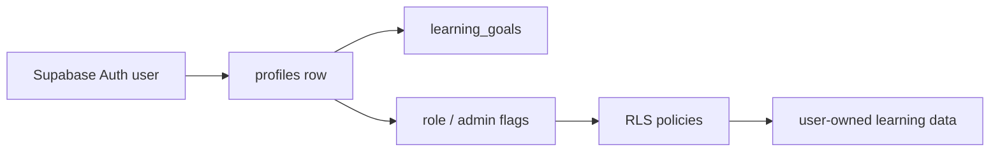

# Backend And Authentication

> Last updated: 2026-05-19

This file fixes the backend, database, and authentication choices for TALKPIK AI.

## Backend Stack

| Area | Fixed Choice | Version Policy | Reason |
| --- | --- | --- | --- |
| Backend platform | `Supabase` | managed current stable | Auth, Postgres, RLS, Storage, generated APIs. |
| DB client | `@supabase/supabase-js` | `2.x` | Official client for browser/server Supabase access. |
| SSR auth helper | `@supabase/ssr` | latest stable `0.x` until 1.x exists | Cookie-based auth for Next.js server/client boundaries. |
| Database | Supabase Postgres | managed stable | Relational learning, attempts, feedback, profile, and admin data. |
| Authorization | Supabase RLS | mandatory | User-owned learning data must be protected at the database layer. |
| Storage | Supabase Storage | managed stable | Avatars, generated PDFs, exported feedback, and future media. |

## Backend Rules

- Default data access goes through Supabase and RLS.
- New tables in exposed schemas must enable RLS before user access.
- Do not use `service_role` keys in client code.
- Keep `service_role` usage server-only and narrowly scoped.
- Store authorization-critical role/plan data in trusted server/database fields, not user-editable metadata.
- Start without Prisma/Drizzle. Use SQL migrations and generated Supabase types first.
- Add an ORM only after there is a concrete problem SQL + Supabase types cannot solve.

## Authentication

Default provider: `Supabase Auth`.

Reason:

- The product is data-heavy and user-owned.
- Supabase Auth integrates directly with Supabase RLS.
- The app needs profile, goals, learning progress, writing drafts, feedback, and admin access.
- A single identity plane is simpler for MVP and safer for RLS.

## Clerk Decision

Clerk is not the default. Reconsider Clerk only if one of these becomes a
near-term requirement:

- enterprise SSO,
- organization/team membership as a core feature,
- hosted auth UI is more important than database-native authorization,
- B2B account administration becomes central to the product.

If Clerk is reconsidered, create a stack-change note before implementation.
