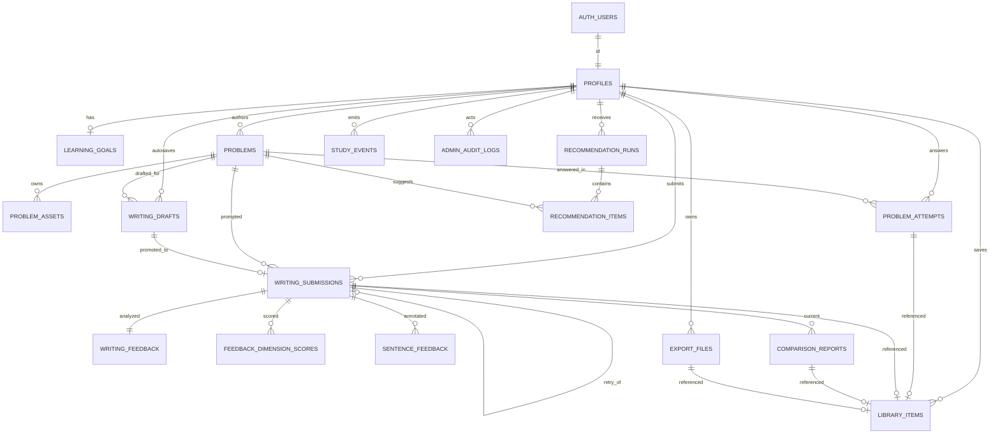

# Database Schema

> Status: historical initial Tier 1 MVP schema baseline
>
> Last updated: 2026-05-20
>
> Current schema inventory: [`docs/supabase-table-inventory.md`](../supabase-table-inventory.md)

이 문서는 TALKPIK AI 첫 개발 단계에서 사용한 Supabase Postgres 초기 스키마
기준 문서입니다. 현재 저장소 기준 최신 테이블/RPC/스토리지/사용처 재고는
`docs/supabase-table-inventory.md`를 우선하세요.

데이터베이스, 마이그레이션, 또는 데이터 모델 관련 작업 전에는
`docs/supabase-table-inventory.md`, `docs/development/backend-auth.md`,
현재 `supabase/migrations/`, `src/lib/supabase/types.ts`를 함께 확인하세요.

근거 분석: Opus 4.7 × gpt-5.5 병렬 분석, round-2 종합.

## Fixed Baseline

- Database: Supabase Postgres 15+
- Auth: Supabase Auth (`auth.users.id`를 모든 user-owned 테이블 FK 타겟으로 사용)
- Storage: Supabase Storage (buckets: `avatars`, `problem-assets`, `generated-exports`)
- Authorization: Postgres RLS (모든 user-owned 테이블에 enable + force)
- PK 전략: `uuid` + `gen_random_uuid()` 일괄 사용
- ORM: 미사용. SQL 마이그레이션 + Supabase 생성 타입.
- 마이그레이션 위치: `supabase/migrations/` (도메인별 분할 12개 파일)

## Tier 분리

- **Tier 1 (MVP)** — 본 문서에서 DDL 정의. 현재 `docs/Wireframe/` 32 화면 + `docs/sitemap.md` Target Route Map 범위.
- **Tier 2 (Deferred)** — DDL 미작성, 본 문서 후반부에서 placeholder 설명만. IA/sitemap 확정 후 별도 마이그레이션으로 추가.

---

## 1. Tier 1 MVP Tables

### 1.1 `profiles`

`auth.users.id`와 1:1 미러. 권한·플랜·상태는 DB 컬럼(trusted)로만 관리 — auth metadata 금지.

| col | type | null | default | note |
| --- | --- | --- | --- | --- |
| `id` | `uuid` | no | — | PK, FK `auth.users(id)` on delete cascade |
| `display_name` | `text` | yes | | |
| `nickname` | `citext` | yes | | unique on `lower(nickname)` |
| `avatar_path` | `text` | yes | | → `storage/avatars` |
| `ui_locale` | `text` | no | `'ko'` | check in (`'ko'`,`'en'`,`'vi'`) |
| `app_role` | `text` | no | `'learner'` | check in (`'learner'`,`'content_admin'`,`'org_admin'`,`'platform_admin'`) |
| `plan_label` | `text` | no | `'free'` | UI shell용; billing 미구현 |
| `status` | `text` | no | `'active'` | check in (`'active'`,`'blocked'`,`'deleted'`) |
| `created_at` | `timestamptz` | no | `now()` | |
| `updated_at` | `timestamptz` | no | `now()` | trigger 자동 갱신 |

**인덱스**: unique `(lower(nickname))` partial where `nickname is not null`.

**RLS**: 본인은 `select` + 제한 컬럼 `update`. `app_role`/`plan_label`/`status`는 admin만 변경.

---

### 1.2 `learning_goals`

A-03 학습 목표 1:1.

| col | type | null | default | note |
| --- | --- | --- | --- | --- |
| `user_id` | `uuid` | no | — | PK, FK `profiles(id)` on delete cascade |
| `topik_level` | `text` | no | | check in (`'TOPIK_I'`,`'TOPIK_II'`) |
| `target_grade` | `smallint` | no | | check between 1 and 6 |
| `exam_date` | `date` | yes | | |
| `weekly_goal_minutes` | `int` | yes | | |
| `weak_areas` | `text[]` | no | `'{}'` | GIN index |
| `is_active` | `boolean` | no | `true` | |
| `updated_at` | `timestamptz` | no | `now()` | trigger 자동 갱신 |

**RLS**: `user_id = auth.uid()`.

---

### 1.3 `problems` + `problem_assets`

AI 생성 문제와 admin 큐레이션 문제를 한 테이블 + `source` 컬럼으로 통합. H-01 검수 흐름은 `publish_status` + `review_status` 두 축.

**`problems`**

| col | type | null | default | note |
| --- | --- | --- | --- | --- |
| `id` | `uuid` | no | `gen_random_uuid()` | PK |
| `source` | `text` | no | `'ai_generated'` | check in (`'ai_generated'`,`'curated'`) |
| `author_id` | `uuid` | yes | | FK `profiles(id)` on delete set null |
| `domain` | `text` | no | | check in (`'reading'`,`'listening'`,`'writing'`) |
| `question_no` | `smallint` | yes | | writing은 51/52/53/54, reading/listening은 null |
| `topik_level` | `smallint` | no | | check in (1,2) |
| `difficulty` | `smallint` | yes | | check between 1 and 5 |
| `title` | `text` | no | | |
| `prompt` | `text` | no | | |
| `materials` | `jsonb` | yes | | 이미지/오디오 URL, 조건 |
| `answer_key` | `jsonb` | yes | | 객관식 정답 또는 writing rubric 예시 |
| `rubric` | `jsonb` | yes | | writing 채점 기준 |
| `explanation` | `text` | yes | | |
| `tags` | `text[]` | no | `'{}'` | GIN |
| `publish_status` | `text` | no | `'draft'` | check in (`'draft'`,`'published'`,`'archived'`) |
| `review_status` | `text` | no | `'pending'` | 최종 검수 결과. check in (`'pending'`,`'approved'`,`'rejected'`) |
| `review_workflow_status` | `text` | yes | | 진행 중 검수 워크플로 단계 (D-C). topik-ai 5단계(검수 대기/검수 중/보류/검수 완료/수정 필요) 매핑. nullable·CHECK 없음(코드 확정 전 PROPOSED) |
| `topic_category_code` | `text` | yes | | 주제 분류 코드 (D-B). `domain`(영역)과 의미 다름. topik-ai 주제(생활/학습/사회/문화/경제/교육/환경/기술) 매핑. nullable·CHECK 없음(코드 확정 전 PROPOSED) |
| `lifecycle_status` | `text` | no | `'active'` | check in (`'active'`,`'inactive'`,`'expired'`). 관리자 `operationStatus` 정합 대상 |
| `lifecycle_reason` | `text` | yes | | 사용자 화면 비활성 사유 |
| `expires_at` | `timestamptz` | yes | | 문제 전용 만료 시각. 자동 만료 로직 없음 |
| `visibility` | `text` | no | `'private'` | check in (`'private'`,`'public'`,`'org'`) |
| `created_at` | `timestamptz` | no | `now()` | |
| `updated_at` | `timestamptz` | no | `now()` | trigger |

**Writing 08~11 문제 데이터 계약**:
- Wireframe 08~11 더미 JSON은 `problems.materials`, `answer_key`, `rubric` JSONB에 저장한다.
- 사용자 화면은 raw JSONB를 직접 읽지 않고 `src/lib/writing/problem-normalizer.ts`의 `NormalizedWritingProblem` 계약으로 정규화한 뒤 렌더링한다.
- `list_user_problems`는 사용자 문제 목록용 RPC다. 쓰기 상태는 `writing_drafts`와 `writing_submissions`에서 계산하고, lifecycle 비활성/만료 상태를 함께 반환한다.

**인덱스**:
- `(domain, question_no, topik_level)` composite
- `using gin (tags)`
- partial `(publish_status, review_status) where source = 'curated'`
- partial `(author_id) where source = 'ai_generated'`

**RLS**:
- `select`: `publish_status='published' AND (visibility='public' OR author_id = auth.uid())` OR `private.is_admin(auth.uid())`
- `insert/update/delete`: admin 또는 본인 ai_generated 문제

**`problem_assets`**

| col | type | null | default | note |
| --- | --- | --- | --- | --- |
| `id` | `uuid` | no | `gen_random_uuid()` | PK |
| `problem_id` | `uuid` | no | | FK `problems(id)` on delete cascade |
| `storage_path` | `text` | no | | → `storage/problem-assets` |
| `asset_type` | `text` | no | | check in (`'image'`,`'audio'`) |
| `sort_order` | `int` | no | `0` | |

**인덱스**: `(problem_id, sort_order)`.

**RLS**: 부모 problem 가시성과 동일.

---

### 1.4 `problem_attempts`

객관식 읽기/듣기 풀이. 쓰기는 별도 (`writing_submissions`).

| col | type | null | default | note |
| --- | --- | --- | --- | --- |
| `id` | `uuid` | no | `gen_random_uuid()` | PK |
| `user_id` | `uuid` | no | | FK `profiles(id)` on delete cascade |
| `problem_id` | `uuid` | no | | FK `problems(id)` on delete cascade |
| `selected_answer` | `jsonb` | yes | | |
| `is_correct` | `boolean` | yes | | |
| `score` | `numeric(5,2)` | yes | | |
| `status` | `text` | no | `'started'` | check in (`'started'`,`'submitted'`,`'reviewed'`) |
| `started_at` | `timestamptz` | no | `now()` | |
| `submitted_at` | `timestamptz` | yes | | |
| `bookmarked` | `boolean` | no | `false` | |
| `time_spent_seconds` | `int` | yes | | |

**인덱스**:
- `(user_id, submitted_at desc)`
- `(problem_id, user_id)`
- partial `(user_id, is_correct) where is_correct = false` (오답 노트)
- partial `(user_id) where bookmarked = true` (북마크)

**RLS**: `user_id = auth.uid()`.

---

### 1.5 `writing_drafts` + `writing_submissions`

**핵심 결정**: draft(mutable)와 submission(immutable)을 분리. immutable submission이 audit/재채점/AI 재현성을 보장하고, 활성 draft 1개 invariant는 partial unique index로 강제.

**`writing_drafts`**

| col | type | null | default | note |
| --- | --- | --- | --- | --- |
| `id` | `uuid` | no | `gen_random_uuid()` | PK |
| `user_id` | `uuid` | no | | FK `profiles(id)` on delete cascade |
| `problem_id` | `uuid` | no | | FK `problems(id)` on delete cascade |
| `question_no` | `smallint` | no | | check in (51,52,53,54) |
| `answer_text` | `text` | yes | | |
| `answer_json` | `jsonb` | yes | | 51={blank1,blank2}, 53={intro,body,conclusion} |
| `char_count` | `int` | yes | | |
| `autosave_status` | `text` | no | `'clean'` | check in (`'clean'`,`'dirty'`,`'syncing'`,`'failed'`,`'superseded'`) |
| `last_saved_at` | `timestamptz` | yes | | |
| `created_at` | `timestamptz` | no | `now()` | |
| `updated_at` | `timestamptz` | no | `now()` | trigger |

**인덱스**:
- `(user_id, updated_at desc)`
- `(user_id, autosave_status)`
- **partial unique** `(user_id, problem_id) where autosave_status != 'superseded'` → 활성 draft 1개 보장

**RLS**: `user_id = auth.uid()` (select/insert/update/delete 본인만).

**`writing_submissions`** (immutable after insert)

| col | type | null | default | note |
| --- | --- | --- | --- | --- |
| `id` | `uuid` | no | `gen_random_uuid()` | PK |
| `user_id` | `uuid` | no | | FK `profiles(id)` on delete cascade |
| `problem_id` | `uuid` | no | | FK `problems(id)` on delete restrict |
| `draft_id` | `uuid` | yes | | FK `writing_drafts(id)` on delete set null |
| `question_no` | `smallint` | no | | check in (51,52,53,54) |
| `answer_text` | `text` | no | | |
| `answer_json` | `jsonb` | yes | | |
| `char_count` | `int` | no | | |
| `submitted_at` | `timestamptz` | no | `now()` | |
| `feedback_status` | `text` | no | `'pending'` | check in (`'pending'`,`'analyzing'`,`'complete'`,`'failed'`) |
| `parent_submission_id` | `uuid` | yes | | self-FK on delete set null (retry 체인) |

**인덱스**:
- `(user_id, submitted_at desc)`
- `(problem_id, user_id)`
- partial `(feedback_status) where feedback_status in ('pending','analyzing')`
- partial `(parent_submission_id) where parent_submission_id is not null`

**RLS**:
- `select`: `user_id = auth.uid()` OR `private.is_admin(auth.uid())`
- `insert`: `user_id = auth.uid()`
- `update`/`delete`: **정책 없음 → 차단** (immutable). `feedback_status` 갱신은 server-side service_role로만.

**Trigger**: `writing_submissions` insert 시 같은 `(user_id, problem_id)`의 활성 draft → `autosave_status = 'superseded'` 마킹.

---

### 1.6 `writing_feedback` + `feedback_dimension_scores` + `sentence_feedback`

부분 정규화: overall은 1:1, 차원별 점수는 정규화, 문장별 첨삭은 별 테이블.

**`writing_feedback`** (1:1 with submission)

| col | type | null | default | note |
| --- | --- | --- | --- | --- |
| `submission_id` | `uuid` | no | | PK, FK `writing_submissions(id)` on delete cascade |
| `user_id` | `uuid` | no | | denorm for RLS perf |
| `status` | `text` | no | `'partial'` | check in (`'partial'`,`'complete'`,`'failed'`) |
| `score_total` | `numeric(5,2)` | yes | | |
| `score_max` | `numeric(5,2)` | yes | | |
| `overall_summary` | `text` | yes | | AI 총평 |
| `ai_model` | `text` | yes | | 재현성 메타 |
| `ai_model_version` | `text` | yes | | |
| `raw_ai_result` | `jsonb` | yes | | 원본 보관 |
| `generated_at` | `timestamptz` | no | `now()` | |

**인덱스**: `(user_id, generated_at desc)`.

**RLS**: `user_id = auth.uid()` OR admin.

**`feedback_dimension_scores`**

| col | type | null | default | note |
| --- | --- | --- | --- | --- |
| `id` | `uuid` | no | `gen_random_uuid()` | PK |
| `submission_id` | `uuid` | no | | FK `writing_submissions(id)` on delete cascade |
| `user_id` | `uuid` | no | | denorm |
| `dimension` | `text` | no | | check in (`'grammar'`,`'vocab'`,`'structure'`,`'content'`,`'expression'`,`'topic_fit'`) |
| `score` | `numeric(5,2)` | yes | | |
| `score_max` | `numeric(5,2)` | yes | | |
| `summary` | `text` | yes | | |
| `weakness_level` | `smallint` | yes | | check between 1 and 5 |

**인덱스**:
- unique `(submission_id, dimension)`
- `(user_id, dimension, score)` (X-07 약점 추천)

**RLS**: `user_id = auth.uid()` OR admin.

**`sentence_feedback`**

| col | type | null | default | note |
| --- | --- | --- | --- | --- |
| `id` | `uuid` | no | `gen_random_uuid()` | PK |
| `submission_id` | `uuid` | no | | FK `writing_submissions(id)` on delete cascade |
| `user_id` | `uuid` | no | | denorm |
| `sentence_index` | `int` | no | | |
| `original_text` | `text` | yes | | |
| `corrected_text` | `text` | yes | | |
| `comment` | `text` | yes | | |

**인덱스**: `(submission_id, sentence_index)`.

**RLS**: `user_id = auth.uid()` OR admin.

---

### 1.7 `comparison_reports`

R-01 비교 리포트. AI 비결정성 때문에 snapshot 저장.

| col | type | null | default | note |
| --- | --- | --- | --- | --- |
| `id` | `uuid` | no | `gen_random_uuid()` | PK |
| `user_id` | `uuid` | no | | FK `profiles(id)` on delete cascade |
| `current_submission_id` | `uuid` | no | | FK `writing_submissions(id)` on delete cascade |
| `previous_submission_id` | `uuid` | yes | | FK `writing_submissions(id)` on delete set null |
| `metrics` | `jsonb` | no | | 차트 데이터 |
| `narrative` | `text` | yes | | AI 서술 보존 |
| `ai_model` | `text` | yes | | |
| `generated_at` | `timestamptz` | no | `now()` | |

**인덱스**:
- `(user_id, generated_at desc)`
- `(current_submission_id)`

**RLS**: `user_id = auth.uid()`.

---

### 1.8 `recommendation_runs` + `recommendation_items`

C-01/R-02/X-07 추천 실행 기록 + 개별 항목. "왜 이 문제가 추천되었는지" 보존.

**`recommendation_runs`**

| col | type | null | default | note |
| --- | --- | --- | --- | --- |
| `id` | `uuid` | no | `gen_random_uuid()` | PK |
| `user_id` | `uuid` | no | | FK `profiles(id)` on delete cascade |
| `source_type` | `text` | no | | check in (`'dashboard'`,`'feedback'`,`'weakness'`,`'next_problem'`) |
| `source_id` | `uuid` | yes | | feedback_id 등 |
| `reason_summary` | `text` | yes | | |
| `created_at` | `timestamptz` | no | `now()` | |
| `expires_at` | `timestamptz` | yes | | |

**인덱스**: `(user_id, source_type, created_at desc)`.

**RLS**: `user_id = auth.uid()`.

**`recommendation_items`**

| col | type | null | default | note |
| --- | --- | --- | --- | --- |
| `id` | `uuid` | no | `gen_random_uuid()` | PK |
| `run_id` | `uuid` | no | | FK `recommendation_runs(id)` on delete cascade |
| `user_id` | `uuid` | no | | denorm |
| `problem_id` | `uuid` | no | | FK `problems(id)` on delete cascade |
| `rank` | `int` | no | | |
| `reason` | `text` | yes | | |
| `estimated_minutes` | `int` | yes | | |
| `weakness_tags` | `text[]` | yes | | |
| `status` | `text` | no | `'active'` | check in (`'active'`,`'consumed'`,`'expired'`) |

**인덱스**:
- unique `(run_id, problem_id)`
- `(run_id, rank)`
- partial `(user_id) where status = 'active'`

**RLS**: `user_id = auth.uid()`.

---

### 1.9 `library_items`

F-01 내 서재. 객관식 attempt / 쓰기 submission / 리포트 / export / 문제를 같은 화면에서 다룸 → polymorphic FK. check constraint로 정확히 하나의 *_id만 non-null 강제.

| col | type | null | default | note |
| --- | --- | --- | --- | --- |
| `id` | `uuid` | no | `gen_random_uuid()` | PK |
| `user_id` | `uuid` | no | | FK `profiles(id)` on delete cascade |
| `item_type` | `text` | no | | check in (`'attempt'`,`'submission'`,`'report'`,`'export'`,`'problem'`) |
| `attempt_id` | `uuid` | yes | | FK `problem_attempts(id)` on delete cascade |
| `submission_id` | `uuid` | yes | | FK `writing_submissions(id)` on delete cascade |
| `report_id` | `uuid` | yes | | FK `comparison_reports(id)` on delete cascade |
| `export_id` | `uuid` | yes | | FK `export_files(id)` on delete cascade |
| `problem_id` | `uuid` | yes | | FK `problems(id)` on delete cascade |
| `note` | `text` | yes | | |
| `tags` | `text[]` | no | `'{}'` | GIN |
| `saved_at` | `timestamptz` | no | `now()` | |

**Check constraint**:
```sql
check (
  (case when attempt_id    is not null then 1 else 0 end +
   case when submission_id is not null then 1 else 0 end +
   case when report_id     is not null then 1 else 0 end +
   case when export_id     is not null then 1 else 0 end +
   case when problem_id    is not null then 1 else 0 end) = 1
)
```

**Check (item_type 일치)**:
```sql
check (
  (item_type = 'attempt'    and attempt_id    is not null) or
  (item_type = 'submission' and submission_id is not null) or
  (item_type = 'report'     and report_id     is not null) or
  (item_type = 'export'     and export_id     is not null) or
  (item_type = 'problem'    and problem_id    is not null)
)
```

**인덱스**:
- `(user_id, item_type, saved_at desc)`
- `using gin (tags)`
- partial unique: `(user_id, attempt_id) where attempt_id is not null`, 동일 패턴 4개 더

**RLS**: `user_id = auth.uid()`.

---

### 1.10 `study_events`

B-01 대시보드, X-02 성장, X-07 약점 추천의 시간축 원장. 일별/차원별 집계는 향후 materialized view.

| col | type | null | default | note |
| --- | --- | --- | --- | --- |
| `id` | `uuid` | no | `gen_random_uuid()` | PK |
| `user_id` | `uuid` | no | | FK `profiles(id)` on delete cascade |
| `event_type` | `text` | no | | catalog 별도 동결 — 초기값: practice_started / attempt_submitted / draft_autosaved / submission_submitted / feedback_viewed / report_viewed / recommendation_clicked / export_downloaded |
| `occurred_at` | `timestamptz` | no | `now()` | |
| `problem_id` | `uuid` | yes | | FK `problems(id)` on delete set null |
| `submission_id` | `uuid` | yes | | FK `writing_submissions(id)` on delete set null |
| `attempt_id` | `uuid` | yes | | FK `problem_attempts(id)` on delete set null |
| `session_id` | `uuid` | yes | | client-issued session UUID (선택적 그룹핑) |
| `payload` | `jsonb` | yes | | 이벤트별 메타 |

**인덱스**:
- `(user_id, occurred_at desc)`
- `(user_id, event_type, occurred_at desc)`
- partial `(session_id) where session_id is not null`

**RLS**:
- `select`/`insert`: `user_id = auth.uid()`
- admin: `select` only via `private.is_admin()`

---

### 1.11 `export_files`

F-M1 PDF 등 사용자 생성 파일 추적.

| col | type | null | default | note |
| --- | --- | --- | --- | --- |
| `id` | `uuid` | no | `gen_random_uuid()` | PK |
| `user_id` | `uuid` | no | | FK `profiles(id)` on delete cascade |
| `source_type` | `text` | no | | check in (`'submission'`,`'report'`,`'library_selection'`) |
| `source_id` | `uuid` | yes | | |
| `storage_path` | `text` | no | | → `storage/generated-exports` (private) |
| `options` | `jsonb` | yes | | PDF 옵션 |
| `status` | `text` | no | `'queued'` | check in (`'queued'`,`'ready'`,`'failed'`) |
| `created_at` | `timestamptz` | no | `now()` | |
| `ready_at` | `timestamptz` | yes | | |

**인덱스**:
- `(user_id, created_at desc)`
- partial `(status) where status in ('queued','failed')`

**RLS**: `user_id = auth.uid()`. Storage policy: 경로 `exports/{user_id}/...`만 본인 접근.

---

### 1.12 `admin_audit_logs`

X-10 관리 액션 추적. admin만 select.

| col | type | null | default | note |
| --- | --- | --- | --- | --- |
| `id` | `uuid` | no | `gen_random_uuid()` | PK |
| `admin_user_id` | `uuid` | no | | FK `profiles(id)` on delete restrict |
| `action` | `text` | no | | e.g. `'approve_problem'`, `'block_user'` |
| `target_table` | `text` | no | | |
| `target_id` | `text` | no | | uuid/bigint 모두 수용 |
| `diff` | `jsonb` | yes | | |
| `payload` | `jsonb` | yes | | |
| `created_at` | `timestamptz` | no | `now()` | |

**인덱스**:
- `(admin_user_id, created_at desc)`
- `(target_table, target_id, created_at desc)`

**RLS**:
- `select`: `private.is_admin(auth.uid())`
- `insert`: server-side service_role 또는 admin
- `update`/`delete`: 정책 없음 (append-only)

---

## 1.13 Phase 7 Tables — Billing / Notifications / Org / Legal (구현·적용 완료)

> 아래 테이블은 처음엔 §6 Tier 2(미작성)로 남겨졌으나, conformance/admin-integration 단계에서
> **마이그레이션이 작성·적용**되었다. 라이브 dev DB(`talkpik-dev`)에 모두 존재하며 RLS enable+force
> 적용. 컬럼 단위 상세는 각 마이그레이션 파일을, 테이블 인벤토리는
> [`docs/supabase-table-inventory.md`](../supabase-table-inventory.md)를 본다.

**Billing** (`20260602120100_billing.sql`) — X-03 / `/subscription` / `/paywall`

- `subscription_plans` (PK `plan_key text`): `name`, `cadence`(monthly/quarterly/yearly), `price_cents`, `currency`(KRW), `features` jsonb, `recommended`, `active`. authenticated가 active 플랜 read.
- `subscriptions`: `user_id`→profiles, `plan_key`→subscription_plans, `billing_cadence`, `status`(active/canceled/past_due/trialing/paused), `current_period_*`, `cancel_at`, `provider*`. owner read-only(쓰기는 service_role).
- `payment_history`: `user_id`→profiles, `subscription_id`→subscriptions, `amount_cents`, `currency`, `status`(paid/failed/refunded/pending), `receipt_url`, `paid_at`. owner read-only. **환불은 별도 테이블 없이 `status='refunded'`** (관리자 `commerce_refunds`와 정합 대상).

**Notifications** (`20260602120200_notifications_and_settings.sql`) — X-09 / `/settings/notifications`

- `notification_settings` (PK `user_id`→profiles): `reminder_time`, `reminder_days` jsonb[], `channels` jsonb, `timezone`. owner full control.
- `notification_log`: `user_id`→profiles, `channel`, `template_key`, `status`(sent/failed/pending), `payload`, `sent_at`. owner read-only(쓰기는 service_role).
- 같은 마이그레이션이 `profiles.learning_locale`(ko/en/vi, null=ui_locale 따름) + `profiles.content_prefs` jsonb 컬럼도 추가(G-01).

**Organizations** — ❌ **제거됨 (2026-06-09, `20260609130000_remove_v13_admin_island.sql`)**

- `organizations`/`org_members`/`assignments`/`assignment_submissions` + `private.is_org_member`/`is_org_manager` 헬퍼는 v13 admin 섬 철거 때 drop. (NET-NEW였고 사용자 화면 미사용.) 배경: [`admin-scope-boundary.md`](../admin-scope-boundary.md) 2026-06-09 결정.

**Admin RPC 제거** (같은 마이그레이션) — 문제 쓰기/사용자관리/감사조회 RPC 11개(`admin_update_problem`·`admin_delete_problem`·`admin_add/remove_problem_asset`·`admin_toggle_problem_publish`·`admin_change_user_role`·`admin_set_user_status`·`get_admin_users`·`get_admin_user_stats`·`get_admin_audit_logs`·`get_admin_org_dashboard`) drop. **보존**: `profiles.app_role`, `admin_audit_logs`, `private.is_*_admin`(RLS load-bearing).

**Legal** (`20260608120000_legal_documents_and_consents.sql`) — A-01 / X-13 / X-14

- `legal_documents`: `doc_type`(terms/privacy), `version`, `locale`(ko/en/vi), `title`, `body`, `summary`, `is_placeholder`, `requires_consent`, `status`(draft/published/archived), `effective_at`. anon 포함 누구나 published read, platform_admin이 작성. **버전당 1행 append-only**. 관리자 `operation_policies`/`operation_policy_histories` 정합 대상.
- `user_consents`: `user_id`→profiles, `document_id`→legal_documents, `doc_type`, `version`, `source`(signup/re_consent/settings), `accepted_at`. owner read + owner insert, **immutable(UPDATE/DELETE 정책 없음)**.

---

## 2. RLS Patterns

모든 user-owned 테이블:
```sql
alter table <name> enable row level security;
alter table <name> force row level security;  -- owner 우회 차단
```

### 2.1 표준 owner check (InitPlan 최적화)
```sql
create policy own_rows on writing_submissions
  for select to authenticated
  using ( user_id = (select auth.uid()) );
```
`(select auth.uid())`로 감싸면 매 행 호출이 아니라 1회 InitPlan 평가 → RLS-heavy 테이블 성능 결정적.

### 2.2 published problems 가시성
```sql
create policy published_visible on problems
  for select to authenticated
  using (
    publish_status = 'published'
    and (visibility = 'public' or author_id = (select auth.uid()))
  );
```

### 2.3 admin SECURITY DEFINER
```sql
create function private.is_admin(uid uuid) returns boolean
  language sql security definer
  set search_path = public
  stable
as $$
  select exists(
    select 1 from profiles
    where id = uid and app_role in ('content_admin','platform_admin')
  );
$$;
revoke all on function private.is_admin(uuid) from public;
grant execute on function private.is_admin(uuid) to authenticated;
```

### 2.4 immutable submission
```sql
create policy own_submissions_select on writing_submissions
  for select to authenticated
  using ( user_id = (select auth.uid()) or private.is_admin((select auth.uid())) );

create policy own_submissions_insert on writing_submissions
  for insert to authenticated
  with check ( user_id = (select auth.uid()) );
-- update/delete 정책 없음 → 자동 차단
```

### 2.5 admin override
```sql
create policy admin_manage_problems on problems
  for all to authenticated
  using ( private.is_admin((select auth.uid())) )
  with check ( private.is_admin((select auth.uid())) );
```

---

## 3. Storage Buckets

| bucket | visibility | 경로 패턴 | 파일 크기 한도 | 허용 MIME | 참조 컬럼 |
| --- | --- | --- | --- | --- | --- |
| `avatars` | public | `{user_id}/{file}` | 5MB | png/jpeg/webp | `profiles.avatar_path` |
| `problem-assets` | public read | `{problem_id}/{file}` | 20MB | image/* + audio mp3/wav/ogg | `problem_assets.storage_path` |
| `generated-exports` | private | `exports/{user_id}/{export_id}.pdf` | 50MB | application/pdf | `export_files.storage_path` |

`storage.objects` RLS 정책 (마이그레이션 14/16):

- `avatars`
  - select: 모두 (anon + authenticated)
  - insert/update/delete: 본인 폴더(`{user_id}/`)만
- `problem-assets`
  - select: 모두 (anon + authenticated)
  - insert/update/delete: admin (`private.is_admin()`) 만
- `generated-exports`
  - select/insert/delete: 본인 폴더(`exports/{user_id}/`)만
  - update 정책 없음 → export는 immutable (재생성은 service_role bypass)

경로 검증은 `storage.foldername(name)[N]` 패턴 사용. application은 위 경로 컨벤션을 반드시 준수해야 함.

---

## 4. ER Diagram



---

## 5. Migration Index

마이그레이션은 `supabase/migrations/` 에 timestamp 오름차순으로 적용. **현재 라이브 dev DB(`talkpik-dev`)에
총 36개 적용 완료**(2026-06-09 기준). 아래 표는 초기 Tier-1 16개이며, 이후 Phase-7/conformance 마이그레이션은
표 아래 목록 + 정본 인덱스 [`supabase/migrations/INDEX.md`](../../supabase/migrations/INDEX.md) 참조.

| 순서 | 파일 | 책임 |
| --- | --- | --- |
| 1 | `20260520120000_extensions_and_schemas.sql` | `pgcrypto`, `citext` extension, `private` schema |
| 2 | `20260520120100_profiles_goals.sql` | `profiles`, `learning_goals` |
| 3 | `20260520120200_problems.sql` | `problems`, `problem_assets` |
| 4 | `20260520120300_attempts.sql` | `problem_attempts` |
| 5 | `20260520120400_writing.sql` | `writing_drafts`, `writing_submissions` |
| 6 | `20260520120500_feedback.sql` | `writing_feedback`, `feedback_dimension_scores`, `sentence_feedback`, `comparison_reports` |
| 7 | `20260520120600_recommendations.sql` | `recommendation_runs`, `recommendation_items` |
| 8 | `20260520120700_library_events_exports.sql` | `library_items`, `study_events`, `export_files` |
| 9 | `20260520120800_audit.sql` | `admin_audit_logs` |
| 10 | `20260520120900_functions.sql` | `private.is_admin()` SECURITY DEFINER |
| 11 | `20260520121000_triggers.sql` | `updated_at` autoupdate, draft → submission 승격 |
| 12 | `20260520121100_rls_policies.sql` | 모든 RLS enable + force + 정책 |
| 13 | `20260520121200_storage_buckets.sql` | avatars / problem-assets / generated-exports buckets |
| 14 | `20260520121300_storage_policies.sql` | `storage.objects` RLS 정책 |
| 15 | `20260520121400_profiles_protected_columns.sql` | `profiles.app_role`/`plan_label`/`status` 변경 차단 트리거 (RLS 정책 단순화 + BEFORE UPDATE 트리거) |
| 16 | `20260520121500_submission_status_function.sql` | `private.set_submission_feedback_status(uuid,text)` (service_role 전용 상태 전이) |

각 파일은 idempotent하게 작성 (`if not exists`, `drop policy if exists`, `on conflict do nothing`).

**Phase 7 / conformance / admin-integration 마이그레이션 (17~36, 적용 완료):**

| timestamp | 파일 | 책임 |
| --- | --- | --- |
| `20260521120000`~`20260526180000` | (auth bootstrap / phase 5~6 RPC / cleanup cron 등) | `supabase/migrations/INDEX.md` 참조 |
| `20260602120100` | `billing.sql` | `subscription_plans`, `subscriptions`, `payment_history` (§1.13) |
| `20260602120200` | `notifications_and_settings.sql` | `notification_settings`, `notification_log`, `profiles.learning_locale`/`content_prefs` |
| `20260602120300` | `org.sql` | `organizations`, `org_members`, `assignments`, `assignment_submissions` |
| `20260602120400` | `admin_and_user_rpcs.sql` | `get_admin_users`, `admin_change_user_role`, `list_user_problems` 등 |
| `20260608120000` | `legal_documents_and_consents.sql` | `legal_documents`, `user_consents` (§1.13) |
| `20260608120100` | `problems_lifecycle_expiry.sql` | `problems.lifecycle_status`/`lifecycle_reason`/`expires_at` |
| `20260608120200` | `seed_writing_problem_fixtures.sql` | Wireframe 08~11 쓰기 문제 seed |
| `20260608120300` | `problems_topic_category_review_workflow.sql` | `problems.topic_category_code`(D-B) + `review_workflow_status`(D-C) + allowlist |
| `20260608120400` | `admin_update_problem_audit_note.sql` | `admin_update_problem`에 `__note`→audit payload |
| `20260609120000` | `list_user_problems_writing_state.sql` | `list_user_problems` 쓰기 상태/ lifecycle 반환 |

### 적용 방법

```bash
# 표준 경로 (CLI + DB 비밀번호 보유 시)
pnpm dlx supabase db push       # 원격 적용 (idempotent, schema_migrations 추적)
pnpm dlx supabase gen types typescript --project-id <ref> > src/lib/supabase/types.ts

# 이 환경처럼 CLI/DB 비밀번호가 없을 때 (access token만 있을 때)
#   Supabase Management API POST /v1/projects/{ref}/database/query 로 마이그레이션 SQL 직접 적용.
#   적용 후 schema_migrations(version,name) 백필 + 'notify pgrst, reload schema' 권장.
```

> **금지**: `supabase db reset` (전체 재적용=데이터 파괴). 정합은 **additive + idempotent** 마이그레이션으로만.
> prod 대상이면 report-only. 본 저장소는 구현 단계로 `package.json`/CLI 설치 완료.

---

## 6. Tier 2 — Deferred (DDL 미작성)

IA/sitemap 확정 또는 PRD MVP 범위 변경 전까지 DDL을 만들지 않습니다. 설계 메모만 남겨 둡니다.

> **승격 완료(더 이상 deferred 아님)**: Billing(`subscription_plans`/`subscriptions`/`payment_history`),
> Notifications(`notification_settings`/`notification_log`) 는 **DDL 작성·적용 완료** → §1.13 참조.
> (이전 placeholder 표기는 stale였음. 2026-06-09 정정.)
>
> **Organizations는 2026-06-09에 도입→제거됨**: org 테이블/헬퍼는 v13 admin 섬과 함께 drop
> (외부 API 문제 모델로 전환, 사용자 화면 미사용). 향후 조직 기능이 정식 IA로 들어오면 재설계.

| 영역 | placeholder 테이블 | 트리거 조건 |
| --- | --- | --- |
| **모의고사** | `mock_exams`, `mock_exam_sessions`, `mock_exam_answers`, `mock_exam_results` | `docs/Wireframe/`에 모의고사 화면 + `docs/sitemap.md` route 추가 후 |
| **게시판/공지** | `notices`, `events`, `notice_views` | IA/sitemap 추가 후 (관리자 `operation_notices`/`operation_events`와 정합) |
| **단어장** | `vocab_entries`, `user_vocab` | `/library` 하위가 아닌 standalone 화면 IA 추가 후 |
| **배지/XP** | `badges`, `user_badges`, `xp_events` | PRD 7.14 우선순위 격상 후 |

Tier 2 도입 시 새 마이그레이션 timestamp는 `2026XXXXHHMMSS_<domain>.sql` 패턴 유지.

---

## 7. Constraints / Invariants 요약

- `auth.users.id = profiles.id` (1:1, cascade)
- 모든 user-owned 테이블: `user_id` 컬럼 + RLS `(user_id = auth.uid())`
- `writing_submissions`는 insert-only (update/delete 정책 없음). `feedback_status` 갱신은 `private.set_submission_feedback_status(uuid,text)` 함수(service_role 전용)로만. 허용 전이: pending→analyzing|failed, analyzing→complete|failed, failed→analyzing(재시도). complete는 terminal.
- `writing_drafts`는 `(user_id, problem_id)` 당 활성 draft 1개 (partial unique).
- `library_items`는 정확히 하나의 *_id만 non-null (check constraint).
- `problems.publish_status='published'` + `visibility='public'` 만 일반 사용자에게 select 허용.
- admin 판정은 `private.is_admin()` SECURITY DEFINER 함수만 (JWT claim 금지 — DB가 truth).
- `profiles.app_role` / `plan_label` / `status`는 BEFORE UPDATE 트리거 `private.protect_profile_columns()` 가 보호. 비-admin은 어떤 경로로도 변경 불가 (RLS + 트리거 이중).
- Storage 경로 컨벤션 (필수): `avatars/{user_id}/...`, `problem-assets/{problem_id}/...`, `generated-exports/exports/{user_id}/{export_id}.pdf`. 위반 시 storage RLS 정책으로 차단됨.

## 8. 변경 이력

- 2026-05-20: 초안 작성. Round-2 종합으로 초기 스키마 기준 확정.
- 2026-05-20 round-2: 마이그레이션 보강 (storage buckets/정책, profiles protected-column 트리거, feedback_status 전이 함수) 추가.
- 2026-06-09: user↔admin 정합 작업. 라이브 dev DB에 누락돼 있던 4개 마이그레이션(legal/lifecycle/audit-note/list_user_problems) 적용 + `schema_migrations` 백필(36개 정렬). `problems`에 `topic_category_code`(D-B)·`review_workflow_status`(D-C) 문서화, §1.13 Phase-7 테이블 신설, §5 마이그레이션 인덱스/적용 방법 갱신, §6에서 billing/org/notifications 승격 정정.
- 2026-06-09 (후속): **v13 admin 섬 제거**(소유자 결정 — 관리자(topik-ai)가 외부 API로 문제를 받아 노출(공개/비공개) 적용·Supabase 저장, **v13은 읽기만**). `20260609130000_remove_v13_admin_island.sql`로 admin RPC 11개 + org 테이블 4개 + org 헬퍼 2개 drop. **보존**: `app_role`·`admin_audit_logs`·`private.is_*_admin`(load-bearing). 코드/네비/테스트/타입 동반 제거. 배경·전체 목록: [`admin-scope-boundary.md`](../admin-scope-boundary.md) 2026-06-09 §.
