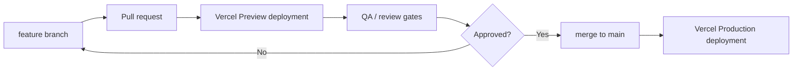

# Deployment And Environments

> Last updated: 2026-05-19

Primary deployment target: `Vercel`.

Deployment is part of the fixed development baseline, but actual project linking,
domain setup, and production deployment must wait until application code exists.

## Environment Model

| Environment | Trigger | Purpose |
| --- | --- | --- |
| Local | Developer machine with `.env.local` | Build and test before pushing. |
| Preview | Pull request or non-production branch push | QA, design review, stakeholder review, and AI workflow verification. |
| Production | Merge or push to `main` | User-facing deployment. |

Rules:

- `main` is the production branch.
- Feature branches and pull requests must deploy to Preview before production.
- Production deployment should happen only after build, typecheck, lint, and relevant tests pass.
- Do not deploy directly from an unreviewed local working tree unless there is an explicit emergency decision record.
- Use Vercel Git integration as the default deployment path.
- Use Vercel CLI deployment only for controlled recovery, diagnostics, or a documented CI workflow.

## Required Build Settings

Once `package.json` exists, Vercel must use:

| Setting | Value |
| --- | --- |
| Framework preset | `Next.js` |
| Install command | `pnpm install --frozen-lockfile` |
| Build command | `pnpm build` |
| Output directory | Vercel default for Next.js |
| Node.js version | `24.x` when supported by Vercel project settings; otherwise the latest supported LTS matching app compatibility |

If Vercel does not yet support the selected Node LTS in project settings, use
the latest Vercel-supported LTS and record the mismatch in the deployment report.

## Environment Variables

Environment variables must be configured per Vercel environment.

Required initial variables:

| Variable | Scope | Browser-visible? | Notes |
| --- | --- | --- | --- |
| `NEXT_PUBLIC_SUPABASE_URL` | Local, Preview, Production | yes | Supabase project URL. |
| `NEXT_PUBLIC_SUPABASE_PUBLISHABLE_KEY` | Local, Preview, Production | yes | Public client key only. |
| `SUPABASE_SERVICE_ROLE_KEY` | Server-only, if needed later | no | Do not add until a server-only admin task requires it. |

Rules:

- Never commit `.env.local`.
- Never expose `service_role` or secret keys with `NEXT_PUBLIC_`.
- Use separate Supabase projects or separate credentials for Preview and Production when real user data exists.
- Pull local development variables with Vercel CLI only after the project is linked.
- Any new secret must be listed in the implementation plan and final report without revealing its value.

## Deployment Gates

Before a Preview deployment is considered reviewable:

- `pnpm install --frozen-lockfile`
- `pnpm typecheck`
- `pnpm lint`
- `pnpm test`
- `pnpm build`

Before Production:

- All Preview gates pass.
- Relevant Playwright tests pass for changed user flows.
- UI changes have browser/visual QA evidence.
- Supabase migrations, if any, have been reviewed for RLS and secret exposure.
- AI service changes, if any, use the documented service boundary and validated request/response schemas.
- Billing remains disabled unless billing scope has been explicitly reopened.

## Rollback And Recovery

Use Vercel's deployment history for rollback when a production deployment
regresses.

Rollback report must include:

- failed deployment URL or commit,
- rollback target,
- user-visible symptom,
- verification after rollback,
- follow-up issue or fix plan.

Do not delete failed deployments until debugging evidence has been collected,
unless there is a security or secret exposure risk.
