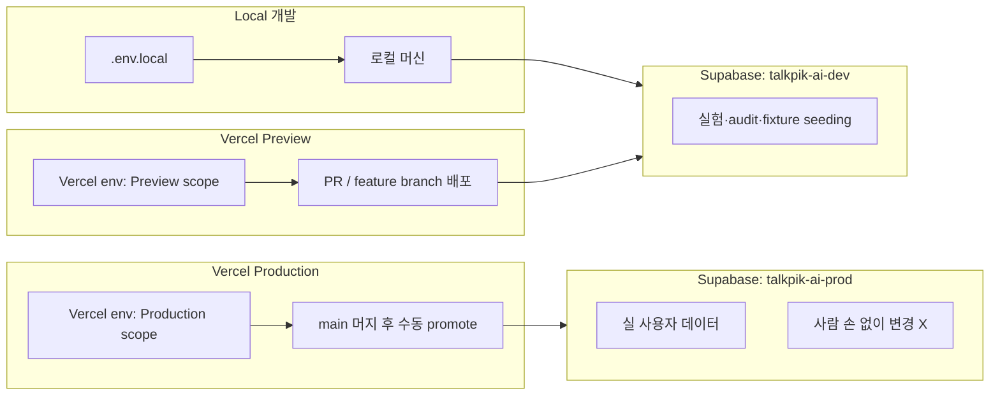

# Environments — Supabase + Vercel 운영 관리

> Last updated: 2026-05-28
> Status: Local + Preview 가동 중, Production 준비 단계 (Supabase prod 프로젝트 미생성)

이 문서는 **dev/prod 환경 분리 원칙, Supabase 프로젝트 운영, Vercel 배포 관리, 키 회전, 마이그레이션 흐름, 사고 대응** 을 한 페이지로 정리합니다. 운영 환경(prod) 도입 시 이 문서를 그대로 따라가면 됩니다.

다음 정본을 참조합니다:

| 영역 | 참조 |
| --- | --- |
| Supabase / Auth / RLS / Storage 아키텍처 | [`backend-auth.md`](./backend-auth.md) |
| 인증 흐름 + 운영 정책 (cleanup pg_cron, rate limit, role 모델) | [`auth-overview.md`](./auth-overview.md) |
| DB 스키마, RLS 정책, 마이그레이션 인덱스 | [`database-schema.md`](./database-schema.md) |
| Vercel 배포 게이트, env var 룰 | [`deployment.md`](./deployment.md) |
| 결제·구독 deferred 정책 | [`deferred-scope.md`](./deferred-scope.md) |
| IA 구현 검수 (audit가 어떤 키를 쓰는지) | [`../ai-workflow/ia-implementation-verification-execution-plan.md`](../ai-workflow/ia-implementation-verification-execution-plan.md) |

---

## 1. 한 줄 결론

**Supabase 프로젝트 2개**(dev / prod) + **Vercel 환경 3개**(Local / Preview / Production) 로 격리합니다. dev는 audit·fixture seeding 등 자유 실험용, prod는 실 사용자 데이터 전용으로 **자동화 없이 사람 손이 명시적으로 승인** 해야만 변경이 들어갑니다. 모든 키는 노출 시 즉시 회전, audit `--apply` 는 prod-target 자동 거부됩니다.

---

## 2. 환경 매트릭스



### 환경별 책임 분리

| 항목 | Local | Vercel Preview | Vercel Production |
| --- | --- | --- | --- |
| 가리키는 Supabase | dev | dev (또는 staging) | **prod** |
| 자격증명 위치 | `.env.local` (gitignored) | Vercel UI · Preview scope | Vercel UI · Production scope |
| 데이터 종류 | 실험·fixture | dev 데이터 공유 | **실 사용자 데이터** |
| 자유롭게 reset 가능? | ✅ | ✅ (협의) | ❌ (절대 X) |
| Audit `pnpm test:ia:storage-state --apply` | ✅ 허용 | ✅ 허용 | ❌ **거부됨** (`build-storage-state.mjs` 가드) |
| Custom SMTP | 선택 | 선택 | **필수** (built-in 2/hour 부족) |
| 마이그레이션 적용 | 직접 push | 직접 push | **수동 승인 트리거** |

> Preview와 Local이 같은 dev Supabase를 공유하면 데이터가 겹쳐서 디버그가 복잡해집니다. 팀이 커지면 별도 staging Supabase 프로젝트 도입 권장.

---

## 3. 환경 변수 매트릭스

`.env.example` 의 헤더 표와 동일한 내용입니다. 코드/도구는 다음 룰로 동작합니다.

| 변수 | Local (`.env.local`) | Vercel Preview | Vercel Production | 비고 |
| --- | --- | --- | --- | --- |
| `NEXT_PUBLIC_SUPABASE_URL` | dev URL | dev URL | **prod URL** | 브라우저에서 사용 → `NEXT_PUBLIC_` prefix 필수 |
| `NEXT_PUBLIC_SUPABASE_PUBLISHABLE_KEY` | dev publishable | dev publishable | **prod publishable** | 안전한 공개 키 |
| `NEXT_PUBLIC_SITE_URL` | `http://127.0.0.1:3000` | preview 도메인 | prod 도메인 | redirect URL 생성에 사용 |
| `SUPABASE_SERVICE_ROLE_KEY` | dev Secret API key (`sb_secret_*`) | dev Secret API key | **prod Secret API key** | 서버 전용, 브라우저 노출 절대 X. 신규 발급은 Dashboard → Secret API Keys |
| `SUPABASE_ENV_LABEL` | `local` (또는 `dev`) | `preview` | `prod` | audit 가드용 라벨 — 서버 전용 |
| `SUPABASE_TEST_PASSWORD` | audit용 임시값 | (선택) | **NEVER SET** | audit 가짜 유저 4개 공유 비번. DB 비밀번호 아님 |
| `ACCESS_TOKEN` (Supabase PAT) | CLI 로컬 사용시 | CI에서만 | CI에서만 | `supabase link`, `db push` 등에 사용 |
| Custom SMTP creds | — | — | **prod에만 필수** | SendGrid/Resend/Postmark 등 |

### `NEXT_PUBLIC_` prefix 룰

Next.js 룰: `NEXT_PUBLIC_<NAME>` 만 브라우저에서 읽힙니다. `NEXT_<NAME>` (PUBLIC 없는) 형태는 별도 의미 없는 일반 서버 변수입니다.

- 브라우저 필요 → `NEXT_PUBLIC_` ✅
- 서버 전용 (admin API, Node 스크립트, route handler 내부) → prefix 없음 ✅
- service_role / Secret API key / SMTP password 류는 **절대 NEXT_PUBLIC_ 금지**

### "비밀번호" 4종 헷갈리지 마세요

| 이름 | 무엇 | 어디서 만들어짐 | 어디 보관 |
| --- | --- | --- | --- |
| **DB 비밀번호** (postgres role) | Supabase 프로젝트 직접 연결용 | 프로젝트 생성 시 설정 | Supabase Vault, psql 직접 연결 때만 |
| **JWT secret** | Supabase가 토큰 서명에 사용 | Supabase 자동 생성 | Dashboard, 회전 시 모든 토큰 무효화 (nuclear) |
| **실 사용자 비밀번호** (`auth.users`) | 각 사용자의 로그인 비번 | 사용자가 가입 시 입력 | DB에 bcrypt hash |
| **`SUPABASE_TEST_PASSWORD`** | audit 가짜 유저 4개 공유 비번 | 개발자가 랜덤 생성 | `.env.local` (dev/preview만) |

---

## 4. Supabase 프로젝트 운영 (DB 측)

### 4.1 dev 프로젝트 (현재)

- 사용처: 로컬 개발, Preview 배포, IA audit, RLS smoke test, 마이그레이션 검증
- 운영 모드: 자유롭게 reset/seed 가능
- audit 테스트 유저 4개: `student@audit.local`, `content_admin@audit.local`, `org_admin@audit.local`, `platform_admin@audit.local`
- cleanup pg_cron job (`cleanup_unconfirmed_users_daily`)이 30일 후 미인증 유저 자동 정리

### 4.2 prod 프로젝트 (도입 시 신규 생성)

Dashboard에서 새 프로젝트 만들 때 체크리스트:

| 단계 | 항목 | 비고 |
| --- | --- | --- |
| 1 | 새 Supabase 프로젝트 생성 (이름 예: `talkpik-ai-prod`) | dev와 완전 별개 |
| 2 | DB 리전 선택 | 사용자 위치 고려 (한국이면 `ap-northeast-2`) |
| 3 | 강한 DB 비밀번호 (Vault 보관) | 노출 시 회전 + DB pause/resume 필요 |
| 4 | `supabase/migrations/` 전체 적용 | dev에서 검증된 순서로 |
| 5 | RLS 정책 활성화 확인 | `private.is_*_admin()` 함수 + `admin_audit_logs` 트리거 |
| 6 | pg_cron extension 활성화 | `cleanup_unconfirmed_users_daily` 등록 |
| 7 | Email Template (signup / recovery / magic-link) prod 도메인으로 갱신 | `{{ .ConfirmationURL }}` → `https://prod-domain/auth/callback` |
| 8 | Authentication → URL Configuration → Redirect URLs | prod 도메인만 화이트리스트 |
| 9 | Custom SMTP 설정 | SendGrid / Resend / Postmark 등. built-in SMTP 2/hour는 운영 불가 |
| 10 | Auth → Providers → Email → Confirm email **반드시 ON** | cleanup 정책의 전제 |
| 11 | Storage 정책 적용 (`is_email_confirmed` 가드 포함) | 미인증 사용자 업로드 차단 |
| 12 | Secret API key 발급 (`sb_secret_...`) | Vercel Production env에만 입력 |
| 13 | Publishable key 메모 | Vercel Production env에 입력 |
| 14 | DB backup 정책 결정 | Free = 7일 PITR, Pro = 30일+. 운영용은 Pro 권장 |
| 15 | (선택) staging 프로젝트 별도 생성 | dev와 prod 사이 검증 단계 추가 |

> 위 체크리스트 끝나야 prod 배포가 의미를 가집니다. 항목 하나라도 빠지면 데이터·인증·복구 어딘가에서 문제 생깁니다.

### 4.3 마이그레이션 흐름 (dev → prod)

```text
1. 로컬에서 작성       supabase/migrations/<timestamp>_<slug>.sql
        ↓
2. dev 적용           supabase db push --project-ref <dev-ref>
        ↓
3. 검증              • pnpm test:supabase:local
                     • Playwright auth + RLS smoke
                     • dev에서 사람 손으로 시나리오 한 번 따라가기
        ↓
4. PR / 리뷰          • migration diff 코드 리뷰
                     • RLS 정책 변경 시 별도 강조 (security-critical)
                     • Codex cross-model review (권장)
        ↓
5. main 머지          • Vercel Preview 자동 deploy
                     • Preview에서 한 번 더 검증
        ↓
6. prod 적용 (수동)   • pre-flight: pg_dump 백업
                     • supabase db push --project-ref <prod-ref>
                     ─────────────────────────────────────────────
                     ↑ 자동화 절대 X — 사람이 명시적으로 실행
        ↓
7. prod 검증          • smoke 테스트 (read-only)
                     • Supabase Logs 모니터링
                     • Vercel deployment health 확인
```

**핵심:** 5번까지는 자동, **6번은 수동 승인 게이트**. CI가 prod에 자동 push하면 사람이 다시 보지 못한 변경이 운영에 들어갑니다.

---

## 5. Vercel 배포 관리 (배포 측)

### 5.1 Vercel 환경 3개

| Vercel 환경 | 트리거 | 가리키는 Supabase | 용도 |
| --- | --- | --- | --- |
| Development | `vercel dev` 또는 로컬 빌드 | (사용 안 함 — 로컬은 `.env.local` 직접) | 일반 로컬 개발은 `pnpm dev` 사용 |
| **Preview** | PR / non-main 브랜치 push | dev (또는 staging) | QA, 디자인 리뷰, 스테이크홀더 리뷰 |
| **Production** | main 머지 + 수동 promote | **prod** | 사용자 노출 배포 |

[`deployment.md`](./deployment.md) §Environment variables 표가 정본. 위는 그 표의 환경 분리 관점 요약입니다.

### 5.2 Vercel env 설정 위치

```
Vercel Dashboard → 프로젝트 → Settings → Environment Variables
   ├── 변수명 입력
   ├── 값 입력
   ├── Scope 체크박스:
   │     ☐ Development
   │     ☑ Preview         ← dev 자격증명
   │     ☑ Production      ← prod 자격증명 (별도 값)
   └── Save
```

같은 변수명이라도 scope가 다르면 다른 값을 입력할 수 있습니다. 그게 분리 메커니즘입니다.

### 5.3 배포 게이트 (Preview → Production 승격 조건)

[`deployment.md`](./deployment.md) §Deployment Gates 의 룰을 그대로 따릅니다.

**Preview 검증:**
- `pnpm install --frozen-lockfile`
- `pnpm typecheck`
- `pnpm lint`
- `pnpm test`
- `pnpm build`

**Production 추가 요건:**
- 모든 Preview 게이트 PASS
- 변경 사용자 흐름에 대해 Playwright 통과
- UI 변경은 브라우저/시각 QA 증거
- Supabase 마이그레이션이 있으면 RLS · secret 노출 검토 끝
- AI 서비스 변경이 있으면 service boundary + request/response 스키마 validation 끝
- Billing 활성화 없음 (별도 scope 재개 결정 없으면 deferred 유지)

### 5.4 Rollback

[`deployment.md`](./deployment.md) §Rollback And Recovery 참조. 핵심:

- Vercel UI → Deployments → 이전 deployment 클릭 → "Promote to Production"
- 즉시 이전 빌드로 되돌아감 (DB는 별도 — 마이그레이션 rollback은 PITR 또는 reverse migration)
- Rollback 보고서 작성: 실패 deployment URL, target, 증상, 검증, 후속

---

## 6. 키 회전 정책

### 6.1 정기 회전 (예방)

| 키 | 주기 | 절차 |
| --- | --- | --- |
| Supabase Secret API key | **분기 1회** | Dashboard에서 새 key 발급 → Vercel env 갱신 → 다음 deploy → 옛 key revoke (3단계 무중단) |
| Supabase Publishable key | 변경 시에만 | 위험 낮음, 보통 안 바꿔도 됨 |
| SMTP API key | 분기 1회 | 동일 |
| `ACCESS_TOKEN` (Supabase PAT) | 분기 1회 | Supabase 계정 설정에서 새 발급 |
| DB password | 연 1회 | Supabase DB pause/resume (downtime 있음) |
| JWT secret | 사고 시에만 | 발급된 모든 토큰 무효화 → 모든 사용자 강제 로그아웃 |

### 6.2 무중단 회전 표준 절차

```text
1. Dashboard에서 새 Secret API key 발급
2. Vercel env (Production scope) 의 SUPABASE_SERVICE_ROLE_KEY를 새 값으로 교체
3. Vercel Production 재배포 (deploy hook 또는 redeploy 버튼)
4. 새 배포 + 새 키로 잘 동작 확인 (Supabase Logs로 키 사용 흔적 확인)
5. Dashboard에서 옛 키 revoke
```

이 순서대로 가면 다운타임 없음. **2-3 순서 바뀌면 일시 인증 실패** 발생.

### 6.3 비상 회전 (사고 대응)

키 노출 의심 → 즉시:

```text
0. 신호 감지
   • Supabase Logs에서 unfamiliar service_role 사용
   • 알 수 없는 IP에서 admin RPC
   • role 변경 audit_log에 unexpected 항목
   • 채팅 / 이메일 / 스크린샷 / git diff에 키 노출 흔적
   • GitHub secret scanning alert

1. 즉시 Dashboard에서 해당 키 revoke
   (Secret API key는 개별 revoke 가능, legacy JWT는 JWT secret 전체 회전 필요)

2. 새 Secret API key 발급

3. Vercel env 갱신 (영향받는 scope)

4. 즉시 재배포

5. Supabase Logs 24-48시간 분석 — malicious activity 탐지
   ─ unfamiliar IP의 admin.createUser / RPC 호출
   ─ profiles.app_role unexpected 변경
   ─ Storage 비정상 업로드

6. 영향 사용자 식별 (있다면 통보 + 비밀번호 재설정 강제 + 세션 무효화)

7. 사고 보고서: docs/incidents/<YYYY-MM-DD>-<slug>.md
   ─ 노출 경로 (어떻게 새어나갔는지)
   ─ 노출 시각 / 발견 시각 / 회전 시각
   ─ 영향 평가 (실제 악용 흔적 / 사용자 영향)
   ─ 재발 방지 액션
```

### 6.4 dev 키도 회전 대상

prod 아니라고 dev 키 노출 무시 X. dev에도 fixture / test 데이터가 있고, 노출된 service_role은 dev 프로젝트 admin 권한 그대로 가짐. **노출됐으면 회전.**

`auth-overview.md` §10 에 다음 drift 기록이 있습니다:

> **Known doc-↔-impl drift (2026-05-27)**: SUPABASE_SERVICE_ROLE_KEY 일부 변경 흔적이 transcript에 노출됐던 정황. 후속 정리: dev 키 회전 + Secret API key로 전환.

전환 완료 시 위 노트 갱신 필요.

---

## 7. Audit (IA 검수) vs prod 정책

[`../ai-workflow/ia-implementation-verification-execution-plan.md`](../ai-workflow/ia-implementation-verification-execution-plan.md) 의 IA 구현 검수가 어떤 키를 어디서 쓰는지:

### 7.1 안전한 prod-대상 audit (read-only)

```text
✅ 가능
   • Public 라우트 navigation smoke (X-01/A-01/A-02/X-06/X-11/X-12)
   • Auth route handler 응답 검증 (GET 405, no token leak)
   • /auth/error?reason=... 매핑 정확성
   • RLS 정책 dry-run (서비스 키 없이)
   • Health endpoint ping
   • Synthetic 모니터링 (Vercel Cron + curl)
```

### 7.2 절대 금지 (write 동작)

```text
🚫 prod에 절대 X
   • build-storage-state.mjs --apply  ← 가드로 자동 거부됨
   • 테스트 유저 생성
   • DB row 삽입/삭제
   • role 변경 RPC
   • 어떤 종류의 fixture seed든
```

### 7.3 안전 가드 동작

`scripts/audit-setup/build-storage-state.mjs` 가 다음 3 신호로 타깃 분류:

```javascript
function classifyTargetEnv() {
  // 1. SUPABASE_ENV_LABEL 명시값 (가장 강한 신호)
  // 2. NEXT_PUBLIC_SUPABASE_URL heuristic — 127.0.0.1/localhost → local
  // 3. NEXT_PUBLIC_SITE_URL heuristic — *-dev / *-staging / *.vercel.app → dev
  // 신호 없으면 → "unknown-treat-as-prod" (안전한 default)
}
```

`--apply` 동작:

| 분류 | 결과 | exit code |
| --- | --- | --- |
| `local` / `dev` / `staging` / `preview` | ✅ 진행 | (정상 흐름) |
| `prod` 또는 `unknown-treat-as-prod` | 🚫 **REFUSED** | 2 |
| 위 + `--i-know-this-is-prod-and-want-to-seed-anyway` 플래그 | ✅ 진행 (build-status.json에 기록) | (정상 흐름) |

IA audit caveat: this break-glass flag is not valid for IA implementation
verification seed-data, storage-state, or audit evidence. Any IA audit artifact
produced with a production or unknown-target override is non-audit evidence and
blocks final `PASS`.

verbose flag 이름은 일부러 길게 — 우연한 prod 실행 방지. **prod에 대고 이 플래그를 절대 쓰지 마세요.** dev에서 라벨 분류가 헷갈릴 때 일회용 비상 탈출구 용도일 뿐.

---

## 8. 백업 + 모니터링

| 항목 | 도구 | 빈도 | 비고 |
| --- | --- | --- | --- |
| DB PITR (Point-in-Time Recovery) | Supabase 내장 | 자동 | Free 7일, Pro 30일+ |
| 마이그레이션 전 백업 | `pg_dump > backups/<timestamp>.sql` | 마이그레이션마다 수동 | prod 마이그레이션 시 필수 |
| 월간 아카이브 | S3 / R2 / Backblaze 등 외부 | 월 1회 | Supabase 장애·계정 정지 시 보험 |
| Auth 이벤트 로그 | Supabase Dashboard → Logs | 실시간 | 비정상 패턴 알람 |
| RLS 거부 로그 | Postgres logs | 실시간 | Pro+ 플랜에서 더 상세 |
| 슬로우 쿼리 | Supabase Insights | 주간 리뷰 | 인덱스 누락 탐지 |
| 클라이언트 오류 | Sentry (별도 셋업 권장) | 실시간 | prod 도입 시 별도 결정 |
| pg_cron 헬스 | `select * from cron.job_run_details order by start_time desc limit 5;` | 주간 점검 | cleanup job 누락 탐지 |
| Vercel deployment health | Vercel UI | 자동 | deployment 실패 알람 |
| Synthetic uptime | Vercel Cron + smoke endpoint | 5분 | prod 도입 시 검토 |

---

## 9. 사고 대응 플레이북 (요약)

| 사고 유형 | 첫 조치 | 후속 |
| --- | --- | --- |
| Service key 노출 | 즉시 revoke + 새 키 + Vercel 갱신 + 재배포 | 로그 24h 분석, 사용자 통보 여부 결정, `docs/incidents/` 보고서 |
| 마이그레이션 실패 | Vercel Production을 이전 deployment로 즉시 rollback | DB PITR로 마이그 직전 시점 복원 검토 |
| RLS 정책 누락 발견 | 마이그레이션으로 즉시 패치 + 관련 RPC 일시 disable | 영향 row 카운트 + 데이터 노출 평가 + 사용자 통보 |
| pg_cron job 실패 | `select * from cron.job_run_details where status='failed';` 확인 후 수동 트리거 | extension 상태 점검, 알람 셋업 |
| Built-in SMTP 한도 도달 | Custom SMTP 즉시 전환 | 사용자에게 cooldown 안내, X-11 카운트다운 동작 확인 |
| DB 용량 폭주 | Supabase Dashboard에서 plan upgrade 또는 데이터 archive | cleanup 정책 강화 |
| Vercel 빌드 실패 (prod) | 이전 deployment로 promote | 실패 빌드 분석, 재배포 |
| `NEXT_PUBLIC_SITE_URL` 도메인 변경 후 콜백 실패 | Supabase Dashboard Redirect URLs 화이트리스트 갱신 | 이메일 템플릿 `{{ .ConfirmationURL }}` 확인 |

---

## 10. 현재 상태 (2026-05-28 기준)

| 항목 | 상태 |
| --- | --- |
| dev Supabase 프로젝트 | 운영 중 (현재 `.env.local` 가리킴) |
| dev `SUPABASE_SERVICE_ROLE_KEY` | Secret API key 도입 단계 (2026-05-27 legacy JWT 노출 이후 회전 진행 중) |
| Vercel Preview env | 설정 필요 (별도 확인) |
| prod Supabase 프로젝트 | **미생성** — 운영 결정 후 §4.2 체크리스트 따라 생성 |
| Vercel Production env | **미설정** |
| Custom SMTP | 미설정 (prod 도입 시 필수) |
| Synthetic 모니터링 | 미설정 (prod 도입 시 검토) |

---

## 11. 새 환경 도입 시 순서 (체크리스트)

```text
[ ] 1. 도입 결정 (product/business)
[ ] 2. Supabase prod 프로젝트 생성 (§4.2 체크리스트 15단계)
[ ] 3. 마이그레이션 전체 적용 (dev에서 검증 완료된 순서로)
[ ] 4. Custom SMTP 셋업
[ ] 5. Vercel Production env 변수 설정 (§3 표)
[ ] 6. SUPABASE_ENV_LABEL=prod 명시
[ ] 7. NEXT_PUBLIC_SITE_URL을 prod 도메인으로
[ ] 8. Supabase Redirect URLs 화이트리스트 갱신
[ ] 9. Email Template 도메인 확인
[ ] 10. 첫 prod 배포 (Vercel Promote)
[ ] 11. Smoke test (§7.1 read-only audit)
[ ] 12. 모니터링 알람 셋업
[ ] 13. Incident response 연락처 확정
[ ] 14. 백업 정책 확정 (PITR + 외부 아카이브)
[ ] 15. 첫 사용자 진입 전 한 번 더 보안 점검
```

---

## 12. 용어집 (바이브 코더 용)

| 용어 | 풀이 |
| --- | --- |
| dev / prod | 개발용 / 사용자 노출용 환경 |
| Supabase | 백엔드 플랫폼 — DB + Auth + Storage |
| Vercel | 배포 플랫폼 — Next.js 호스팅 |
| Preview deployment | PR 올릴 때 자동 생성되는 임시 사이트 |
| Production deployment | 실제 사용자가 보는 사이트 |
| RLS (Row Level Security) | DB가 "이 사용자는 자기 row만 봐" 강제 |
| service_role / Secret API key | DB admin 권한 키 — 노출 시 모든 데이터 위험 |
| Publishable key | 브라우저에서 써도 안전한 공개 키 |
| `NEXT_PUBLIC_` prefix | 변수 이름 앞에 붙으면 브라우저에서 접근 가능 |
| PITR (Point-in-Time Recovery) | "어제 14:00 상태로 DB 되돌려" 기능 |
| pg_cron | DB 안에서 도는 스케줄러 |
| Custom SMTP | 메일 발송 외부 서비스 (SendGrid 등) |
| audit `--apply` | IA 검수가 테스트 유저 실제로 생성하는 동작 |
| 키 회전 (rotation) | 옛 키 폐기 + 새 키 발급 |

---

## 13. 관련 문서

- [`backend-auth.md`](./backend-auth.md) — Supabase 아키텍처 + RLS 룰
- [`auth-overview.md`](./auth-overview.md) — 인증 흐름 + 운영 정책 (cleanup, rate limit, role)
- [`database-schema.md`](./database-schema.md) — 테이블 스키마 + RLS 정책 SQL
- [`deployment.md`](./deployment.md) — Vercel 배포 게이트 (이 문서는 그 정본의 환경 분리 관점 확장)
- [`stack.md`](./stack.md) — 프레임워크/패키지 선택
- [`deferred-scope.md`](./deferred-scope.md) — 결제·구독 deferred 영역
- [`../sitemap.md`](../sitemap.md) — 라우트 매핑 (audience map 포함)
- [`../ai-workflow/ia-implementation-verification-execution-plan.md`](../ai-workflow/ia-implementation-verification-execution-plan.md) — IA 구현 검수 (audit `--apply` 가드 출처)
- 사고 보고서 폴더: `docs/incidents/` (필요 시 신규 생성)
