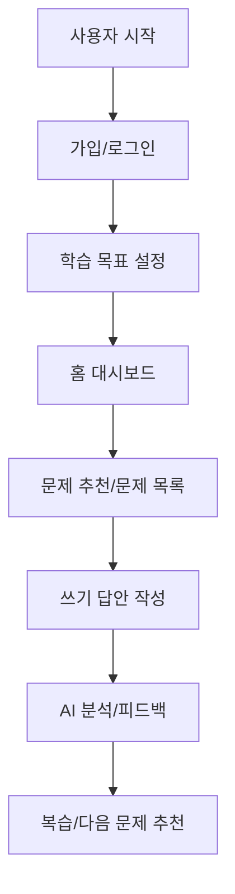

# Flow 문서 안내

이 폴더는 사용자가 TALKPIK AI를 어떤 순서로 사용하는지 보여주는 문서입니다.
쉽게 말하면 "사용자가 앱 안에서 어디서 시작하고, 어떤 화면을 거쳐, 어떤 결과를 얻는가"를 설명합니다.

## 핵심 문서

| 문서 | 쉽게 말하면 | 언제 보나요 |
| --- | --- | --- |
| [user-flow.md](./user-flow.md) | 현재 기준 사용자 흐름입니다. | 가입, 학습, 문제풀이, 피드백 흐름을 볼 때 |

## 사용자 흐름을 보는 법

이 그림은 전체 흐름의 쉬운 버전입니다.
정확한 노드 이름과 화면 연결은 [user-flow.md](./user-flow.md)를 기준으로 봐야 합니다.

## 다른 문서와의 관계

| 연결 문서 | 관계 |
| --- | --- |
| [../Wireframe/README.md](../Wireframe/README.md) | Flow의 각 화면이 IA 문서의 화면 설명과 연결됩니다. |
| [../ia.md](../ia.md) | 사용자가 이동하는 화면이 실제 라우트와 연결됩니다. |
| [../../README.md](../../README.md) / [../../AGENTS.md](../../AGENTS.md) | 흐름 안에서 각 기능이 어떻게 동작해야 하는지 설명합니다. |

## AI에게 지시할 때

> `docs/flow/user-flow.md`를 기준으로 사용자가 어느 화면에서 어느 화면으로 이동해야 하는지 확인해줘.
