# TALKPIK AI Sitemap

이 문서는 [docs/flow/user-flow.md](./user-flow.md)를 보기 쉽게 다시 정리한 사이트맵입니다. 사이트맵의 화면, 이동, 분기 내용은 오직 `docs/flow/user-flow.md`만 근거로 삼습니다.

## 범례

| 표시 | 의미 |
| --- | --- |
| 청록색 | 사용자가 이동하는 주요 화면 |
| 초록색 | 문제 선택, 답안 작성, 피드백 같은 핵심 학습 화면 |
| 노란색 | 사용자 인터랙션, 기능 실행 결과, 상태값에 따른 분기 |
| 보라색 | 모달 또는 일시 상태 |
| 회색 | 인증 callback, OAuth 후처리 같은 시스템 처리 |
| 연보라색 | 약관, 개인정보처리방침 같은 보조 화면 |

## 사이트맵 다이어그램

```mermaid
flowchart TD
  subgraph S1["시작 / 인증"]
    X01["23 X-01 제품 랜딩"]
    START_DECISION["무료 시작 / 로그인 / 약관 확인"]
    A01["01 A-01 회원가입"]
    A02["02 A-02 로그인"]
    X13["35 X-13 이용약관"]
    X14["36 X-14 개인정보처리방침"]
    X06["28 X-06 비밀번호 재설정"]
    X16["38 X-16 새 비밀번호 설정"]
    X12["34 X-12 인증 메일 확인 안내"]
    CB[["/auth/callback 라우트 핸들러"]]
    CB_DECISION["callback 결과"]
    X17["39 X-17 인증 콜백 fragment 처리"]
    FRAGMENT_DECISION["fragment 처리 결과"]
    X11["33 X-11 인증 에러"]
    AUTH_ERROR_DECISION["인증 에러 reason"]
    PA["/auth/post-auth OAuth 후처리"]
    POST_AUTH_DECISION["약관 / 학습 목표 상태"]
    CONSENT["40 X-18 소셜 로그인 약관 동의"]
    A03["03 A-03 학습 목표 설정"]
  end

  subgraph S2["홈"]
    B01["04 B-01 홈 대시보드"]
    HOME_DECISION["홈에서 선택한 행동"]
  end

  subgraph S3["문제 선택"]
    C01["05 C-01 문제 유형 추천"]
    C02["06 C-02 문제 목록"]
    C03["07 C-03 다시 풀기 모달"]
    PROBLEM_DECISION["시작할 문제 번호 / 취소"]
  end

  subgraph S4["쓰기"]
    D01["08 D-01 51번 단답 작성"]
    D02["09 D-02 52번 답안 작성"]
    D03["10 D-03 53번 장문 작성"]
    D04["11 D-04 54번 에세이 작성"]
    DM3["22 D-M3 자동저장 경고"]
    AUTOSAVE_DECISION["저장 경고 선택"]
    DM1["12 D-M1 제출 확인 모달"]
    SUBMIT_DECISION["제출 확인 / 취소"]
    DM2["13 D-M2 AI 분석 로딩"]
    ANALYSIS_DECISION["분석 완료 유형"]
  end

  subgraph S5["피드백 / 복습"]
    E01["14 E-01 단답 피드백"]
    E02["15 E-02 장문 피드백"]
    SHORT_FEEDBACK_DECISION["단답 피드백 후 행동"]
    LONG_FEEDBACK_DECISION["장문 피드백 후 행동"]
    R01["16 R-01 비교 리포트"]
    R02["17 R-02 다음 문제 추천"]
    X07["29 X-07 약점 기반 추천"]
    F01["18 F-01 내 서재"]
    FM1["19 F-M1 PDF 내보내기 모달"]
  end

  subgraph S6["설정 / 결제"]
    X02["24 X-02 성장 대시보드"]
    G01["20 G-01 설정 언어"]
    X05["27 X-05 프로필 편집"]
    X09["31 X-09 알림 설정"]
    X03["25 X-03 페이월"]
    X04["26 X-04 구독 관리"]
  end

  X01 --> START_DECISION
  START_DECISION -->|"무료 시작"| A01
  START_DECISION -->|"로그인"| A02
  START_DECISION -. "약관/개인정보" .-> X13
  X13 -. "개인정보처리방침" .-> X14
  X01 -. "내비/미리보기/혜택 확인" .-> X01

  A01 -->|"이메일 가입"| A03
  A01 -->|"가입 직후"| X12
  A01 -. "Google로 계속" .-> PA
  A01 -. "Google OAuth callback" .-> CB
  A01 -. "약관/개인정보 확인" .-> X13
  A01 -. "약관/혜택 확인" .-> A01
  A02 -->|"로그인 성공: 학습자"| B01
  A02 -->|"회원가입"| A01
  A02 -->|"계정 찾기"| X06
  A02 -. "Google로 계속" .-> PA
  A02 -. "Google OAuth callback / 매직 링크 / 비밀번호 재설정 링크 클릭" .-> CB
  X06 -->|"재설정 링크"| X16
  X06 -. "오류 callback" .-> CB
  X16 -->|"비밀번호 변경 완료 / 로그인 복귀"| A02
  X12 -. "60초 cooldown 후 인증 메일 재전송" .-> X12
  X12 -->|"이메일 링크 클릭"| CB

  CB --> CB_DECISION
  CB_DECISION -->|"Google OAuth 성공"| PA
  CB_DECISION -->|"토큰 교환 성공: 학습자"| B01
  CB_DECISION -->|"query 없는 implicit fragment"| X17
  CB_DECISION -->|"토큰 교환 실패"| X11
  X17 --> FRAGMENT_DECISION
  FRAGMENT_DECISION -->|"setSession 성공"| B01
  FRAGMENT_DECISION -->|"fragment 실패/unknown"| X11

  PA --> POST_AUTH_DECISION
  POST_AUTH_DECISION -->|"필수 약관 미동의"| CONSENT
  CONSENT -->|"동의 기록"| PA
  POST_AUTH_DECISION -->|"학습 목표 없음"| A03
  POST_AUTH_DECISION -->|"동의+학습 목표 있음"| B01
  A03 -->|"다음 단계 / 건너뛰기"| B01

  X11 --> AUTH_ERROR_DECISION
  AUTH_ERROR_DECISION -->|"user_not_found → 중립 안내 후 다시 가입"| A01
  AUTH_ERROR_DECISION -->|"otp_expired / email_not_confirmed → 재전송"| X12
  AUTH_ERROR_DECISION -->|"flow_state_* / bad_code_verifier → 다시 시도"| A02
  AUTH_ERROR_DECISION -. "Retry-After 카운트다운 후 자동 활성" .-> X11
  A02 -. "세션 만료 = ?reason=session_expired" .-> A02

  B01 --> HOME_DECISION
  HOME_DECISION -->|"추천 학습"| C01
  HOME_DECISION -->|"최근 첨삭"| F01
  HOME_DECISION -->|"목표/성장 카드"| X02
  HOME_DECISION -->|"알림"| X09
  HOME_DECISION -->|"설정"| G01
  HOME_DECISION -->|"프로필 편집"| X05
  HOME_DECISION -->|"멤버십 / 구독 관리"| X04
  HOME_DECISION -. "로그아웃 (사이드바 하단, POST /auth/sign-out)" .-> A02

  C01 -->|"카드 선택 / 추천 유형 시작"| C02
  C01 -. "필터 변경" .-> C01
  C02 -->|"상세 보기 / 문제 선택"| C03
  C02 -. "유형 필터 / 정렬 / 검색 / 페이지 이동" .-> C02
  C03 --> PROBLEM_DECISION
  PROBLEM_DECISION -->|"시작: 51번"| D01
  PROBLEM_DECISION -->|"시작: 52번"| D02
  PROBLEM_DECISION -->|"시작: 53번"| D03
  PROBLEM_DECISION -->|"시작: 54번"| D04
  PROBLEM_DECISION -->|"취소"| C02

  D01 -->|"제출"| DM1
  D02 -->|"제출"| DM1
  D03 -->|"제출"| DM1
  D04 -->|"제출"| DM1
  D01 -. "저장 / 도구 / 이미지 확인 / 답안 작성" .-> D01
  D02 -. "조건 확인 / 가이드 / 임시저장" .-> D02
  D03 -. "자료 카드 / 본문 편집 / 저장" .-> D03
  D04 -. "조건 / 개요 / 표현 / 루브릭 확인" .-> D04
  D01 -. "저장 경고 / 이탈" .-> DM3
  D02 -. "저장 경고 / 이탈" .-> DM3
  D03 -. "저장 경고 / 이탈" .-> DM3
  D04 -. "저장 경고 / 이탈" .-> DM3

  DM3 --> AUTOSAVE_DECISION
  AUTOSAVE_DECISION -->|"취소 / 저장 후 이동: 51"| D01
  AUTOSAVE_DECISION -->|"취소 / 저장 후 이동: 52"| D02
  AUTOSAVE_DECISION -->|"취소 / 저장 후 이동: 53"| D03
  AUTOSAVE_DECISION -->|"취소 / 저장 후 이동: 54"| D04
  AUTOSAVE_DECISION -. "저장 안 함" .-> C02

  DM1 --> SUBMIT_DECISION
  SUBMIT_DECISION -->|"확인 CTA"| DM2
  SUBMIT_DECISION -->|"취소: 51"| D01
  SUBMIT_DECISION -->|"취소: 52"| D02
  SUBMIT_DECISION -->|"취소: 53"| D03
  SUBMIT_DECISION -->|"취소: 54"| D04
  DM1 -. "요약 재확인" .-> DM1
  DM2 --> ANALYSIS_DECISION
  ANALYSIS_DECISION -->|"분석 완료: 단답"| E01
  ANALYSIS_DECISION -->|"분석 완료: 장문"| E02
  DM2 -. "대기 유지" .-> DM2

  E01 --> SHORT_FEEDBACK_DECISION
  SHORT_FEEDBACK_DECISION -->|"다시 풀기"| C03
  SHORT_FEEDBACK_DECISION -->|"다음 문제 추천"| R02
  SHORT_FEEDBACK_DECISION -->|"비교 리포트"| R01
  SHORT_FEEDBACK_DECISION -. "결과 저장" .-> F01
  E02 --> LONG_FEEDBACK_DECISION
  LONG_FEEDBACK_DECISION -->|"다시 작성: 53"| D03
  LONG_FEEDBACK_DECISION -->|"다시 작성: 54"| D04
  LONG_FEEDBACK_DECISION -->|"비교 리포트"| R01
  LONG_FEEDBACK_DECISION -->|"다음 문제 추천"| R02
  LONG_FEEDBACK_DECISION -->|"PDF 저장"| FM1

  R01 -->|"약점 인사이트"| X07
  R01 -->|"다음 문제"| R02
  R01 -. "공유 / 차트 확인" .-> R01
  R02 -->|"추천 시작 / 카드 선택"| C02
  R02 -->|"목록 탐색"| C02
  X02 -->|"추천 액션 선택"| X07
  X02 -. "KPI / 차트 확인" .-> X02
  X07 -->|"추천 문제 시작"| C02
  X07 -. "탭 변경 / 인사이트 확인" .-> X07
  F01 -->|"PDF 내보내기"| FM1
  F01 -. "검색 / 행 선택 / 상세 패널 / 저장 해제" .-> F01
  FM1 -->|"다운로드 완료 / 닫기"| F01

  G01 -. "언어/지역/학습 언어 선택 후 저장" .-> G01
  R01 -. "유료 잠금 진입" .-> X03
  R02 -. "유료 잠금 진입" .-> X03
  FM1 -. "유료 잠금 진입" .-> X03
  X03 -->|"구독 CTA"| X04
  X03 -->|"학습 복귀"| B01
  X04 -->|"플랜 변경"| X03
  X04 -. "결제 deferred 안내 / 이력 placeholder" .-> X04
  G01 -. "멤버십 / 결제 진입" .-> X04
  X05 -. "멤버십 / 결제 진입" .-> X04
  X05 -. "입력 수정 / 이미지 변경 / 저장" .-> X05
  X09 -. "이메일/푸시 선택 / 토글 변경 / 저장" .-> X09

  class X01,A01,A02,A03,B01,X06,X16,X12,X11,X17,X02,X07,F01,G01,X03,X04,X05,X09 page
  class C01,C02,D01,D02,D03,D04,E01,E02,R01,R02 learning
  class START_DECISION,CB_DECISION,FRAGMENT_DECISION,POST_AUTH_DECISION,AUTH_ERROR_DECISION,HOME_DECISION,PROBLEM_DECISION,AUTOSAVE_DECISION,SUBMIT_DECISION,ANALYSIS_DECISION,SHORT_FEEDBACK_DECISION,LONG_FEEDBACK_DECISION decision
  class C03,DM1,DM2,DM3,FM1 modal
  class CB,PA system
  class X13,X14 support
  class CONSENT page

  classDef page fill:#BDEFE9,stroke:#4AAE9F,color:#111827,stroke-width:1px
  classDef learning fill:#D9F7BE,stroke:#73A942,color:#111827,stroke-width:1px
  classDef decision fill:#FFD982,stroke:#C98200,color:#111827,stroke-width:1px
  classDef modal fill:#DCC8FF,stroke:#8B5CF6,color:#111827,stroke-width:1px
  classDef system fill:#E5E7EB,stroke:#6B7280,color:#111827,stroke-width:1px
  classDef support fill:#E9D5FF,stroke:#A855F7,color:#111827,stroke-width:1px
```

## 주요 분기

| 분기 | 이동 |
| --- | --- |
| 시작 선택 | 제품 랜딩에서 회원가입, 로그인, 약관/개인정보 화면으로 이동 |
| OAuth 후처리 | 필수 약관 미동의면 소셜 로그인 약관 동의, 학습 목표가 없으면 학습 목표 설정, 둘 다 있으면 홈 대시보드 |
| 인증 callback | OAuth 성공, 토큰 교환 성공, fragment 처리, 토큰 교환 실패에 따라 후속 화면이 갈라짐 |
| 인증 에러 reason | 다시 가입, 인증 메일 재전송, 로그인 재시도, 카운트다운 유지로 분기 |
| 문제 번호 선택 | 다시 풀기 모달에서 51, 52, 53, 54번 작성 화면 또는 문제 목록으로 이동 |
| 제출 / 분석 | 제출 확인 후 AI 분석 로딩으로 이동하고, 분석 완료 유형에 따라 단답 피드백 또는 장문 피드백으로 이동 |
| 단답 피드백 후 행동 | 다시 풀기, 다음 문제 추천, 비교 리포트, 내 서재 저장으로 이동 |
| 장문 피드백 후 행동 | 다시 작성, 비교 리포트, 다음 문제 추천, PDF 저장으로 이동 |
| 유료 잠금 | 비교 리포트, 다음 문제 추천, PDF 내보내기에서 페이월로 진입할 수 있음 |

## 사이트맵에서 축약한 내부 동작

아래 동작은 `user-flow.md`에 있는 화면 내부 반복 조작이다. 새 화면으로 이동하지 않는 조작이므로 사이트맵 다이어그램에서는 점선 self-loop로 표현했다.

- 제품 랜딩의 내비게이션, 미리보기, 혜택 확인
- 회원가입의 약관/혜택 확인
- 인증 메일 재전송 cooldown 유지
- 문제 추천/목록의 필터, 정렬, 검색, 페이지 이동
- 답안 작성 화면 내부의 저장, 도구, 이미지 확인, 조건/가이드/루브릭 확인
- 제출 확인 모달의 요약 재확인, AI 분석 로딩의 대기 유지
- 비교 리포트의 공유와 차트 확인
- 성장 대시보드, 약점 기반 추천, 내 서재, 설정, 프로필, 알림, 구독 관리의 화면 내부 수정/저장 조작

## 제외 범위

`user-flow.md`에 따르면 관리자 화면은 이 사용자 앱 흐름도 범위에 없다. 따라서 사이트맵에도 관리자 화면을 넣지 않는다.
