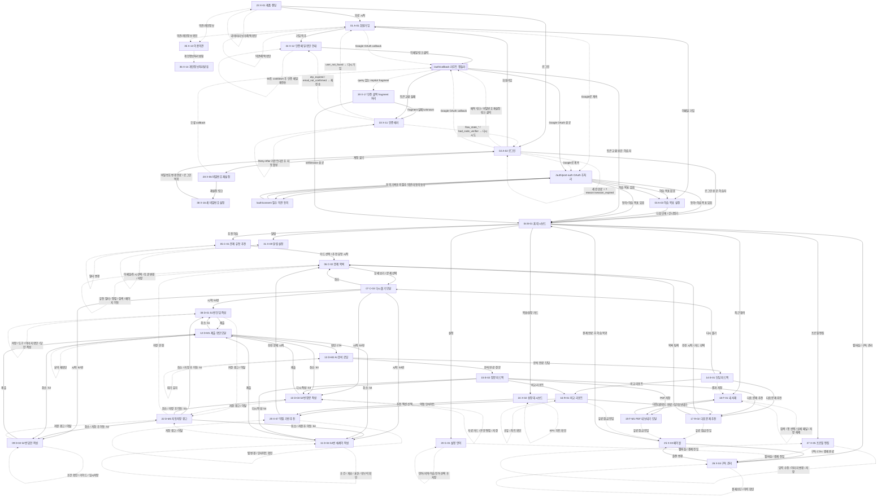

# TALKPIK AI 사용자 플로우 (현행)

이 문서는 `docs/Wireframe/`의 35개 페이지 IA와 연동된 **현행 사용자 플로우**입니다.
이 중 X-13~X-17은 기존 34개 Wireframe 이후 코드베이스 기준으로 추가된 화면입니다.
노드명은 `docs/Wireframe/{...}/description.md`의 `Source` 값과 일치합니다(참조 규칙: `docs/Wireframe/README.md`).

새 구현/QA는 본 문서를 정본으로 사용합니다.

> 관리자 화면은 별도 관리자 앱(topik-ai) 소관이라 이 흐름도 범위에 없습니다. 경계 기준은 `docs/admin-scope-boundary.md`를 따릅니다.

## Mermaid 사용자 플로우

## 인증 콜백 / 에러 흐름 — 상세 시나리오

위 다이어그램의 `CB` (`/auth/callback`)와 X-11/X-12는 cleanup 정책(30일 미인증 자동 삭제)과 함께 가야 의미가 있다. cleanup이 켜진 상태에서 사용자가 옛 인증 링크를 클릭하면 Supabase가 보낼 응답이 늘어나기 때문이다. 시나리오는 다음 여섯 가지.

| # | 상황 | Supabase 응답 | UX 결과 |
| --- | --- | --- | --- |
| 1 | 정상 가입 직후 30분 안에 메일 클릭 | `verifyOtp` success | `next` 또는 `/dashboard`로 redirect |
| 2 | 24h 토큰 만료 후 클릭 | `error.code = otp_expired` | X-11에서 "다시 인증 메일 받기" 안내 (이메일 prefill, 60초 cooldown) |
| 3 | 30일 미인증 cleanup 후 옛 링크 클릭 | `error.code = user_not_found` | X-11에서 "다시 가입하기" primary CTA → A-01 |
| 4 | 같은 메일 60초 이내 재전송 시도 | `error.code = over_email_send_rate_limit` + `Retry-After` 헤더 | X-11에서 `retry_after_seconds` 카운트다운, 다 끝나면 CTA 자동 활성 |
| 5 | 다른 브라우저/기기에서 PKCE 토큰 검증 시도 | `error.code = bad_code_verifier` 또는 `flow_state_not_found` | X-11에서 "처음부터 다시" 안내, A-02 로그인으로 secondary |
| 6 | Google OAuth callback 성공 | `exchangeCodeForSession` success | `/auth/post-auth`에서 약관 동의 누락 시 `/auth/consent`, 학습 목표 누락 시 A-03, 모두 있으면 B-01 |

세션 만료(in-app JWT expiry)는 미들웨어에서 잡혀 `/login?reason=session_expired`로 친절 redirect한다. X-11/X-12를 거치지 않는다.

`/auth/error`의 `reason` query는 Supabase 공식 `error.code` 11개 (`otp_expired`, `flow_state_expired`, `flow_state_not_found`, `bad_code_verifier`, `user_not_found`, `over_email_send_rate_limit`, `over_request_rate_limit`, `email_not_confirmed`, `signup_disabled`, `access_denied`, `unknown`)에 매핑된다. 자세한 메시지/CTA 표는 `docs/Wireframe/33-X-11-auth-error/description.md` 참고.
