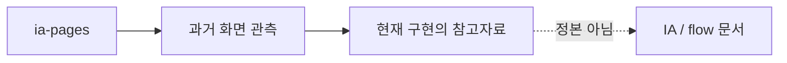

# IA Pages 문서 안내

이 폴더는 과거 HTML 버전 화면을 관측해서 적어 둔 참고 문서입니다.
현재 구현 기준은 [../IA/README.md](../IA/README.md)와 [../flow/user-flow.md](../flow/user-flow.md)입니다.

## 이 폴더의 성격

`ia-pages`는 "예전에 화면이 어떻게 생겼는지"를 이해하는 데 도움이 됩니다.
하지만 새 기능을 만들거나 QA할 때는 이 폴더를 기준으로 삼으면 안 됩니다.

## 문서 목록

| 문서 | 쉽게 말하면 |
| --- | --- |
| [00-common-layout.md](./00-common-layout.md) | 과거 HTML 화면의 공통 레이아웃 관찰 |
| [01-home-v1.md](./01-home-v1.md) | 과거 홈 화면 v1 관찰 |
| [02-home-v2.md](./02-home-v2.md) | 과거 홈 화면 v2 관찰 |
| [03-practice-create.md](./03-practice-create.md) | 과거 연습 생성 화면 관찰 |
| [04-practice-solve.md](./04-practice-solve.md) | 과거 문제 풀이 화면 관찰 |
| [05-writing-practice-create.md](./05-writing-practice-create.md) | 과거 쓰기 연습 생성 화면 관찰 |
| [06-writing-51.md](./06-writing-51.md) | 과거 51번 쓰기 화면 관찰 |
| [07-writing-53.md](./07-writing-53.md) | 과거 53번 쓰기 화면 관찰 |
| [08-my-library.md](./08-my-library.md) | 과거 내 서재 화면 관찰 |
| [09-my-vocabulary.md](./09-my-vocabulary.md) | 과거 단어장 화면 관찰 |
| [10-writing-feedback-list.md](./10-writing-feedback-list.md) | 과거 쓰기 피드백 목록 관찰 |
| [11-writing-feedback-detail.md](./11-writing-feedback-detail.md) | 과거 쓰기 피드백 상세 관찰 |
| [12-mock-exam-results.md](./12-mock-exam-results.md) | 과거 모의고사 결과 화면 관찰 |
| [13-mock-exam-history.md](./13-mock-exam-history.md) | 과거 모의고사 이력 화면 관찰 |
| [14-mock-test-setup.md](./14-mock-test-setup.md) | 과거 모의고사 설정 화면 관찰 |
| [14-1-mock-test-exam.md](./14-1-mock-test-exam.md) | 과거 모의고사 시험 화면 관찰 |
| [15-ai-tutor.md](./15-ai-tutor.md) | 과거 AI 튜터 화면 관찰 |
| [16-board.md](./16-board.md) | 과거 게시판 화면 관찰 |
| [17-notice-detail.md](./17-notice-detail.md) | 과거 공지 상세 화면 관찰 |
| [18-profile-settings.md](./18-profile-settings.md) | 과거 프로필 설정 화면 관찰 |
| [99-open-questions.md](./99-open-questions.md) | 당시 남아 있던 질문 목록 |

## AI에게 지시할 때

> `docs/ia-pages`는 레거시 참고로만 보고, 현재 기준은 `docs/IA`와 `docs/flow`를 우선해줘.
