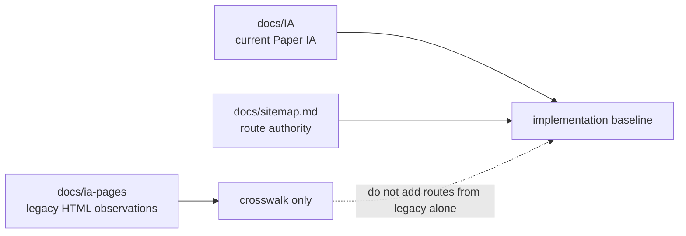

# IA Pages Legacy Crosswalk

This folder contains legacy observations from older HTML screens. It is not the
current Paper-frame screen inventory.

For current implementation, use:

- [docs/sitemap.md](../sitemap.md) for routes.
- [docs/IA/README.md](../IA/README.md) for the current 32 Paper-frame screens.
- [docs/flow/user-flow.md](../flow/user-flow.md) for screen order and dependencies.

## Folder Role

Use these files when you need historical context for how an older page looked.
Do not treat this folder as proof that a page belongs in the current product.

## Current Paper IA Crosswalk

| IA | Current screen | Current route or host | Current IA doc | Legacy `ia-pages` equivalent |
| --- | --- | --- | --- | --- |
| X-01 | Product landing | `/` | [23-X-01 product landing](../IA/23-X-01-product-landing/description.md) | none |
| A-01 | Sign-up | `/sign-up` | [01-A-01 sign-up](../IA/01-A-01-sign-up/description.md) | none |
| A-02 | Login | `/login` | [02-A-02 login](../IA/02-A-02-login/description.md) | none |
| X-06 | Password reset | `/password-reset` | [28-X-06 password reset](../IA/28-X-06-password-reset/description.md) | none |
| A-03 | Learning goal setup | `/onboarding/learning-goal` | [03-A-03 learning goal setup](../IA/03-A-03-learning-goal-setup/description.md) | none |
| B-01 | Home dashboard | `/dashboard` | [04-B-01 home dashboard](../IA/04-B-01-home-dashboard/description.md) | [01-home-v1](./01-home-v1.md), [02-home-v2](./02-home-v2.md) |
| C-01 | Problem type recommendations | `/practice/recommendations` | [05-C-01 problem type recommendations](../IA/05-C-01-problem-type-recommendations/description.md) | [03-practice-create](./03-practice-create.md), [05-writing-practice-create](./05-writing-practice-create.md) |
| C-02 | Problem list | `/practice/problems` | [06-C-02 problem list](../IA/06-C-02-problem-list/description.md) | [04-practice-solve](./04-practice-solve.md) |
| C-03 | Retry modal | hosted by `/practice/problems` | [07-C-03 retry modal](../IA/07-C-03-retry-modal/description.md) | none |
| D-01 | 51 short-answer writing | `/writing/51` | [08-D-01 short-answer writing 51](../IA/08-D-01-short-answer-writing-51/description.md) | [06-writing-51](./06-writing-51.md) |
| D-02 | 52 answer writing | `/writing/52` | [09-D-02 answer writing 52](../IA/09-D-02-answer-writing-52/description.md) | none |
| D-03 | 53 long-form writing | `/writing/53` | [10-D-03 long-form writing 53](../IA/10-D-03-long-form-writing-53/description.md) | [07-writing-53](./07-writing-53.md) |
| D-04 | 54 essay writing | `/writing/54` | [11-D-04 essay writing 54](../IA/11-D-04-essay-writing-54/description.md) | none |
| D-M1 | Submission confirmation modal | hosted by writing routes | [12-D-M1 submission confirmation](../IA/12-D-M1-submission-confirmation-modal/description.md) | none |
| D-M2 | AI analysis loading | hosted by writing submission flow | [13-D-M2 AI analysis loading](../IA/13-D-M2-ai-analysis-loading/description.md) | none |
| D-M3 | Autosave warning | hosted by writing routes | [22-D-M3 autosave warning](../IA/22-D-M3-autosave-warning/description.md) | none |
| E-01 | Short-answer feedback | `/writing/feedback/short/:id` | [14-E-01 short-answer feedback](../IA/14-E-01-short-answer-feedback/description.md) | [10-writing-feedback-list](./10-writing-feedback-list.md), [11-writing-feedback-detail](./11-writing-feedback-detail.md) |
| E-02 | Long-form feedback | `/writing/feedback/long/:id` | [15-E-02 long-form feedback](../IA/15-E-02-long-form-feedback/description.md) | [10-writing-feedback-list](./10-writing-feedback-list.md), [11-writing-feedback-detail](./11-writing-feedback-detail.md) |
| R-01 | Comparison report | `/writing/reports/:id/compare` | [16-R-01 comparison report](../IA/16-R-01-comparison-report/description.md) | none |
| R-02 | Next problem recommendation | `/practice/next` | [17-R-02 next problem recommendation](../IA/17-R-02-next-problem-recommendation/description.md) | none |
| F-01 | My library | `/library` | [18-F-01 my library](../IA/18-F-01-my-library/description.md) | [08-my-library](./08-my-library.md), [09-my-vocabulary](./09-my-vocabulary.md) |
| F-M1 | PDF export modal | hosted by library, feedback, and report routes | [19-F-M1 PDF export modal](../IA/19-F-M1-pdf-export-modal/description.md) | none |
| G-01 | Language settings | `/settings/language` | [20-G-01 language settings](../IA/20-G-01-language-settings/description.md) | [18-profile-settings](./18-profile-settings.md) |
| H-01 | Admin problem management | `/admin/problems` | [21-H-01 admin problem management](../IA/21-H-01-admin-problem-management/description.md) | none |
| X-02 | Growth dashboard | `/growth` | [24-X-02 growth dashboard](../IA/24-X-02-growth-dashboard/description.md) | none |
| X-03 | Paywall | `/paywall` | [25-X-03 paywall](../IA/25-X-03-paywall/description.md) | none |
| X-04 | Subscription management | `/subscription` | [26-X-04 subscription management](../IA/26-X-04-subscription-management/description.md) | none |
| X-05 | Profile editing | `/profile` | [27-X-05 profile editing](../IA/27-X-05-profile-editing/description.md) | [18-profile-settings](./18-profile-settings.md) |
| X-07 | Weakness-based recommendations | `/practice/weakness` | [29-X-07 weakness-based recommendations](../IA/29-X-07-weakness-based-recommendations/description.md) | none |
| X-08 | Organization admin dashboard | `/admin/org` | [30-X-08 organization admin dashboard](../IA/30-X-08-organization-admin-dashboard/description.md) | none |
| X-09 | Notification settings | `/settings/notifications` | [31-X-09 notification settings](../IA/31-X-09-notification-settings/description.md) | [18-profile-settings](./18-profile-settings.md) |
| X-10 | Admin user management | `/admin/users` | [32-X-10 admin user management](../IA/32-X-10-admin-user-management/description.md) | none |

## Legacy Document List

| Document | Historical use |
| --- | --- |
| [00-common-layout.md](./00-common-layout.md) | Common layout observations from older HTML screens. |
| [01-home-v1.md](./01-home-v1.md) | Older home dashboard variant. |
| [02-home-v2.md](./02-home-v2.md) | Older home dashboard variant. |
| [03-practice-create.md](./03-practice-create.md) | Older practice generation screen. |
| [04-practice-solve.md](./04-practice-solve.md) | Older problem solving screen. |
| [05-writing-practice-create.md](./05-writing-practice-create.md) | Older writing setup screen. |
| [06-writing-51.md](./06-writing-51.md) | Older writing question 51 screen. |
| [07-writing-53.md](./07-writing-53.md) | Older writing question 53 screen. |
| [08-my-library.md](./08-my-library.md) | Older library screen. |
| [09-my-vocabulary.md](./09-my-vocabulary.md) | Older vocabulary page, now only a possible library sub-view. |
| [10-writing-feedback-list.md](./10-writing-feedback-list.md) | Older feedback list, now represented by library plus feedback detail routes. |
| [11-writing-feedback-detail.md](./11-writing-feedback-detail.md) | Older feedback detail screen. |
| [12-mock-exam-results.md](./12-mock-exam-results.md) | Older mock-exam results; outside current Paper frame. |
| [13-mock-exam-history.md](./13-mock-exam-history.md) | Older mock-exam history; outside current Paper frame. |
| [14-mock-test-setup.md](./14-mock-test-setup.md) | Older mock-test setup; outside current Paper frame. |
| [14-1-mock-test-exam.md](./14-1-mock-test-exam.md) | Older mock-test exam; outside current Paper frame. |
| [16-board.md](./16-board.md) | Older board screen; outside current Paper frame. |
| [17-notice-detail.md](./17-notice-detail.md) | Older notice detail; outside current Paper frame. |
| [18-profile-settings.md](./18-profile-settings.md) | Older combined profile/settings screen. |
| [99-open-questions.md](./99-open-questions.md) | Historical open questions from older observations. |

## Maintenance Rule

When the Paper frame changes, update [docs/sitemap.md](../sitemap.md),
[docs/IA/README.md](../IA/README.md), and
[docs/flow/user-flow.md](../flow/user-flow.md) first. Update this README only as
a legacy crosswalk; do not add new current screens here unless the project
explicitly decides to make `docs/ia-pages` canonical again.
