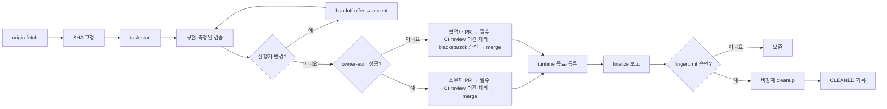
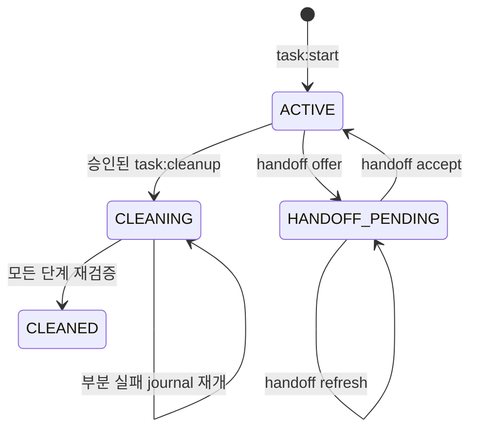

# AI 개발 파이프라인

| 항목 | 값 |
| --- | --- |
| 상태 | 활성 운영 정책 |
| owner | TALKPIK AI 저장소 작업 lifecycle |
| 적용 대상 | 사람, Codex, Claude가 수행하는 모든 개발 task |
| 정본 | 이 문서와 실행 가능한 `package.json` 명령·contract test |
| 마지막 검토 | 2026-07-22 |

이 문서는 AI 개발 작업의 시작, 인수인계, 검증, 종료와 정리를 한 흐름으로 정의한다. `AGENTS.md`는 공통 행동 계약이고, 이 문서는 branch·worktree·registry·산출물·정리의 세부 workflow owner다.

## 용어와 불변 조건

| 용어 | 뜻 | 지켜야 할 조건 |
| --- | --- | --- |
| task | 한 가지 목적을 가진 변경 단위 | 한 task는 한 branch와 한 worktree만 소유한다. |
| 기준 checkout | `origin/main`을 확인하고 task를 시작하는 공유 저장소 | 다른 task를 위해 branch를 바꾸거나 merge·rebase하지 않는다. |
| task worktree | task 전용 작업 폴더 | 기준 checkout의 `.worktrees/<type>-<slug>`에만 둔다. |
| lifecycle registry v2 | 도구와 무관한 task 상태 기록 | Git common directory의 `talkpik-task-lifecycle/v2/`에 둔다. secret·token·원문 thread ID를 기록하지 않는다. |
| fingerprint | 특정 시점의 Git·PR·runtime·정리 후보를 묶은 SHA-256 승인값 | 상태가 달라지면 기존 정리 승인은 무효다. |

branch는 다음 형식만 허용한다.

```text
feat|fix|refactor|test|docs|chore|ci/<kebab-slug>
```

예: `feat/writing-feedback`, `fix/oauth-callback`, `chore/ai-development-pipeline`. `codex/…`, `claude/…`처럼 도구 이름을 branch 소유권으로 사용하지 않는다. 누가 수행하든 같은 task record를 이어 쓴다.

## 전체 흐름



핵심은 시작할 때 기준 SHA를 고정하고, 끝날 때는 먼저 삭제 가능성만 보고한 다음 사용자가 승인한 동일 상태만 비강제로 정리하는 것이다.

## 명령 사용법

모든 예시는 기준 checkout 또는 해당 task worktree의 절대 경로를 사용한다. `--actor`는 `codex`, `claude`, `manual` 중 하나다.

### 시작과 상태 확인

```bash
pnpm task:start -- --repo <기준-checkout> --branch feat/example-task --actor codex
pnpm task:status -- --repo <기준-checkout-or-worktree> --branch feat/example-task
```

`task:start`은 다음을 한 묶음으로 수행한다.

1. 기준 checkout과 Git common directory가 안전한 실제 경로인지 확인한다.
2. 기준 checkout이 clean인지, branch·worktree·registry가 중복되지 않는지 확인한다.
3. `git fetch --prune origin`을 실행한다.
4. 조회한 `origin/main` SHA를 record에 고정한다. `--base-sha <sha>`가 있으면 일치해야 한다.
5. 고정 SHA에서 branch와 `.worktrees/<type>-<slug>` worktree를 만든다.

fetch 실패, stale base, dirty 기준 checkout, 이름 중복, 기존 native worktree 소유권 충돌은 fail-closed다. 공유 `main`에서는 `pull`, `merge`, `rebase`, `switch`, `checkout`, `reset`을 실행하지 않는다.

worktree가 만들어진 직후 프로세스가 중단되면 `StartRecoveryV1` 기록이 남는다. 같은 실행자가 같은 branch·경로·기준 SHA로 `task:start`을 다시 실행했을 때만 복구를 시도한다. 실행 복구와 `task:status`는 같은 read-only 진단기로 missing·dirty·detached·wrong branch·wrong HEAD·native ownership·remote branch 충돌을 확인한다. 원격 branch 부재 확인은 최대 5초로 제한하며 시간 안에 증명하지 못하면 `REMOTE_EVIDENCE_UNAVAILABLE`로 불확실성을 명시한다. 모든 조건을 확인한 뒤에만 기존 worktree를 TaskRecord에 연결하며, 하나라도 불명확하면 파일이나 branch를 삭제하지 않는다.

`task:status`는 기존 원본 record와 함께 사람이 읽는 `summary`, 전체 `blockers`, 실행할 명령 하나만 담은 `nextAction`을 출력한다. 출력하는 PowerShell 명령의 경로는 공백과 작은따옴표가 있어도 그대로 복사해 실행할 수 있게 인용한다. 작업 시작이 중단되어 아직 `TaskRecordV2`가 없는 경우에도 복구 안내를 읽을 수 있다.

### Codex ↔ Claude 인수인계

```bash
pnpm task:handoff -- --action offer --repo <task-worktree> --branch feat/example-task --actor codex --to claude --context <task-worktree>/.codex/work/example-task/handoff.json
pnpm task:handoff -- --action accept --repo <task-worktree> --branch feat/example-task --actor claude
pnpm task:handoff -- --action refresh --repo <task-worktree> --branch feat/example-task --actor codex --context <task-worktree>/.codex/work/example-task/handoff.json
```

`offer`는 현재 실행자만 사용할 수 있으며 `objective`, `completed`, `decisions`, `remaining`, `verification`, `blockers`, `nextAction`만 담은 JSON 문서가 필요하다. 입력 파일은 해당 task의 `.codex/work/<slug>/` 아래 일반 파일이어야 한다. lexical·canonical 경로가 모두 그 안에 있어야 하고 symlink·junction·reparse 조상을 통과할 수 없다. 모든 작업 맥락 문자열은 GitHub·OpenAI·AWS credential, private key, Bearer token, 명시적으로 표시된 thread·session·conversation ID와 `/threads/<ID>` 값을 거부한다. 일반 UUID, 짧은 `token` 단어와 라벨 없는 hash는 허용한다. 명령은 worktree를 새로 만들지 않고 현재 HEAD·파일 상태를 `HandoffSnapshot`에, 작업 맥락을 별도 `HandoffContextV1`에 fingerprint와 함께 저장한다. 상태가 `HANDOFF_PENDING`인 동안에는 두 실행자의 동시 수정을 막는다.

지정된 다음 실행자만 `accept`할 수 있다. 새 공개 `accept`는 context sidecar가 누락되면 실패하며 snapshot이나 context가 바뀌면 수락하지 않는다. `HANDOFF_PENDING`인데 context가 없으면 `task:status`는 `accept`를 안내하지 않는다. 대신 인수인계를 보낸 실행자가 `.codex/work/<slug>/handoff-context.json`을 준비해 `refresh`하도록 하나의 다음 명령만 안내한다. 인수인계를 보낸 실행자가 그 뒤 작업 폴더를 수정한 경우에도 `refresh`로 같은 대상에게 새 snapshot과 context를 만들고 revision을 올린다. `task:resume`은 기존 library·호출 호환을 위해 context가 없는 과거 snapshot도 읽는 명시적 호환 명령이며 사용 중단 안내를 stderr에 출력한다. 기본 상태 안내와 새 자동화는 반드시 `task:handoff --action accept`를 사용한다.

### runtime 등록

```bash
pnpm task:runtime -- --repo <task-worktree> --branch feat/example-task --ports 3101 --pids 12345 --locks C:\absolute\repo\.codex\work\example-task\server.lock
pnpm task:runtime -- --repo <task-worktree> --branch feat/example-task
```

runtime을 사용하지 않았어도 두 번째 예처럼 빈 상태를 명시적으로 등록한다. 포트·PID·lock은 task별 최대 32개다. lock 경로는 해당 worktree의 `.codex/work/<slug>/` 안의 절대 경로만 허용한다. worktree 자체가 포트나 프로세스를 격리하지 않으므로 병렬 runtime은 서로 다른 loopback port와 test data를 사용한다.

### GitHub 소유자 인증 사전 확인

외부 GitHub에 publish·approval·merge 작업을 하기 직전에 다음 명령으로 현재 계정이 저장소 소유자인지 확인한다. 이 저장소의 소유자는 `blackstarzck`이다.

```bash
pnpm task:owner-auth -- --repo <repo-or-worktree> --owner blackstarzck
pnpm task:owner-auth -- --repo <task-worktree> --branch feat/example-task --owner blackstarzck --publish-approved
```

명령은 먼저 `origin` URL에서 실제 소유자를 확인한 뒤 `gh api user`로 현재 로그인을 읽는다. 이미 `blackstarzck`이면 전역 계정을 바꾸지 않고 성공한다. 다른 계정이면 기본 호출은 `SWITCH_REQUIRED`와 `manualApprovalRequired: true`만 안전한 JSON으로 반환하며 `gh auth switch`를 실행하지 않는다. 첫 로그인 확인 자체가 실패하면 승인 없는 호출은 즉시 실패한다. 사용자가 원격 게시를 승인한 작업에서만 `--publish-approved`를 붙일 수 있고, 이 경우 첫 확인 실패도 저장된 소유자 계정으로 전환한 뒤 `gh api user`를 한 번만 다시 검증한다. 전환이나 재검증이 실패하면 중단한다. `--branch`를 함께 주면 성공 결과를 해당 task의 `OwnerAuthResultV1` sidecar로 남긴다.

token·인증 명령의 stdout·stderr는 결과에 포함하지 않으며 각 하위 명령은 30초가 지나면 실패한다. 성공 결과의 `manualApprovalRequired: false`는 계정 확인의 중복 절차만 생략한다는 뜻이다. 필수 CI와 review 의견 처리는 그대로 의무이며 어떤 인증 경로도 이를 우회할 수 없다.

### 파이프라인 소요 시간 측정

`task:start`, `task:status`, 인수인계, runtime, finish, finalize, cleanup과 `--branch`를 지정한 owner-auth는 별도 입력 없이 자동으로 시간을 기록한다. 10초 이상 걸릴 것으로 예상되는 setup·test·typecheck·lint·build·review·CI·publish 명령은 다음처럼 `task:measure`로 실행한다.

```bash
pnpm task:measure -- --repo <task-worktree> --branch feat/example-task --actor codex --phase test --scope focused --budget small-check -- pnpm vitest run tests/example.test.ts
pnpm task:measure -- --repo <task-worktree> --branch feat/example-task --actor codex --phase ci --scope full --budget full-ci -- pnpm test
pnpm task:metrics -- --repo <기준-checkout-or-worktree> --branch feat/example-task
```

`--` 뒤 명령은 shell 없이 해당 worktree에서 실행한다. 명령 원문·인자·환경 변수·stdout·stderr는 저장하지 않으며 원래 종료 코드를 그대로 반환한다. 잘못된 task·실행자·worktree는 자식 명령 실행 전에 차단한다. 소유권 확인 뒤 측정 저장소만 쓸 수 없는 경우에는 `TASK_METRIC_RECORDING_WARNING`을 출력하되 원래 명령을 실행하고 그 결과를 바꾸지 않는다. 예산 초과도 `TASK_METRIC_BUDGET_EXCEEDED` 경고와 보고서 집계만 만들며 test·CI·Git 안전 조건을 우회하거나 새 실패 조건이 되지 않는다.

| budget profile | 경고 기준 | 주 용도 |
| --- | ---: | --- |
| `lifecycle-fast` | 30초 | 자동 lifecycle 명령 |
| `setup` | 180초 | dependency·환경 준비 |
| `small-check` | 120초 | 영향 범위 검사 |
| `docs-ci` | 60초 | 문서 전용 CI |
| `full-ci` | 600초 | 전체 test·CI |
| `review` | 300초 | 독립 review 대기 |
| `publish` | 120초 | 인증·push·PR 게시 |

`task:metrics`는 저장소를 바꾸지 않는 report-only 명령이다. `commandTotalMs`는 각 명령 시간을 단순 합산하고, `measuredWallMs`는 서로 겹친 구간을 한 번만 센 실제 측정 구간이며, 그 차이를 `overlapMs`로 보여준다. 작업 사이의 사람 대기 시간이나 측정하지 않은 세션 공백은 포함하지 않는다. phase별 시도·실패·미완료·예산 초과도 함께 집계한다. 이 보고서 자체는 다시 측정하지 않는다.

측정 record는 Git common directory의 `talkpik-task-lifecycle/v2/metrics/<task-id>/<span-id>.json`에 `TaskMetricSpanV1`로 저장한다. 허용 필드가 닫혀 있고 fingerprint, task·branch, phase·scope, 시작·종료 시각, duration, 상태·exit code, PID, budget만 포함한다. actor는 저장하지 않고 실행 시 task registry와만 대조한다. symlink·junction·reparse·경로 탈출·fingerprint 변조·중복 span과 동시 완료 경쟁은 거부한다. 측정 파일은 task 상태, cleanup 승인 fingerprint와 삭제 후보, CI 성공 기준의 일부가 아니다.

GitHub Actions의 각 runner는 로컬 task registry를 공유하지 않으므로 job summary의 `service_time_seconds`를 별도로 남긴다. queue 시간은 runner 안에서 정확히 알 수 없어 GitHub run API에서 확인하며 추정값을 만들지 않는다.

### 종료 보고와 정리

```bash
pnpm task:finish -- --repo <task-worktree> --branch feat/example-task --actor codex
pnpm task:finalize -- --repo <기준-checkout-or-worktree> --branch feat/example-task
pnpm task:cleanup -- --repo <기준-checkout-or-worktree> --branch feat/example-task --approval <fingerprint>
```

`task:finish`는 구현을 끝낼 때 빠르게 실행하는 로컬 report-only 명령이다. 현재 실행자와 worktree branch·HEAD, 일반 Git status, upstream과 로컬 ahead/behind만 읽고 `FinishReportV1`을 저장한다. `node_modules`, `.next` 같은 ignored dependency tree를 열거하거나 해시하지 않으며 fetch, push, PR 조회·생성·merge, Git 수정, 파일 삭제를 하지 않는다. dirty 상태면 검증·커밋 준비를, clean이지만 미게시 상태면 게시 승인을 안내한다. 원격만 앞서면 fast-forward 한 명령을, 양쪽이 갈라졌으면 기록을 먼저 비교하고 사람이 merge·rebase 방식을 결정하는 한 명령을 제공한다. 정확한 `origin/<task-branch>`가 ahead 0·behind 0일 때만 게시 완료로 판단한다. 공백이 있는 Windows 경로도 복사 실행할 수 있도록 경로 인자를 안전하게 quote한다.

`task:finalize`는 삭제하지 않는 report-only 명령이다. `origin` fetch, task·worktree 소유권, clean 상태, HEAD와 branch·PR 일치, 게시하지 않은 commit, `main` 대상의 최신 merged PR, `origin/main` 포함 여부, remote task branch 부재, runtime 포트·PID·lock, operation lock, 정리 후보 경로를 확인한다. 확인할 수 없으면 준비 완료로 추정하지 않는다. 네트워크를 쓰는 `git fetch`, `git ls-remote`, `gh pr view`에만 각각 30초의 hard timeout을 적용하며, 시간 초과는 해당 원격 증거를 확인하지 못한 blocker로 처리한다. 로컬 Git 명령에는 이 timeout을 적용하지 않는다.

두 명령의 목적은 다르다. `finish`는 일상적인 작업 마감 안내를 빠르게 만들고, `finalize`는 실제 삭제 승인값을 만들기 위한 깊은 정리 사전 검사다. `finalize`와 `cleanup`은 주요 단계별 실제 소요 시간을 `timings`로 함께 출력한다. 이 시간은 진단 정보일 뿐 승인 fingerprint나 registry schema에는 포함하지 않는다.

`ready: true`이면 후보 목록과 fingerprint를 사용자에게 보고한다. 사용자가 그 fingerprint를 승인한 뒤에만 `task:cleanup`을 실행한다. GitHub가 초 단위로 주는 `mergedAt` 값은 동일한 UTC 시각의 밀리초 포함 형식으로 정규화해 기록하지만, 내부 registry가 받는 시간은 계속 밀리초까지 정확한 ISO 형식만 허용한다.

승인 fingerprint는 disposable root의 내용 전체가 아니라 정확한 root 경로·종류·device·inode·생성 시각 identity를 묶는다. 따라서 `node_modules`, `.next`, task 임시 로그 안의 내용 변화만으로 승인이 만료되지는 않는다. 반대로 root가 삭제 후 다시 생성되거나 symlink·junction으로 바뀌거나 identity를 안전하게 얻지 못하면 `APPROVAL_INVALIDATED` 또는 경로 안전 오류로 멈춘다. `tsconfig.tsbuildinfo`는 정확한 파일 하나만 disposable 후보로 허용한다. ignored 탐색은 directory 단위로 접고, `.codex/work/<slug>` 이외의 다른 task 폴더나 임의 ignored root가 있으면 보존한다.

정리 순서는 다음과 같다.

1. 각 task 소유 임시 산출물과 disposable build root의 identity를 확인하고 고유 quarantine claim을 journal에 기록
2. 원래 경로의 객체를 같은 파일시스템의 claim 경로로 원자 이동한 뒤 이동된 객체의 identity를 다시 확인하고 제거
3. 각 후보의 부재를 확인한 직후 claim 해제와 `candidateProgress`를 하나의 원자적 journal 갱신으로 기록
4. `git worktree remove` 비강제 실행
5. worktree가 목록에서 사라졌는지 재검증
6. `git branch -d` 비강제 실행
7. remote branch가 이미 삭제됐는지 확인
8. `CleanupManifest`에 `CLEANED` tombstone 기록

후보 정리 뒤 task 전용 quarantine claim 디렉터리가 비어 있으면 재개 과정과 worktree 제거 직전에 함께 제거한다. 다른 파일이나 다른 주체의 claim이 하나라도 있으면 그 디렉터리는 보존한다.

`--force`, `git branch -D`, 탐색기 선삭제, remote branch 강제 삭제는 제공하지 않는다. dirty·detached·locked·prunable·소유권 불명 worktree, active runtime, 열린 PR, 미병합 PR, 보호 branch, 게시되지 않은 commit은 그대로 보존한다.

Node의 비강제 재귀 삭제는 disposable root 내부의 symlink·junction 자체만 제거하고 외부 target을 따라가지 않는 조건을 Windows와 Unix 테스트로 고정한다. root 자체가 link인 경우에는 삭제하지 않는다. 다만 Unix의 bind mount나 별도 mount point는 일반 디렉터리와 같은 metadata로 보일 수 있어 완전히 식별할 수 없다. 이런 mount를 disposable root 내부에 두지 않는 것이 운영 조건이며, 의심되면 cleanup을 실행하지 않고 사람이 mount 상태를 먼저 확인한다.

GitHub의 squash merge는 PR head commit 자체가 `origin/main`의 조상이 아니므로 현재 자동 정리 조건을 충족하지 않는다. 이 경우 `PR_HEAD_NOT_IN_ORIGIN_MAIN`으로 보존하며, squash 대응 계약을 별도로 승인·구현하기 전에는 수동 삭제로 우회하지 않는다.

## registry와 상태 전이

```text
<git-common-dir>/talkpik-task-lifecycle/v2/
├── tasks/<task-id>.json
├── handoffs/<snapshot-id>.json
├── handoff-contexts/<snapshot-id>.json
├── start-recoveries/<task-id>.json
├── finish-reports/<task-id>.json
├── owner-auth/<task-id>.json
├── metrics/<task-id>/<span-id>.json
├── runtimes/<task-id>.json
└── cleanups/<task-id>.json
```

기존의 닫힌 `TaskRecordV2` 파일과 필드 의미는 바꾸지 않는다. 새 공개 sidecar는 `HandoffContextV1`, `StartRecoveryV1`, `FinishReportV1`, `OwnerAuthResultV1`, `TaskMetricSpanV1`로 분리한다. 모든 record는 허용 필드만 받고 크기·문자열·배열·시간·경로·fingerprint를 검증하며 원자적으로 교체한다. 같은 task의 새 finish·owner-auth sidecar 시간은 task와 직전 sidecar보다 과거일 수 없다. unknown field, secret·token·원문 thread ID와 유사한 key, prototype 오염, symlink·경로 탈출은 거부한다. 예전 Codex 전용 registry는 `task:status`에서 선택적으로 읽는 legacy hint일 뿐, v2 상태나 삭제 권한의 근거가 아니다.



`task:finalize`는 상태를 바꾸지 않는다. cleanup 중 일부 단계 이후 실패하면 `CLEANING` journal, 후보별 `candidateProgress`, 완료 단계가 남는다. 이 필드는 기존 manifest와 호환되는 선택 필드지만 새 cleanup은 항상 기록한다. 값은 승인된 후보의 순서와 정확히 같은 prefix여야 하며 중복·미승인 후보를 허용하지 않는다. 이동 중인 후보는 선택 필드 `currentClaim`에 원래 경로, 고유 quarantine 경로와 승인 digest를 기록한다. 이를 통해 claim 기록 전후, 원자 이동 후, quarantine 삭제 후 중단을 같은 승인으로 재개한다. 원래 경로와 quarantine이 동시에 존재하거나 quarantine identity가 달라졌거나 새 미승인·ignored root가 생기면 두 객체를 모두 보존하고 중단한다.

operation lock이 남아 있으면 다른 lifecycle 명령은 `TASK_OPERATION_IN_PROGRESS`로 실패한다. cleanup lock만 task ID, operation, PID, nonce, 승인 fingerprint, 생성 시각을 담은 닫힌 JSON record로 쓴다. 유효한 `CLEANING` journal의 task·branch·worktree·revision·state와 단계별 native Git 소유권이 현재 operation과 정확히 같고 record의 PID가 실행 중이 아닐 때만 stale cleanup lock 회수를 시도한다. 회수 대상은 고유 claim 경로로 먼저 원자 이동하고 이동된 identity와 내용을 재검증한 뒤에만 삭제한다. 그 사이 원래 경로에 새 lock이 생기거나 claim이 바뀌면 새 lock과 claim을 모두 보존한다. 정상 operation lock 해제도 같은 claim 절차를 쓴다. 회수 뒤에도 Git·PR·runtime·후보 identity 전체를 다시 확인한다. live PID, 기존 token 형식, malformed·unknown field, 다른 operation·task·승인, journal 없는 lock은 자동 제거하지 않는다.

## 산출물 정책

- 작업 중 plan, log, PID, 임시 script, 중간 screenshot은 ignored 경로 `.codex/work/<slug>/`에 둔다. Git에 추가하면 실패한다.
- `.tmp/`, `artifacts/`, `.scratch/`, `output/`의 기존 tracked 경로는 legacy baseline이다. 기존 파일은 삭제만 허용하며 내용 수정과 새 경로 추가는 금지한다.
- 저장소 root는 `config/artifact-hygiene-policy.json`의 allowlist만 허용한다. Windows 대소문자 변형, symlink·junction·reparse, 경로 탈출은 실패한다.
- 최종 승인된 증거만 `docs/qa/reports/<YYYY-MM-DD>-<slug>/`에 둔다. 폴더 안의 모든 새 파일은 `artifact-manifest.json`에 상대 경로, 목적, SHA-256을 등록한다.
- 단일 역사 보고서 Markdown은 `docs/qa/reports/<date>-<slug>.md`에 둘 수 있다. 이 보고서는 운영 정본이 아니다.

```bash
pnpm report:artifact-hygiene
pnpm check:artifact-hygiene
```

report는 위반을 보여주고, check는 위반이 있으면 실패한다. CI는 후보 branch 안의 검사기를 신뢰하지 않는다. 이벤트가 제공한 정확한 base SHA에서 trusted runner, checker, policy, library와 공용 manifest validator 다섯 파일을 `RUNNER_TEMP`의 workspace 밖으로 `git show`로 복원해 실행한다. 최초 도입처럼 base에 trusted 파일 다섯 개가 모두 없을 때만 PR base가 `origin/main`과 같고 partial base가 아닌 경우에 current runner의 `--allow-bootstrap` 경로를 허용한다.

최초 bootstrap CI의 외부 저장소 변수는 승인된 PR 후보 head SHA에 정확히 고정한다. GitHub는 PR 검사를 위해 후보 head와 base를 합친 임시 commit을 만들 수 있는데, 이를 합성 merge commit이라 한다. checkout의 `HEAD`가 이 합성 commit이면 후보 head와 raw SHA가 다른 것이 정상이므로 둘의 직접 일치는 의도적으로 요구하지 않는다. 대신 runner는 승인된 후보 commit이 `HEAD`에 포함되고, trusted runner·checker·policy·library·공용 validator 다섯 파일이 후보와 `HEAD`에서 모두 동일한 일반 blob일 때만 허용한다. 후보가 새 commit으로 바뀌면 이전 승인 SHA는 자동으로 효력을 잃는다. trusted surface가 `origin/main`에 설치된 뒤 다섯 파일 변경은 일반 PR에서 차단하며, 별도의 소유자 승인과 2단계 반영 절차로만 갱신한다.

같은 검증은 최초 설치 PR의 `merge_group`과 merge 직후 `main push`에도 한 번 적용한다. 이때 event base에는 trusted 파일이 하나도 없어야 하고 base와 승인 후보가 현재 GitHub event `HEAD`의 조상이어야 하며, 승인 후보 이후 trusted 다섯 파일의 mode와 blob이 바뀌지 않아야 한다. merge 뒤 다음 push부터는 base에 설치된 trusted runner를 사용하므로 이 one-time 경로는 닫힌다.

bootstrap target은 `origin/main`으로 고정한다. `pull_request.base.ref`는 정확히 `main`, `merge_group.base_ref`는 정확히 `refs/heads/main`이어야 하며, push workflow도 `branches: [main]`만 받는다. 다른 target은 승인 SHA가 같아도 실패한다.

## CI와 병렬 PR

CI는 `pull_request`, merge queue의 `merge_group`, `main` push에서 먼저 전체 Git diff를 분류한다. workflow 수준의 `paths`·`paths-ignore`와 GitHub PR files API는 사용하지 않는다. checkout은 전체 이력을 받고, PR은 base와 head의 merge base를 기준으로 한 3-dot diff, `merge_group`과 push는 base/before와 head 사이의 2-dot diff를 `git diff --name-status -z --no-renames --no-ext-diff --no-textconv --ignore-submodules=none`으로 읽는다.

분류기는 `run_app`, `run_pipeline_contracts`, `run_windows_lifecycle`, `changed_count`, `classification`을 출력한다. SHA·commit·merge base·diff·NUL record를 확인할 수 없거나 변경이 비어 있으면 전체 검증으로 되돌린다. 삭제, rename이 `--no-renames`로 풀린 삭제+추가, copy/type-change, symlink·gitlink, 예상 밖 file mode·status와 분류표에 없는 경로도 같은 방식으로 처리한다. 경로에 ASCII control·비ASCII 문자, Windows 금지 문자(`< > : " \\ | ? *`), 빈·`.`·`..` segment, 끝의 점·공백, 대소문자를 무시한 Windows device 이름(`CON`, `PRN`, `AUX`, `NUL`, `COM1`~`COM9`, `LPT1`~`LPT9`, `COM¹`~`COM³`, `LPT¹`~`LPT³`, 확장자 포함)이 있어 Windows checkout 안전을 증명할 수 없을 때도 전체 검증과 Windows lifecycle을 실행한다. Unicode 대소문자 충돌을 Linux Bash만으로 완전하게 증명하지 않고 비ASCII 경로를 보수적으로 처리한다. 또한 HEAD tree의 파일과 directory entry 경로를 NUL-safe로 한 번 읽고 ASCII 대소문자를 접은 전체 경로 identity가 중복되는지 확인한다. `docs/Guide.md`와 `docs/guide.md`, `docs/Foo.md` 파일과 `docs/foo.md/bar.md` directory처럼 Windows에서 충돌하는 경로가 있거나 tree 목록을 읽지 못하면 파일 내용은 열지 않고 `full-fallback` 처리한다.

| 변경 분류 | Linux에서 실행하는 검증 | Windows lifecycle |
| --- | --- | --- |
| 문서만 변경 | base 소유 UI·artifact 검사, project structure, agent skill 정책 | 건너뜀 |
| pipeline·lifecycle만 변경 | 위 신뢰 경계 검사 + 관련 lifecycle contract | 실행 |
| app·lock·config·workflow·혼합·불명확 | 위 신뢰 경계 검사 + typecheck, 전체 test, lint, build | 실행 |

문서만 바뀌어도 Linux `verify` 작업 자체는 실행하고 신뢰 경계 검사를 통과해야 한다. dependency 설치와 app 검증만 생략한다. pipeline-only 변경은 dependency를 설치한 뒤 관련 contract를 집중 실행한다. app 전체 검증의 `pnpm test`가 lifecycle contract도 포함하므로 같은 Linux contract를 별도로 중복 실행하지 않는다.

CI가 검사하는 계약은 다음과 같다.

1. trusted base 기반 UI·artifact diff 계약
2. project structure와 agent skill 정책
3. 기존 v1 report-only worktree lifecycle
4. v2 task lifecycle와 cleanup contract
5. typecheck, 전체 test, lint, build
6. Windows에서 v1과 v2·cleanup lifecycle contract

세 실행 경로의 결과는 후보 코드를 checkout하거나 package를 설치하지 않는 `CI required` 작업 하나로 모은다. 이 작업은 항상 실행되며 분류 작업과 선행 작업이 실패·취소되거나, 분류 output이 누락·변조되거나, 예상과 다르게 건너뛰어지면 실패한다.

| 실행 이벤트·분류 | Linux 검증 | Windows lifecycle | main 무결성 | `CI required` 결과 |
| --- | --- | --- | --- | --- |
| draft PR | 분류와 함께 건너뜀 | 건너뜀 | 건너뜀 | 성공 |
| ready PR·merge queue, 문서만 | 신뢰 경계 검사 성공 | 건너뜀 | 건너뜀 | 성공 |
| ready PR·merge queue, pipeline 또는 전체 | 집중 또는 전체 검증 성공 | 성공 | 건너뜀 | 성공 |
| `main` push | 분류 성공 뒤 건너뜀 | 건너뜀 | 경량 검사 성공 | 성공 |

`main` push의 `full`·`full-fallback` 분류는 감사와 fail-safe 집계용이다. PR 또는 merge queue에서 이미 전체 검증한 내용을 merge 직후 다시 실행하지 않고, push에서는 dependency 없는 경량 무결성만 실행한다. 표에 없는 이벤트, PR draft 상태 누락, 분류 결과·output 누락, 비정상 boolean 조합, 선행 작업 실패·취소·예상 밖 건너뜀은 모두 fail-closed 처리한다. 이 고정된 검사 이름 덕분에 이벤트마다 서로 다른 작업을 GitHub 보호 규칙에 직접 연결하지 않는다.

분류기와 `CI required` 집계기는 후보 workflow 안에 있으므로 후보가 두 코드를 함께 바꾸는 상황을 기술적으로 완전히 분리하지 못한다. 이를 독립적인 보안 경계라고 표현하지 않는다. `.github/`, `scripts/`, package·lock·config와 pipeline contract test는 `CODEOWNERS`에서 `blackstarzck` 소유로 묶고, workflow 변경 PR은 기존 필수 검사 아래에서 diff와 contract test를 소유자가 검토한 뒤 반영한다. base 소유 UI·artifact 검사는 이 절차와 별도로 후보 코드보다 먼저 계속 실행한다.

현재 ruleset에는 merge queue를 켜는 `merge_queue` rule이 없어 live `merge_group` 이벤트를 만들 수 없다. 따라서 현재 전환 gate는 다음처럼 나눈다.

| 이벤트 | 현재 전환 전 검증 | merge queue 활성화 뒤 검증 |
| --- | --- | --- |
| draft PR | 실제 GitHub Actions 실행 관찰 | 동일 |
| ready PR | 실제 GitHub Actions 실행 관찰 | 동일 |
| `main` push | 실제 GitHub Actions 실행 관찰 | 동일 |
| `merge_group` | `ci-trust-boundary` shell contract test | 실제 merge queue 실행 관찰을 필수로 추가 |

merge queue를 별도 승인으로 활성화하기 전에는 shell contract 통과를 live 검증으로 표현하지 않는다. 활성화할 때는 live `merge_group` 성공을 ruleset 변경과 rollback의 사전 관찰 조건에 추가한다.

PR이 병렬로 진행되면 각 PR과 merge queue가 최신 base SHA에서 다시 통과해야 한다. `origin/main`에는 다음 GitHub 보호 규칙이 활성화돼 있다. workflow 반영과 ruleset 변경은 서로 다른 변경 단계다.

| GitHub 설정 | 현재 운영 상태 |
| --- | --- |
| `Protect main - required PR and CI` (`18859824`) | strict 모드로 활성화. ruleset 전환 전 필수 check는 `typecheck / test / lint / build`, `report-only worktree lifecycle / windows` 두 개다. 전환 뒤에는 정확히 `CI required` 하나만 필수로 둔다. review thread 해결은 계속 필수다. |
| `Protect main - Code Owner review` (`18859832`) | 활성화. code owner 승인 1개가 필요하고 `blackstarzck`는 `always` 예외 actor다. 소유자 예외는 필수 CI와 review thread 처리가 끝난 뒤에만 사용한다. |
| merge queue | 현재 `merge_queue` rule이 없어 비활성. 이 pipeline 변경에서 함께 활성화하지 않는다. |
| merge 뒤 branch 자동 삭제 | `delete_branch_on_merge: true`로 활성화돼 있다. |

ruleset은 다음 순서로만 전환한다.

1. `CI required` workflow를 먼저 `main`에 반영한다. ruleset은 아직 기존 필수 check 두 개를 그대로 사용한다.
2. draft PR, ready PR, `main` push의 live 결과와 `merge_group` shell contract가 위 표대로 모두 성공하는지 확인한다. merge queue가 나중에 활성화돼 있으면 live `merge_group`도 반드시 확인한다. 하나라도 누락·실패하면 전환하지 않고 기존 검사 아래에서 workflow 수정 PR을 처리한다.
3. 전환 직전 ruleset 전체 payload를 다시 조회한다. 기존 `required_status_checks` 배열은 순서와 각 객체의 모든 값을 그대로 보존하고, 예상한 다른 보호 설정도 같은지 확인한다. 조회 응답을 update endpoint가 받는 필드만 값 손실 없이 정규화한 정확한 payload를 `.codex/work/<slug>/ruleset-rollback.json`에 rollback snapshot으로 보관한다. 읽기 전용 응답 metadata와 인증 정보는 snapshot에 넣지 않는다.
4. 전환 직전 성공한 `CI required` check run을 다시 조회해 check 이름과 `app.id`를 확인한다. 현재 관찰값은 GitHub Actions app ID `15368`이지만 고정 추정하지 않는다. 값이 없거나 `15368`과 다르면 fail-closed하고 `PUT`을 실행하지 않는다.
5. snapshot과 같되 필수 check 목록만 기존 배열에서 정확히 `[{"context":"CI required","integration_id":15368}]`로 바꾼 payload를 준비한다. 같은 ruleset endpoint에 한 번의 `PUT`을 보내 원자적으로 교체하며, 새 검사를 추가한 뒤 별도 요청에서 기존 검사를 제거하는 2단계 전환은 사용하지 않는다.
6. 즉시 ruleset을 다시 조회해 필수 check 객체의 `context`와 `integration_id`가 각각 정확히 `CI required`, `15368`이고 나머지 설정은 snapshot과 같은지 확인한다. 최신 `main` 기준 ready PR에서도 새 필수 검사가 실제로 병합을 보호하는지 확인한다.

전환 뒤 `CI required`가 누락·실패하거나 ruleset 조회 결과가 예상과 다르면 다음 순서로 원자적으로 rollback한다.

1. 같은 ruleset endpoint에 rollback snapshot 전체를 한 번의 `PUT`으로 보낸다. 이 요청 하나에서 기존 필수 check 두 개를 다시 추가하고 `CI required`를 제거한다.
2. ruleset을 다시 조회해 기존 `required_status_checks` 배열의 순서·객체 값과 다른 보호 설정이 snapshot과 정확히 같은지 확인한다.
3. 복구된 기존 검사 아래에서 workflow 수정 PR을 검증하고 병합한다.
4. draft PR, ready PR, `main` push의 live 결과와 `merge_group` shell contract를 모두 다시 확인한다. merge queue가 활성화돼 있으면 live `merge_group`도 다시 관찰한다.
5. 모든 결과가 정상일 때 최신 ruleset payload를 새 snapshot으로 잡고 전환 절차를 처음부터 다시 시작한다.

이 전환과 rollback은 필수 검사 공백이나 세 검사가 동시에 장기간 필수가 되는 중간 상태를 만들지 않는다. snapshot이 없거나 현재 payload가 사전 확인값과 다르면 `PUT`을 실행하지 않는다. workflow PR 자체는 GitHub ruleset을 수정하지 않으며, 외부 설정 변경은 사용자 승인과 실제 검사 관찰 뒤 별도로 수행한다.

production에 즉시 노출되는 `collab` remote는 이 pipeline의 fetch, CI target, merge, cleanup 대상이 아니다.

## 실패 복구와 Git 승인 경계

| 상황 | 안전한 대응 |
| --- | --- |
| fetch·GitHub PR 조회 실패 | 최신 상태를 추정하지 않고 보존한다. 네트워크·인증 복구 후 finalize를 다시 실행한다. |
| 소유자 인증 불가·불일치 | 소유자 예외 경로로 진행하지 않는다. 협업자가 PR을 연 뒤 필수 CI·review 의견을 처리하고, 마지막에 `blackstarzck` 승인을 받아 merge한다. |
| 새 commit 뒤 bootstrap 승인 SHA가 오래됨 | 이전 SHA로 재실행하지 않는다. 새 PR 후보 head를 검토한 뒤 외부 저장소 변수를 그 정확한 SHA로 다시 승인·설정한다. |
| handoff fingerprint 변경 | 이전 snapshot을 쓰지 않는다. 변경 소유자를 확인하고 원 실행자가 `--action refresh`로 같은 대상에게 새 인수인계를 만든다. |
| 시작 직후 프로세스 중단 | branch나 worktree를 지우지 않는다. `task:status`의 소유권·상태 안내를 확인하고 같은 실행자가 같은 `task:start`을 재실행한다. |
| runtime active | server·watcher를 정상 종료하고 빈 runtime 상태를 다시 등록한다. |
| approval 만료 | cleanup을 재시도하지 말고 finalize의 새 fingerprint를 다시 보고·승인받는다. |
| cleanup 부분 실패 | journal과 실제 Git 목록을 읽고, 같은 승인값으로만 재개한다. 강제 정리하지 않는다. |
| stale operation lock 의심 | process·task·lock 소유권을 먼저 확인한다. 불명확하면 보존하고 owner에게 이관한다. |

stage, commit, push, PR 생성, merge, 활성 ruleset 변경, head branch 자동 삭제, bootstrap worktree 제거는 각각 사용자 요청 또는 결과 보고 후 승인된 범위에서만 수행한다. `origin/main`은 PR과 활성 필수 검사를 거치며, `collab`은 사용자가 정확히 배포 의도까지 명시하고 별도 확인하기 전에는 건드리지 않는다.
