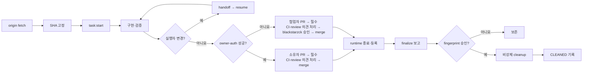
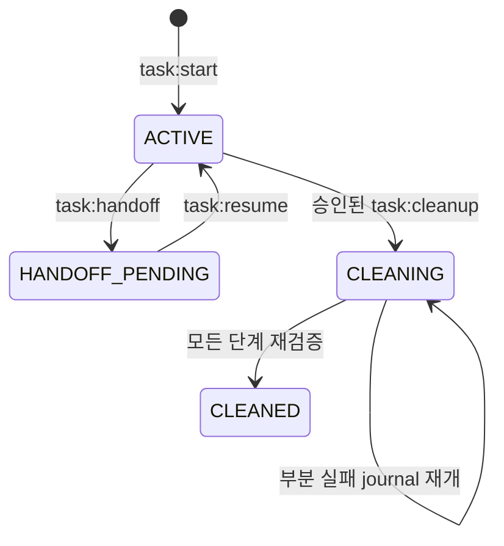

# AI 개발 파이프라인

| 항목 | 값 |
| --- | --- |
| 상태 | 활성 운영 정책 |
| owner | TALKPIK AI 저장소 작업 lifecycle |
| 적용 대상 | 사람, Codex, Claude가 수행하는 모든 개발 task |
| 정본 | 이 문서와 실행 가능한 `package.json` 명령·contract test |
| 마지막 검토 | 2026-07-21 |

이 문서는 AI 개발 작업의 시작, 인수인계, 검증, 종료와 정리를 한 흐름으로 정의한다. `AGENTS.md`는 공통 행동 계약이고, 이 문서는 branch·worktree·registry·산출물·정리의 세부 workflow owner다.

## 용어와 불변 조건

| 용어 | 뜻 | 지켜야 할 조건 |
| --- | --- | --- |
| task | 한 가지 목적을 가진 변경 단위 | 한 task는 한 branch와 한 worktree만 소유한다. |
| 기준 checkout | `origin/main`을 확인하고 task를 시작하는 공유 저장소 | 다른 task를 위해 branch를 바꾸거나 merge·rebase하지 않는다. |
| task worktree | task 전용 작업 폴더 | 기준 checkout의 `.worktrees/<type>-<slug>`에만 둔다. |
| lifecycle registry v2 | 도구와 무관한 task 상태 기록 | Git common directory의 `talkpik-task-lifecycle/v2/`에 둔다. secret·token·원문 thread ID를 기록하지 않는다. |
| fingerprint | 특정 시점의 Git·PR·runtime·정리 후보를 묶은 SHA-256 승인값 | 상태가 달라지면 기존 정리 승인은 무효다. |

branch는 다음 형식만 허용한다.

```text
feat|fix|refactor|test|docs|chore|ci/<kebab-slug>
```

예: `feat/writing-feedback`, `fix/oauth-callback`, `chore/ai-development-pipeline`. `codex/…`, `claude/…`처럼 도구 이름을 branch 소유권으로 사용하지 않는다. 누가 수행하든 같은 task record를 이어 쓴다.

## 전체 흐름



핵심은 시작할 때 기준 SHA를 고정하고, 끝날 때는 먼저 삭제 가능성만 보고한 다음 사용자가 승인한 동일 상태만 비강제로 정리하는 것이다.

## 명령 사용법

모든 예시는 기준 checkout 또는 해당 task worktree의 절대 경로를 사용한다. `--actor`는 `codex`, `claude`, `manual` 중 하나다.

### 시작과 상태 확인

```bash
pnpm task:start -- --repo <기준-checkout> --branch feat/example-task --actor codex
pnpm task:status -- --repo <기준-checkout-or-worktree> --branch feat/example-task
```

`task:start`은 다음을 한 묶음으로 수행한다.

1. 기준 checkout과 Git common directory가 안전한 실제 경로인지 확인한다.
2. 기준 checkout이 clean인지, branch·worktree·registry가 중복되지 않는지 확인한다.
3. `git fetch --prune origin`을 실행한다.
4. 조회한 `origin/main` SHA를 record에 고정한다. `--base-sha <sha>`가 있으면 일치해야 한다.
5. 고정 SHA에서 branch와 `.worktrees/<type>-<slug>` worktree를 만든다.

fetch 실패, stale base, dirty 기준 checkout, 이름 중복, 기존 native worktree 소유권 충돌은 fail-closed다. 공유 `main`에서는 `pull`, `merge`, `rebase`, `switch`, `checkout`, `reset`을 실행하지 않는다.

### Codex ↔ Claude 인수인계

```bash
pnpm task:handoff -- --repo <task-worktree> --branch feat/example-task --actor codex --to claude
pnpm task:resume -- --repo <task-worktree> --branch feat/example-task --actor claude
```

`handoff`는 worktree를 새로 만들지 않는다. 현재 HEAD와 worktree 상태 fingerprint를 `HandoffSnapshot`으로 기록하고 상태를 `HANDOFF_PENDING`으로 바꾼다. 이때 active actor는 비워 동시 수정을 막는다. 지정된 다음 실행자만 `resume`할 수 있고, snapshot 이후 상태가 바뀌면 resume는 실패한다.

### runtime 등록

```bash
pnpm task:runtime -- --repo <task-worktree> --branch feat/example-task --ports 3101 --pids 12345 --locks C:\absolute\repo\.codex\work\example-task\server.lock
pnpm task:runtime -- --repo <task-worktree> --branch feat/example-task
```

runtime을 사용하지 않았어도 두 번째 예처럼 빈 상태를 명시적으로 등록한다. 포트·PID·lock은 task별 최대 32개다. lock 경로는 해당 worktree의 `.codex/work/<slug>/` 안의 절대 경로만 허용한다. worktree 자체가 포트나 프로세스를 격리하지 않으므로 병렬 runtime은 서로 다른 loopback port와 test data를 사용한다.

### GitHub 소유자 인증 사전 확인

외부 GitHub에 publish·approval·merge 작업을 하기 직전에 다음 명령으로 현재 계정이 저장소 소유자인지 확인한다. 이 저장소의 소유자는 `blackstarzck`이다.

```bash
pnpm task:owner-auth -- --repo <repo-or-worktree> --owner blackstarzck
```

명령은 `origin` URL에서 실제 소유자를 확인하고 입력한 소유자와 일치할 때만 `gh auth switch`를 시도한 뒤, `gh api user`로 현재 로그인을 다시 검증한다. token을 직접 읽거나 출력하지 않으며, 각 Git·GitHub 하위 명령은 30초가 지나면 실패한다.

성공 결과의 `manualApprovalRequired: false`는 이미 소유자 계정임을 사람이 한 번 더 확인하는 중복 절차만 생략한다는 뜻이다. 필수 CI 통과와 review 의견 처리는 그대로 의무다. 인증을 바꿀 수 없거나 소유자가 일치하지 않으면 fail-closed로 소유자 예외 경로를 닫는다. 이때 협업자는 PR을 연 뒤 필수 CI와 review 의견을 모두 처리하고, 그 다음 `blackstarzck`의 승인을 받아야 merge할 수 있다. 어떤 경로도 CI나 review를 우회할 수 없다.

### 종료 보고와 정리

```bash
pnpm task:finalize -- --repo <기준-checkout-or-worktree> --branch feat/example-task
pnpm task:cleanup -- --repo <기준-checkout-or-worktree> --branch feat/example-task --approval <fingerprint>
```

`task:finalize`는 삭제하지 않는 report-only 명령이다. `origin` fetch, task·worktree 소유권, clean 상태, HEAD와 branch·PR 일치, 게시하지 않은 commit, `main` 대상의 최신 merged PR, `origin/main` 포함 여부, remote task branch 부재, runtime 포트·PID·lock, operation lock, 정리 후보 경로를 확인한다. 확인할 수 없으면 준비 완료로 추정하지 않는다.

`ready: true`이면 후보 목록과 fingerprint를 사용자에게 보고한다. 사용자가 그 fingerprint를 승인한 뒤에만 `task:cleanup`을 실행한다. cleanup은 상태를 다시 확인하므로 파일, commit, PR, runtime, 정리 후보가 달라지면 `APPROVAL_INVALIDATED`로 멈춘다.

정리 순서는 다음과 같다.

1. task 소유 임시 산출물과 disposable build 결과 제거
2. `git worktree remove` 비강제 실행
3. worktree가 목록에서 사라졌는지 재검증
4. `git branch -d` 비강제 실행
5. remote branch가 이미 삭제됐는지 확인
6. `CleanupManifest`에 `CLEANED` tombstone 기록

`--force`, `git branch -D`, 탐색기 선삭제, remote branch 강제 삭제는 제공하지 않는다. dirty·detached·locked·prunable·소유권 불명 worktree, active runtime, 열린 PR, 미병합 PR, 보호 branch, 게시되지 않은 commit은 그대로 보존한다.

GitHub의 squash merge는 PR head commit 자체가 `origin/main`의 조상이 아니므로 현재 자동 정리 조건을 충족하지 않는다. 이 경우 `PR_HEAD_NOT_IN_ORIGIN_MAIN`으로 보존하며, squash 대응 계약을 별도로 승인·구현하기 전에는 수동 삭제로 우회하지 않는다.

## registry와 상태 전이

```text
<git-common-dir>/talkpik-task-lifecycle/v2/
├── tasks/<task-id>.json
├── handoffs/<snapshot-id>.json
├── runtimes/<task-id>.json
└── cleanups/<task-id>.json
```

공개 record는 `TaskRecordV2`, `HandoffSnapshot`, `ArtifactManifest`, `RuntimeManifest`, `CleanupManifest`로 구분한다. record는 허용 필드만 받으며 경로·크기·시간·fingerprint를 검증하고 원자적으로 교체한다. 예전 Codex 전용 registry는 `task:status`에서 선택적으로 읽는 legacy hint일 뿐, v2 상태나 삭제 권한의 근거가 아니다.



`task:finalize`는 상태를 바꾸지 않는다. cleanup 중 일부 단계 이후 실패하면 `CLEANING` journal과 완료 단계가 남는다. 동일 fingerprint로 재실행할 때만 완료된 단계를 검증하며 이어간다.

operation lock이 남아 있으면 다른 lifecycle 명령은 `TASK_OPERATION_IN_PROGRESS`로 실패한다. stale lock으로 의심해도 자동 삭제하지 않는다. 실행 중인 lifecycle process가 없고 정확한 task·lock 소유권이 확인된 뒤, 사용자 승인 하에 해당 lock 하나만 복구 대상으로 다룬다. 원인을 확인하지 못하면 task를 보존한다.

## 산출물 정책

- 작업 중 plan, log, PID, 임시 script, 중간 screenshot은 ignored 경로 `.codex/work/<slug>/`에 둔다. Git에 추가하면 실패한다.
- `.tmp/`, `artifacts/`, `.scratch/`, `output/`의 기존 tracked 경로는 legacy baseline이다. 기존 파일은 삭제만 허용하며 내용 수정과 새 경로 추가는 금지한다.
- 저장소 root는 `config/artifact-hygiene-policy.json`의 allowlist만 허용한다. Windows 대소문자 변형, symlink·junction·reparse, 경로 탈출은 실패한다.
- 최종 승인된 증거만 `docs/qa/reports/<YYYY-MM-DD>-<slug>/`에 둔다. 폴더 안의 모든 새 파일은 `artifact-manifest.json`에 상대 경로, 목적, SHA-256을 등록한다.
- 단일 역사 보고서 Markdown은 `docs/qa/reports/<date>-<slug>.md`에 둘 수 있다. 이 보고서는 운영 정본이 아니다.

```bash
pnpm report:artifact-hygiene
pnpm check:artifact-hygiene
```

report는 위반을 보여주고, check는 위반이 있으면 실패한다. CI는 후보 branch 안의 검사기를 신뢰하지 않는다. 이벤트가 제공한 정확한 base SHA에서 trusted runner, checker, policy, library와 공용 manifest validator 다섯 파일을 `RUNNER_TEMP`의 workspace 밖으로 `git show`로 복원해 실행한다. 최초 도입처럼 base에 trusted 파일 다섯 개가 모두 없을 때만 PR base가 `origin/main`과 같고 partial base가 아닌 경우에 current runner의 `--allow-bootstrap` 경로를 허용한다.

최초 bootstrap CI의 외부 저장소 변수는 승인된 PR 후보 head SHA에 정확히 고정한다. GitHub는 PR 검사를 위해 후보 head와 base를 합친 임시 commit을 만들 수 있는데, 이를 합성 merge commit이라 한다. checkout의 `HEAD`가 이 합성 commit이면 후보 head와 raw SHA가 다른 것이 정상이므로 둘의 직접 일치는 의도적으로 요구하지 않는다. 대신 runner는 승인된 후보 commit이 `HEAD`에 포함되고, trusted runner·checker·policy·library·공용 validator 다섯 파일이 후보와 `HEAD`에서 모두 동일한 일반 blob일 때만 허용한다. 후보가 새 commit으로 바뀌면 이전 승인 SHA는 자동으로 효력을 잃는다. trusted surface가 `origin/main`에 설치된 뒤 다섯 파일 변경은 일반 PR에서 차단하며, 별도의 소유자 승인과 2단계 반영 절차로만 갱신한다.

같은 검증은 최초 설치 PR의 `merge_group`과 merge 직후 `main push`에도 한 번 적용한다. 이때 event base에는 trusted 파일이 하나도 없어야 하고 base와 승인 후보가 현재 GitHub event `HEAD`의 조상이어야 하며, 승인 후보 이후 trusted 다섯 파일의 mode와 blob이 바뀌지 않아야 한다. merge 뒤 다음 push부터는 base에 설치된 trusted runner를 사용하므로 이 one-time 경로는 닫힌다.

bootstrap target은 `origin/main`으로 고정한다. `pull_request.base.ref`는 정확히 `main`, `merge_group.base_ref`는 정확히 `refs/heads/main`이어야 하며, push workflow도 `branches: [main]`만 받는다. 다른 target은 승인 SHA가 같아도 실패한다.

## CI와 병렬 PR

CI는 `pull_request`, merge queue의 `merge_group`, `main` push에서 다음을 검사한다.

1. trusted base 기반 UI·artifact diff 계약
2. project structure와 agent skill 정책
3. 기존 v1 report-only worktree lifecycle
4. v2 task lifecycle와 cleanup contract
5. typecheck, 전체 test, lint, build
6. Windows에서 v1과 v2·cleanup lifecycle contract

PR이 병렬로 진행되면 각 PR과 merge queue가 최신 base SHA에서 다시 통과해야 한다. `origin/main`에는 다음 GitHub 보호 규칙이 활성화돼 있다.

| GitHub 설정 | 현재 운영 상태 |
| --- | --- |
| `Protect main - required PR and CI` (`18859824`) | strict 모드로 활성화. 필수 check는 정확히 `typecheck / test / lint / build`, `report-only worktree lifecycle / windows` 두 개이며 review thread 해결도 필수다. |
| `Protect main - Code Owner review` (`18859832`) | 활성화. code owner 승인 1개가 필요하고 `blackstarzck`는 `always` 예외 actor다. 소유자 예외는 필수 CI와 review thread 처리가 끝난 뒤에만 사용한다. |
| merge 뒤 branch 자동 삭제 | `delete_branch_on_merge: false`로 비활성화돼 있으며, 저장소 설정 중 이 항목만 별도 적용 대기다. |

production에 즉시 노출되는 `collab` remote는 이 pipeline의 fetch, CI target, merge, cleanup 대상이 아니다.

## 실패 복구와 Git 승인 경계

| 상황 | 안전한 대응 |
| --- | --- |
| fetch·GitHub PR 조회 실패 | 최신 상태를 추정하지 않고 보존한다. 네트워크·인증 복구 후 finalize를 다시 실행한다. |
| 소유자 인증 불가·불일치 | 소유자 예외 경로로 진행하지 않는다. 협업자가 PR을 연 뒤 필수 CI·review 의견을 처리하고, 마지막에 `blackstarzck` 승인을 받아 merge한다. |
| 새 commit 뒤 bootstrap 승인 SHA가 오래됨 | 이전 SHA로 재실행하지 않는다. 새 PR 후보 head를 검토한 뒤 외부 저장소 변수를 그 정확한 SHA로 다시 승인·설정한다. |
| handoff fingerprint 변경 | 이전 snapshot을 쓰지 않는다. 변경 소유자를 확인하고 원 실행자가 새 handoff를 만든다. |
| runtime active | server·watcher를 정상 종료하고 빈 runtime 상태를 다시 등록한다. |
| approval 만료 | cleanup을 재시도하지 말고 finalize의 새 fingerprint를 다시 보고·승인받는다. |
| cleanup 부분 실패 | journal과 실제 Git 목록을 읽고, 같은 승인값으로만 재개한다. 강제 정리하지 않는다. |
| stale operation lock 의심 | process·task·lock 소유권을 먼저 확인한다. 불명확하면 보존하고 owner에게 이관한다. |

stage, commit, push, PR 생성, merge, 활성 ruleset 변경, head branch 자동 삭제, bootstrap worktree 제거는 각각 사용자 요청 또는 결과 보고 후 승인된 범위에서만 수행한다. `origin/main`은 PR과 활성 필수 검사를 거치며, `collab`은 사용자가 정확히 배포 의도까지 명시하고 별도 확인하기 전에는 건드리지 않는다.
