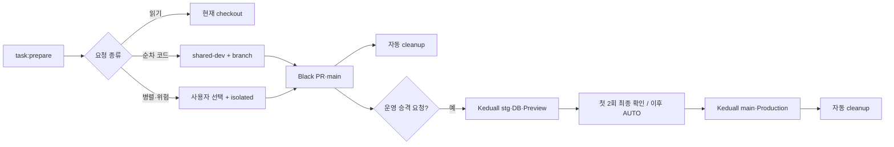
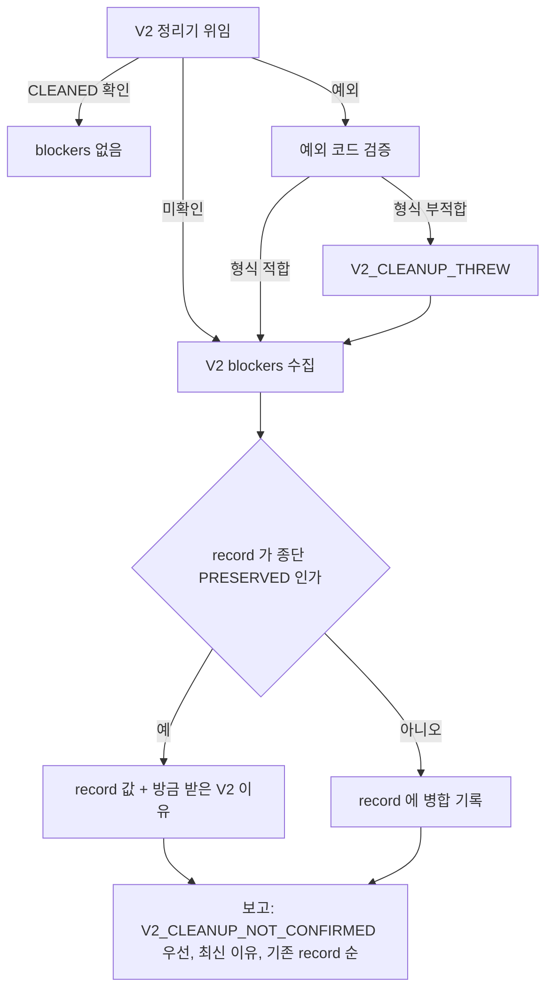
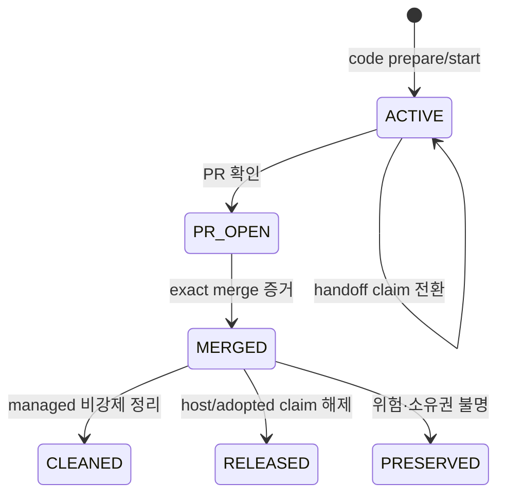

# AI 개발·운영 승격·자동 정리 파이프라인 v3.1

| 항목 | 값 |
| --- | --- |
| 상태 | 활성 운영 정책 |
| owner | TALKPIK AI 저장소 작업 lifecycle |
| 적용 대상 | 사람, Codex, Claude가 수행하는 모든 개발 task |
| 정본 | 이 문서와 실행 가능한 `package.json` 명령·contract test |
| 마지막 검토 | 2026-07-24 |

이 문서는 AI 개발 작업의 시작, Codex↔Claude 인수인계, Black 개발 저장소 검증, Keduall 운영 승격, Vercel 배포와 자동 정리를 한 흐름으로 정의하는 유일한 세부 workflow owner다. `AGENTS.md`의 workflow 계약, 이 문서, 실행 명령과 contract test는 같은 변경 묶음에서 함께 바뀌어야 한다. 대화 방식처럼 workflow와 무관한 `AGENTS.md` 변경은 이 결합 검사 대상이 아니다.

## 용어와 불변 조건

| 용어 | 뜻 | 지켜야 할 조건 |
| --- | --- | --- |
| task | 한 가지 목적을 가진 변경 단위 | branch와 workspace는 요청 종류에 따라 선택하며 task identity와 분리한다. |
| 기준 checkout | `origin/main`을 확인하고 task를 시작하는 공유 저장소 | 다른 task를 위해 branch를 바꾸거나 merge·rebase하지 않는다. |
| shared slot | 작은 순차 코드 작업이 재사용하는 `.worktrees/shared-dev` | 한 번에 task 하나만 claim하며 task가 끝나도 폴더는 유지한다. |
| isolated workspace | 병렬·장기·위험 작업용 관리 worktree | 사용자 선택 뒤 `.worktrees/<type>-<slug>`에 만들며 병합 뒤 비강제 정리한다. |
| host/adopted workspace | Codex·Claude·사람이 이미 연 작업 공간 | claim과 task 산출물만 관리하고 폴더·Git ref는 보존한다. |
| lifecycle registry v3 | task와 선택적 branch·workspace를 분리한 도구 중립 기록 | Git common directory의 `talkpik-task-lifecycle/v3/`에 두고 secret·token·원문 thread ID를 기록하지 않는다. |
| PromotionRunV1 | Black source부터 Keduall `main`·Vercel까지 추적하는 별도 승격 기록 | 개발 task와 분리하고 SHA·digest·deployment identity·승인 mode만 저장한다. |
| fingerprint | 특정 시점의 Git·PR·runtime·정리 후보를 묶은 SHA-256 승인값 | 상태가 달라지면 기존 정리 승인은 무효다. |
| Keduall production target | 이 checkout의 `collab/main`, 즉 `keduall/topik-project-v13`의 `refs/heads/main` | Keduall 저장소를 직접 clone한 checkout의 `origin/main`과 같은 ref다. 이 checkout의 `origin/main`과는 다른 저장소다. |

branch는 다음 형식만 허용한다.

```text
feat|fix|refactor|test|docs|chore|ci/<kebab-slug>
```

예: `feat/writing-feedback`, `fix/oauth-callback`, `chore/ai-development-pipeline`. `codex/…`, `claude/…`처럼 도구 이름을 branch 소유권으로 사용하지 않는다. 누가 수행하든 같은 task record를 이어 쓴다.

## 전체 흐름



질문·조사·리뷰에는 Git 자원을 만들지 않는다. 작은 순차 작업마다 새 폴더를 만들지 않고, 병렬성이 실제로 필요할 때만 별도 worktree를 선택한다. production은 Black `main` 병합만으로 시작되지 않고 사용자의 명시적 승격 요청으로만 시작한다.

## 명령 사용법

모든 예시는 기준 checkout 또는 해당 task worktree의 절대 경로를 사용한다. `--actor`는 `codex`, `claude`, `manual` 중 하나다.

### 준비·시작·상태 확인

```bash
pnpm task:prepare -- --repo <기준-checkout> --intent read-only
pnpm task:prepare -- --repo <기준-checkout> --intent code --branch feat/example-task --actor codex
pnpm task:start -- --repo <기준-checkout> --branch feat/example-task --actor codex
pnpm task:status -- --repo <기준-checkout-or-worktree> --branch feat/example-task
```

`task:prepare --intent read-only`는 Git status·remote identity 같은 읽기 전용 기준만 확인하고 fetch, pull, branch, worktree, registry를 만들지 않는다.

코드 작업은 다음을 한 묶음으로 수행한다.

1. 기준 checkout·Git common directory·remote identity를 안전한 실제 경로로 확인한다.
2. 기존 ACTIVE task가 있으면 새 Git 자원을 만들지 않고 동일 branch·workspace를 재사용한다.
3. 새 작업이면 `git fetch --prune origin` 뒤 clean하고 fast-forward 가능한 기준 `main`에서만 `git pull --ff-only origin main`을 실행한다.
4. 정확한 최신 `origin/main` SHA를 `TaskRecordV3`에 고정한다.
5. 작은 순차 작업은 task branch와 `.worktrees/shared-dev`를 claim한다.
6. shared slot이 사용 중이거나 병렬·장기·위험 작업이면 자동 생성하지 않고 `공용 작업 공간 / 별도 안전 폴더` 선택을 사용자에게 돌려준다.

dirty, fetch 실패, 갈라진 `main`, 진행 중 Git 작업, 이름 중복, native worktree 소유권 충돌은 fail-closed다. merge·rebase·reset으로 자동 우회하지 않는다. 기준 `main`에 대한 유일한 변경은 위 조건을 모두 통과한 `pull --ff-only`다.

`workspaceMode`는 `shared-slot | isolated | adopted | host`, `ownership`은 `managed | adopted | host`다. Codex와 Claude는 같은 task claim의 현재 실행자와 revision만 원자적으로 전환한다. workspace·HEAD·fingerprint가 바뀌거나 claim이 살아 있으면 동시 수정을 차단한다. host/adopted 경로는 같은 Git common directory의 native worktree임을 확인해도 cleanup은 preserve-only다.

기존 `task:start`, `task:status`, `task:handoff`, `task:resume`, `task:finish`, `task:runtime`, `task:finalize`, `task:cleanup`, `task:measure`, `task:metrics`, `task:owner-auth`는 유지하고 v3 record를 읽는다. 기존 v2 record는 변경하지 않고 v3로 복사한다. 미등록 legacy worktree는 read-only 발견 목록에만 남기고 자동 소유권을 부여하거나 삭제하지 않는다.

### 검증 증거 재사용

```bash
pnpm validation:record -- --repo <repo> --workflow pipeline-v3.1-black-pr-full
pnpm validation:check -- --repo <repo> --workflow pipeline-v3.1-black-pr-full
pnpm validation:status -- --repo <repo>
```

`validation:record`는 caller가 SHA·digest·성공 여부·소요시간을 제출하는 명령이 아니다. 승인된 workflow ID만 받고, clean worktree의 현재 `HEAD`, 고정된 `origin/main`, 정본 파일에서 계산한 workflow digest를 직접 읽는다. 그 뒤 고정된 project structure, artifact hygiene, agent policy·skill, 전체 test, typecheck, lint, build preflight와 build를 shell 없이 직접 실행해 실제 종료 코드와 시간을 기록한다. 실행 전후 Git 상태나 digest가 달라지면 실패·미완료로 기록하며 재사용하지 않는다.

저장소에는 완료된 검증의 결과·소요시간과 정확한 `(head SHA, base SHA, workflow digest)`만 저장한다. 명령 원문, 환경변수, stdout·stderr, token은 저장하지 않는다. `validation:check`도 현재 Git 상태와 정본에서 세 값을 다시 계산하고 모두 같으며 결과가 `SUCCESS`이고 완료된 record일 때만 재사용 가능으로 반환한다. caller가 `--result SUCCESS`, 임의 SHA나 digest를 넣는 입력은 거부한다. 실패·미완료·변조·동시 갱신 충돌은 cache miss 또는 오류로 처리한다.

### Codex ↔ Claude 인수인계

```bash
pnpm task:handoff -- --action offer --repo <task-worktree> --branch feat/example-task --actor codex --to claude --context <task-worktree>/.codex/work/example-task/handoff.json
pnpm task:handoff -- --action accept --repo <task-worktree> --branch feat/example-task --actor claude
pnpm task:handoff -- --action refresh --repo <task-worktree> --branch feat/example-task --actor codex --context <task-worktree>/.codex/work/example-task/handoff.json
```

`offer`는 현재 실행자만 사용할 수 있으며 `objective`, `completed`, `decisions`, `remaining`, `verification`, `blockers`, `nextAction`만 담은 JSON 문서가 필요하다. 입력 파일은 해당 task의 `.codex/work/<slug>/` 아래 일반 파일이어야 한다. lexical·canonical 경로가 모두 그 안에 있어야 하고 symlink·junction·reparse 조상을 통과할 수 없다. 모든 작업 맥락 문자열은 GitHub·OpenAI·AWS credential, private key, Bearer token, 명시적으로 표시된 thread·session·conversation ID와 `/threads/<ID>` 값을 거부한다. 일반 UUID, 짧은 `token` 단어와 라벨 없는 hash는 허용한다. 명령은 worktree를 새로 만들지 않고 현재 HEAD·파일 상태를 `HandoffSnapshot`에, 작업 맥락을 별도 `HandoffContextV1`에 fingerprint와 함께 저장한다. 상태가 `HANDOFF_PENDING`인 동안에는 두 실행자의 동시 수정을 막는다.

지정된 다음 실행자만 `accept`할 수 있다. 새 공개 `accept`는 context sidecar가 누락되면 실패하며 snapshot이나 context가 바뀌면 수락하지 않는다. `HANDOFF_PENDING`인데 context가 없으면 `task:status`는 `accept`를 안내하지 않는다. 대신 인수인계를 보낸 실행자가 `.codex/work/<slug>/handoff-context.json`을 준비해 `refresh`하도록 하나의 다음 명령만 안내한다. 인수인계를 보낸 실행자가 그 뒤 작업 폴더를 수정한 경우에도 `refresh`로 같은 대상에게 새 snapshot과 context를 만들고 revision을 올린다. `task:resume`은 기존 library·호출 호환을 위해 context가 없는 과거 snapshot도 읽는 명시적 호환 명령이며 사용 중단 안내를 stderr에 출력한다. 기본 상태 안내와 새 자동화는 반드시 `task:handoff --action accept`를 사용한다.

### runtime 등록

```bash
pnpm task:runtime -- --repo <task-worktree> --branch feat/example-task --ports 3101 --pids 12345 --locks C:\absolute\repo\.codex\work\example-task\server.lock
pnpm task:runtime -- --repo <task-worktree> --branch feat/example-task
```

runtime을 사용하지 않았어도 두 번째 예처럼 빈 상태를 명시적으로 등록한다. 포트·PID·lock은 task별 최대 32개다. lock 경로는 해당 worktree의 `.codex/work/<slug>/` 안의 절대 경로만 허용한다. worktree 자체가 포트나 프로세스를 격리하지 않으므로 병렬 runtime은 서로 다른 loopback port와 test data를 사용한다.

**이 명령 한 번은 v3와 v2 registry를 함께 갱신한다.** v3는 선언한 포트·PID·lock을 불변 snapshot으로 저장하고 task record가 그것을 가리키게 한다. 빈 선언은 v3에서 그 참조를 해제하는 뜻이다. 같은 호출이 v2 runtime manifest도 쓴다. 정리는 v3가 v2에 위임하고 v2 게이트는 그 manifest 파일이 있어야 통과하므로, 한쪽만 쓰면 정리가 영구히 `RUNTIME_REGISTRATION_REQUIRED`로 막혀 `CLEANED`에 도달할 수 없다. 빈 선언에도 manifest를 쓰는 이유가 이것이다 — 게이트가 확인하는 것은 "실행 중인 것이 있는지"가 아니라 "운영자가 runtime 상태를 선언했는지"다. manifest가 없는 상태는 "없음"이 아니라 "모름"이므로 차단이 맞다.

v3를 먼저 쓰고 v2를 뒤에 쓴다. v2 쓰기가 실패하면 manifest가 없어 정리가 계속 막히는 쪽으로 닫힌다. 반대 순서는 manifest만 남아 정리를 허용하는 열린 실패가 된다.

### GitHub 계정 profile

Black `origin` 작업은 `blackstarzck`, Keduall `collab` 작업은 `guestkeduall-design`으로 관리한다.

```bash
pnpm task:owner-auth -- --repo <repo-or-worktree> --owner blackstarzck
pnpm task:owner-auth -- --repo <repo-or-worktree> --owner guestkeduall-design
```

repository 단위 auth lock 안에서 필요한 계정으로 전환하고 `gh api user`와 repository permission을 확인한다. token이나 인증 원문은 저장·출력하지 않으며 작업 뒤 원래 활성 계정으로 복원한다. Black solo 작업은 `guestkeduall-design` 승인에 의존하지 않는다. 계정·permission 확인 실패는 Git 작업을 보존 상태로 중단한다.

### 보안 선행 조건

현재 두 저장소의 Git 이력에는 `.scratch/**`, `.tmp/**`, `artifacts/**`, 임시 SQL·로그·스크립트·환경 파일·화면 캡처와 root 임의 산출물이 포함됐을 가능성이 확인됐다. 따라서 원격 반영 전에 특정 파일 하나가 아닌 전체 reachable history를 값 출력 없이 검사한다. 보고서는 경로, commit의 안전한 hash, 탐지 규칙만 기록하며 blob 값·token·원문 credential을 기록하지 않는다.

credential 폐기·교체가 history rewrite보다 먼저다. Actions 산출물·cache, PR 참조, fork·clone, Vercel build·log 노출도 별도 사고 대응에서 조사한다. credential 교체, Git history rewrite·강제 push와 GitHub Support 요청은 각각 사용자 별도 승인 작업이며, 사고 처리 전 archive tag를 만들지 않는다. 이 선행 조건이 끝나기 전 publish·promotion은 차단한다.

### Keduall 승격·DB·Vercel

이 checkout에서 remote 이름 `collab`은 `https://github.com/keduall/topik-project-v13.git`의 고정 별칭이다. `collab/main`은 `keduall/topik-project-v13`의 `refs/heads/main`이며, Keduall 저장소를 직접 clone한 checkout에서 부르는 `origin/main`과 같은 ref다. 현재 checkout의 `origin/main`은 `blackstarzck/topik-project-v13`의 main이므로 두 저장소를 섞지 않는다. 에이전트는 아래 표현을 같은 production 대상으로 정규화하고, 어느 별칭을 뜻하는지 다시 질문하지 않는다.

- `collab/main`
- `keduall/topik-project-v13`의 `main`
- Keduall 저장소 checkout의 `origin/main`

사용자가 “운영에 반영해줘”라고 명시할 때만 다음 명령으로 승격을 시작·조회·재개한다.

```bash
pnpm release:start -- --repo <기준-checkout> --run-id <promotion-YYYYMMDD-source8> --vercel-project <project> --vercel-domain <domain>
pnpm release:status -- --repo <기준-checkout> --run-id <run-id>
pnpm release:resume -- --repo <기준-checkout> --run-id <run-id> --expected-revision <revision> --expected-fingerprint <fingerprint> --event PROD_APPROVAL_GRANTED --event-at <ISO-8601> --approval <approval-fingerprint>
```

`release:start`는 caller가 source·tree·stg SHA나 보안 감사 JSON을 제출하게 하지 않는다. 고정된 `origin`·`collab` 저장소 identity를 확인한 뒤 `origin/main`과 `collab/main` 또는 `collab/stg`에서 SHA를 직접 읽고, 승인된 기준점 이후의 차분에 대한 보안 감사를 직접 실행한다. finding이 하나라도 있거나 ref를 읽지 못하면 승격 기록을 시작하지 않는다.

#### 기준점 차분 보안 감사

보안 감사의 기준점과 승인된 예외는 `config/security-audit-baseline.json`에만 둔다. 이 파일은 승인된 기준점 commit SHA, 승인 시각, 감사 대상 ref 목록과 `(경로, 규칙)` 예외 인벤토리를 닫힌 schema로 담고 전체 내용의 SHA-256 fingerprint를 함께 저장한다.

- 기준점 이전의 오래된 이력은 검토를 마친 예외 인벤토리로 통과시킨다. 이미 정리할 수 없는 과거 산출물 때문에 승격이 영구히 막히는 상태를 없애는 것이 목적이다.
- 기준점 이후 새로 추가되거나 수정된 산출물의 finding은 그대로 차단한다. finding이 하나라도 있으면 `SECURITY_INCIDENT_BLOCKED`이며 이 조건은 완화하지 않는다.
- 예외는 경로 하나에 규칙 하나씩 정확히 대응한다. 같은 경로가 나중에 다른 규칙을 위반하면 계속 차단된다. 경로만으로 모든 규칙을 면제하는 통짜 예외는 제공하지 않는다.
- 기준점이나 예외를 바꾸려면 `config/security-audit-baseline.json`을 고쳐야 하고, `/config/`는 CODEOWNERS가 보호하므로 소유자 리뷰를 거친다. `release:start`에는 기준점·예외를 지정하는 명령 인자가 없어 caller가 감사 범위를 우회할 수 없다.
- 이 파일이 없거나 schema·fingerprint가 깨졌으면 `SECURITY_BASELINE_CONFIG_INVALID`로 즉시 중단한다. 전체 이력 감사로 조용히 되돌아가지 않는다.
- 감사 기록은 `SecurityArtifactDiffAuditV1`이며 기준점 SHA의 안전한 hash를 담는다. `release:start`가 읽은 승인 기준점과 이 hash가 다르면 `SECURITY_AUDIT_BASELINE_MISMATCH`, 기준점 정보 없이 차분 기록을 제출하면 `SECURITY_AUDIT_BASELINE_REQUIRED`로 거부한다. hash뿐 아니라 기록에 적힌 기준점 이름 자체도 승인 기준점에 묶는다. 이름이 승인 기준점 SHA와 다르거나 호출자가 넘긴 기대 이름과 다르면 hash가 맞아도 같은 `SECURITY_AUDIT_BASELINE_MISMATCH`로 거부하므로, 이름과 hash가 서로 다른 기준점을 가리키는 모순된 기록은 통과하지 못한다.
- 경로 예외는 Git이 저장한 대소문자까지 정확히 같아야 적용된다. 예외에 적힌 이름과 글자 대소문자만 다른 파일은 서로 다른 파일이므로 예외로 통과시키지 않고 계속 차단한다. 대소문자만 다른 두 경로를 함께 승인하려면 예외를 각각 등록한다.
- 승인 시각이 정해진 형식의 시각 값이 아니면 다른 오류로 새지 않고 `SECURITY_BASELINE_CONFIG_INVALID`로 거부한다.
- 새 승격 기록을 만드는 경로는 차분 감사 기록만 받는다. 기준점 없는 전체 이력 감사 기록을 넣으면 `SECURITY_AUDIT_BASELINE_REQUIRED`로 거부하므로 기준점 검증이 통째로 생략되는 조합이 남지 않는다. 전체 이력 감사 기록 자체는 CI 검사처럼 승격 기록을 만들지 않는 경로에서 계속 읽을 수 있다.
- 승격 기록은 어떤 기준점으로 감사했는지를 기준점 SHA의 안전한 hash로 함께 저장한다. 사후에 감사 범위를 기록만 보고 확인할 수 있다. 이 값은 승격 기록의 fingerprint에만 들어가고 pipeline 계약 fingerprint와 profile fingerprint에는 영향을 주지 않으므로 승인 성공 횟수를 reset하지 않는다.
- **CI의 감사 단계도 같은 승인 인벤토리를 읽는다.** `.github/workflows/ci.yml`은 `scripts/security-artifact-audit.mjs`에 `--baseline-config config/security-audit-baseline.json`을 넘긴다. 이 배선이 없을 때는 승격 파이프라인만 예외를 적용하고 CI는 적용하지 못해, 기준선에 이미 승인된 종류의 경로를 새로 추가하는 PR이 항상 CI에서 막혔다. 규칙이 최상위 `supabase/migrations/*.sql`만 승인하므로 `supabase/migrations/down/`의 되돌리기 SQL이 정확히 그 경우다.
- 그래서 `down/`에 파일을 추가하는 변경은 **같은 PR에서 기준선 예외 등록이 따라온다.** `(경로, 규칙)` 항목을 넣고 fingerprint를 다시 계산해야 하며, `/config/`가 CODEOWNERS 보호 경로이므로 이 등록 자체가 승인 장치다. 규칙을 넓혀 폴더 단위로 승인하지는 않는다. 그렇게 하면 그 폴더의 SQL이 소유자 승인 없이 통과하기 때문이다.
- `--baseline-config`를 주지 않으면 CLI 동작은 이전과 완전히 같다(예외 미적용). 기준선 파일이 없거나 fingerprint가 어긋나면 감사를 그냥 통과시키지 않고 `SECURITY_BASELINE_CONFIG_INVALID`로 중단한다.

##### 대량 등재는 내용 검사를 근거로 남긴다 (2026-08-11)

CI가 보는 차분 감사와 승격 선행 조건인 **전체 이력 감사는 서로 다른 검사다.** 차분 감사가 초록이어도 전체 이력 감사는 기준점 이전 산출물 때문에 빨간 상태일 수 있다. 2026-08-11 기준으로 전체 이력 감사는 고유 경로 1,353건이었고, 이 상태로는 승격이 막힌다.

그래서 예외 등재는 경로를 세는 작업이 아니라 **내용을 읽고 판정한 결과를 남기는 작업이다.** 이때 지킨 기준을 기록한다.

- **이미지가 아닌 파일은 전수 내용 검사를 거친 뒤에만 등재한다.** 검사 항목은 JWT, Supabase 키, `service_role` 참조, bcrypt 해시, DB 접속 문자열, 세션 저장 파일 구조(`cookies`/`origins`), `sb-*-auth-token`, `base64-` 블롭, refresh/access token, 이메일, 전화번호, 주민등록번호다. 값은 읽어도 기록·출력하지 않고 유형과 건수만 남긴다.
- **JWT 문자열만 찾는 검사로는 부족하다.** Playwright `storageState` 파일은 Supabase 세션 쿠키를 인코딩해 담기 때문에 `eyJ`로 시작하는 형태가 그대로 나타나지 않는다. 실제로 `.scratch/student-state.json`이 1차 검사를 통과했다가 세션 저장 파일 구조 검사에서 걸렸다. 세션 저장 파일은 갱신 토큰을 포함하므로 등재 대상이 아니라 **자격 증명 폐기 대상**이다.
- **파일을 지우는 것으로는 감사가 통과되지 않는다.** 감사는 도달 가능한 이력을 스캔하므로, 트리에서 지운 경로도 계속 지적된다. 정식 해소 경로는 이 기준선 등재이고, 이력 재작성은 별도 승인 작업이다.
- **폐기된 문서 최상위 폴더 아래 경로는 기준선에 적을 수 없다.** `scripts/check-project-structure.mjs`가 `retiredDocsTopLevel`에 오른 이름의 경로 문자열이 저장소 파일에 나타나는 것 자체를 금지하므로, 기준선에 넣으면 구조 게이트가 깨진다. 이 문서도 같은 규칙을 받으므로 여기에 그 경로를 그대로 적지 않는다. 두 게이트가 서로 막는 상태이며 해소에는 구조 게이트 쪽 예외나 이력 정리라는 별도 결정이 필요하다. 2026-08-11 등재에서는 이 사유로 와이어프레임 문서 폴더 117건과 AI 워크플로 문서 폴더 4건, 합계 121건을 제외했다. 제외분도 내용 검사에서는 자격 증명이 검출되지 않았다.
- `config/security-audit-baseline.json`은 pipeline 계약 구현 경로여서 이 문서와 **같은 변경에서 함께 갱신해야** 구조 게이트를 통과한다. 기준선 인벤토리가 정책 표면이므로 근거를 문서에 남기게 만든 결합이다.
- `tests/scripts/ai-release-baseline-audit.test.mjs`가 등재 건수를 고정 검증한다. 기준선을 바꾸면 이 숫자도 같은 변경에서 갱신한다. 무심한 인벤토리 증가를 드러내려는 가드다.
- `baselineSha`는 `scripts/ai-release.mjs`가 승격 차분 감사의 기준점으로 읽는다. 예외를 추가할 때 이 값을 함께 올리면 감사 범위가 조용히 좁아지므로, 기준점 이동은 예외 등재와 분리된 별도 판단으로 다룬다.

공개 `release:resume`은 최초 2회에 필요한 사람의 최종 승인만 받는다. candidate·PR·DB·Vercel·cleanup 상태를 caller가 만든 JSON으로 제출해 상태를 전진시키는 경로는 `RELEASE_TRUSTED_EXECUTOR_REQUIRED`로 거부한다. 이 상태 전이는 고정 저장소·계정·permission·현재 ref/SHA와 trusted workflow 결과를 직접 확인하는 운영 executor만 호출할 수 있다. 해당 executor가 설치되기 전에는 승격이 안전하게 중단된 상태이며 수동 JSON으로 우회할 수 없다.

#### 승격 executor

승격 단계를 실제로 수행하는 운영 executor는 `release:exec`이며, 네 개의 하위 명령으로 나뉜다.

```bash
pnpm release:exec -- status --repo <기준-checkout> --run-id <run-id>
pnpm release:exec -- next --repo <기준-checkout> --run-id <run-id> [--db-evidence <파일 경로>] [--dry-run]
pnpm release:exec -- run --repo <기준-checkout> --run-id <run-id> [--db-evidence <파일 경로>] [--dry-run]
pnpm release:exec -- probe-vercel --repo <기준-checkout> --run-id <run-id> [--branch stg]
```

| 하위 명령 | 용도 | 현재 상태 |
| --- | --- | --- |
| `status` | 기록을 읽어 다음 단계, 필요한 계정, 사전 점검 차단 사유, 사람 승인 명령을 보고한다. 아무 것도 쓰지 않는다 | 동작 |
| `next` | 다음 단계 하나를 실제로 수행하고 실측한 증거로 상태를 전진시킨다. `--dry-run`이면 무엇을 할지만 보고한다 | 동작 |
| `run` | 멈춰야 할 지점에 닿을 때까지 `next`를 반복한다. 한 번에 최대 12회다 | 동작 |
| `probe-vercel` | 기록에 적힌 project·domain으로 Preview·Production 배포와 Preview 환경 범위를 읽기 전용으로 확인한다 | 동작 |

`--db-evidence`와 `--dry-run`은 `next`와 `run`에만 허용한다. `status`나 `probe-vercel`에 붙이면 `INVALID_EXECUTOR_ARGUMENTS`로 거부한다. 같은 인자를 두 번 적어도 같은 코드로 거부한다.

`next` 한 번은 아래 순서로만 진행하고, 앞 단계에서 멈추면 그 뒤 작업은 아예 실행하지 않는다.

1. 승격 기록과 승인 정책을 읽는다.
2. registry lock이 남아 있으면 `PROMOTION_REGISTRY_LOCKED`로 보고만 하고 끝낸다.
3. 다음 단계가 없으면 `TERMINAL`, 사람 승인이 필요하면 공개 `release:resume` 명령 한 줄과 함께 `HUMAN_APPROVAL_REQUIRED`로 끝낸다.
4. DB gate 단계인데 증거 파일이 없으면 `DB_EVIDENCE_REQUIRED`로 끝낸다. 이 시점까지 원격을 만지지 않는다.
5. 증거 파일을 안전하게 읽고, 원격 ref·저장소 identity·필요 계정을 실측해 사전 점검한다. 차단 사유가 하나라도 있으면 `PREFLIGHT_BLOCKED`로 끝낸다.
6. `--dry-run`이면 수행할 단계·하위 작업·계정만 `DRY_RUN`으로 보고하고 끝낸다. 원격과 승격 기록을 바꾸지 않는다.
7. 계정이 필요한 하위 작업을 각자의 계정 lock 안에서 수행하고, 결과를 다시 읽어 조립기에 넣은 뒤 상태를 전진시킨다. 결과는 `ADVANCED`다.

`run`은 사람 승인 필요, 사전 점검 차단, DB 증거 필요, DB gate 차단, 종료 상태, 어댑터 오류 중 하나에 닿으면 멈추고 각 회차 결과를 함께 보고한다. 어댑터 오류는 대문자 코드 하나로만 남기고 공급자·명령 출력 원문은 담지 않는다. 12회 상한은 무한 반복을 막는 안전장치이며 상한에 닿아도 상태를 억지로 전진시키지 않는다.

계정 lock 안에서 일어난 실패도 실패 종류를 잃지 않는다. 계정 확인 자체가 막힌 것과 인증된 뒤 실제 작업이 실패한 것을 구분해서, 병합 충돌·push 검증 실패·보호 branch·PR 병합 검증 실패처럼 이미 정해진 대문자 코드가 있으면 그 코드를 그대로 보고한다. 코드가 없는 실패만 `EXECUTOR_AUTH_OPERATION_FAILED`로 모은다. 어느 경우에도 공급자 메시지·stack·명령 출력 원문은 옮기지 않는다.

`probe-vercel`은 읽기만 한다. 배포를 만들지 않고 alias를 바꾸지 않으며 승격 기록도 고치지 않는다. `--branch`는 Preview 환경 범위를 확인할 branch이며 기본값은 `stg`다. 이 인자는 `probe-vercel`에만 허용하고 다른 하위 명령에 붙이면 `INVALID_EXECUTOR_ARGUMENTS`로 거부한다. 접근 자격이 준비되지 않았으면 결과를 꾸미지 않고 `VERCEL_TOKEN_MISSING`을 그대로 보고해 준비가 필요한 상태를 드러낸다.

`status`는 읽기 전용이다. registry lock을 만들지 않고 승격 기록도 고치지 않는다. 현재 `collab/stg`가 이 승격이 만들 수 있었던 값이 아니면 `PROMOTION_BASE_MOVED`, 저장소 identity가 다르면 `REPOSITORY_IDENTITY_MISMATCH`로 차단한다. 어떤 값을 통과시키는지는 바로 아래에서 정한다. 실패는 대문자 코드 하나로만 보고하며 공급자 원문·명령 출력은 담지 않는다.

##### 자기 자신이 옮긴 `stg`와 남이 옮긴 `stg`

`stg` 끝 커밋이 기록과 다르다는 사실만으로는 남이 끼어든 것인지, 이 승격이 방금 만든 결과인지 알 수 없다. 그래서 사전 점검은 관측한 끝 커밋이 이 승격이 정당하게 만들 수 있었던 값인지도 함께 본다.

| 기록 상태 | 관측한 `stg` 끝 커밋을 통과시키는 조건 |
| --- | --- |
| `stg` PR 열림 | 그 커밋의 부모가 정확히 기록의 `stg` 기준, candidate 순서일 때 |
| production 반영 완료 | 그 커밋이 기록의 확정된 `main` SHA와 같을 때 |
| 그 밖의 모든 상태 | 통과시키지 않는다 |

부모를 실측하지 못했거나 순서·값이 하나라도 다르면 지금처럼 `PROMOTION_BASE_MOVED`로 차단한다. 제3자가 `stg`를 다른 커밋으로 옮긴 경우는 부모가 맞지 않으므로 계속 차단된다. 이 판정 덕분에 병합은 성공했지만 이어지는 확인이 실패한 재시도, 정리 도중 candidate 삭제만 실패한 재시도가 영구 교착에 빠지지 않고 멱등 재사용 경로로 이어진다.

##### 정상 지연을 실패로 세지 않기

배포 레코드 생성, production alias 전환, 첫 응답은 병합 직후 짧게 늦어질 수 있다. 이 세 확인은 한 번 읽고 끝내지 않고 유한 폴링으로 기다린다. 시도 횟수와 간격은 주입 가능하며 기본값은 보수적으로 잡는다.

| 확인 대상 | 기본 시도 | 기본 간격 | 소진했을 때 |
| --- | --- | --- | --- |
| 정확한 commit의 배포 레코드 | 20회 | 15초 | `VERCEL_DEPLOYMENT_NOT_FOUND` |
| production alias 전환 | 20회 | 15초 | alias 미전환으로 판정해 `PRODUCTION_FAILED` |
| 읽기 전용 smoke test | 5회 | 15초 | smoke 실패로 판정해 alias만 rollback |

폴링은 읽기 전용 조회와 `GET` smoke만 반복하며 배포·alias·DB를 바꾸지 않는다. 마지막 시도까지 조건이 맞지 않을 때만 기존 실패 코드로 끝낸다.

##### 고아 registry lock

승격 기록의 lock 파일은 쓰기 순간에만 존재하고 정상 종료 때 사라진다. 남아 있다면 다른 실행이 진행 중이거나 앞선 실행이 비정상 종료한 것이다. `status`와 `next`는 시작할 때 lock 존재를 확인해 `PROMOTION_REGISTRY_LOCKED`로 보고만 하고, 어떤 경우에도 스스로 지우지 않는다. 자동 회수는 진행 중인 다른 실행의 쓰기를 덮어쓸 수 있어 제공하지 않는다. 사람이 진행 중인 실행이 없음을 확인한 뒤 직접 정리한다.

##### DB gate 증거 파일

원격 데이터베이스는 v13 작업면에서 조회하지 않는다. DB gate에 필요한 사실은 topik-ai 절차가 JSON 파일로 만들어 공유 pipeline 폴더의 `db-evidence\` 아래에 두고, executor는 `--db-evidence`로 받은 그 파일만 읽는다. 허용 폴더 밖 경로, 폴더 탈출, symbolic link·reparse point, 일반 파일이 아닌 대상, 256 KiB 초과, JSON 파싱 실패는 각각 `DB_EVIDENCE_PATH_ESCAPE`, `DB_EVIDENCE_SYMLINK`, `DB_EVIDENCE_UNREADABLE`, `DB_EVIDENCE_TOO_LARGE`, `DB_EVIDENCE_INVALID_JSON`으로 거부한다. 파일을 읽는 단계는 의미를 판단하지 않고, 판단은 기존 DB gate 계약이 한다. 요구 항목과 판정 결과는 [`topik-ai-migration-evidence-handoff.md`](./topik-ai-migration-evidence-handoff.md)가 owner다. 자동 적용이 켜진 것으로 표시된 증거는 통과시키지 않으며 복구는 forward-fix만 허용한다.

##### 제출 증거 사본

승격 기록의 journal에는 event digest만 남는다. 사후 감사를 위해 제출한 event 사본은 기준 checkout의 Git 공용 폴더 안 `ai-pipeline/promotions/v1/evidence/<run-id>/<순번 3자리>-<event 이름>.json`에 원자적으로 기록한다. 순번은 journal 길이로 정해지므로 같은 단계를 다시 실행해도 파일이 늘어나지 않는다. token 유사 key나 값이 있으면 사본을 만들지 않고 `PROMOTION_EVIDENCE_SECRET_FORBIDDEN`으로 거부한다. 사본 기록 실패는 `PROMOTION_EVIDENCE_RECORDING_WARNING` 경고로만 남기고 이미 확정된 상태 전이 결과를 바꾸지 않는다. 측정 기록 실패를 경고로만 다루는 `task:measure`와 같은 원칙이다.

이미 있는 사본은 덮어쓰지 않는다. 같은 순번 자리에 기록된 event가 새로 제출한 event와 완전히 같을 때만 멱등 성공으로 처리하고 파일 내용과 기록 시각을 그대로 남긴다. 내용이 다르거나 읽을 수 없으면 `PROMOTION_EVIDENCE_CONFLICT`로 중단해 사후 감사 자료가 조용히 바뀌지 않게 한다.

event의 시각과 사본의 기록 시각은 그 단계의 외부 작업이 끝난 직후에 같은 값으로 만든다. 인증, Git·GitHub 작업, 최대 수 분까지 걸릴 수 있는 Vercel 폴링을 시작하기 전에 시각을 미리 고정하지 않으므로, 기록된 시각과 실제 완료 시각이 크게 벌어지지 않는다. 호출자가 고정된 시각 값을 직접 넘긴 경우에는 그 값을 그대로 존중한다.

executor는 단계를 계정이 필요한 하위 작업으로 쪼개 계정을 고정한다. 한 단계가 생성과 병합을 함께 포함하면 하위 작업별로 계정이 다르다. 사전 점검에서 필요한 계정을 먼저 확인하고, 실제 수행도 하위 작업마다 그 계정의 lock 안에서 실행한다. 계정 확인이 실패하면 `EXECUTOR_ACCOUNT_UNAVAILABLE`로 차단하고 원격을 만지지 않는다.

| 단계 | 하위 작업 | 계정 |
| --- | --- | --- |
| candidate 생성 | 생성, push | `blackstarzck` |
| `stg` PR 생성 | 생성 | `blackstarzck` |
| `stg` PR 병합 | 병합 | `guestkeduall-design` |
| `stg` PR 병합 | Preview 확인 | 계정 불필요 |
| DB gate 평가 | 확인 | 계정 불필요 |
| `main` PR 생성 | 생성 | `blackstarzck` |
| `main` PR 병합 | 병합 | `guestkeduall-design` |
| `main` PR 병합 | 병합 parent 확인 | 계정 불필요 |
| Production 확인 | 확인 | 계정 불필요 |
| alias rollback 확인 | rollback 확인 | 계정 불필요 |
| 정리 | `stg` 동기화·candidate 삭제 | `guestkeduall-design` |

사람의 최종 승인은 executor 안에 두지 않는다. 승인이 필요한 상태에서는 `status`와 `next`가 사용자가 그대로 복사해 실행할 수 있는 공개 `release:resume` 명령 한 줄을 출력하고 그 자리에서 멈춘다. 승인 값과 기록 revision·fingerprint를 사람이 직접 확인한 뒤 스스로 실행해야 하고, executor가 자기 자신에게 승인을 발급할 수 없어야 하기 때문이다. 공백이 있는 Windows 경로도 그대로 복사 실행할 수 있게 경로 인자를 quote한다.

승인을 executor가 발급하지 못하게 하는 장치는 세 겹이다. 승인 대기 상태의 단계 계획에는 제출할 event 자체가 없고, 승인 event를 만드는 조립기가 없으며, 상태를 전진시키기 직전 검사가 `PROD_APPROVAL_GRANTED` 제출을 `EXECUTOR_APPROVAL_EVENT_FORBIDDEN`으로 거부한다.

같은 단계를 두 번 실행해도 중복 부작용이 생기지 않는다.

| 단계 | 재실행 때 확인하는 사실 | 이미 되어 있으면 |
| --- | --- | --- |
| candidate 생성 | 원격에 candidate branch가 있는지, 없으면 로컬에 있는지 | 병합을 다시 하지 않고 그 SHA를 그대로 쓴다. 원격에 이미 있으면 push도 하지 않고, 로컬만 있으면 parent를 먼저 확인한 뒤에만 push한다 |
| `stg`·`main` PR 생성 | 같은 base·head의 열린 PR이 있는지 | 새 PR을 만들지 않고 기존 PR 번호와 head SHA를 쓴다 |
| `stg`·`main` PR 병합 | 원격 branch 끝 커밋의 parent가 기대한 기준·head 순서인지 | 병합을 다시 요청하지 않고 그 병합 커밋을 그대로 쓴다 |
| alias rollback | 현재 alias가 이미 이전 `READY` 배포를 가리키는지 | alias를 다시 지정하지 않는다 |
| 정리 | `stg`가 이미 `main`과 같은지, candidate branch가 남아 있는지 | 동기화와 삭제를 건너뛴다 |

`stg` 동기화는 fast-forward만 허용하고 force 계열 인자를 쓰지 않으며, 대상 branch가 `stg`가 아니면 `EXECUTOR_FAST_FORWARD_BRANCH_FORBIDDEN`으로 거부한다. 앞서지 않는 SHA로 옮기려 하면 `EXECUTOR_FAST_FORWARD_NOT_POSSIBLE`로 중단하고, push 뒤 원격 ref를 다시 읽어 다르면 `EXECUTOR_PUSH_VERIFY_FAILED`로 중단한다.

1. Keduall `stg`에서 `chore/promote-<date>-<source-sha>` candidate를 만든다.
2. 정확한 Black source SHA를 `--no-ff`로 병합하고 candidate parent가 현재 `stg`, Black source 순서인지 검사한다.
3. candidate → `stg` PR을 `guestkeduall-design`으로 처리한다.
4. `stg` Vercel Preview가 정확한 SHA이고 branch 전용 `topik-dev` 환경 범위인지 확인한다.
5. DB gate를 통과한다.
6. `stg` → `main` PR을 merge commit으로 처리한다.
7. Vercel Production의 정확한 main SHA·target·alias·domain과 읽기 전용 smoke test를 확인한다.
8. Production 성공 뒤 `stg`가 fast-forward 가능할 때만 `main`으로 동기화하고 candidate workspace를 정리한다. `stg`와 `main`은 삭제하지 않는다.

squash, rebase, Keduall `main` 직접 push는 허용하지 않는다. `PromotionRunV1`은 Black source SHA·tree hash, Keduall stg 기준·candidate·stg·main SHA, migration manifest와 증거, 승인 mode·성공 횟수, Vercel deployment ID·commit SHA·alias, 중단·재개 상태를 닫힌 secret-safe schema로 저장한다.

executor가 Git과 GitHub를 만지는 경로는 `scripts/lib/ai-release-git.mjs` 어댑터 계층 하나로 모은다. 어댑터는 상태 기록을 직접 고치지 않고, 실제로 관측한 값만 돌려준다. 상태 전이는 그 관측값을 `scripts/lib/ai-release-executor.mjs`의 조립기에 넣어야만 만들어진다.

| 어댑터 | 하는 일 | 코드 수준에서 막는 것 |
| --- | --- | --- |
| Git 어댑터 | remote 갱신, 정확한 SHA 조회, 병합 parent 실측, candidate 병합, branch push, 조상 관계 확인, `stg` fast-forward 동기화, candidate branch 삭제 | `--force`·`-f`·`--force-with-lease`·`--force-if-includes`와 `+`로 시작하는 refspec, `--squash`·`--rebase`·`--hard`, `stg` 외 branch의 동기화 |
| GitHub 어댑터 | 열린 PR 탐지, PR 생성, PR 상태 조회, PR 병합 | `gh auth` 하위 명령 전체, `--squash`·`--rebase`·`--admin` |
| Vercel 어댑터 | 정확한 commit의 배포 조회, `READY` 대기, alias 대상 조회, alias 재지정, 이전 `READY` production 조회, Preview 환경 범위 확인 | `assignAlias` 외 모든 경로의 쓰기 동작, 응답 원문 보관, 환경 변수 값 요청 |
| 관측값 사상 함수 | candidate·`stg` PR·`stg` ready·`main` PR·`main` merge·정리·사전 점검·Preview·Production·rollback 관측값을 조립기가 요구하는 모양으로 만든다 | 측정하지 않은 값, SHA 형식이 아닌 값, boolean이 아닌 판정 |

- candidate 병합은 고유한 임시 worktree에서 `--no-ff`로만 수행하고, 결과 SHA와 parent를 다시 읽어 `stg` 기준·Black source 순서를 확인한다. 충돌이면 병합을 중단하고 `EXECUTOR_CANDIDATE_MERGE_CONFLICT`로 보고한다. 성공·실패 모두 임시 worktree 정리를 시도하며, 정리가 실패하면 조용히 넘기지 않고 `cleanupFailed`로 결과에 드러낸다. 강제 삭제는 하지 않는다.
- branch push는 force 계열 인자를 쓰지 않고, push 뒤 원격 ref를 다시 읽어 기대한 SHA와 같은지 확인한다. 다르거나 읽지 못하면 `EXECUTOR_PUSH_VERIFY_FAILED`로 중단한다.
- branch push는 원격 branch 삭제와 같은 범위로 `chore/promote-<날짜>-<source8>` 형식의 candidate branch만 허용한다. `stg`, `main`, `master`, `develop`, `production`, `staging`은 `EXECUTOR_PROTECTED_BRANCH`, 그 밖의 형식은 `EXECUTOR_CANDIDATE_BRANCH_INVALID`로 거부하며 어떤 명령도 실행하지 않는다. `stg`를 `main`으로 맞추는 동기화는 별도 fast-forward 경로만 담당한다.
- candidate를 원격에 올리기 전에 로컬 candidate 커밋의 parent가 기록의 `stg` 기준·Black source 순서인지 먼저 확인한다. 이전 실행이 남긴 로컬 branch가 다른 커밋을 가리키면 push하지 않고 `EXECUTOR_LINEAGE_MISMATCH`로 중단하므로, 검사에 실패할 커밋이 원격에 먼저 올라가는 순서가 생기지 않는다.
- 원격 branch 끝 커밋 조회는 조회 성공과 branch 부재를 구분한다. 명령이 성공하고 결과가 비어 있을 때만 branch가 없는 것으로 보고, 명령 실패나 예상과 다른 출력은 `EXECUTOR_REF_LOOKUP_FAILED`로 중단한다. 인증·네트워크 실패가 branch 삭제 성공이나 미발행 candidate로 잘못 기록되지 않는다.
- PR 병합은 병합 커밋 방식과 기대 head commit 고정을 함께 요구한다. squash 병합은 병합 커밋의 조상 관계를 끊어 이후 `stg` 동기화와 자동 정리 판정을 망치므로 허용하지 않는다.
- 원격 branch 삭제는 `chore/promote-<날짜>-<source8>` 형식의 candidate branch만 허용한다. `stg`, `main`, `master`, `develop`, `production`, `staging`은 `EXECUTOR_PROTECTED_BRANCH`로 거부한다.
- 어댑터는 계정을 스스로 바꾸지 않고 현재 로그인 계정을 그대로 쓴다. 계정 고정은 호출자가 repository 단위 auth lock 안에서 감싸며, `blackstarzck` 계정으로 Keduall 저장소에 접근하는 조합은 `collabSource` profile로만 승인한다.
- 모든 자식 프로세스는 shell 없이, 유한 timeout과 제한된 출력 buffer로 실행한다. 실패는 대문자 코드 하나로만 보고하고 자식 프로세스의 출력 원문은 오류·반환값·기록에 담지 않는다.

executor가 Vercel을 조회하는 경로는 `scripts/lib/ai-release-vercel.mjs` 어댑터 하나로 모은다. 이 어댑터도 상태 기록을 직접 고치지 않고 관측값만 돌려주며, 상태 전이는 그 관측값을 `scripts/lib/ai-release-executor.mjs`의 조립기에 넣어야만 만들어진다.

- 배포 조회, `READY` 대기, alias 대상 조회, 이전 `READY` production 조회, Preview 환경 범위 확인은 모두 읽기 전용이다. 유일한 쓰기 동작은 smoke 실패 뒤 이전 `READY` deployment로 alias만 되돌리는 alias 재지정이며, 재지정 뒤 alias 대상을 다시 읽어 기대한 deployment와 같은지 확인한다. 다르면 `VERCEL_ALIAS_MISMATCH`로 중단한다. 어떤 경우에도 DB는 되돌리지 않으므로 rollback 관측값의 DB 변경 여부는 항상 거짓 상수다.
- Preview 환경 범위 확인은 환경 변수의 이름과 적용 범위만 조회하고 값은 요청하지 않는다. `stg`는 유료 custom environment 없이 branch Preview로 동작하므로 `topik-dev` 범위의 환경 key 존재만 확인한다.
- production 읽기 전용 smoke test는 `GET`만 보내고 응답 본문을 보관하지 않으며 상태 코드만 비교한다. redirect는 따라가지 않는다. smoke 실행 경로에는 인증 헤더를 붙일 인자 자체가 없어 코드 수준에서 인증된 요청을 만들 수 없다.
- 응답은 곧바로 닫힌 모양으로 사상하고 원문을 보관하지 않는다. 실패는 `VERCEL_TOKEN_MISSING`, `VERCEL_API_UNAVAILABLE`, `VERCEL_DEPLOYMENT_NOT_FOUND`, `VERCEL_NOT_READY`, `VERCEL_ALIAS_MISMATCH` 같은 대문자 코드 하나로만 보고하고 공급자 응답 본문·헤더 원문은 오류·반환값·기록·로그에 담지 않는다.
- 조회 주소는 암호화된 `https` 연결만 허용한다. 평문 `http`나 다른 방식의 주소는 요청을 보내기 전에 `VERCEL_API_UNAVAILABLE`로 거부하므로, 접근 자격이 담긴 인증 헤더가 암호화되지 않은 연결로 나가는 조합이 없다. 로컬 주소도 예외로 두지 않는다.
- 모든 요청에는 요청 하나 단위의 상한 시간이 있다. 상한을 넘기면 요청을 취소하고 `VERCEL_API_UNAVAILABLE`로 정규화하므로, 응답하지 않는 상대 하나가 폴링 상한과 무관하게 executor를 무기한 멈추지 못한다. 상한 값은 주입 가능하며 기본값은 보수적으로 잡는다. 읽기 전용 smoke test에도 같은 보호가 있어 응답하지 않는 확인은 유한 시간 뒤 실패한 확인으로 센다.

##### Vercel 접근 자격 준비

배포 조회에 필요한 접근 자격은 저장소 밖 로컬 경로에만 둔다.

| 항목 | 값 |
| --- | --- |
| 파일 경로 | 공유 pipeline 폴더의 `credentials\vercel.env` |
| 허용 key | `VERCEL_TOKEN`, `VERCEL_TEAM_ID` 두 개뿐 |
| 파일이 없을 때 | 환경 변수 `VERCEL_TOKEN`(필요하면 `VERCEL_TEAM_ID`)을 대신 쓴다 |
| 둘 다 없을 때 | `VERCEL_TOKEN_MISSING`으로 중단한다 |

- 허용 key 두 개 외의 key가 파일에 하나라도 있으면 조용히 무시하지 않고 `EXECUTOR_VERCEL_CREDENTIAL_INVALID`로 거부한다. 같은 key를 두 번 적거나 `KEY=값` 형태가 아닌 줄이 있으면 같은 코드로 거부한다.
- 파일은 일반 파일이어야 한다. 파일 자체나 상위 폴더 중 하나라도 symbolic link·reparse point를 거치면 `EXECUTOR_VERCEL_CREDENTIAL_INVALID`로 거부한다.
- 값을 돌려주는 API는 만들지 않는다. 읽은 값은 봉인된 객체 안에 갇히고, 밖으로는 요청 헤더 하나와 team 식별자·자격 출처(`file` 또는 `env`)만 나간다. 직렬화·문자열화·검사 출력은 모두 재정의해 값이 어디에도 나타나지 않는다. 그래서 자격 값은 오류 메시지, stack, 보고서, 로그, 명령 출력에 절대 나오지 않는다.
- 이 파일은 저장소 안에 두지 않으며 에이전트가 값을 읽어 출력하거나 문서화하지 않는다. production credential은 이 경로로도 로컬 에이전트에 전달하지 않는다.

같은 계약 버전의 최초 2회 production 승격은 `stg`·DB 검사가 끝난 뒤 `AWAITING_PROD_APPROVAL`에서 Keduall `main` merge 직전 최종 확인을 한 번 받는다. 명시적인 push·merge 표현도 이 확인을 생략하거나 우회하지 않는다. 두 번 연속 production `READY`, 정확한 main SHA, production alias, smoke test, cleanup이 성공하면 이후 `AUTO`다. pipeline 계약, DB workflow·호환성, Vercel project·environment·domain, remote·branch·auth profile 변경 또는 배포 실패·rollback·보안 사고는 성공 횟수를 0으로 reset한다. destructive DB migration과 강제 Git 작업은 `AUTO`에서도 별도 승인 대상이다.

production DB 자동 apply는 초기에 비활성이다. production project와 tracker, schema·RPC·RLS·grant fingerprint, migration SHA-256 manifest, backup/PITR, 고정 Supabase CLI/action, 변경된 과거 migration을 대체할 forward reconciliation이 준비된 뒤 trusted operations workflow만 적용할 수 있다. remote tracker는 manifest의 정확한 prefix여야 하고 과거 migration 수정·삭제·rename, destructive SQL·grant 회수·N-1/N 호환성 실패가 있으면 중단한다. production credential은 로컬 에이전트나 candidate PR에 전달하지 않는다.

`stg`는 유료 custom environment에 의존하지 않는 일반 Vercel Preview branch이며 `topik-dev` 범위의 환경 key 존재만 확인한다. `main`은 Production을 자동 build한다. build 실패 시 기존 alias를 유지하고, alias 전환 뒤 smoke 실패 시 이전 `READY` deployment로 alias만 rollback하며 DB는 되돌리지 않는다.

### 파이프라인 소요 시간 측정

`task:start`, `task:status`, 인수인계, runtime, finish, finalize, cleanup과 `--branch`를 지정한 owner-auth는 별도 입력 없이 자동으로 시간을 기록한다. 10초 이상 걸릴 것으로 예상되는 setup·test·typecheck·lint·build·review·CI·publish 명령은 다음처럼 `task:measure`로 실행한다.

```bash
pnpm task:measure -- --repo <task-worktree> --branch feat/example-task --actor codex --phase test --scope focused --budget small-check -- pnpm vitest run tests/example.test.ts
pnpm task:measure -- --repo <task-worktree> --branch feat/example-task --actor codex --phase ci --scope full --budget full-ci -- pnpm test
pnpm task:metrics -- --repo <기준-checkout-or-worktree> --branch feat/example-task
```

`--` 뒤 명령은 shell 없이 해당 worktree에서 실행한다. 명령 원문·인자·환경 변수·stdout·stderr는 저장하지 않으며 원래 종료 코드를 그대로 반환한다. 잘못된 task·실행자·worktree는 자식 명령 실행 전에 차단한다. 소유권 확인 뒤 측정 저장소만 쓸 수 없는 경우에는 `TASK_METRIC_RECORDING_WARNING`을 출력하되 원래 명령을 실행하고 그 결과를 바꾸지 않는다. 예산 초과도 `TASK_METRIC_BUDGET_EXCEEDED` 경고와 보고서 집계만 만들며 test·CI·Git 안전 조건을 우회하거나 새 실패 조건이 되지 않는다.

| budget profile | 경고 기준 | 주 용도 |
| --- | ---: | --- |
| `lifecycle-fast` | 30초 | 자동 lifecycle 명령 |
| `setup` | 180초 | dependency·환경 준비 |
| `small-check` | 120초 | 영향 범위 검사 |
| `docs-ci` | 60초 | 문서 전용 CI |
| `full-ci` | 600초 | 전체 test·CI |
| `review` | 300초 | 독립 review 대기 |
| `publish` | 120초 | 인증·push·PR 게시 |

`task:metrics`는 저장소를 바꾸지 않는 report-only 명령이다. `commandTotalMs`는 각 명령 시간을 단순 합산하고, `measuredWallMs`는 서로 겹친 구간을 한 번만 센 실제 측정 구간이며, 그 차이를 `overlapMs`로 보여준다. 작업 사이의 사람 대기 시간이나 측정하지 않은 세션 공백은 포함하지 않는다. phase별 시도·실패·미완료·예산 초과도 함께 집계한다. 이 보고서 자체는 다시 측정하지 않는다.

측정 record는 Git common directory의 `talkpik-task-lifecycle/v2/metrics/<task-id>/<span-id>.json`에 `TaskMetricSpanV1`로 저장한다. 허용 필드가 닫혀 있고 fingerprint, task·branch, phase·scope, 시작·종료 시각, duration, 상태·exit code, PID, budget만 포함한다. actor는 저장하지 않고 실행 시 task registry와만 대조한다. symlink·junction·reparse·경로 탈출·fingerprint 변조·중복 span과 동시 완료 경쟁은 거부한다. 측정 파일은 task 상태, cleanup 승인 fingerprint와 삭제 후보, CI 성공 기준의 일부가 아니다.

검증 결과를 재사용하는 cache key는 정확한 `(head SHA, base SHA, workflow digest)`다. 세 값과 성공 결과가 모두 같을 때만 무거운 전체 검증을 재사용한다. Black PR에서 전체 검증은 한 번 수행하고, Keduall 승격은 동일 key의 성공 증거와 승격·DB·Vercel 전용 검증만 소비한다. 어느 값이든 바뀌면 cache miss다.

GitHub Actions의 각 runner는 로컬 task registry를 공유하지 않으므로 job summary의 `service_time_seconds`를 별도로 남긴다. queue 시간은 runner 안에서 정확히 알 수 없어 GitHub run API에서 확인하며 추정값을 만들지 않는다.

### 종료 보고와 정리

```bash
pnpm task:finish -- --repo <task-worktree> --branch feat/example-task --actor codex
pnpm task:finalize -- --repo <기준-checkout-or-worktree> --branch feat/example-task
pnpm task:cleanup -- --repo <기준-checkout-or-worktree> --branch feat/example-task --approval <fingerprint>
pnpm task:autocleanup -- --repo <기준-checkout> --branch feat/example-task
pnpm task:sweep -- --repo <기준-checkout>
```

`task:finish`는 구현을 끝낼 때 빠르게 실행하는 로컬 report-only 명령이다. 현재 실행자와 worktree branch·HEAD, 일반 Git status, upstream과 로컬 ahead/behind만 읽고 `FinishReportV1`을 저장한다. `node_modules`, `.next` 같은 ignored dependency tree를 열거하거나 해시하지 않으며 fetch, push, PR 조회·생성·merge, Git 수정, 파일 삭제를 하지 않는다. dirty 상태면 검증·커밋 준비를, clean이지만 미게시 상태면 게시 승인을 안내한다. 원격만 앞서면 fast-forward 한 명령을, 양쪽이 갈라졌으면 기록을 먼저 비교하고 사람이 merge·rebase 방식을 결정하는 한 명령을 제공한다. 정확한 `origin/<task-branch>`가 ahead 0·behind 0일 때만 게시 완료로 판단한다. 공백이 있는 Windows 경로도 복사 실행할 수 있도록 경로 인자를 안전하게 quote한다.

`task:finalize`는 삭제하지 않는 report-only 명령이다. `origin` fetch, task·worktree 소유권, clean 상태, HEAD와 branch·PR 일치, 게시하지 않은 commit, `main` 대상의 최신 merged PR, `origin/main` 포함 여부, remote task branch 부재, runtime 포트·PID·lock, operation lock, 정리 후보 경로를 확인한다. 확인할 수 없으면 준비 완료로 추정하지 않는다. 네트워크를 쓰는 `git fetch`, `git ls-remote`, `gh pr view`에만 각각 30초의 hard timeout을 적용하며, 시간 초과는 해당 원격 증거를 확인하지 못한 blocker로 처리한다. 로컬 Git 명령에는 이 timeout을 적용하지 않는다.

두 명령의 목적은 다르다. `finish`는 일상적인 작업 마감 안내를 빠르게 만들고, `finalize`는 실제 삭제 승인값을 만들기 위한 깊은 정리 사전 검사다. `finalize`와 `cleanup`은 주요 단계별 실제 소요 시간을 `timings`로 함께 출력한다. 이 시간은 진단 정보일 뿐 승인 fingerprint나 registry schema에는 포함하지 않는다.

수동 복구 경로에서는 `ready: true`인 legacy 후보 목록과 fingerprint를 사용자에게 보고하고, 사용자가 그 fingerprint를 승인한 뒤에만 `task:cleanup`을 실행한다. 정상 병합된 managed v3 task는 별도의 사용자 승인값 없이 자동 정리한다. `task:autocleanup`은 특정 task 하나를, `task:sweep`은 최대 10개를 순차 검사해 병합·소유권·runtime·경로·HEAD/PR SHA가 모두 안전할 때만 비강제 cleanup journal을 실행한다.

pipeline이 도구 사이에서 공유해야 하는 상태는 **공유 pipeline 폴더** 하나에 모은다. 계정 전환 잠금(`locks\`), 배포 접근 자격(`credentials\`), DB gate 증거(`db-evidence\`)가 여기에 들어간다. 위치는 환경 변수 `TALKPIK_PIPELINE_SHARED_ROOT`에 절대 경로로 지정하고, Codex와 Claude를 포함한 모든 도구가 같은 값을 보도록 사용자 환경 변수로 설정한다.

지정하지 않으면 개인 폴더(`%LOCALAPPDATA%\TalkpikPipeline`)로 되돌아간다. 단일 도구만 쓰는 환경에서는 이 기본값으로 충분하지만, 앱 격리(container)로 개인 폴더가 도구마다 다른 실제 위치로 전환되는 환경에서는 잠금이 서로 보이지 않아 상호 배제가 무력해진다. 그런 경우 pipeline은 조용히 갈라지지 않고 `reparse point` 검사에서 차단한다. 지정한 경로가 절대 경로가 아니거나 존재하지 않거나 다른 위치로 전환되면 추측하지 않고 즉시 실패한다.

계정 전환은 컴퓨터 전체에 영향을 주므로 공유 폴더를 저장소 안에 두지 않는다. 여러 저장소를 동시에 작업할 때도 하나의 잠금이 되도록 저장소 밖 고정 위치를 쓴다.

`TaskRecordV3`는 저장소 identity를 `<host>/<owner>/<repository>` 형태로 기록하고, 자동 정리의 승인 목록은 `<owner>/<repository>` 형태를 key로 쓴다. 두 표기를 잇는 정규화는 `github.com` host만 인정하며, 세 segment가 아니거나 host가 다르면 승인하지 않고 `REPOSITORY_PROFILE_UNAPPROVED`로 보존한다. 따라서 `local` host로 기록된 저장소와 다른 host의 동명 저장소는 자동 정리 대상이 되지 않는다. remote 해석과 승격 기록 대조도 같은 정규화 결과로 비교하며, 정규화에 실패하면 비교를 시도하지 않고 즉시 보존한다. 테스트 fixture는 실제 기록과 같은 `<host>/<owner>/<repository>` 형태를 써야 하고, 그 정합성은 `parseRepositoryIdentity`의 출력이 승인 목록으로 정규화되는지 확인하는 계약 테스트로 고정한다.

| workspace | 병합 뒤 자동 정리 |
| --- | --- |
| `shared-slot` + `managed` | runtime 종료 → task 산출물 제거 → 최신 `origin/main`으로 detach → task branch 비강제 삭제. `.worktrees/shared-dev` 폴더는 유지 |
| `isolated` + `managed` | task 산출물 → worktree → local branch → exact-SHA remote branch 순서로 비강제 제거 |
| `host` / `adopted` | task 산출물과 claim만 해제하고 workspace·Git ref는 보존 |
| Keduall promotion | Production 성공 뒤 candidate branch와 임시 checkout만 정리. `stg`·`main`은 절대 삭제하지 않음 |

#### 병합 PR 조회는 브랜치 이름으로 하고 소유자는 head 저장소로 좁힌다 (2026-08-11)

정리 판단의 근거인 merged PR 조회는 `gh pr list --head <브랜치 이름>`으로 한다. `--head`에 `<owner>:<branch>` 형식을 넘기면 안 된다. `gh`는 그 형식을 지원하지 않으면서(`gh pr list --help`에 명시) 오류 대신 **빈 목록**을 반환하기 때문에, 정상 병합된 PR도 찾지 못하고 항상 `MERGED_MAIN_PR_NOT_FOUND`로 보존된다. 2026-08-11 이 결함으로 병합 후 자동 정리가 전혀 동작하지 않았고 워크트리를 수동 제거해야 했다.

브랜치 이름만으로는 소유자를 좁히지 못하므로 조회 결과에서 `headRepository.nameWithOwner`가 이 저장소와 같은지 확인한다. fork 의 동명 브랜치가 같은 head SHA 로 목록에 들어오면 워크트리·브랜치 삭제 근거가 잘못 성립할 수 있어, 이 확인이 없으면 조회 인자만 고치는 것으로는 안전하지 않다.

테스트 스텁은 `--head` 인자를 실제 `gh`처럼 판정해야 한다. 인자를 무시하고 언제나 같은 목록을 돌려주는 스텁은 이 결함을 통과시킨다. 실제로 그렇게 돼 있어 결함이 오래 남았다.

#### 정리 실패 보고는 실제 이유를 담는다 (2026-08-11)

isolated managed workspace의 정리는 V2 정리기에 위임한다. 위임이 확인되지 않으면 `V2_CLEANUP_NOT_CONFIRMED`가 남는데, 이 코드만으로는 운영자가 무엇을 고쳐야 하는지 알 수 없다. 그래서 V2가 보고한 실제 이유를 함께 남긴다. 보고되는 blocker가 어디서 오는지는 다음 세 경로다.



핵심은 **정리가 막힌 실제 이유가 항상 보고에 남는다**는 것이다. 위 경로가 지키는 계약은 다음과 같다.

- `TaskAutoCleanupAdapterResultV3`는 단일 `blocker` 문자열과 함께 `blockers` 배열을 보고한다. `blocker`는 기존 호출자를 위해 유지하며 배열의 첫 항목과 같다. 결과를 만드는 세 지점이 모두 같은 형태를 내보내므로 호출자가 `blockers` 유무를 분기하지 않아도 된다.
- V2 결과는 이 파이프라인이 검증하지 않는 입력이다. record schema가 허용하는 형식(`^[A-Z0-9_:-]{1,128}$`)만 통과시킨다.
- **상한 32와 우선순위를 함께 지킨다.** record의 blocker와 V2 이유는 각각 최대 32개라 단순히 이어붙이면 상한을 넘는다. 뒤에서 자르면 정작 필요한 최신 이유가 사라지므로 순서를 고정한다 — 위임 실패 사실, 방금 받은 V2 이유, record의 기존 blocker. 상한에 걸리면 오래된 record 항목부터 잘린다.
- **`PRESERVED`는 종단 상태다.** 이미 보존된 task를 다시 정리 시도하면 `reconcileDelegatedCleanupV3`가 조기 반환해 record의 `blockers`를 갱신하지 않는다. record만 읽으면 재시도 때 옛 이유가 그대로 나오므로, 어댑터 결과가 방금 받은 V2 이유를 합쳐 보고한다.

이 보고가 없던 동안 정리 실패 원인을 찾으려면 V2 정리기를 직접 호출해야 했다. 정리 실패는 워크트리가 쌓이는 결과로 이어지므로 보고만으로 조치할 수 있어야 한다.

원격 task branch가 남아 있으면 repository profile에 맞는 계정으로 전환하고 remote identity와 ref가 merged PR head SHA와 정확히 같을 때만 `--force-with-lease=<remote-ref>:<expected-sha>`를 사용한 exact-SHA lease로 삭제한다. 이 옵션은 임의 SHA로 원격을 덮어쓰는 강제 push가 아니라, 원격 ref가 방금 검증한 SHA 그대로일 때만 삭제를 허용하는 TOCTOU 보호 장치다. 삭제 직후 전체 snapshot을 다시 계산하며 조금이라도 달라지면 worktree와 로컬 branch는 보존한다. 인증·identity·SHA 확인 실패도 로컬 항목을 그대로 보존한다.

Black 또는 Keduall `main` 병합에 성공한 에이전트는 대상 worktree 밖의 안전한 기준 checkout에서 `task:autocleanup`을 즉시 실행한다. 에이전트 밖에서 병합됐거나 즉시 실행이 끊긴 작업은 다음 코드 작업의 `task:prepare`가 숨김 일회성 `task:sweep`을 실행해 따라잡는다. `task:start`도 이전 호출 경로와의 호환을 위해 같은 일회성 sweep을 실행한다. 질문·조사·리뷰에 쓰는 `task:prepare --intent read-only`는 네트워크나 sweep을 시작하지 않는다.

상시 프로세스, Windows Scheduled Task, 5분 주기 설치는 사용하지 않는다. 따라서 외부 병합만 일어나고 이후 코드 작업이나 수동 sweep이 전혀 없으면 자동 정리는 실행되지 않으며, 5분 내 정리를 보장하지 않는다. 즉시 정리가 필요하면 다음 명령을 기준 checkout에서 직접 실행한다.

```bash
pnpm task:sweep -- --repo <절대-기준-checkout>
```

일회성 sweep은 실행 뒤 종료한다. 먼저 유효한 ACTIVE v2 후보를 최대 10개까지 v3 record로 복사하고 이미 같은 branch의 v3 record가 있으면 재사용한다. 복사할 수 없는 legacy record는 삭제하지 않고 blocker와 함께 보존한다. 그 뒤 v2와 v3 정리기를 연달아 실행하지 않고, v3 reconciliation 후 v3 sweep 하나만 실행한다. 따라서 계정 전환·복원, 최대 처리 수와 전체 실행 예산도 한 번만 적용된다. 병합 직후 직접 호출하는 `task:autocleanup`도 v3 record가 없는 v2 task를 먼저 v3로 복사한 뒤 같은 v3 인증·정리 경로를 다시 호출하며, 복사나 재호출이 불명확하면 구형 정리기로 우회하지 않고 보존한다.

v3 sweep은 repository auth lock 안에서 필요한 계정으로 전환해 `gh api user`와 permission을 확인한 뒤 원래 계정을 복원하고 token·인증 출력은 저장하지 않는다. keyring 접근이 불가능하면 `AUTH_UNAVAILABLE`로 보존한다. ACTIVE task가 없으면 인증이나 네트워크를 호출하지 않는다. 저장소 단위 lock과 task별 lock을 함께 사용하며 한 번에 최대 10개, 전체 실행 예산은 최대 10분, 같은 blocker는 15분 cooldown이다. 모든 Git·GitHub 명령은 남은 예산 안의 개별 timeout과 중단 신호를 받으며, 남은 예산이 없으면 새 후보를 시작하지 않는다.

10분은 파이프라인이 제어하는 Git·GitHub 작업의 실행 예산이지 운영체제가 멈춘 파일시스템 호출까지 강제 종료한다는 보장은 아니다. 강제 종료가 cleanup journal을 손상시킬 수 있으므로 일회성 sweep 자체를 `taskkill`로 종료하지 않는다. 예상 밖의 오류나 시간 부족은 대상 task를 삭제하지 않고 `PRESERVED` 또는 `FAILED`로 남겨 다음 코드 작업의 sweep이나 수동 `task:sweep`에서 재검사한다. 일반적인 위험 task 하나가 보존·실패해도 다음 task와 새 작업 시작을 막지 않는다. 대상 worktree 내부에서 실행된 정리, v3로 안전하게 복사되지 않은 legacy record, 비정식 경로는 정리하지 않는다.

승인 fingerprint는 disposable root의 내용 전체가 아니라 정확한 root 경로·종류·device·inode·생성 시각 identity를 묶는다. 따라서 `node_modules`, `.next`, task 임시 로그 안의 내용 변화만으로 승인이 만료되지는 않는다. 반대로 root가 삭제 후 다시 생성되거나 symlink·junction으로 바뀌거나 identity를 안전하게 얻지 못하면 `APPROVAL_INVALIDATED` 또는 경로 안전 오류로 멈춘다. `tsconfig.tsbuildinfo`는 정확한 파일 하나만 disposable 후보로 허용한다. ignored 탐색은 directory 단위로 접고, `.codex/work/<slug>` 이외의 다른 task 폴더나 임의 ignored root가 있으면 보존한다.

정리 순서는 다음과 같다.

1. 각 task 소유 임시 산출물과 disposable build root의 identity를 확인하고 고유 quarantine claim을 journal에 기록
2. 원래 경로의 객체를 같은 파일시스템의 claim 경로로 원자 이동한 뒤 이동된 객체의 identity를 다시 확인하고 제거
3. 각 후보의 부재를 확인한 직후 claim 해제와 `candidateProgress`를 하나의 원자적 journal 갱신으로 기록
4. `git worktree remove` 비강제 실행
5. worktree가 목록에서 사라졌는지 재검증
6. `git branch -d` 비강제 실행
7. remote branch가 이미 삭제됐는지 확인
8. `CleanupManifest`에 `CLEANED` tombstone 기록

후보 정리 뒤 task 전용 quarantine claim 디렉터리가 비어 있으면 재개 과정과 worktree 제거 직전에 함께 제거한다. 다른 파일이나 다른 주체의 claim이 하나라도 있으면 그 디렉터리는 보존한다.

`--force`, `git branch -D`, 탐색기 선삭제, remote branch 강제 삭제는 제공하지 않는다. dirty·detached·locked·prunable·소유권 불명 worktree, active runtime, 열린 PR, 미병합 PR, 보호 branch, 게시되지 않은 commit은 그대로 보존한다.

Node의 비강제 재귀 삭제는 disposable root 내부의 symlink·junction 자체만 제거하고 외부 target을 따라가지 않는 조건을 Windows와 Unix 테스트로 고정한다. root 자체가 link인 경우에는 삭제하지 않는다. 다만 Unix의 bind mount나 별도 mount point는 일반 디렉터리와 같은 metadata로 보일 수 있어 완전히 식별할 수 없다. 이런 mount를 disposable root 내부에 두지 않는 것이 운영 조건이며, 의심되면 cleanup을 실행하지 않고 사람이 mount 상태를 먼저 확인한다.

GitHub의 squash merge는 PR head commit 자체가 `origin/main`의 조상이 아니므로 현재 자동 정리 조건을 충족하지 않는다. 이 경우 `PR_HEAD_NOT_IN_ORIGIN_MAIN`으로 보존하며, squash 대응 계약을 별도로 승인·구현하기 전에는 수동 삭제로 우회하지 않는다.

## registry와 상태 전이

```text
<git-common-dir>/talkpik-task-lifecycle/
├── v2/                         기존 record·수동 cleanup 호환, 원본 불변
├── v3/tasks/<task-id>.json     TaskRecordV3
├── v3/runtimes/<task-id>.json  RuntimeSnapshotV1
├── v3/claims/                  실행자·shared slot claim
├── v3/migrations/              v2→v3 copy journal
├── v3/cleanup/                 자동 정리 journal·report
└── v3/sweeps/latest.json       repository sweep 요약

<git-common-dir>/ai-pipeline/promotions/v1/
├── runs/<run-id>.json          PromotionRunV1
└── approval-policy.json        production 승인 policy
```

승격 기록은 task lifecycle registry와 다른 root에 둔다. task 정리가 승격 기록을 건드리지 않고, 승격 기록도 task record를 건드리지 않는다.

`TaskRecordV3`는 repository profile·기준 SHA·선택적 task branch·workspace mode·ownership·현재 실행자·revision·runtime·artifact manifest·cleanup policy를 저장한다. 상태는 `ACTIVE → PR_OPEN → MERGED → CLEANED|RELEASED|PRESERVED`다. branch나 worktree 경로 자체를 task identity로 사용하지 않는다. 모든 record는 허용 필드만 받고 크기·시간·경로·fingerprint를 검증하며 secret·token·원문 thread/session ID, prototype 오염, symlink·reparse·경로 탈출을 거부한다.

기존의 닫힌 `TaskRecordV2` 파일과 필드 의미는 바꾸지 않는다. v3 전환은 copy journal로 재개 가능하게 수행하고 v2 tombstone도 반영한다. 미등록 legacy worktree는 발견 목록에만 기록한다. 이름·경로가 그럴듯하다는 이유로 v3 소유권을 부여하거나 자동 정리하지 않는다.



`task:finalize`는 상태를 바꾸지 않는다. legacy v2 cleanup 중 일부 단계 이후 실패하면 `CLEANING` journal, 후보별 `candidateProgress`, 완료 단계가 남는다. 이 필드는 기존 manifest와 호환되는 선택 필드이며 같은 승인으로만 재개한다. 원래 경로와 quarantine이 동시에 존재하거나 quarantine identity가 달라졌거나 새 미승인·ignored root가 생기면 두 객체를 모두 보존하고 중단한다.

operation lock이 남아 있으면 다른 lifecycle 명령은 `TASK_OPERATION_IN_PROGRESS`로 실패한다. cleanup lock만 task ID, operation, PID, nonce, 승인 fingerprint, 생성 시각을 담은 닫힌 JSON record로 쓴다. 유효한 `CLEANING` journal의 task·branch·worktree·revision·state와 단계별 native Git 소유권이 현재 operation과 정확히 같고 record의 PID가 실행 중이 아닐 때만 stale cleanup lock 회수를 시도한다. 회수 대상은 고유 claim 경로로 먼저 원자 이동하고 이동된 identity와 내용을 재검증한 뒤에만 삭제한다. 그 사이 원래 경로에 새 lock이 생기거나 claim이 바뀌면 새 lock과 claim을 모두 보존한다. 정상 operation lock 해제도 같은 claim 절차를 쓴다. 회수 뒤에도 Git·PR·runtime·후보 identity 전체를 다시 확인한다. live PID, 기존 token 형식, malformed·unknown field, 다른 operation·task·승인, journal 없는 lock은 자동 제거하지 않는다.

## 산출물 정책

- 작업 중 plan, log, PID, 임시 script, 중간 screenshot은 ignored 경로 `.codex/work/<slug>/`에 둔다. Git에 추가하면 실패한다.
- `.tmp/`, `artifacts/`, `.scratch/`, `output/`의 기존 tracked 경로는 legacy baseline이다. 기존 파일은 삭제만 허용하며 내용 수정과 새 경로 추가는 금지한다.
- 저장소 root는 `config/artifact-hygiene-policy.json`의 allowlist만 허용한다. Windows 대소문자 변형, symlink·junction·reparse, 경로 탈출은 실패한다.
- 최종 승인된 증거만 `docs/qa/reports/<YYYY-MM-DD>-<slug>/`에 둔다. 폴더 안의 모든 새 파일은 `artifact-manifest.json`에 상대 경로, 목적, SHA-256을 등록한다.
- 단일 역사 보고서 Markdown은 `docs/qa/reports/<date>-<slug>.md`에 둘 수 있다. 이 보고서는 운영 정본이 아니다.

```bash
pnpm report:artifact-hygiene
pnpm check:artifact-hygiene
```

report는 위반을 보여주고, check는 위반이 있으면 실패한다. CI는 후보 branch 안의 검사기를 신뢰하지 않는다. 이벤트가 제공한 정확한 base SHA에서 trusted runner, checker, policy, library와 공용 manifest validator 다섯 파일을 `RUNNER_TEMP`의 workspace 밖으로 `git show`로 복원해 실행한다. 최초 도입처럼 base에 trusted 파일 다섯 개가 모두 없을 때만 PR base가 `origin/main`과 같고 partial base가 아닌 경우에 current runner의 `--allow-bootstrap` 경로를 허용한다.

최초 bootstrap CI의 외부 저장소 변수는 승인된 PR 후보 head SHA에 정확히 고정한다. GitHub는 PR 검사를 위해 후보 head와 base를 합친 임시 commit을 만들 수 있는데, 이를 합성 merge commit이라 한다. checkout의 `HEAD`가 이 합성 commit이면 후보 head와 raw SHA가 다른 것이 정상이므로 둘의 직접 일치는 의도적으로 요구하지 않는다. 대신 runner는 승인된 후보 commit이 `HEAD`에 포함되고, trusted runner·checker·policy·library·공용 validator 다섯 파일이 후보와 `HEAD`에서 모두 동일한 일반 blob일 때만 허용한다. 후보가 새 commit으로 바뀌면 이전 승인 SHA는 자동으로 효력을 잃는다. trusted surface가 `origin/main`에 설치된 뒤 다섯 파일 변경은 일반 PR에서 차단하며, 별도의 소유자 승인과 2단계 반영 절차로만 갱신한다.

trusted surface 갱신의 1단계 PR은 `.github/workflows/ci.yml`, CI 계약 테스트와 이 문서만 바꿔 정확한 head SHA 외부 승인 게이트를 먼저 설치한다. 이 PR은 기존 다섯 파일을 건드리지 않으므로 현재 base-owned runner로 검증한다. 2단계 PR은 최종 push 뒤 raw head SHA를 저장소 변수 `ARTIFACT_HYGIENE_TRUSTED_UPDATE_APPROVED_HEAD_SHA`에 고정한다. CI는 승인 SHA가 현재 PR 후보와 정확히 같고 base의 자손이며 합성 `HEAD`에 포함되는지, 후보의 다섯 파일이 일반 blob인지, 후보 이후 합성 `HEAD`에서 mode와 blob이 바뀌지 않았는지 확인한 뒤에만 후보 runner의 `--allow-trusted-update` 경로를 실행한다. 이후 push는 승인을 무효화하므로 새 SHA로 다시 승인해야 한다. PR, merge queue와 merge 직후 `main push`가 끝나면 변수는 제거하거나 다음 승인 SHA로 교체한다.

같은 검증은 최초 설치 PR의 `merge_group`과 merge 직후 `main push`에도 한 번 적용한다. 이때 event base에는 trusted 파일이 하나도 없어야 하고 base와 승인 후보가 현재 GitHub event `HEAD`의 조상이어야 하며, 승인 후보 이후 trusted 다섯 파일의 mode와 blob이 바뀌지 않아야 한다. merge 뒤 다음 push부터는 base에 설치된 trusted runner를 사용하므로 이 one-time 경로는 닫힌다.

bootstrap target은 `origin/main`으로 고정한다. `pull_request.base.ref`는 정확히 `main`, `merge_group.base_ref`는 정확히 `refs/heads/main`이어야 하며, push workflow도 `branches: [main]`만 받는다. 다른 target은 승인 SHA가 같아도 실패한다.

## CI와 병렬 PR

CI는 `pull_request`, merge queue의 `merge_group`, `main` push에서 먼저 전체 Git diff를 분류한다. workflow 수준의 `paths`·`paths-ignore`와 GitHub PR files API는 사용하지 않는다. checkout은 전체 이력을 받고, PR은 base와 head의 merge base를 기준으로 한 3-dot diff, `merge_group`과 push는 base/before와 head 사이의 2-dot diff를 `git diff --name-status -z --no-renames --no-ext-diff --no-textconv --ignore-submodules=none`으로 읽는다.

분류기는 `run_app`, `run_pipeline_contracts`, `run_windows_lifecycle`, `changed_count`, `classification`을 출력한다. SHA·commit·merge base·diff·NUL record를 확인할 수 없거나 변경이 비어 있으면 전체 검증으로 되돌린다. 삭제, rename이 `--no-renames`로 풀린 삭제+추가, copy/type-change, symlink·gitlink, 예상 밖 file mode·status와 분류표에 없는 경로도 같은 방식으로 처리한다. 경로에 ASCII control·비ASCII 문자, Windows 금지 문자(`< > : " \\ | ? *`), 빈·`.`·`..` segment, 끝의 점·공백, 대소문자를 무시한 Windows device 이름(`CON`, `PRN`, `AUX`, `NUL`, `COM1`~`COM9`, `LPT1`~`LPT9`, `COM¹`~`COM³`, `LPT¹`~`LPT³`, 확장자 포함)이 있어 Windows checkout 안전을 증명할 수 없을 때도 전체 검증과 Windows lifecycle을 실행한다. Unicode 대소문자 충돌을 Linux Bash만으로 완전하게 증명하지 않고 비ASCII 경로를 보수적으로 처리한다. 또한 HEAD tree의 파일과 directory entry 경로를 NUL-safe로 한 번 읽고 ASCII 대소문자를 접은 전체 경로 identity가 중복되는지 확인한다. `docs/Guide.md`와 `docs/guide.md`, `docs/Foo.md` 파일과 `docs/foo.md/bar.md` directory처럼 Windows에서 충돌하는 경로가 있거나 tree 목록을 읽지 못하면 파일 내용은 열지 않고 `full-fallback` 처리한다.

| 변경 분류 | Linux에서 실행하는 검증 | Windows lifecycle |
| --- | --- | --- |
| 문서만 변경 | base 소유 UI·artifact 검사, project structure, agent skill 정책 | 건너뜀 |
| pipeline·lifecycle만 변경 | 위 신뢰 경계 검사 + 관련 lifecycle contract | 실행 |
| app·lock·config·workflow·혼합·불명확 | 위 신뢰 경계 검사 + typecheck, 전체 test, lint, build | 실행 |

문서만 바뀌어도 Linux `verify` 작업 자체는 실행하고 신뢰 경계 검사를 통과해야 한다. dependency 설치와 app 검증만 생략한다. pipeline-only 변경은 dependency를 설치한 뒤 관련 contract를 집중 실행한다. app 전체 검증의 `pnpm test`가 lifecycle contract도 포함하므로 같은 Linux contract를 별도로 중복 실행하지 않는다.

Black PR CI는 `origin/main` 이후 각 커밋에서 새로 추가되거나 수정된 보안 산출물만 차단하고 순수 삭제는 허용한다. `PromotionRunV1`은 인증된 운영 경로에서 `origin/main`, `collab/stg`, `collab/main`을 승인된 기준점 이후 차분으로 감사한다.

CI가 검사하는 계약은 다음과 같다.

1. trusted base 기반 UI·artifact diff 계약
2. project structure와 agent skill 정책
3. 기존 v1 report-only worktree lifecycle
4. v2 호환과 v3 task lifecycle·cleanup contract
5. security artifact audit와 PromotionRunV1 contract
6. learner 마이그레이션 저작 동결(project structure 계약에 포함)
7. typecheck, 전체 test, lint, build
8. Windows에서 v1·v2·v3·one-shot sweep cleanup lifecycle contract

6번은 `supabase/migrations/*.sql`의 저작이 워터마크 `20260729120000`에서 동결됐다는 사실을 강제한다. 그 이하 forward 파일은 topik-ai `supabase/migrations-v13/`에 바이트 그대로 채택돼 있어 편집·이름변경·삭제가 채택의 근거인 바이트 동일성을 깨고, 신규 learner 마이그레이션은 이 저장소가 아니라 그쪽에서 저작한다. `migrations/down/**`와 `migrations/INDEX.md`는 예외다. 우회 스위치는 없으며 위반은 해당 파일을 topik-ai로 옮겨 해소한다. 상세는 [`supabase/README.md`](../../supabase/README.md)의 "저작 동결" 절이다.

세 실행 경로의 결과는 후보 코드를 checkout하거나 package를 설치하지 않는 `CI required` 작업 하나로 모은다. 이 작업은 항상 실행되며 분류 작업과 선행 작업이 실패·취소되거나, 분류 output이 누락·변조되거나, 예상과 다르게 건너뛰어지면 실패한다.

| 실행 이벤트·분류 | Linux 검증 | Windows lifecycle | main 무결성 | `CI required` 결과 |
| --- | --- | --- | --- | --- |
| draft PR | 분류와 함께 건너뜀 | 건너뜀 | 건너뜀 | 성공 |
| ready PR·merge queue, 문서만 | 신뢰 경계 검사 성공 | 건너뜀 | 건너뜀 | 성공 |
| ready PR·merge queue, pipeline 또는 전체 | 집중 또는 전체 검증 성공 | 성공 | 건너뜀 | 성공 |
| `main` push | 분류 성공 뒤 건너뜀 | 건너뜀 | 경량 검사 성공 | 성공 |

`main` push의 `full`·`full-fallback` 분류는 감사와 fail-safe 집계용이다. PR 또는 merge queue에서 이미 전체 검증한 내용을 merge 직후 다시 실행하지 않고, push에서는 dependency 없는 경량 무결성만 실행한다. 표에 없는 이벤트, PR draft 상태 누락, 분류 결과·output 누락, 비정상 boolean 조합, 선행 작업 실패·취소·예상 밖 건너뜀은 모두 fail-closed 처리한다. 이 고정된 검사 이름 덕분에 이벤트마다 서로 다른 작업을 GitHub 보호 규칙에 직접 연결하지 않는다.

분류기와 `CI required` 집계기는 후보 workflow 안에 있으므로 후보가 두 코드를 함께 바꾸는 상황을 기술적으로 완전히 분리하지 못한다. 이를 독립적인 보안 경계라고 표현하지 않는다. `.github/`, `scripts/`, package·lock·config와 pipeline contract test는 `CODEOWNERS`에서 `blackstarzck` 소유로 묶고, workflow 변경 PR은 기존 필수 검사 아래에서 diff와 contract test를 소유자가 검토한 뒤 반영한다. base 소유 UI·artifact 검사는 이 절차와 별도로 후보 코드보다 먼저 계속 실행한다.

현재 ruleset에는 merge queue를 켜는 `merge_queue` rule이 없어 live `merge_group` 이벤트를 만들 수 없다. 따라서 현재 전환 gate는 다음처럼 나눈다.

| 이벤트 | 현재 전환 전 검증 | merge queue 활성화 뒤 검증 |
| --- | --- | --- |
| draft PR | 실제 GitHub Actions 실행 관찰 | 동일 |
| ready PR | 실제 GitHub Actions 실행 관찰 | 동일 |
| `main` push | 실제 GitHub Actions 실행 관찰 | 동일 |
| `merge_group` | `ci-trust-boundary` shell contract test | 실제 merge queue 실행 관찰을 필수로 추가 |

merge queue를 별도 승인으로 활성화하기 전에는 shell contract 통과를 live 검증으로 표현하지 않는다. 활성화할 때는 live `merge_group` 성공을 ruleset 변경과 rollback의 사전 관찰 조건에 추가한다.

PR이 병렬로 진행되면 각 PR과 merge queue가 최신 base SHA에서 다시 통과해야 한다. `origin/main`에는 다음 GitHub 보호 규칙이 활성화돼 있다. workflow 반영과 ruleset 변경은 서로 다른 변경 단계다.

| GitHub 설정 | 현재 운영 상태 |
| --- | --- |
| `Protect main - required PR and CI` (`18859824`) | strict 모드로 활성화. ruleset 전환 전 필수 check는 `typecheck / test / lint / build`, `report-only worktree lifecycle / windows` 두 개다. 전환 뒤에는 정확히 `CI required` 하나만 필수로 둔다. review thread 해결은 계속 필수다. |
| `Protect main - Code Owner review` (`18859832`) | 활성화. code owner 승인 1개가 필요하고 `blackstarzck`는 `always` 예외 actor다. 소유자 예외는 필수 CI와 review thread 처리가 끝난 뒤에만 사용한다. |
| merge queue | 현재 `merge_queue` rule이 없어 비활성. 이 pipeline 변경에서 함께 활성화하지 않는다. |
| merge 뒤 branch 자동 삭제 | `delete_branch_on_merge: true`로 활성화돼 있다. |

ruleset은 다음 순서로만 전환한다.

1. `CI required` workflow를 먼저 `main`에 반영한다. ruleset은 아직 기존 필수 check 두 개를 그대로 사용한다.
2. draft PR, ready PR, `main` push의 live 결과와 `merge_group` shell contract가 위 표대로 모두 성공하는지 확인한다. merge queue가 나중에 활성화돼 있으면 live `merge_group`도 반드시 확인한다. 하나라도 누락·실패하면 전환하지 않고 기존 검사 아래에서 workflow 수정 PR을 처리한다.
3. 전환 직전 ruleset 전체 payload를 다시 조회한다. 기존 `required_status_checks` 배열은 순서와 각 객체의 모든 값을 그대로 보존하고, 예상한 다른 보호 설정도 같은지 확인한다. 조회 응답을 update endpoint가 받는 필드만 값 손실 없이 정규화한 정확한 payload를 `.codex/work/<slug>/ruleset-rollback.json`에 rollback snapshot으로 보관한다. 읽기 전용 응답 metadata와 인증 정보는 snapshot에 넣지 않는다.
4. 전환 직전 성공한 `CI required` check run을 다시 조회해 check 이름과 `app.id`를 확인한다. 현재 관찰값은 GitHub Actions app ID `15368`이지만 고정 추정하지 않는다. 값이 없거나 `15368`과 다르면 fail-closed하고 `PUT`을 실행하지 않는다.
5. snapshot과 같되 필수 check 목록만 기존 배열에서 정확히 `[{"context":"CI required","integration_id":15368}]`로 바꾼 payload를 준비한다. 같은 ruleset endpoint에 한 번의 `PUT`을 보내 원자적으로 교체하며, 새 검사를 추가한 뒤 별도 요청에서 기존 검사를 제거하는 2단계 전환은 사용하지 않는다.
6. 즉시 ruleset을 다시 조회해 필수 check 객체의 `context`와 `integration_id`가 각각 정확히 `CI required`, `15368`이고 나머지 설정은 snapshot과 같은지 확인한다. 최신 `main` 기준 ready PR에서도 새 필수 검사가 실제로 병합을 보호하는지 확인한다.

전환 뒤 `CI required`가 누락·실패하거나 ruleset 조회 결과가 예상과 다르면 다음 순서로 원자적으로 rollback한다.

1. 같은 ruleset endpoint에 rollback snapshot 전체를 한 번의 `PUT`으로 보낸다. 이 요청 하나에서 기존 필수 check 두 개를 다시 추가하고 `CI required`를 제거한다.
2. ruleset을 다시 조회해 기존 `required_status_checks` 배열의 순서·객체 값과 다른 보호 설정이 snapshot과 정확히 같은지 확인한다.
3. 복구된 기존 검사 아래에서 workflow 수정 PR을 검증하고 병합한다.
4. draft PR, ready PR, `main` push의 live 결과와 `merge_group` shell contract를 모두 다시 확인한다. merge queue가 활성화돼 있으면 live `merge_group`도 다시 관찰한다.
5. 모든 결과가 정상일 때 최신 ruleset payload를 새 snapshot으로 잡고 전환 절차를 처음부터 다시 시작한다.

이 전환과 rollback은 필수 검사 공백이나 세 검사가 동시에 장기간 필수가 되는 중간 상태를 만들지 않는다. snapshot이 없거나 현재 payload가 사전 확인값과 다르면 `PUT`을 실행하지 않는다. workflow PR 자체는 GitHub ruleset을 수정하지 않으며, 외부 설정 변경은 사용자 승인과 실제 검사 관찰 뒤 별도로 수행한다.

Keduall production target은 일반 task lifecycle의 base가 아니다. 사용자가 명시한 승격 요청에서만 `PromotionRunV1`이 `collab/stg`와 `collab/main`을 추적하며, cleanup은 candidate branch·임시 checkout만 대상으로 삼고 `stg`·`main`은 보존한다.

## 실패 복구와 Git 승인 경계

| 상황 | 안전한 대응 |
| --- | --- |
| fetch·GitHub PR 조회 실패 | 최신 상태를 추정하지 않고 보존한다. 네트워크·인증 복구 후 finalize를 다시 실행한다. |
| 소유자 인증 불가·불일치 | 소유자 예외 경로로 진행하지 않는다. 협업자가 PR을 연 뒤 필수 CI·review 의견을 처리하고, 마지막에 `blackstarzck` 승인을 받아 merge한다. |
| 새 commit 뒤 bootstrap 승인 SHA가 오래됨 | 이전 SHA로 재실행하지 않는다. 새 PR 후보 head를 검토한 뒤 외부 저장소 변수를 그 정확한 SHA로 다시 승인·설정한다. |
| handoff fingerprint 변경 | 이전 snapshot을 쓰지 않는다. 변경 소유자를 확인하고 원 실행자가 `--action refresh`로 같은 대상에게 새 인수인계를 만든다. |
| 시작 직후 프로세스 중단 | branch나 worktree를 지우지 않는다. `task:status`의 소유권·상태 안내를 확인하고 같은 실행자가 같은 `task:start`을 재실행한다. |
| runtime active | server·watcher를 정상 종료하고 빈 runtime 상태를 다시 등록한다. |
| approval 만료 | cleanup을 재시도하지 말고 finalize의 새 fingerprint를 다시 보고·승인받는다. |
| cleanup 부분 실패 | journal과 실제 Git 목록을 읽고, 같은 승인값으로만 재개한다. 강제 정리하지 않는다. |
| stale operation lock 의심 | process·task·lock 소유권을 먼저 확인한다. 불명확하면 보존하고 owner에게 이관한다. |
| 자동 정리 보존·실패 | `AutoCleanupReportV1`의 blocker와 retry 시각을 확인한다. 새 작업은 계속하며, 조건을 해소한 뒤 직접 autocleanup 또는 다음 sweep으로 재시도한다. |
| sweep lock이 남음 | PID가 살아 있거나 형식·소유권이 불명확하거나 `holdUntil` 전이면 보존한다. 종료 PID이고 10분 이상 지났으며 `holdUntil`도 지난 정확한 sweep lock만 원자 claim 뒤 회수한다. |

stage, commit, push, PR 생성, merge, 활성 ruleset 변경, head branch 자동 삭제, credential 교체와 history rewrite는 각각 사용자 요청 또는 결과 보고 후 승인된 범위에서만 수행한다. 이 checkout의 `origin/main`은 PR과 활성 필수 검사를 거친다. Keduall 승격 요청은 release orchestration을 시작할 권한이며, 최초 2회의 `AWAITING_PROD_APPROVAL` 확인, destructive DB migration 승인이나 강제 Git 작업 승인을 대신하지 않는다.
