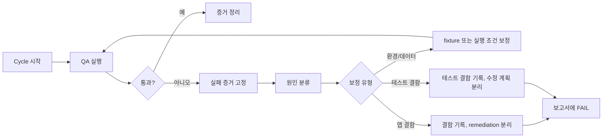

# 2026-07-02 UltraQA 심층 QA 실행 계획안

| 항목 | 내용 |
| --- | --- |
| 작성일 | 2026-07-02 |
| 상태 | 실행 계획 |
| 실행 모드 | `$ultraqa` 기반 반복 QA: 실행 → 판정 → 진단 → 보정/재실행 → 증거 보고 |
| 기준 문서 | `docs/qa/README.md`, `TESTING.md`, `docs/prd.md`, `DESIGN.md`, `src/lib/routes.ts` |
| 계획 파일 | `docs/qa/plan/2026-07-02-ultraqa-deep-qa-execution-plan.md` |
| 보고서 위치 | `docs/qa/reports/qa-report-YYYYMMDD-HHMM.html` |
| 증거 위치 | `docs/qa/reports/qa-report-YYYYMMDD-HHMM-evidence/` |

## 결론

이 문서는 2026-07-02 실행자가 사용한 **당시 운영 계획**이다. 현재 실행 기준은
`docs/qa/README.md`, `TESTING.md`, `docs/prd.md`, `DESIGN.md`와 active source/tests다.

핵심 목표는 세 가지다.

1. 자동 검증, 브라우저 검증, 수동 탐색 검증을 한 흐름으로 묶는다.
2. 실패는 `$ultraqa` 방식으로 재현 증거를 모으고 원인을 분류한 뒤 재검증한다.
3. Supabase 데이터 준비가 필요해도 secret을 노출하지 않고, non-production 확인과
   증거 기록을 먼저 고정한다.

## 이번 실행 범위

| 구분 | 포함 |
| --- | --- |
| 자동 게이트 | `lint`, `typecheck`, `format`, `build`, `test`, admin-boundary/remote-apply 관련 정적 테스트 |
| E2E | `pnpm test:e2e` 전체. `setup` → `mobile-360` → `tablet-768` → `desktop-1280` 순서 |
| 브라우저 QA | 주요 public/protected route, 쓰기 51~54, 피드백/리포트/서재, 설정/알림, 모바일 overflow |
| 데이터 QA | e2e learner 계정 준비, 필요한 fixture 생성/정리, RLS 우회 검증 분리 |
| 보고 | HTML 보고서, 스크린샷 증거, 실패 trace 로컬 경로, fixture manifest, UNVERIFIED 목록 |

| 구분 | 제외 |
| --- | --- |
| 코드 수정 | QA 실행 중 발견된 결함은 보고서에 기록한다. 코드 수정은 별도 remediation 계획으로 분리한다. |
| 배포 | `collab` merge/push/deploy 금지. 별도 명시 확인 전 배포하지 않는다. |
| 스키마 적용 | v13에서 원격 Supabase schema apply, migration push, destructive reset 금지. |
| 관리자 기능 확장 | user-facing app 범위만 검증한다. admin route/UI/schema 추가나 remediate 금지. |
| 실제 결제/실제 AI provider | deferred scope로 유지한다. 스텁/안내 상태만 검증한다. |

## 오늘자 위험 보완

| 위험 | 보완 |
| --- | --- |
| 기존 rev6 문서와 오늘 실행 계획 혼동 | 이 문서를 오늘 실행 entrypoint로 사용하고, 상세 매트릭스는 rev6를 참조한다. |
| `$ultraqa`가 코드 수정까지 확장 | 이번 계획의 기본 출력은 QA 보고서다. 코드 수정은 별도 계획/브랜치로 분리한다. |
| `SUPABASE_ACCESS_TOKEN` 오남용 | CLI 관리 토큰으로만 취급한다. 값 출력 금지, build/test 셸에 export 금지. |
| service role로 만든 데이터만 보고 PASS | fixture 준비와 learner/anon 검증을 분리한다. PASS는 learner/anon 화면 증거로만 판정한다. |
| 원격 DB 변경 경계 불명확 | non-production 확인 전 데이터 주입 금지. schema apply와 destructive reset 금지. |
| 증거 품질 부족 | 모든 PASS/FAIL/UNVERIFIED는 명령 결과 또는 브라우저 증거와 연결한다. |
| 기존 미커밋 변경 오염 | 실행 시작/종료 시 `git status --short --branch`를 보고서에 기록하고, `.env.example` 기존 변경은 건드리지 않는다. |

## Preflight

### 1. 작업면 확인

- [ ] `pwd`가 `C:\Users\admin\Desktop\workspace\topik-project\v13`인지 기록한다.
- [ ] `git branch --show-current`를 기록한다.
- [ ] `git status --short --branch`를 보고서 Environment 섹션에 그대로 기록한다.
- [ ] 현재 확인된 기존 변경: `.env.example` 수정 1건. 이 계획에서는 수정하지 않는다.
- [ ] `collab` 브랜치가 대상이면 즉시 중단하고 사용자 확인을 받는다.

### 2. 런타임 확인

- [ ] `node --version`이 `>=24 <25` 범위인지 기록한다.
- [ ] `pnpm --version`을 기록한다. `package.json` 기준은 `pnpm@11.1.3`이다.
- [ ] 포트 `3000, 3001, 3002, 3003, 3100` 점유 여부를 기록한다.
- [ ] 기존 dev/prod 서버가 살아 있으면 빌드 전 종료한다.
- [ ] `.next` 오염이 의심되면 서버 종료 후 `.next` 삭제를 기록하고 진행한다.

### 3. 환경 변수 존재 확인

값은 출력하지 않는다. 보고서에는 `present/missing`만 기록한다.

| 변수 | 용도 | 보고 규칙 |
| --- | --- | --- |
| `SUPABASE_ENV_LABEL` | non-production 확인 | 값이 `local/dev/development/preview/qa/staging/test/testing` 중 하나인지 여부만 기록 |
| `E2E_STUDENT_EMAIL` | E2E 학습자 계정 | 값 출력 금지. 없으면 프로젝트 메모 기준 `student@audit.local` 사용 여부 기록 |
| `SUPABASE_TEST_PASSWORD` | E2E 학습자 비밀번호 | 값 출력 금지 |
| `NEXT_PUBLIC_SUPABASE_URL` | 앱 Supabase URL | origin만 보고서에 기록 가능. secret 아님 |
| `NEXT_PUBLIC_SUPABASE_PUBLISHABLE_KEY` | 브라우저 publishable key | 값 출력 금지 |
| `SUPABASE_SERVICE_ROLE_KEY` | E2E setup/Auth admin fixture | 값 출력 금지. server-only로만 사용 |
| `SUPABASE_ACCESS_TOKEN` | Supabase CLI 관리 토큰 | 값 출력 금지. 일반 build/test 셸에 export 금지 |

현재 확인: `.env.local`에는 `SUPABASE_ACCESS_TOKEN`과 `SUPABASE_TEST_PASSWORD`가
활성 라인으로 존재한다. `.env.example`에는 `SUPABASE_ACCESS_TOKEN`이 없다.

주의: `scripts/build-preflight.mjs`는 실행 환경에 `SUPABASE_ACCESS_TOKEN`이 올라와
있거나 `supabase/.temp`가 있으면 원격 Supabase apply 표면으로 판단하고 build를
차단한다. 데이터 준비용 CLI 작업이 필요하면 별도 셸에서만 토큰을 사용하고, build
및 test 셸에는 export하지 않는다.

## Supabase 데이터 준비 원칙

### 허용 조건

데이터 주입은 아래 조건을 모두 만족할 때만 한다.

- [ ] QA가 특정 동적 화면 id 또는 계정 상태를 필요로 한다.
- [ ] 기존 E2E setup 또는 기존 테스트 fixture helper로 준비할 수 없다.
- [ ] `SUPABASE_ENV_LABEL`이 production 계열이 아님을 확인했다.
- [ ] 작업 대상 project ref 또는 URL이 보고서에 기록됐다. secret은 기록하지 않는다.
- [ ] 생성할 row, 계정, storage object가 seed manifest에 기록된다.
- [ ] cleanup 방법이 정해져 있다.

### 금지 조건

- [ ] `supabase db push`, `supabase migration up`, `supabase db reset --linked` 같은 원격 schema/data apply 명령 금지.
- [ ] production, live, prod 라벨 환경에서 test data 생성 금지.
- [ ] `SUPABASE_ACCESS_TOKEN` 값 출력, 파일 복사, 보고서 기록 금지.
- [ ] service role 결과만으로 RLS PASS 판정 금지.
- [ ] admin UI 또는 admin route를 새로 만들거나 고치지 않는다.

### 실행 방식

| 상황 | 사용할 수단 | 판정 |
| --- | --- | --- |
| E2E 학습자 계정 생성/갱신 | 기존 `tests/e2e/_setup/e2e-student-fixture.ts` 흐름 | 허용 |
| 쓰기 제출/피드백 동적 id 준비 | 기존 E2E fixture helper 또는 전용 QA seed script | 조건부 허용 |
| Supabase CLI 인증 필요 | 별도 셸에서 `SUPABASE_ACCESS_TOKEN` 사용 | 조건부 허용 |
| learner 화면 검증 | fresh login 또는 regenerated storageState | 필수 |
| anon/protected redirect 검증 | 무세션 브라우저 컨텍스트 | 필수 |

## UltraQA 사이클

최대 5회 반복한다. 같은 실패가 3회 반복되면 중단하고 원인과 blocker를 보고한다.

| 분류 | 예시 | 이번 실행 처리 |
| --- | --- | --- |
| 환경 | 포트 충돌, stale `.next`, missing env | 보정 후 재실행 |
| 데이터 | feedback/report id 없음, learner 상태 부족 | fixture 준비 후 재실행 |
| 앱 결함 | P0/P1/P2/P3 product defect | 보고서 기록. 코드 수정은 별도 계획 |
| 테스트 결함 | stale selector, flaky wait | 보고서 기록. 테스트 수정은 별도 계획 |
| 스펙 갭 | SOT에 기대 동작 없음 | 결함 집계와 분리하고 문서 게이트로 기록 |

## 실행 순서

### Phase 0. 문서와 라우트 기준 고정

- [ ] `docs/qa/README.md`와 `TESTING.md`를 QA 실행 기준으로 둔다.
- [ ] `src/lib/routes.ts`의 `APP_ROUTE_SPECS`, `PUBLIC_PATHS`, `PROTECTED_ROUTE_CASES`, `FLOW_ROUTE_SPECS`를 route 단일 출처로 둔다.
- [ ] 제품 약속과 화면 범위는 `docs/prd.md`, 현재 route source와 route contract tests를 대조한다.
- [ ] 화면별 깊은 판정이 필요한 경우 현재 component와 관련 unit/e2e test를 읽는다.
- [ ] UI/스타일 판정은 `DESIGN.md`를 기준으로 한다.

### Phase 1. 자동화 게이트

서버를 띄우기 전에 순서대로 실행한다.

1. `pnpm lint`
2. `pnpm typecheck`
3. `pnpm format`
4. `pnpm vitest run tests/scripts/build-preflight.test.ts tests/scripts/no-supabase-remote-apply-surface.test.ts tests/scripts/env-example-contract.test.ts`
5. `pnpm harness:admin-boundary`
6. `pnpm build`
7. `pnpm test`

각 명령은 보고서에 다음 필드를 남긴다.

| 필드 | 내용 |
| --- | --- |
| command | 실행 명령 |
| started_at / ended_at | KST 기준 |
| exit_code | 종료 코드 |
| result | PASS / FAIL / SKIP |
| evidence | 주요 로그 요약. secret 포함 원문 로그 금지 |
| rerun | 재실행 여부와 이유 |

### Phase 2. Prod 서버 기반 E2E

- [ ] `pnpm build`가 통과한 뒤 `pnpm start`로 서버를 띄운다.
- [ ] `E2E_BASE_URL` 또는 기본 `http://127.0.0.1:3000`을 기록한다.
- [ ] `pnpm test:e2e`를 실행한다.
- [ ] Playwright 프로젝트 순서를 확인한다: `setup`, `mobile-360`, `tablet-768`, `desktop-1280`.
- [ ] `tests/e2e/auth-state/student.json`은 토큰을 포함할 수 있으므로 보고서/evidence 폴더로 복사하지 않는다.
- [ ] 실패 시 `test-results/failure-log.json` 요약과 trace 로컬 경로만 기록한다.

### Phase 3. 핵심 브라우저 QA

E2E 결과가 green이어도 직접 브라우저 증거를 남긴다.

| 그룹 | 확인 |
| --- | --- |
| Public auth | 랜딩, 회원가입, 로그인, 비밀번호 재설정, 인증 에러, 인증 메일 안내 |
| Protected guard | 무세션 protected 접근 → 로그인 이동 |
| Workspace shell | 사이드바, 모바일 drawer, 로그아웃, active menu |
| Practice | 추천, 문제 목록 필터/정렬/empty/error, 다시 풀기 모달 |
| Writing | 51/52/53/54 작성, autosave, 제출 확인, 분석 대기, 새로고침 복원 |
| Feedback/report | short/long 피드백, 비교 리포트, 다음 문제 추천, 내 서재 저장 |
| Settings | 언어, 학습 목표, 계정, 알림, 프로필 |
| Paywall/subscription | deferred 결제 안내, 데이터 변경 없음 |
| Mobile | `360x720`에서 overflow, modal/drawer close, keyboard focus |

각 화면 증거에는 `route`, `viewport`, `final_url`, `hydration 증거`, `screenshot`,
`console error 요약`, `verdict`를 남긴다.

### Phase 4. 데이터/RLS/보안 QA

- [ ] anon 상태에서 protected route가 차단되는지 확인한다.
- [ ] learner 세션에서 자기 데이터만 보이는지 확인한다.
- [ ] service role로 준비한 fixture가 learner 화면에서 기대 범위로만 보이는지 확인한다.
- [ ] 타인 feedback/report id 접근은 404 또는 접근 차단으로 처리되는지 확인한다.
- [ ] browser-visible env에 service role, access token, private key가 노출되지 않는지 확인한다.
- [ ] admin route/UI가 사용자 앱에 노출되지 않는지 확인한다.
- [ ] `SUPABASE_ACCESS_TOKEN`, `SUPABASE_SERVICE_ROLE_KEY`, auth storage, trace zip은 evidence 폴더에 복사하지 않는다.

### Phase 5. 보고서 작성

HTML 보고서는 아래 섹션을 포함한다.

| 섹션 | 필수 내용 |
| --- | --- |
| Executive summary | 전체 판정, P0/P1/P2/P3 수, ship-readiness |
| Environment | branch/worktree, dirty status, Node/pnpm, base URL, 실행 시각 |
| Credential posture | 필요한 키 present/missing, 값 미기록 확인, non-production 확인 |
| Command results | 자동 게이트 결과와 재실행 이력 |
| E2E results | project별 pass/fail/skip, 실패 trace 로컬 경로 |
| Browser evidence | route/viewport별 screenshot, final URL, hydration 확인 |
| Data fixture manifest | 생성 row/account/storage object, marker, cleanup 상태 |
| Defect log | severity, route, 재현 절차, 기대/실제, 증거, owner/status |
| Spec gaps | 결함과 분리된 문서 갭, 필요한 SOT 변경 제안 |
| UNVERIFIED | 사유, 필요한 fixture, 재검증 명령 |
| Security notes | secret 미노출, admin boundary, RLS 대체 검증 |
| Docs consulted | 이번 QA에서 실제로 읽은 SOT 목록 |

## 증거 판정 규칙

| 판정 | 조건 |
| --- | --- |
| PASS | 명령 통과 또는 하이드레이션 확인된 브라우저 증거가 있고 기대 결과와 일치 |
| FAIL | 재현 가능한 기대/실제 차이가 있고 증거가 연결됨 |
| SKIP | 환경 제약 또는 명시 제외 범위. 대체 검증 여부 기록 |
| UNVERIFIED | 필요한 fixture/권한/동적 id/하이드레이션 증거가 없어 판정 불가 |

UNVERIFIED는 PASS에 포함하지 않는다. 핵심 학습 경로가 UNVERIFIED면 ship-readiness는
`blocked` 또는 `conditional`로 둔다.

## 결함 등급

| 등급 | 기준 |
| --- | --- |
| P0 | 데이터 노출, auth bypass, writing 제출 손실, app crash, admin scope 침범 |
| P1 | 핵심 학습 흐름 중단, 피드백/리포트/서재 주요 기능 실패, 모바일 사용 불가 |
| P2 | 상태 메시지 오류, 부분 기능 실패, 접근성/반응형 문제 |
| P3 | copy, spacing, 낮은 위험의 cosmetic issue |

## 완료 기준

- [ ] P0/P1 0개.
- [ ] 자동화 게이트 통과. 실패가 있으면 원인과 재실행 결과 기록.
- [ ] `pnpm test:e2e` 0 fail 또는 명확한 환경 skip/UNVERIFIED 사유 기록.
- [ ] desktop/tablet/mobile 주요 viewport 증거 확보.
- [ ] 모든 FAIL/UNVERIFIED가 재현 절차와 다음 조치를 가진다.
- [ ] secret이 보고서, 로그, 스크린샷, trace, commit 대상에 노출되지 않았다.
- [ ] fixture manifest와 cleanup 상태가 남아 있다.
- [ ] SOT 충돌 또는 갭은 결함과 분리해 문서 게이트로 기록했다.

## 실행 후 Git/문서 처리

- [ ] QA 보고서와 증거 폴더만 변경 대상에 포함한다.
- [ ] `.env.local`, `tests/e2e/auth-state/`, `test-results/`, trace zip은 stage 금지.
- [ ] 기존 `.env.example` 변경은 이 계획의 변경이 아니므로 섞지 않는다.
- [ ] `git add -A` 금지. 파일을 명시해 stage한다.
- [ ] commit/push/PR은 사용자 확인 후 진행한다.
- [ ] `collab` 대상 merge/push/deploy는 별도 명시 확인 전 금지한다.

## Docs consulted

- `AGENTS.md` — 한국어 보고, SOT, Supabase/secret, QA 완료 기준, collab 보호
- `README.md` — 프로젝트 목적, 기술 스택, 문서 진입점
- `docs/qa/README.md` — 현재 QA 문서 지도와 역사 기록 해석 기준
- `docs/qa/plan/first-remediation-execution-plan-20260612.md` — 이전 QA 후속 처리 방식
- `TESTING.md` — Vitest/Playwright/Supabase local stack 기준
- `package.json` — scripts, engines, dependency 기준
- `playwright.config.ts` — project, viewport, trace, auth-state 구조
- `src/lib/routes.ts` — route 단일 출처
- `docs/prd.md`, `src/lib/routes.ts`, route contract tests — 제품/route/flow 기준
- `DESIGN.md` — UI/상태/접근성 체크 기준
- `supabase/migrations/INDEX.md`, `docs/supabase/` — 데이터/RLS 검증 기준
- `scripts/build-preflight.mjs` — dev/prod build 오염 방지와 Supabase remote apply 표면 차단

## 외부 근거

- Playwright 공식 문서: Trace Viewer와 `retain-on-failure`는 실패 테스트 증거를 남기는
  방식의 근거다. <https://playwright.dev/docs/trace-viewer>
- Supabase 공식 문서: `SUPABASE_ACCESS_TOKEN`은 CLI 로그인/CI 명령용 personal access
  token으로 다룬다. <https://supabase.com/docs/reference/cli/introduction>
- Supabase 공식 문서: API key와 RLS/권한 경계는 service role 검증과 learner 검증을
  분리해야 하는 근거다. <https://supabase.com/docs/guides/getting-started/api-keys>,
  <https://supabase.com/docs/guides/api/securing-your-api>
