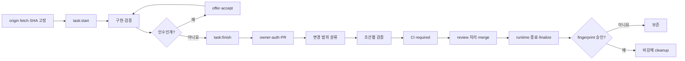

# AI 개발 파이프라인 구현 보고서

> 구현 기간: 2026-07-21~2026-07-22 · 최종 갱신: 2026-07-22 · 성격: 당시 구현·검증 기록 · 운영 정본: [`../../operations/ai-development-pipeline.md`](../../operations/ai-development-pipeline.md)

## 결과 요약

Codex와 Claude가 같은 작업을 이어받을 수 있는 공용 lifecycle, 임시 산출물 검문, 승인 기반 정리, GitHub 소유자 인증과 CI 보호 규칙을 구현했다. 최초 구축 뒤 실제 사용에서 확인된 긴 대기와 복잡한 마감 절차를 다섯 번의 작은 후속 PR로 보완했다.

핵심 결과는 다음과 같다.

- 작업 시작은 공유 `main`을 pull하거나 바꾸지 않고, fetch한 `origin/main`의 고정 SHA에서 task branch와 `.worktrees/<type>-<slug>`를 만든다.
- Codex와 Claude는 같은 task record와 worktree를 사용하며, fingerprint가 일치하는 `offer → accept` 인수인계로 실행자 한 명만 바꾼다.
- 일상 마감은 빠른 `task:finish`, 삭제 판단은 깊은 `task:finalize`, 실제 삭제는 동일 fingerprint를 사용자가 승인한 `task:cleanup`으로 분리했다.
- 저장소 root의 새 임시 산출물과 manifest 없는 UI 증거는 PR에서 차단한다. 기존 누적물은 legacy baseline으로 보존한다.
- GitHub의 필수 검사는 `CI required` 하나로 고정했다. draft, ready PR, `main` push가 서로 필요한 일만 수행한다.
- ready PR은 변경 범위를 `docs-only`, `pipeline`, `full`, `full-fallback`으로 분류한다. 문서만 바뀌면 app 설치·전체 test·Windows lifecycle을 생략하고, 불명확하거나 Windows checkout에 위험한 변경은 전체 검사로 되돌린다.
- `blackstarzck` 인증 성공은 계정 확인 절차만 간소화한다. 필수 CI와 review 의견 처리는 소유자도 우회하지 않는다.

파이프라인 구현 PR [#52](https://github.com/blackstarzck/topik-project-v13/pull/52), 보완 PR [#53](https://github.com/blackstarzck/topik-project-v13/pull/53), [#54](https://github.com/blackstarzck/topik-project-v13/pull/54), [#56](https://github.com/blackstarzck/topik-project-v13/pull/56), [#57](https://github.com/blackstarzck/topik-project-v13/pull/57), [#58](https://github.com/blackstarzck/topik-project-v13/pull/58)은 모두 `main`에 병합됐다. 중간의 #55는 파이프라인과 무관한 문서 작업이므로 구현 목록에서 제외했다.

기능 구현과 GitHub 설정 전환은 완료됐다. 기존 worktree·branch·legacy 산출물 정리는 이번 범위에서 수행하지 않았다.

## 구현 전·후 비교

| 사용자가 겪는 상황 | 구현 전 | 구현 후 |
| --- | --- | --- |
| 새 작업 시작 | 세션·도구마다 branch와 폴더를 수동 선택 | `task:start`이 fetch 후 고정한 `origin/main` SHA에서 branch·worktree 생성 |
| 기준 checkout | 공유 `main`에서 pull·switch가 섞일 수 있음 | 공유 `main`을 바꾸지 않고 task worktree에서만 수정 |
| branch·폴더 이름 | `codex/`, `claude/`, 형제 폴더와 native worktree 혼재 | 공용 branch 형식과 `.worktrees/<type>-<slug>` 사용 |
| Codex↔Claude 인수인계 | 대화 메모에 의존하거나 새 폴더 생성 | 같은 worktree를 유지하고 `offer → accept`로 실행자만 교체 |
| 일상 마감 | 깊은 원격·산출물 검사를 매번 반복 | 빠른 `task:finish`로 commit·push 상태만 확인 |
| 삭제 준비 | 마감 확인과 삭제 검사가 한 흐름에 섞임 | `task:finalize`는 report-only, `task:cleanup`만 승인 후 삭제 |
| cleanup 중단 | 일부 삭제 뒤 재개 판단이 어려움 | journal·quarantine·후보별 진행 기록으로 같은 승인 재개 |
| 임시 파일 | root, `.tmp/`, `artifacts/` 등에 누적 | `.codex/work/<slug>/`만 사용하고 새 금지 경로를 CI에서 차단 |
| CI 이벤트 | PR과 push에서 무거운 검사가 중복될 수 있음 | draft·ready·`main` push 역할 분리 |
| 작은 문서 변경 | app 전체 test와 Windows 검증까지 수행 | 신뢰 경계 검사는 유지하고 install·app 전체 suite·Windows는 생략 |
| 필수 검사 | 이벤트별 여러 check 이름을 ruleset에 연결 | 항상 존재하는 `CI required` 하나만 GitHub Actions app에 고정 |
| 원격 branch | merge 뒤에도 남을 수 있음 | GitHub의 head branch 자동 삭제 활성 |
| merge 방식 | squash·rebase가 cleanup 판단을 복잡하게 할 수 있음 | 저장소 수준에서 merge commit만 허용 |

## 최종 작업 흐름

승인하지 않거나 상태가 달라지면 아무것도 지우지 않는다. `--force`, `git branch -D`, 탐색기 선삭제는 제공하지 않는다.

## 구현 묶음

| PR | 병합 결과 | 핵심 변경 |
| --- | --- | --- |
| [#52](https://github.com/blackstarzck/topik-project-v13/pull/52) | `6eb450a1`, 2026-07-21 11:51:41Z | 공용 task lifecycle·registry, 인수인계, 산출물 검사, finalize·cleanup, trusted-base CI, 운영 정본 |
| [#53](https://github.com/blackstarzck/topik-project-v13/pull/53) | `ca334b46`, 2026-07-21 22:52:10Z | PR와 `main` push에서 중복되던 전체 CI 실행 제거 |
| [#54](https://github.com/blackstarzck/topik-project-v13/pull/54) | `c65c58fd`, 2026-07-22 01:15:57Z | 빠른 `task:finish`, 복사 가능한 상태 안내, 실용적인 인수인계·소유자 인증 흐름 |
| [#56](https://github.com/blackstarzck/topik-project-v13/pull/56) | `95076061`, 2026-07-22 04:06:43Z | finalize 성능 개선, cleanup 부분 실패 journal·quarantine 복구, `CLEANED` tombstone 상태 |
| [#57](https://github.com/blackstarzck/topik-project-v13/pull/57) | `b9b140df`, 2026-07-22 04:40:13Z | 고정 집계 작업 `CI required`, draft/ready/push 행렬, required ruleset 원자 전환 |
| [#58](https://github.com/blackstarzck/topik-project-v13/pull/58) | `70a50218`, 2026-07-22 06:08:21Z | 경로 기반 조건부 CI, Windows 경로·대소문자 충돌 fail-closed, CODEOWNERS 보호 확대 |

공개 record는 역할별로 `TaskRecordV2`, handoff snapshot/context, artifact manifest, cleanup manifest와 sidecar로 분리했다. token, secret, private key와 원문 thread ID는 저장하지 않는다. 신규 인수인계의 표준은 `task:handoff --action accept`이며 `task:resume`은 과거 snapshot 호환용이다.

## 검증 결과와 실제 시간

시간은 각 실행에서 직접 관찰한 wall time이다. 초기 구현의 일부 명령은 시작·종료 시각을 별도 보존하지 못해 wall time만 남아 있으며, 추정 시간을 만들지 않았다.

### 보완 PR별 GitHub ready 검사

| PR | Linux 검증 | Windows lifecycle | 결과 |
| --- | ---: | ---: | --- |
| #53 | 255초 | 256초 | 둘 다 성공 |
| #54 | 313초 | 295초 | 둘 다 성공 |
| #56 | 245초 | 401초 | 둘 다 성공 |
| #57 | 331초 | 407초 | 둘 다 성공, `CI required` 3초 |
| #58 | 분류 12초 + 전체 307초 | 357초 | `full`, 변경 5개, `CI required` 2초 |

#58 merge 뒤 [main push run `29895823994`](https://github.com/blackstarzck/topik-project-v13/actions/runs/29895823994)은 분류 14초, 경량 무결성 14초, `CI required` 2초에 성공했다. app 전체 검증과 Windows lifecycle은 설계대로 건너뛰었다.

### 성능 보완과 PR #58 최종 로컬 검증

| 명령·단계 | 결과 | 실제 wall time |
| --- | --- | ---: |
| PR #56 전체 `pnpm test` | 305개 파일, 2,981 성공·17 skip | 526.7초 |
| PR #56 cleanup 계약 | 82/82 성공 | 309.078초 |
| 실제 `task:finalize` 비교 | 중앙값 종전 111.1초 → 개선 후 3.33초 | 96.9% 단축 |
| PR #57 전체 `pnpm test` | 305개 파일, 2,983 성공·17 skip | 617.7초 |
| PR #57 `pnpm build` | 성공 | 67.4초 |
| PR #58 `pnpm check:task-lifecycle` 단독 실행 | 8분 도구 제한에 걸려 성공 증거 없음 | 484초 |
| PR #58 전체 `pnpm test` 첫 실행 | 새 CI fixture 2건 실패, 2,991 성공·17 skip | 682.5초 |
| PR #58 focused CI 계약 1차 | 43/43 성공 | 31.240초 |
| PR #58 focused CI 계약 2차 | 43/43 성공 | 28.971초 |
| PR #58 수정 뒤 전체 `pnpm test` | 305개 파일, 3,008 성공·17 skip | 510.7초 |
| `pnpm check:project-structure` | 성공 | 2.0초 |
| `pnpm check:artifact-hygiene` | 성공 | 3.0초 |
| agent skill 정책·proxy | 둘 다 성공 | 1.7초 + 1.4초 |
| `pnpm typecheck` | 성공 | 6.4초 |
| `pnpm lint` | 성공 | 25.9초 |
| `pnpm build` | 성공 | 35.5초 |
| `task:finish` | clean commit, 게시 전 상태 정확히 보고 | 1.9초 |
| `task:owner-auth` | `blackstarzck`, 계정 전환 없음 | 2.1초 |
| push / draft PR 생성 | 둘 다 성공 | 2.7초 / 2.3초 |
| PR #58 merge | owner 예외, merge commit, head 일치 확인 | 3.2초 |
| PR #58 최종 `task:finalize` | `ready: true`, blocker 없음 | 6.0초 |

UI 제품 동작과 Supabase schema는 바꾸지 않았으므로 Playwright와 원격 DB apply는 적용 대상이 아니었다. build가 자동 변경한 `next-env.d.ts`는 원래 내용으로 복구해 commit에서 제외했다.

## 실패·미완료·외부 상태

| 상태 | 발견 내용 | 처리와 영향 |
| --- | --- | --- |
| 해결 | 최초 bootstrap CI가 GitHub 합성 merge `HEAD`를 PR raw SHA와 직접 비교 | 후보 포함 관계와 trusted blob 동일성 검사로 수정, 후속 GitHub CI 통과 |
| 해결 | Windows Git이 예상한 8.3 경로 대신 긴 정규 경로 반환 | 실제 경로 정규화 비교로 수정, 후속 Windows CI 통과 |
| 해결 | `task:start`이 제한된 fetch refspec에서 원격 동일 branch를 놓칠 수 있음 | exact `git ls-remote --heads`를 생성 전후에 사용하고 미확인은 fail-closed |
| 해결 | cleanup 후보 일부 삭제 뒤 journal이 없어 재개가 막힐 수 있음 | 후보별 승인 digest, quarantine claim과 진행 journal로 재개 가능하게 수정 |
| 해결 | cleanup 뒤 `task:status`가 `ACTIVE`로 보일 수 있음 | 검증된 tombstone만 읽어 `CLEANED`를 표시 |
| 해결 | 최초 구현의 v2 lifecycle 합산 실행이 도구의 604초 제한 초과 | 같은 계약 81/81을 275.9초에 다시 통과해 기능 실패와 실행 제한을 구분 |
| 해결 | 최초 전체 test에서 실제 Git fixture 2건이 공통 40초 제한 초과 | 관련 Git 통합 테스트의 제한을 분리하고 전체 test를 517.1초에 다시 통과 |
| 해결 | 최초 구현 최종 리뷰 뒤 writing 통합 테스트 1건이 전체 부하에서 40초 초과 | 단독 8.754초에 통과하고 GitHub required test에서도 재확인 |
| 해결 | PR #58 gitlink fixture에 신규 index용 `--add` 누락 | 실패를 재현한 뒤 `update-index --add --cacheinfo`로 수정 |
| 해결 | PR #58의 여러 Git/Bash fixture가 한 40초 제한에 누적 | 큰 timeout 대신 `it.each`로 분리, 43/43을 두 번 연속 확인 |
| 해결·증거 대체 | PR #58 `check:task-lifecycle` 단독 실행이 484초 제한에 걸림 | 단독 성공으로 표현하지 않음. 이후 전체 test의 같은 계약과 ready PR Windows lifecycle 성공으로 검증 |
| 해결 | PR #58 첫 전체 test가 위 두 새 CI fixture 때문에 682.5초 뒤 실패 | fixture 수정 뒤 3,008개 테스트를 510.7초에 통과 |
| 개선됐지만 잔존 | cleanup 계약 309.078초 | 목표 300초보다 9.1초 길다. 안전성 시나리오는 유지하고 fixture 생성 비용을 후속 최적화 |
| 미확인 | merge queue가 비활성이라 실제 `merge_group` 이벤트 없음 | shell contract는 통과. queue를 켜는 시점에 live 실행을 별도 확인해야 함 |
| 기술 부채 | GitHub Actions가 `actions/checkout@v4`의 Node.js 20 사용 중단 경고 표시 | 현재 실행은 Node 24 강제 적용으로 성공. action major 업데이트를 별도 검토 |
| 과거 외부 상태 | 병합된 PR #52의 현재 rollup에 비필수 `CodeRabbit` failure가 남아 있음 | 필수 Linux·Windows 검사는 성공했고 병합을 뒤집지 않음. 외부 상태 기록으로 보존 |
| 과거 기록 | 2026-07-21 저장소 전체 Prettier에서 기존 52개 파일 불일치 | 이번 변경 파일은 통과. 현재 수량을 재검증하지 않았으므로 별도 formatting 작업에서 다시 측정 |
| 승인 대기 | 완료된 local worktree·branch 정리 | 사용자 승인 없는 cleanup은 실행하지 않음 |
| 범위 밖 | `collab`, 원격 Supabase apply, legacy 강제 삭제 | 수행하지 않음 |

PR #58은 runtime 미사용 상태를 빈 manifest로 등록한 뒤 finalize가 `ready: true`를 반환했다. snapshot fingerprint는 `e027b07c4ce87819bd77055c83650abf6b28153a298a13ebe5ba19d786355f40`이다. 이 값은 보고용이며 사용자가 정확히 승인하기 전에는 cleanup 권한이 아니다. 상태가 달라지면 다시 finalize해야 한다.

## 왜 몇 시간이 걸렸는가

| 누적 원인 | 실제 관찰 | 이번 보완 |
| --- | --- | --- |
| 전체 app suite 반복 | 로컬 1회 약 8~10분, ready Linux 약 4~6분 | 문서·pipeline·app 분류로 불필요한 전체 실행 제거 |
| 실제 Git 저장소 fixture | lifecycle·cleanup이 branch, worktree, remote, 중단 복구를 매번 생성 | 빠른 단위 계약과 느린 통합 계약을 분리하고 직렬 실행 유지 |
| 별도 Windows 검증 | ready PR에서 약 4~7분 | 문서 전용 변경은 Windows 생략, 위험 경로는 계속 Windows로 fail-closed |
| draft·ready·main 중복 | 이벤트마다 같은 전체 suite를 반복할 수 있었음 | #53과 #57에서 이벤트 역할과 단일 집계를 분리 |
| 작업 마감의 깊은 검사 | 종전 finalize 중앙값 111.1초 | 일상 마감은 약 2초 `task:finish`, 삭제 전 finalize는 약 3~6초 |
| 보안 리뷰 뒤 재검증 | 경로 탈출·TOCTOU·부분 삭제·후보 workflow 변조는 작은 누락도 위험 | 작은 PR로 나누고 독립 리뷰 뒤 필요한 범위만 재검증 |
| 실패한 장기 실행의 재시도 | 604초·484초 제한 초과와 682.5초 실패도 원인 수정 뒤 다시 실행 | 실패 시간을 성공처럼 숨기지 않고 별도 기록하며, 재시도 범위를 좁히는 계약 분류 도입 |

몇 시간은 한 명령이 멈춘 시간이 아니었다. 5개의 보완 PR, 각 PR의 Linux·Windows CI, 로컬 전체 suite, 독립 리뷰에서 발견한 결함 수정과 재검증이 순차로 누적된 결과다. cleanup 안전성 검사는 여전히 느리지만, 일반적인 문서나 일상 마감이 그 비용을 매번 지불하지 않도록 경로를 분리했다.

## 기존 누적물 읽기 전용 감사

감사 기준은 2026-07-22 15:13 KST의 로컬 `origin/main` `70a502184a58`이다. 감사 자체에서는 fetch, 삭제, 이동, 파일 내용·secret 열람을 하지 않았다. 전체 감사 wall time은 약 15.2초였다.

| Git 항목 | 현재 수량 | 판단 |
| --- | ---: | --- |
| 연결 worktree | 24 | 21 clean, 3 dirty |
| detached worktree | 2 | 소유권 확인 전 보존 |
| local branch | 58 | 8개가 `origin/main`에 미포함 |
| `origin/*` 추적 branch | 28 | 4개가 `origin/main`에 미포함 |
| branch 연결 worktree | 22 | 16개 포함, 6개 미포함 |

변경이 남은 세 worktree는 자동 정리 금지 대상이다.

- `C:/Users/admin/.codex/worktrees/a744/v13-latest`: detached, 변경 1개
- `C:/Users/admin/Desktop/workspace/topik-project/v13-first-qa`: `codex/first-qa`, 변경 2개
- `C:/Users/admin/Desktop/workspace/topik-project/v13-supabase-environment-separation`: `codex/supabase-environment-separation`, 변경 14개

| legacy 경로 | 디스크 파일 | 바로 아래 항목 | Git 추적 | 일반 미추적 | ignore 처리 |
| --- | ---: | ---: | ---: | ---: | ---: |
| `.scratch` | 373 | 157 | 320 | 0 | 53 |
| `.tmp` | 12 | 11 | 0 | 0 | 12 |
| `artifacts` | 149 | 27 | 136 | 0 | 13 |
| `output` | 28 | 1 | 28 | 0 | 0 |
| `.codex/work` | 26 | 8 | 0 | 0 | 26 |

`.scratch`, `artifacts`, `output`에 추적 중인 legacy 파일은 합계 484개다. 이번 작업은 어떤 누적물도 삭제하지 않았다. PR #57·#58 worktree는 clean이고 `origin/main`에 포함됐지만 승인 기반 cleanup 전까지 보존한다. 다른 clean worktree도 registry 소유권, runtime, PR과 최신 fingerprint를 개별 확인하기 전에는 정리 가능하다고 판단하지 않는다.

## 현재 GitHub 운영 상태

| 설정 | 2026-07-22 확인 결과 |
| --- | --- |
| 필수 ruleset `18859824` | active, strict, `CI required` + GitHub Actions app ID `15368` 한 개 |
| Code Owner ruleset `18859832` | active, 승인 1개, review thread 해결 필수, `blackstarzck`만 `always` 예외 |
| merge 방식 | 저장소 수준에서 merge commit 허용, squash·rebase 비활성 |
| merge 뒤 head branch | 자동 삭제 활성 |
| merge queue | 비활성 |

후보 PR은 classifier와 `CI required` workflow를 함께 바꿀 수 있어 완전히 독립적인 신뢰 경계가 아니다. `.github/`, `scripts/`, package·lock·config와 `tests/scripts/`를 `CODEOWNERS`로 보호하고, base 소유 trusted 검사와 소유자 diff 검토를 함께 사용한다.

## 남은 위험과 권고 순서

1. 이 최종 보고서 PR의 docs-only CI를 실제로 관찰하고 병합한다.
2. 보고서 task와 완료된 task별로 빈 runtime 등록, 최신 PR·`origin/main` 포함과 원격 branch 부재를 `task:finalize`로 다시 확인한다.
3. 사용자가 해당 시점의 정확한 fingerprint를 개별 승인한 task만 비강제 cleanup한다. 승인하지 않은 task는 그대로 둔다.
4. dirty worktree 3개와 미병합 local 8개·origin 4개는 소유자, 게시·PR, runtime을 별도 조사한다.
5. legacy 추적 파일 484개는 제품·테스트 의존성을 먼저 확인한 별도 PR에서만 줄인다.
6. merge queue를 켜면 실제 `merge_group`을 통과한 뒤 운영 정본의 검증 상태를 갱신한다.
7. 협업자가 늘면 `blackstarzck` 단독 CODEOWNER와 owner 예외 정책을 팀 정책으로 재검토한다.

Unix bind mount는 일반 폴더와 완전히 구분하지 못할 수 있고, squash merge는 현재 자동 cleanup 계약이 지원하지 않는다. 저장소가 merge commit만 허용하므로 현재 작업에는 squash 위험이 발생하지 않았다.

운영 명령과 실패 복구 절차는 이 역사 보고서가 아니라 [`docs/operations/ai-development-pipeline.md`](../../operations/ai-development-pipeline.md)를 따른다.
