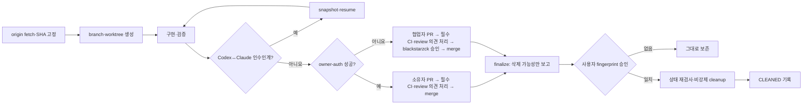

# AI 개발 파이프라인 구현 보고서

> 작성일: 2026-07-21 · 성격: 당시 구현·검증 기록 · 운영 정본: [`../../operations/ai-development-pipeline.md`](../../operations/ai-development-pipeline.md)

## 결과 요약

Codex와 Claude가 같은 작업을 안전하게 이어받고, 작업마다 branch와 worktree를 한 쌍으로 관리하며, 임시 파일이 PR에 섞이지 않도록 막고, 사용자 승인 전에는 어떤 worktree나 branch도 삭제하지 않는 공용 파이프라인을 구현했다.

후속 작업에서 GitHub 소유자 인증 사전 확인을 추가했다. PR #52는 draft·open 상태이며, `blackstarzck` 계정 인증을 확인하고 당시 PR head와 정확히 같은 bootstrap 승인 변수를 설정해 CI 재시도 2까지 실행했다. 재시도 실패 원인은 인증이 아니었다. Linux에서는 GitHub가 PR 검사용으로 임시 생성한 합성 merge commit인 checkout `HEAD`를 PR 후보 SHA와 직접 비교했고, Windows에서는 경로 기대값이 실제 반환 형식과 달랐다. 두 결함은 로컬에서 수정했지만 아직 새 commit을 push하거나 GitHub CI로 재확인하지 않았다.

최초 구현의 핵심 기능과 영향 범위 검증은 통과했다. 당시에는 stage·commit·push·PR·merge와 외부 설정을 수행하지 않았으며, 이후 승인된 후속 단계에서 PR #52와 bootstrap 변수가 만들어졌다. 현재 필수 CI와 Code Owner review ruleset은 활성 상태이고, merge 뒤 branch 자동 삭제만 비활성화돼 있다. merge는 수행하지 않았다. 저장소 전체 Prettier 검사는 이번 작업과 무관한 기존 파일 52개 때문에 실패했지만 당시 변경 파일만 대상으로 한 형식 검사는 통과했다.

기존 worktree·branch·산출물은 읽기 전용으로 조사했으며 하나도 삭제하거나 이동하지 않았다.

## 구현 전·후 비교

| 비교 항목 | 구현 전 | 구현 후 |
| --- | --- | --- |
| 작업 시작 기준 | 각 도구와 세션이 수동 판단 | `origin`을 fetch한 뒤 고정한 `origin/main` SHA에서만 시작 |
| branch 이름 | `codex/…`, `claude/…` 등 도구 이름 혼용 | `feat|fix|refactor|test|docs|chore|ci/<slug>` 공용 규칙 |
| worktree 위치 | 형제 폴더와 도구별 폴더 혼재 | `.worktrees/<type>-<slug>` 한 곳 |
| Codex↔Claude 인수인계 | 대화와 메모에 의존 | 같은 v2 task record와 상태 fingerprint로 인수인계 |
| 동시 작업 | 두 AI가 같은 폴더를 동시에 수정할 수 있음 | 현재 실행자 한 명만 허용하고 handoff 중에는 수정 차단 |
| 임시 산출물 | root, `.tmp/`, `artifacts/` 등에 누적 | `.codex/work/<slug>/`만 허용하고 Git 추가 차단 |
| PR 증거 | 중간 screenshot과 최종 증거 구분이 약함 | 날짜별 증거 폴더와 SHA-256 manifest 요구 |
| 소유자 계정 확인 | GitHub 작업 전 현재 계정을 사람이 수동 확인 | `task:owner-auth`가 소유자 계정을 검증. 실패하면 소유자 예외를 닫고 `협업자 PR → 필수 CI·review 처리 → blackstarzck 승인 → merge` 순서 적용 |
| 작업 종료 | 사람이 임의로 폴더와 branch 삭제 | finalize 보고 → fingerprint 승인 → 비강제 cleanup |
| 기존 누적물 | 소유권 확인 없이 방치하거나 수동 정리할 위험 | legacy baseline으로 보존하고 별도 승인 정리로 이관 |

## 구현된 흐름

삭제 조건을 하나라도 확인하지 못하거나 승인 뒤 상태가 바뀌면 보존한다. squash merge처럼 현재 계약으로 안전성을 증명할 수 없는 경우도 자동 정리하지 않는다.

## 구현 범위

- 공용 명령: `task:start`, `task:status`, `task:handoff`, `task:resume`, `task:runtime`, `task:finalize`, `task:cleanup`, `task:owner-auth`
- Git common directory 기반의 도구 중립 v2 registry와 엄격한 공개 record schema
- 최신 원격 branch 직접 확인, 고정 base SHA, worktree 생성 rollback, actor lock, fingerprint 인수인계
- runtime 등록, PR·HEAD·`origin/main`·소유권 확인, 승인 fingerprint 기반 정리와 부분 실패 journal 복구
- 산출물 report/check, root allowlist, legacy 삭제-only 정책, 최종 evidence manifest
- PR·merge queue·main push의 trusted-base 검사와 Windows lifecycle CI job
- 합성 merge checkout에서도 승인된 PR 후보 포함 관계와 trusted 파일 5개 동일성을 확인하는 bootstrap 검증
- 최초 설치 PR의 merge queue와 merge 직후 main push도 같은 승인 후보의 포함 관계와 trusted mode·blob 동일성을 만족할 때만 허용하는 one-time bootstrap 검증
- Windows가 8.3 짧은 경로 대신 긴 정규 경로를 반환해도 실제 같은 worktree인지 비교하는 lifecycle 테스트
- 운영 정본, 문서 지도, project structure allowlist와 회귀 테스트

## 최종 검증 결과와 실제 시간

아래 시간은 해당 실행의 실제 wall time이다. 일부 초기 실행은 wall time만 계측하고 시작·종료 시각을 별도 저장하지 못했다. Vitest가 자체 출력한 실행 시각이 있는 최종 실행은 함께 적었다. 기존 로컬 시각은 KST이며, 후속 GitHub CI 시각은 `Z`(UTC)로 적었다. 후속 행은 기존 감사와 시간을 덮어쓰지 않는 후속 기록이다.

| 실행 명령 또는 단계 | 결과 | 실행 시각 또는 범위 | 실제 wall time |
| --- | --- | --- | ---: |
| `git fetch --prune origin` | 성공 | 초기 계측 시각 미보존 | 1.3초 |
| bootstrap worktree 생성 | 성공 | 초기 계측 시각 미보존 | 3.7초 |
| worktree env 준비·의존성 설치 | 성공 | 초기 계측 시각 미보존 | 24.4초 |
| baseline project structure | 성공 | 초기 계측 시각 미보존 | 4.3초 |
| baseline agent policy | 성공 | 초기 계측 시각 미보존 | 3.3초 |
| baseline agent skills | 성공 | 초기 계측 시각 미보존 | 3.1초 |
| baseline v1 lifecycle | 성공 | 초기 계측 시각 미보존 | 10.8초 |
| `pnpm check:worktree-lifecycle` | 94/94 성공 | 16:31:27 | 7.9초 |
| `pnpm check:task-lifecycle` | 81/81 성공 | 16:31:41 | 275.9초 |
| artifact hygiene unit test | 38/38 성공 | 16:37:05 | 28.1초 |
| project structure·CI contract | 121/121 성공 | 16:37:38 | 52.3초 |
| `pnpm check:project-structure` | 성공 | 최종 계측 시각 미보존 | 2.3초 |
| `pnpm check:artifact-hygiene` | 성공 | 최종 계측 시각 미보존 | 2.6초 |
| `pnpm check:agent-skill-policy` | 성공 | 최종 계측 시각 미보존 | 1.5초 |
| `pnpm check:agent-skills` | 성공 | 최종 계측 시각 미보존 | 1.3초 |
| `pnpm typecheck` | 성공 | 최종 계측 시각 미보존 | 4.9초 |
| `pnpm test` 재실행 | 성공, 종료 코드 0 | 최종 계측 시각 미보존 | 517.1초 |
| `pnpm lint` | 성공 | 최종 계측 시각 미보존 | 25.0초 |
| `pnpm build` | 성공 | 최종 계측 시각 미보존 | 34.1초 |
| 변경 파일 Prettier 검사 | 성공 | 최종 계측 시각 미보존 | 0.2초 |
| 저장소 전체 `pnpm format` | 실패: 기존 52개 파일 | 최종 계측 시각 미보존 | 64.6초 |
| 후속: owner-auth 테스트 | 12/12 성공 | 시각·wall time 미보존 | 미계측 |
| 후속: artifact·CI trust 관련 테스트 | 56/56 성공 | 시각·wall time 미보존 | 미계측 |
| 후속: Windows lifecycle 표적 테스트 | 41/41 성공 | 시각 미보존 | 71.5초 |
| 후속: 전체 `pnpm check:task-lifecycle` | 81/81 성공 | 시각 미보존 | 243.1초 |
| 후속: GitHub CI 재시도 2 Linux job | 실패: 합성 merge HEAD 처리 결함 | 09:03:35Z→09:03:54Z | 19초 |
| 후속: GitHub CI 재시도 2 Windows job | 실패: 80/81, test 출력 duration 172.27초 | 09:03:34Z→09:07:35Z | 241초(4분 1초) |
| 재게시 전: `pnpm task:owner-auth -- --owner blackstarzck` | 성공, 수동 계정 확인 생략 가능 | 19:47:40.124→19:47:42.093 | 1.969초 |
| 재게시 전: 구조·skill·UI·artifact·worktree 계약 검사 | 모두 성공 | 19:47:57 이후 순차 실행 | 합계 25.8초 |
| 재게시 전: owner-auth 테스트 | 12/12 성공 | 19:48대 실행 | 9.965초 |
| 재게시 전: artifact·CI trust 테스트 | 56/56 성공 | 19:48대 실행 | 51.436초 |
| 재게시 전: `pnpm typecheck` | 성공 | 19:49:40→19:50:02 | 22.088초 |
| 재게시 전: `pnpm lint` | 성공 | 19:50:02→19:50:28 | 26.131초 |
| 재게시 전: `pnpm build` | 성공 | 19:50:28→19:51:11 | 43.163초 |
| 재게시 전: 전체 `pnpm test` | 303개 파일·2,893개 테스트 성공, 8개 파일·17개 테스트 skip | 19:52:07.611→19:59:04.276 | 416.665초 |
| 재게시 전: 변경 파일 Prettier 검사 | 성공 | 19:59 이후 실행 | 1.379초 |
| 최종 리뷰 수정 후: 전체 `pnpm test` | 302개 파일·2,893개 테스트 성공, writing 통합 테스트 1건 timeout | 20:10:40.986→20:20:48.406 | 607.420초 |
| 최종 리뷰 수정 후: writing 실패 항목 단독 재실행 | 1/1 성공, 10개 제외 | 20:20:59 | 8.754초 |
| 최종 리뷰 수정 후: CI trust 계약 | 9/9 성공 | 20:20:59 | 2.208초 |

UI 제품 동작이나 화면 스타일은 변경하지 않았으므로 Playwright CLI와 직접 브라우저 확인은 적용 대상이 아니다.

## 실패·리뷰·미완료

| 구분 | 발견 내용 | 현재 상태 | 영향과 다음 행동 |
| --- | --- | --- | --- |
| lifecycle 보안 리뷰 | junction 경로 탈출, stale base, 생성 뒤 orphan, handoff metadata와 lock 교체 가능성 | 해결 | 실제 경로·원격 ref·lock identity 재검사와 회귀 테스트 추가 |
| artifact 보안 리뷰 | moving base, PR 안에서 checker와 policy 동시 변조, 임의 script·증거 우회, legacy 내용 수정 | 해결 | base의 trusted surface를 외부 임시 경로에서 실행하고 exact manifest·삭제-only 계약 추가 |
| cleanup 안전 리뷰 | ignored 파일의 영구 blocker, 부분 삭제 뒤 불일치, 승인 뒤 상태 변경, operation lock | 해결 | disposable inventory, `CLEANING` journal, content fingerprint, 단계별 재검사 추가 |
| v2 lifecycle 합산 실행 | 첫 합산 실행이 도구의 604초 제한을 초과 | 해결 | 현재 두 파일 81/81이 275.9초에 통과. 기능 실패가 아닌 실행 환경 변동으로 확인 |
| 전체 test 1차 실행 | Git 통합 테스트 2건이 병렬 부하에서 공통 40초 제한 초과 | 해결 | 해당 Git 통합 테스트 파일에만 120초 한도 적용. 전체 test 재실행 517.1초, 종료 코드 0 |
| 저장소 전체 Prettier | 기존 제품·테스트 파일 52개 형식 불일치 | 미완료·이번 범위 밖 | 이번 변경 파일은 통과. 기존 52개는 별도 formatting PR 권고 |
| 실행 시각 계측 | 초기 일부 명령은 start/end timestamp를 별도 보존하지 않고 wall time만 기록 | 부분 보완 | 재게시 전 핵심 검증은 ISO 시각과 wall time을 함께 기록. 다음 작업부터 공통 계측 wrapper 또는 CI artifact로 전 구간 자동 보존 권고 |
| `next build` 부수 변경 | 빌드가 자동 생성 파일 `next-env.d.ts`의 개발용 참조를 빌드용 참조로 바꿈 | 해결 | 구현 변경이 아니므로 원래 내용으로 복원하고 Git 반영 대상에서 제외 |
| 최종 리뷰 뒤 전체 test | writing route 통합 테스트 1건이 전체 병렬 실행에서 40초 제한 초과 | 단독 재현 통과·CI 확인 대기 | 동일 항목은 단독 실행에서 6.56초에 통과. 파이프라인 변경과 직접 관련 없는 부하성 timeout으로 판단하되, GitHub required test 결과를 최종 근거로 사용 |
| GitHub CI 재시도 2 Linux | workflow가 GitHub의 합성 merge `HEAD`를 승인된 PR 후보 raw SHA와 직접 비교 | 로컬 해결·CI 확인 대기 | 후보가 `HEAD`에 포함되고 trusted 파일 5개가 동일한 일반 blob인지 검사하도록 수정. 새 commit push·재실행 전까지 CI 해결로 확정하지 않음 |
| GitHub CI 재시도 2 Windows | 테스트는 8.3 짧은 경로를 기대했지만 Git은 긴 정규 경로를 반환 | 로컬 해결·CI 확인 대기 | 양쪽 경로를 실제 경로로 정규화해 비교하도록 수정. 새 commit push·재실행 전까지 CI 해결로 확정하지 않음 |
| bootstrap trusted check | 이전 PR head의 정확한 승인 SHA가 저장소 변수에 설정됨 | 새 head 승인 대기 | 새 commit 뒤에는 변수를 새 PR 후보 head SHA로 다시 승인·설정해야 함 |
| bootstrap 정리 | 이번 branch와 worktree 제거 | 사용자 승인 대기 | publish·merge·runtime·소유권 확인 뒤 새 finalize/cleanup 절차 사용 |

### Git·GitHub 외부 상태 snapshot

아래는 2026-07-21 19:40 KST에 직접 확인한 상태다.

| 확인 항목 | 2026-07-21 19:40 KST 기록 |
| --- | --- |
| PR | [#52](https://github.com/blackstarzck/topik-project-v13/pull/52), draft·open·blocked, head `795c25724a9b13c3cf117b67753d320402865e4a` |
| 인증 | `blackstarzck` 로그인 확인 성공. CI 재시도 2 실패 원인은 인증이 아님 |
| CodeRabbit 자동 상태 | `success` |
| GitHub review 결정 | `REVIEW_REQUIRED` |
| CI | [run `29815052352`, attempt 2](https://github.com/blackstarzck/topik-project-v13/actions/runs/29815052352)의 Linux·Windows check 모두 `failure`. 두 원인은 로컬 수정됨 |
| `Protect main - required PR and CI` | ruleset `18859824` 활성. strict required check는 정확히 `typecheck / test / lint / build`, `report-only worktree lifecycle / windows` 두 개이며 review thread 해결도 필수 |
| `Protect main - Code Owner review` | ruleset `18859832` 활성. 승인 1개가 필요하고 `blackstarzck`는 `always` 예외 actor. 소유자 예외는 필수 CI와 review thread 처리 뒤에만 적용 |
| bootstrap 승인 변수 | PR head `795c25724a9b13c3cf117b67753d320402865e4a`에 고정. 새 commit 뒤 정확한 새 head로 갱신 필요 |
| merge | 수행하지 않음 |
| merge 뒤 branch 자동 삭제 | `delete_branch_on_merge: false`. 비활성 상태이며 별도 적용 대기 |

## 오래 걸린 단계와 줄이는 방법

| 단계 | 오래 걸린 이유 | 다음 작업에서 줄이는 방법 |
| --- | --- | --- |
| 전체 test 517.1초 | 일반 제품 테스트와 실제 Git 저장소를 만드는 lifecycle 테스트가 함께 병렬 실행됨 | lifecycle 통합 테스트를 명시적인 직렬 CI 단계로 유지하고 기본 test와의 중복 실행 구조를 별도 검토 |
| 최종 전체 test 607.4초 | 병렬 부하에서 writing 통합 테스트 1건이 40초 제한을 소진해 전체 실행이 실패 | 기능별 timeout을 무작정 늘리기보다 느린 Git lifecycle 묶음과 제품 통합 테스트의 CI 실행 자원을 분리하고, 단독 재현 결과를 함께 보존 |
| v2 lifecycle 275.9초 | fetch, branch, linked worktree, rollback, Windows 경로 경계를 임시 저장소에서 반복 확인 | 빠른 schema 테스트와 느린 Git 통합 테스트를 구분하고 안전한 read-only fixture만 재사용 |
| cleanup 단독 최종 실행 359.1초 | remote·worktree·PR·runtime·부분 실패 상태를 실제로 만들고 비강제 정리를 검증 | 삭제 안전성 테스트는 줄이지 말고 Windows 전용 직렬 job에 유지. fixture 생성 비용만 최적화 |
| project structure·CI contract 52.3초 | 각 경우에 Git inventory가 있는 임시 저장소를 생성 | allowlist 순수 함수 테스트와 Git inventory 통합 테스트 분리 검토 |
| 보안 리뷰 반복 | 경로·삭제·trusted base의 작은 누락이 사용자 파일 손실이나 CI 우회로 이어질 수 있음 | junction, TOCTOU, moving ref, partial cleanup을 작업 시작 threat checklist에 고정 |

가장 많은 시간은 기능 작성보다 “잘못 지우지 않는가”와 “PR이 검사기 자체를 바꿔 우회하지 못하는가”를 증명하는 데 사용했다. cleanup이 긴 것은 실제 사용자 worktree가 아니라 매번 새 임시 Git 저장소를 만들어 보존·삭제 순서를 검사했기 때문이다.

## 기존 누적물 읽기 전용 감사

| 조사 대상 | 확인 수량 | 이번 작업의 처리 |
| --- | ---: | --- |
| Git 등록 worktree | 17개 | 삭제·이동 없음 |
| detached worktree | 2개 | 소유권 불명으로 보존 |
| local branch | 51개 | 삭제 없음 |
| `codex/` branch | 36개 | legacy 후보로만 기록 |
| `claude/` branch | 3개 | legacy 후보로만 기록 |
| 새 conventional 규칙 branch | 7개 | 상태만 기록 |
| tracked `artifacts/` 파일 | 136개 | legacy baseline으로 보존, 삭제만 허용하고 수정·추가는 차단 |
| tracked `.tmp/` 파일 | 0개 | 새 경로 차단 |

수량은 2026-07-21 감사 시점의 snapshot이다. 어떤 항목도 소유자·게시·PR·runtime 상태를 확인하지 않고 정리 대상으로 확정하지 않았다.

## 남은 위험과 권고 순서

1. 로컬 수정과 문서를 검토한 뒤 승인된 범위에서 stage·commit하고 새 commit을 PR #52 branch에 push한다.
2. bootstrap 승인 변수를 새 PR 후보의 정확한 head SHA로 갱신한다. 이전 head 승인을 재사용하지 않는다.
3. 활성 required check인 Linux와 Windows job을 모두 다시 실행해 두 로컬 수정이 GitHub CI에서도 통과하는지 확인한다.
4. 새 review thread를 모두 처리한다. 소유자 PR은 그 뒤 `blackstarzck` 예외 경로로 merge할 수 있고, 협업자 PR은 `blackstarzck` 승인을 추가로 받아야 한다.
5. merge 뒤에도 현재 worktree와 branch를 보존하고 새 finalize 결과와 fingerprint를 사용자에게 보고한 뒤 승인된 cleanup만 수행한다.
6. merge 뒤 branch 자동 삭제는 별도 외부 변경 승인을 받기 전까지 비활성 상태로 둔다.
7. 기존 17개 worktree·51개 branch와 Prettier 불일치 52개는 이번 후속 작업과 분리해 보존한다.

원격 Supabase apply, `collab` 변경, 기존 누적물 강제 삭제는 수행하지 않았다.
