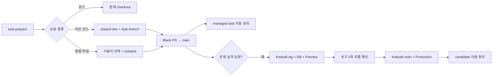

# AI 개발 파이프라인 v3.1 구현 보고서

2026-07-24 보완에서 사용자 결정에 따라 Windows Scheduler 설치·runner 경로를 제거하고, 병합 직후·다음 코드 작업 준비·수동 호출로만 실행되는 일회성 sweep으로 단순화했다.

## 한눈에 보는 결과

이번 변경은 “코딩보다 작업 폴더 생성·검사 반복·정리에 더 오래 걸리는 흐름”을 줄이기 위한 control plane을 구현했다. 질문·조사는 Git 자원을 만들지 않고, 작은 순차 개발은 공용 작업 공간을 재사용하며, 별도 폴더는 병렬·장기·위험 작업에서만 사용자 선택으로 만든다. Codex와 Claude는 같은 task 기록과 작업 공간을 이어받는다.

Black 개발 task, Keduall 운영 승격, 일회성 후속 정리를 서로 다른 기록으로 분리했다. 병합된 관리 대상만 자동 정리하며 불명확하거나 dirty인 항목은 삭제하지 않는다. Keduall production은 사용자의 명시적 승격 요청으로만 시작하고 최초 두 번은 `main` 병합 직전에 확인을 받는다. 다만 현재 구현은 승격 상태기계와 검증 계약까지이며, GitHub·Supabase·Vercel을 실제로 조작하고 그 결과를 수집하는 신뢰 실행기(trusted executor)는 아직 설치하지 않았다. 공개 CLI가 임의 증거로 상태를 넘기지 못하게 막았으므로 지금 상태는 자동 승격이 아니라 안전 중단이다.

다만 원격 반영은 아직 안전하지 않다. 로컬 remote 기록을 값 출력 없이 검사한 결과 과거 임시 산출물이 대량으로 남아 있다. 자격 증명 교체와 Git 이력 정리는 별도 승인 작업이므로 이번 구현에서는 실행하지 않았다. 실제 GitHub 계정 전환, Keduall bootstrap·DB 적용·Vercel 배포도 실행하지 않았다. 사용자 결정에 따라 Windows Scheduled Task와 상시 runner 설치 기능은 구현에서 제거했다.

| 구분 | 구현 전 | v3.1 구현 후 |
| --- | --- | --- |
| 읽기 요청 | lifecycle 자원을 만들 가능성 | `task:prepare --intent read-only`가 branch·worktree·registry를 만들지 않음 |
| 작은 코드 작업 | task마다 별도 worktree | task branch + `.worktrees/shared-dev` 공용 slot |
| Codex↔Claude | 도구별 작업 공간이 갈라질 수 있음 | 같은 `TaskRecordV3` claim과 workspace를 인수인계 |
| 자동 정리 | v2 승인 지문 또는 개별 정리 중심 | 병합 증거가 있는 managed v3 task만 자동 정리 |
| 운영 반영 | `collab` 의미와 절차가 자주 재질문됨 | Black → Keduall `stg` → DB gate → Keduall `main` → Vercel을 `PromotionRunV1`로 추적 |
| 검증 | 같은 SHA의 무거운 검사 반복 | 정확한 `(head SHA, base SHA, workflow digest)` 성공 증거만 재사용 |
| 보안 조사 | 특정 파일 중심 | 전체 reachable history의 임시 산출물 경로를 secret-safe하게 조사 |

## 구현된 흐름

핵심은 개발 task와 운영 승격을 한 record에 억지로 넣지 않는 것이다. Black 개발 작업은 `TaskRecordV3`, 운영 승격은 `PromotionRunV1`, 후속 정리는 병합 직후 호출 또는 다음 코드 작업 준비가 시작하는 일회성 sweep report가 책임진다.

## 구현 범위

| 영역 | 구현 내용 |
| --- | --- |
| Lifecycle V3 | 선택적 branch/workspace, shared slot, isolated/host/adopted 소유권, v2 copy migration, actor claim, runtime, 호환 명령 |
| 자동 정리 | Black·Keduall 병합 증거, exact SHA·remote·계정·소유권 검증, shared/isolated/host별 정리, TOCTOU 재검사, cooldown·lock |
| 운영 승격 | 고정 repository/auth profile, exact-parent candidate, 최초 2회 승인 상태기계, DB·Vercel evidence gate, alias-only rollback 계약. 실제 원격 조작 실행기는 미구현 |
| 일회성 sweep | 병합 직후 즉시 호출, 다음 코드 `task:prepare` catch-up, 수동 `task:sweep`, host-wide auth lock, 원계정 복원, 최대 10개·10분, 15분 cooldown |
| 검증 재사용 | 성공·완료된 정확한 세 key의 증거만 원자 저장·재사용 |
| 보안 감사 | blob 값을 읽지 않는 Git history 경로 inventory, ref snapshot·commit의 SHA-256, 닫힌 secret-safe 보고 형식 |
| 문서·CI | `AGENTS.md`, 운영 정본, `TESTING.md`, README 지도, skill, project structure coupling, pipeline 전용 CI 분류 |

## 보안 감사 결과

상세 inventory는 로컬에 저장된 `origin/main`, `collab/main` 두 ref를 대상으로 수행했다. 원격 최신 상태를 새로 fetch한 결과가 아니며 파일 내용이나 credential 값은 읽거나 기록하지 않았다.

| 항목 | 결과 |
| --- | ---: |
| 검사 ref | 2 |
| Git history 경로 출현 | 49,917 |
| finding | 2,736 |
| 고유 위험 경로 | 1,368 |
| 가장 많은 한 경로의 관련 commit hash | 38 |
| 실제 감사 시간 | 5.695초 |

| 탐지 규칙 | 건수 |
| --- | ---: |
| root의 비승인 이미지 | 902 |
| 중간 screenshot 경로 | 776 |
| `.scratch/**` | 704 |
| `artifacts/**` | 272 |
| 비승인 SQL | 46 |
| `.tmp/**` | 20 |
| 임시 script | 14 |
| 추적된 env 파일 | 2 |

이 finding은 “2,736개의 secret이 확인됐다”는 뜻이 아니다. 내용을 읽지 않고 위험 경로를 보수적으로 분류한 조사 목록이다. 실제 노출 판정·credential 교체·이력 정리는 별도 보안 사고 절차에서 수행해야 한다.

CI와 같은 입력인 `HEAD`, `origin/main`, `collab/main` 세 ref를 다시 검사한 결과는 74,570개 경로 출현, 4,104개 finding, fingerprint `55b4802ee1cbe8240a1ca2d966a1e13ad2c3aaebdb2d5bf2be5bbbb57ee372cd`였다. 동일 위험 경로가 여러 ref에 존재하므로 합계에는 중복이 포함된다. 이 검사는 finding 때문에 의도대로 종료 코드 1을 반환했으며, 현재 PR과 `main` 반영을 차단하는 보안 gate다.

## 검증과 소요시간

기능별 검증은 무거운 Git fixture를 묶어 반복하지 않고 독립적으로 실행했다.

| 명령·검증 | 결과 | 실제 시간 |
| --- | --- | ---: |
| 일회성 task sweep | 10/10 통과 | Vitest 0.397초, 명령 wall time 2.7초 |
| v2 copy → 단일 v3 sweep·비동기 시작 오류 보완 | 3/3 통과 | Vitest 명령 wall time 12.8초 |
| v3 adapter·공용 sweep 최종 집중 검사 | 22/22 통과 | Vitest 명령 wall time 5.0초 |
| 최종 sweep·adapter·project structure 회귀 검사 | 134/134 통과 | Vitest 명령 wall time 103.3초 |
| 구조·CI·sweep·adapter 집중 묶음 | 180/180 통과 | 79.16초 |
| Windows 예약 작업·runner 상태 | 둘 다 없음 | `TalkpikPipelineSweep` query와 `%LOCALAPPDATA%\TalkpikPipeline\runner` read-only 확인 |
| validation evidence | 19/19 통과 | Vitest 0.763초 |
| V3 cleanup adapter | 10/10 통과 | 0.452초 |
| V3 cleanup core | 4/4 통과 | 10.73초 |
| Keduall promotion | 33/33 통과 | 0.507초 |
| security artifact audit | 17/17 통과 | 18.32초 |
| TaskRecordV3 group | 5/5 통과 | 4.75초 |
| v2→v3 migration group | 4/4 통과 | 5.94초 |
| prepare/shared workspace group | 11/11 통과 | 39.86초 |
| claim/cleanup group | 8/8 통과 | 26.67초 |
| 전체 `check:task-lifecycle` 묶음 | 미완료·성능 실패 | Scheduler 제거 후에도 624초 timeout, 남은 전용 프로세스 종료 |
| project structure | 통과 | 명령 출력 확인 |
| agent skill policy·동기화 | 통과 | 명령 출력 확인 |
| CI trust boundary | 47/47 통과 | Vitest 34.29초 |
| 전체 typecheck | 통과 | 7.9초 |
| 전체 lint | 통과 | 29.5초 |
| production build | 통과 | 47.1초, Next compile 19.3초 + TypeScript 19.7초 |
| artifact hygiene | 첫 실행 실패 후 수정, 재실행 통과 | 새 production path 11개 정책 누락 |
| `node --check`, focused ESLint, Prettier, `git diff --check` | 통과 | 명령 출력 확인 |

기존 task 측정 record에는 총 16회, 452.474초가 기록돼 있다. 그중 test 10회가 398.066초이고 3회 실패했다. 이번 구현에서 확인된 반복 비용의 대부분도 코드 실행이 아니라 Windows에서 임시 Git 저장소를 여러 번 만드는 fixture였다.

security test fixture는 테스트마다 두 bare remote를 만들고 push하던 구조를 로컬 remote ref 방식으로 바꿨다. 전체 suite가 34초 제한을 넘기던 상태에서 17개 모두 18.32초에 끝났다. Lifecycle V3는 독립 group으로 총 28개를 모두 통과시켰지만 당시 모든 v2·v3·예약 작업·release·security·validation test를 한 프로세스에 묶은 `check:task-lifecycle`은 606.7초에도 끝나지 않았다.

예약 작업 설치·runner 테스트를 제거한 뒤 새 일회성 sweep 테스트 10개는 Vitest 기준 0.397초에 끝났다. 하지만 전체 `check:task-lifecycle`은 다시 624초 timeout을 넘겼다. timeout이 반환된 뒤에도 남아 있던 이 명령 전용 pnpm·Vitest 프로세스 3개는 command line과 PID를 확인한 뒤 종료했다. 따라서 Scheduler 제거는 개별 cleanup 경로를 가볍게 만들었지만 전체 묶음의 Windows Git fixture 누적 병목을 해결하지는 못했다.

독립 코드 리뷰에서 공개 `task:sweep`이 v2와 v3 정리기를 연달아 실행해 계정 복원 경계와 최대 처리 수·시간 예산을 두 번 적용할 수 있다는 문제가 발견됐다. 이를 유효한 v2 후보의 v3 copy → reconciliation → 단일 v3 sweep 순서로 바꿨다. 복사할 수 없는 legacy record는 보존하고, 이미 같은 branch의 v3 record가 있으면 중복 생성하지 않는다. 또한 숨김 일회성 프로세스가 시작 직후 비동기 오류를 내더라도 성공한 `task:prepare`나 `task:start`를 종료시키지 않도록 오류 listener를 등록했다.

재검토에서는 v3 record가 없는 순수 v2 task에 직접 `task:autocleanup`을 호출할 때 legacy 인증 경로로 내려갈 수 있는 우회가 추가로 발견됐다. 이 경로도 먼저 v3로 복사하고 v3 adapter를 재호출하도록 바꿨다. 복사 또는 재호출이 불명확하면 삭제하지 않고 보존하므로, 병합 직후 직접 정리와 다음 작업의 sweep 모두 같은 계정 lock·원계정 복원 경계를 사용한다.

## 실패·미완료·외부 승인

| 항목 | 현재 상태 | 이유 | 안전한 다음 행동 |
| --- | --- | --- | --- |
| credential 폐기·교체 | 미실행 | 계정 owner의 별도 보안 작업 | 두 계정과 관련 서비스 세션을 먼저 교체·폐기 |
| Git history rewrite·강제 push | 미실행 | 파괴적이며 clone·fork·PR cache에 영향 | 보안 inventory 검토 후 별도 승인과 공지 아래 실행 |
| GitHub Actions·PR·fork·clone·Vercel log 조사 | 미실행 | 원격 조사 권한과 범위 승인 필요 | 보안 사고 task에서 원격 inventory 작성 |
| 외부 병합 후 5분 내 자동 정리 보장 | 제공하지 않음 | 사용자 결정으로 운영체제 예약 작업을 제거 | 다음 코드 `task:prepare`가 catch-up하며 즉시 필요하면 `task:sweep` 직접 실행 |
| 실제 GitHub 계정 전환·permission 확인 | 미실행 | token·keyring을 사용하는 외부 동작 | 깨끗한 환경에서 두 profile smoke 검증 |
| Keduall 신뢰 실행기 | 미구현·안전 중단 | 실제 GitHub PR/merge, trusted DB evidence, Vercel evidence 수집 경로가 없음 | 보안 사고 처리 뒤 별도 구현·통합 검증. 그 전에는 공개 CLI가 `RELEASE_TRUSTED_EXECUTOR_REQUIRED`로 중단 |
| Keduall control plane bootstrap·`stg` 생성 | 미실행 | 보안 선행 조건과 Git publish 승인 필요 | 사고 처리 뒤 Keduall `main` bootstrap PR |
| production DB baseline·apply | 비활성 | migration drift와 N-1/N 호환성 기준선 미완료 | trusted operations workflow와 forward reconciliation 준비 |
| Vercel Preview·Production | 미실행 | 실제 승격을 요청하지 않았고 원격 반영 차단 | bootstrap과 DB gate 뒤 첫 수동 승인 승격으로 검증 |
| legacy 미등록 worktree 정리 | 미실행 | 자동 소유권을 부여할 수 없음 | read-only 감사표를 보고 사람이 task별 소유권 판단 |
| 전체 lifecycle 성능 예산 | 실패 | 한 프로세스에 Windows Git fixture가 누적돼 10분을 넘김 | test file shard와 immutable fixture 공유를 적용한 뒤 600초 안에 전체 묶음 재검증 |

## 기존 worktree·registry 읽기 전용 감사

| 항목 | 로컬 확인 수 |
| --- | ---: |
| native worktree | 24 |
| v2 task record | 13 |
| 실제 worktree가 남은 v2 task | 6 |
| `CLEANED` tombstone이 있는 v2 task | 7 |
| v2 registry 밖 native worktree | 18 |
| locked / prunable worktree | 0 |

미등록 18개는 이름이나 위치만으로 자동 소유권을 추정하지 않는다. 이번 구현은 목록만 보여주고 삭제하지 않는다.

## 오래 걸린 부분과 줄이는 방법

| 오래 걸린 부분 | 원인 | 이번 대응 | 다음 개선 |
| --- | --- | --- | --- |
| lifecycle 통합 테스트 | Windows Git process와 임시 저장소를 반복 생성하고 장수 worker에 fixture가 누적 | 공용 fixture와 범위별 검증, worker 2개 제한, 10분 상한 적용 | test file을 격리 shard로 나누고 immutable bare repository fixture를 더 공유한 뒤 600초 예산 재검증 |
| security history 테스트 | 매 테스트마다 bare remote 2개·push | 로컬 remote ref fixture로 교체해 18.32초로 단축 | immutable template copy와 command 횟수 계측 |
| 전체 파이프라인 검증 반복 | 같은 SHA를 여러 단계에서 다시 검사 | validation evidence exact-key cache 구현 | Black PR 한 번의 full 결과를 Keduall 승격이 소비 |
| 자동 정리 안전성 | 인증·GitHub·Git·TOCTOU 조건이 많음 | preview와 mutation을 분리하고 deadline을 하위 호출까지 전달 | 실제 keyring smoke는 최초 설치 때 한 번만 측정 |

## 남은 위험

- 보안 finding이 0이 아니므로 이 변경을 원격에 올리거나 Keduall로 승격하는 선행 조건은 충족되지 않았다.
- 전체 lifecycle 묶음이 10분 성능 예산을 넘겼으므로 현재 변경은 merge-ready가 아니다. 개별 기능 검사는 통과했지만 합산 검증의 완료 증거가 없다.
- 원격 URL 비교는 GitHub checkout이 만드는 `.git` 없는 HTTPS URL과 로컬의 `.git` 있는 URL을 같은 identity로 정규화한다. 다른 owner/repository는 계속 거부한다.
- 승인된 검증 workflow가 실패하거나 실행 중 Git 상태가 바뀌면 `validation:record`도 비정상 종료하므로 자동화가 성공으로 오인하지 않는다.
- 일회성 sweep과 release 코드는 fail-closed 계약을 유지하지만 실제 Windows keyring·GitHub·Vercel 통합 검증은 아직 없다.
- production DB 자동 apply는 의도적으로 꺼져 있다.
- `origin/main`과 `collab/main`은 로컬 ref 기준 서로 다른 이력을 가진다. bootstrap은 일반 승격과 분리해야 한다.
- host/adopted 및 legacy worktree는 자동 삭제하지 않으므로 최초 정리에서는 `PRESERVED`가 다수 나올 수 있다.

이 문서는 2026-07-23의 구현 증거다. 이후 운영 규칙은 [`docs/operations/ai-development-pipeline.md`](../../operations/ai-development-pipeline.md)를 정본으로 사용한다.
