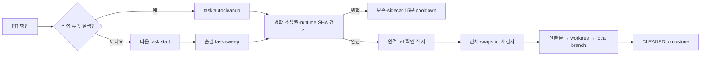

# 병합 후 자동 lifecycle cleanup 구현 보고서

> 구현일: 2026-07-23 · 성격: 구현 당시 증거 · 운영 정본: [`../../operations/ai-development-pipeline.md`](../../operations/ai-development-pipeline.md)

## 결과 요약

PR 병합 뒤 사용자가 별도 승인 fingerprint를 입력하지 않아도 정식 v2 task를 안전 조건 아래 자동 정리하는 경로를 구현했다. 에이전트가 병합한 작업은 `task:autocleanup`, 외부에서 병합된 누적 작업은 다음 `task:start`이 예약한 일회성 `task:sweep`으로 처리한다. 위험하거나 확인할 수 없는 상태는 삭제하지 않고 `PRESERVED` 또는 `FAILED` sidecar로 남기며 새 작업 시작을 막지 않는다.

| 구분 | 구현 전 | 구현 후 |
| --- | --- | --- |
| 정상 병합 task | finalize fingerprint를 사람이 다시 승인 | 병합·SHA·runtime·소유권 재검증 뒤 자동 비강제 정리 |
| 남은 원격 branch | 자동 정리 차단 | `blackstarzck` 인증·저장소 identity·정확한 head SHA 확인 뒤 해당 ref만 삭제 |
| 외부 병합 | 수동 발견 필요 | 다음 task 시작 뒤 숨김 one-shot sweep |
| 위험 상태 | 수동 finalize에서 blocker 확인 | 자동 경로도 삭제 없이 blocker와 재시도 시각 기록 |
| 수동 복구 | `task:cleanup --approval` | 기존 방식 그대로 호환 |

자동 경로도 기존 journal과 비강제 삭제 순서를 그대로 사용한다. `--force`, `git branch -D`, `collab` 조작은 추가하지 않았다.

## 구현 내용

- 공개 명령 `task:autocleanup --repo <base> --branch <branch>`와 `task:sweep --repo <base>`를 추가했다.
- TaskRecordV2는 바꾸지 않고 닫힌 `AutoCleanupReportV1`, `AutoCleanupSweepV1` sidecar를 Git common directory에 원자 기록한다.
- sweep은 valid ACTIVE v2 record의 정식 `.worktrees/<type>-<slug>`만 열거한다. legacy, 경로 탈출, symlink·junction·reparse, 잘못된 Windows casing identity는 후보에서 제외한다.
- 저장소 sweep lock과 task operation lock을 사용하고 최대 10개, 실행 중 후보를 포함한 전체 10분 hard deadline, 동일 blocker 15분 cooldown을 적용한다. 직접 autocleanup은 cooldown을 건너뛴다.
- task 시작은 worktree 생성을 먼저 확정한 뒤 최신 worktree CLI로 숨김 one-shot worker를 예약한다. spawn 실패는 시작 결과를 바꾸지 않는다.
- 오래된 기준 checkout CLI를 쓴 경우 최신 CLI의 `sweep --background true`를 명시적으로 실행할 수 있다. 프로세스 작업 위치와 `--repo`는 정리 대상 밖의 안전한 기준 checkout으로 유지하고, 실행할 파일 경로만 새 worktree의 최신 `scripts/ai-task.mjs`를 가리킨다.
- task 시작의 성공 JSON과 측정 record는 sweep 예약보다 먼저 확정한다.
- 원격 branch가 남으면 다른 blocker가 없는 상태에서만 `blackstarzck` 인증과 GitHub 저장소 identity를 확인한다. 원격 ref SHA가 merged PR head와 정확히 같을 때 조건부 lease로 원자 삭제하고 전체 snapshot을 다시 비교한다.
- `gitCommonDir`·정식 경로·native ownership이 맞지 않으면 인증이나 삭제 전에 `PRESERVED` sidecar를 기록한다.
- 에이전트가 `origin/main` 병합에 성공하면 대상 worktree 밖의 기준 checkout에서 해당 branch `task:autocleanup`을 즉시 실행하는 절차를 운영 정본과 `AGENTS.md`에 고정했다.
- 시간 초과 worker는 Windows에서 정확한 root PID의 process tree만 `taskkill /T /F`로 종료하고, Windows가 아닌 환경에서는 전용 process group만 종료한다. root close와 tree 종료 확인 뒤에만 정확한 PID/UUID 일반 operation lock을 회수한다. 확인 실패 시 lock·journal을 보존하고 같은 sweep의 다음 후보를 실행하지 않는다.
- 종료가 확인된 timeout은 task별 실패 sidecar를 남기고, 종료 미확인 실패는 실행 중 child와 경쟁하지 않는 sweep `runnerFailure`에만 안전한 blocker와 15분 재시도 시각을 남긴다.
- 종료 미확인 `runnerFailure` 기록마저 실패하면 시작 시 미리 만든 `holdUntil` sweep lock을 최대 25분 보존해 이후 sweep 전체를 막는다.
- 직접 autocleanup과 sweep의 완료 기록이 엇갈려도 짧은 보고서 전용 lock 아래 `CLEANED`를 최종 상태로 보존한다. `CLEANED`는 빈 blocker와 `retryAt: null`, 보존·실패는 하나 이상의 blocker와 미래 재시도 시각만 허용한다.
- 보고서 lock 대기 중 parent directory를 junction으로 바꾸는 경쟁도 매 재시도와 획득 직후 identity 재검증으로 차단한다. 10분 지난 malformed lock만 exact identity로 원자 회수한다.
- sweep이 기존 direct `CLEANED`를 선택한 경우 현재 `SWEEP` trigger로 다시 fingerprint한 응답을 반환해 성공 건수로 집계한다. 남은 시간이 35초 이하이면 새 cooldown preview를 시작하지 않는다.
- production preview의 fetch·GitHub·원격 조회는 한 절대 deadline을 공유하고, cleanup child 뒤 마지막 5초는 sweep 보고서 기록에 남겨 전체 10분 경계를 지킨다.

## TDD와 실측 시간

아래 시간은 PowerShell stopwatch로 관찰한 실제 wall time이다. 전체 검증 결과는 완료되는 대로 이 표에 추가하며, 실행하지 않은 항목을 성공으로 적지 않는다.

| TDD 묶음 | RED | GREEN | 결과 |
| --- | ---: | ---: | --- |
| report/sweep 폐쇄형 schema·package 명령 | 3.074초 | 2.384초 | 성공 |
| v2 열거·legacy/경로 탈출·cooldown | 8.266초 | 7.582초 | 성공 |
| 승인 없는 정상 병합 자동정리 | 9.831초 | 32.818초 | 성공 |
| `blackstarzck` 성공·실패, 원격 삭제 뒤 TOCTOU | 10.917초 | 53.934초 | 3개 Git fixture 성공 |
| sweep 최대 10개·summary | 3.738초 | 3.313초 | 성공 |
| cooldown·10분 제한·scheduler | 4.620초 / 4.541초 | 4.083초 | 테스트 fingerprint 오류 수정 뒤 성공 |
| 자기 worktree 삭제 거부 | 5.825초 | 6.729초 | 성공 |
| task:start scheduler 실패 비차단 | 4.439초 | 9.068초 | reparse/case 테스트와 함께 성공 |
| worktree 제거 뒤 자동 journal 재개 | 12.228초 | 15.757초 | sweep 재열거와 CLEANED 완료 성공 |
| malformed stale sweep lock 보존 | 3.869초 | 7.015초 | unknown field lock은 회수하지 않음 |
| autocleanup 승인 인자 거부 | 4.161초 | 9.375초 | 자동 경로가 수동 approval을 받지 않음 |
| duplicate/stale sweep lock·CLI 경계 | 해당 구현 묶음 뒤 추가한 회귀 | 5.255초 | 2개 성공 |
| 조건부 lease remote race·hard deadline·start 출력 순서 | 15.962초 | 24.385초 | 4개 선택 검사 성공 |
| owner-auth cooldown 4종·실제 종료시각·common-dir/native 보존 | 21.060초 | 31.934초 | 7개 선택 검사 성공 |
| production child SWEEP report 경계 | 2.399초 | 2.464초 | 성공 |
| timeout lock 회수와 journal lock 보존 | 5.465초 | 7.466초 | 성공 |
| Windows process tree 종료·root close·lock 회수 순서 | 18.244초 | 19.285초 | Windows 실제 descendant 포함 4개 focused 성공 |
| tree 종료 미확인 뒤 다음 후보 차단 | 4.228초 | 5.156초 | 첫 후보 뒤 sweep 중단 성공 |
| 안정화 뒤 Windows 실제 process tree 단독 재검증 | 해당 없음 | 23.621초 | test 16.837초, root·descendant PID 종료와 lock 부재 확인 |
| deadline 직전 후보 count 일관성 | 4.832초 | 3.394초 | 성공 |
| 즉시 post-merge 절차·조건부 lease 문서 계약 | 2.615초 | 2.443초 | 성공 |
| 최적화 전 autocleanup 전체 | 해당 없음 | 184.145초에서 강제 종료 | 당시 29개, 180초 성능 경계 초과로 최종 결과 없음 |
| 최적화 전 remote/merge 6개 묶음 | 해당 없음 | 124.039초에서 강제 종료 | 반복 저장소 생성이 주 병목 |
| 기본 저장소 template 도입 뒤 remote/merge 6개 | 해당 없음 | test 88.380초, wall 93.222초 | 6/6 성공 |
| merge-ready template 도입 뒤 remote/merge 6개 | 해당 없음 | test 30.850초, wall 34.516초 | 6/6 성공 |
| 위험 상태 12개 묶음 최적화 | 해당 없음 | test 27.622초 → 15.344초 | 실제 보존 조건은 유지하고 중복 원격 조회만 주입으로 대체 |
| 복제 fixture 격리 검증 | 해당 없음 | test 10.420초, wall 14.590초 | 두 복제본과 원본 template의 ref·파일 독립성 확인 |
| Windows 실제 process tree 연속 재검증 | 해당 없음 | test 14.060초 / 14.760초 | wall 15.723초 / 16.949초, 두 번 모두 성공 |
| 최종 autocleanup 전체 | 해당 없음 | test 90.760초, wall 93.242초 | 30/30 성공, Vitest 전체 91.270초 |
| timeout·종료 미확인 실패 기록과 cooldown | 12.600초 | 12.560초 | 5/5 성공, 원문 오류 미저장과 연속 sweep 유예 확인 |
| 종료 미확인 sidecar 쓰기 실패의 fail-closed lock | 9.000초 | 13.240초 | 관련 3/3 성공, 20분 시점 재실행 차단 확인 |
| 실패 기록 보완 뒤 autocleanup 전체 | 해당 없음 | test 74.320초, wall 76.818초 | 32/32 성공, Vitest 전체 74.730초 |
| 독립 리뷰 3건 회귀(구버전 CLI fallback·동시 기록·상태 invariant) | wall 85.900초 | wall 107.400초 | RED 3건 확인 뒤 35/35 성공 |
| 최종 독립 리뷰 4건(path swap·trigger 집계·deadline·malformed lock) | 리뷰 재현 | 선택 검사 30.900초 | 4/4 성공; junction 외부 쓰기 없음 |
| 리뷰 보완 뒤 autocleanup 전체 1차 | 해당 없음 | wall 116.000초 | 36/37 성공; 새 시각 조회에 맞지 않은 기존 fake clock fixture 1건 발견 |
| 리뷰 보완 뒤 autocleanup 전체 최종 | 해당 없음 | test 118.630초, wall 125.000초 | 37/37 성공; 측정 예산 120초는 5초 초과 경고 |
| 절대 deadline 공유·최종 autocleanup | 2개 실패 확인 | test 95.190초, wall 99.600초 | 38/38 성공; 120초 예산 안으로 복귀 |
| 전체 test 첫 실행 | 해당 없음 | wall 811.300초 | 3,033개 성공, 공용 Git template `beforeAll`이 병렬 부하에서 기본 10초 timeout을 넘어 suite 시작 실패; assertion 실패 없음 |
| 전체 test 두 번째 실행 | 해당 없음 | wall 829.000초 | 3,063개 성공, Git-heavy 통합 3개가 병렬 I/O에서 기본 40초 상한을 0.339~15.308초 초과; assertion 실패 없음 |
| 전체 lifecycle 리뷰 전 최종 | 해당 없음 | wall 787.400초 | 5 files, 206/206 성공; 직전 715.835초보다 10.0% 느리지만 기존 로컬 1,290.453초보다 39.0% 단축 |
| 전체 lifecycle 최종 리뷰 중간점 | 해당 없음 | wall 722.400초 | 5 files, 208/208 성공; 이후 절대 deadline 공유 변경은 focused 38/38과 PR CI에서 재검증 |
| 전체 test 최종 | 해당 없음 | wall 711.687초 | 308 files 성공, 8 files 환경상 skip; 3,066개 성공, 17개 skip, 실패 없음 |
| owner-auth 계약 | 해당 없음 | wall 2.327초 | 17/17 성공 |
| 최종 project structure | 해당 없음 | wall 3.250초 | 성공 |
| 최종 artifact hygiene | 해당 없음 | wall 4.151초 | 성공 |
| 최종 agent skill sync | 해당 없음 | wall 2.224초 | 성공 |
| 최종 typecheck | 해당 없음 | wall 8.507초 | 성공 |
| 최종 lint | 해당 없음 | wall 33.356초 | 성공 |
| 최종 production build | 해당 없음 | wall 57.978초 | 성공; build가 바꾼 `next-env.d.ts` 생성 경로는 원래 값으로 복원 |
| deadline 보완 뒤 최종 lint | 해당 없음 | measured 25.100초, wall 26.900초 | 성공 |
| deadline 보완 뒤 최종 production build | 해당 없음 | measured 45.654초, wall 48.800초 | 성공; `next-env.d.ts` 복원 뒤 작업 변경 없음 확인 |
| 최종 독립 코드 리뷰 | 해당 없음 | 리뷰 완료 | P0~P2 지적 없음, merge 가능 판정 |
| 기존 finalize·수동 cleanup 선택 회귀 | 해당 없음 | 90.630초 | 11/11 성공, 71 skip |
| 기존 public lifecycle CLI 선택 회귀 | 해당 없음 | 28.458초 | 4/4 성공, 61 skip |
| 리뷰 최종 cleanup 안전장치 선택 회귀 | 해당 없음 | 33.680초 | 6/6 성공, 76 skip, wall 36.707초 |
| 리뷰 최종 public lifecycle CLI 선택 회귀 | 해당 없음 | 11.750초 | 2/2 성공, 63 skip, wall 14.201초 |
| project structure package 계약 | 해당 없음 | 2.742초 | 1/1 성공, 111 skip |
| `pnpm check:project-structure` | 해당 없음 | 2.992초 | 성공 |
| 리뷰 최종 `pnpm check:project-structure` | 해당 없음 | 2.778초 | 성공 |
| `pnpm check:artifact-hygiene` | 해당 없음 | 4.165초 | 성공 |
| 변경 JS/MJS scoped ESLint | 해당 없음 | 16.958초 | 성공 |
| 변경 파일 scoped Prettier | 해당 없음 | 2.697초 | 성공 |
| 리뷰 최종 scoped ESLint | 해당 없음 | 14.043초 | 성공 |
| 리뷰 최종 scoped Prettier write | 해당 없음 | 2.009초 | 성공 |
| 리뷰 최종 node 문법·Prettier check·diff check | 해당 없음 | 3.4초 이하 | 모두 성공 |

성능 저하의 주원인은 각 테스트가 bare remote·seed·base·merged worktree를 처음부터 반복 생성한 것이었다. 읽기 전용 기본 template과 병합 완료 template을 한 번만 만들고, 각 테스트가 독립 복제본을 쓰도록 바꿨다. remote/merge 6개 묶음의 wall time은 93.222초에서 34.516초로 58.706초(63.0%) 줄었다. 최적화 전 전체 파일은 184.145초 제한 안에 끝나지 않았지만, 실패 기록 보완 뒤 최종 파일은 테스트 32개를 모두 통과하며 wall 76.818초에 끝났다. 미완료 baseline과의 정확한 증감률은 계산하지 않는다.

위험 상태 12개 검사는 dirty 파일, 실제 PID·port·lock, locked·detached worktree, operation lock과 PR 상태 검사를 유지했다. 실제 원격 경쟁과 exact SHA 조건부 삭제는 별도 bare Git 테스트에서 계속 검증하므로, 이 묶음 안의 중복 원격 identity·SHA 조회만 dependency injection으로 대체했다. 해당 묶음은 test 27.622초에서 15.344초로 12.278초(44.5%) 줄었다. template 복제본끼리 remote ref와 worktree 파일을 서로 오염하지 않는 별도 회귀 테스트도 추가했다.

리뷰 보완 전 autocleanup 파일 wall 76.818초는 180초 제한과 선호 목표 90초를 모두 충족했다. 최종 리뷰에서 Git 통합 회귀 5개가 늘어난 뒤에는 한때 wall 125.000초로 small-check 120초 예산을 5초 초과했으나, 네트워크 단계가 하나의 절대 deadline을 공유하도록 보완한 최종 실행은 38/38 성공, wall 99.600초로 예산 안에 복귀했다. Windows 실제 process-tree 테스트의 대기시간은 느린 Windows 환경의 handshake flake를 피하기 위해 줄이지 않았다. 같은 로컬 환경의 리뷰 전 전체 lifecycle은 기존 1,290.453초에서 787.400초로 503.053초(39.0%) 단축됐고, 직전 구현 측정 715.835초보다는 71.565초(10.0%) 늘어 로컬 15% gate 안에 있다. PR #60의 Windows CI 520초와는 실행 환경이 다르므로, CI 수치는 구현 PR의 Windows job에서 별도로 비교한다.

파이프라인 측정기는 총 14회 실행을 기록했다. 최종 성공 10회 외 실패 4회와 예산 초과 3회도 삭제하지 않고 보존했다. 이는 TDD RED, 병렬 Windows Git I/O 상한 발견, 리뷰에서 재현한 회귀의 중간 기록이며 현재 남은 실패를 뜻하지 않는다. 중복 없이 계산한 실제 측정 구간은 2,128.403초이고, 병렬 리뷰 167.019초가 전체 명령 합계와 겹쳤다.

## 보존 조건과 호환성

자동 경로를 직접 호출해 dirty, runtime PID·port·lock, locked·detached·native owner, 열린 PR, PR/head·base SHA 불일치, task operation lock, 저장소 identity와 remote SHA 실패를 모두 `PRESERVED`로 확인했다. 수동 `task:cleanup --approval`의 승인 재검증, 부분 실패 journal과 재개 순서도 변경하지 않았다.

| 상태 | 자동 결과 | 삭제 |
| --- | --- | --- |
| 모든 조건 안전 | `CLEANED` | 비강제 순서로 수행 |
| 병합·runtime·소유권·경로 blocker | `PRESERVED` | 없음 |
| 인증·저장소 identity·원격 SHA 실패 | `PRESERVED` | 로컬 항목 없음 |
| 원격 삭제 뒤 snapshot 변경 | `PRESERVED` | worktree·local branch 없음 |
| cleanup 단계 예외 | `FAILED` | journal에서 안전하게 재개 |
| worker timeout, tree 종료 확인 | `FAILED` | task sidecar 기록, 15분 유예, 이후 후보 중단 |
| worker process tree 종료 미확인 | `FAILED` | sweep runner failure 기록, operation lock·journal 보존, 15분 유예, 이후 후보 중단 |
| 종료 미확인 sidecar 쓰기 실패 | `FAILED` | `holdUntil` sweep lock 보존, 이후 sweep 전체 중단 |

## 미완료·외부 상태

| 항목 | 현재 상태 | 다음 안전 행동 |
| --- | --- | --- |
| 전체 project/lifecycle/typecheck/test/lint/build | 모두 성공. 전체 test 첫 두 번은 Windows 병렬 Git I/O timeout을 찾아 hook·고비용 통합 test 상한을 좁게 보완한 뒤 최종 3,066개 성공. 마지막 deadline 보완은 focused 38/38, lint, build와 정적 계약으로 재검증 | PR에서 전체 lifecycle과 전체 test를 다시 실행 |
| Windows lifecycle CI | 미실행 | PR ready 검사에서 대상 밖 프로세스 제거와 path case/reparse 재검증 |
| 최초 기존 v2 sweep | 미실행 | 구현 PR 병합 뒤 안전한 기준 checkout에서 한 번 실행 |
| 기존 v2 task 실제 삭제 결과 | 미확인 | 최초 sweep sidecar의 CLEANED/PRESERVED/FAILED 건수로 후속 기록 |
| `collab`, 원격 Supabase | 범위 밖 | 변경하지 않음 |

최초 post-merge sweep은 이 구현 branch가 아직 병합되지 않았으므로 실행할 수 없다. 구현 중 실제 사용자 worktree·branch·registry에는 cleanup 또는 sweep을 실행하지 않았다.
