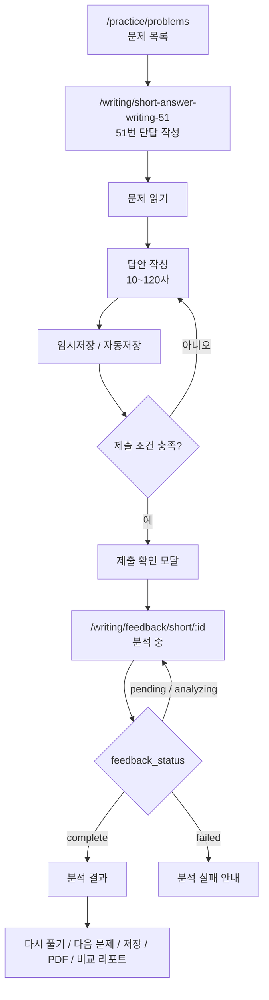
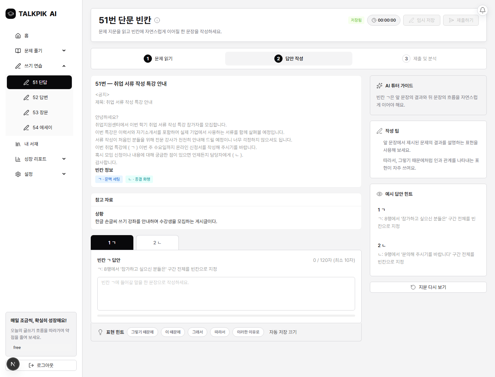
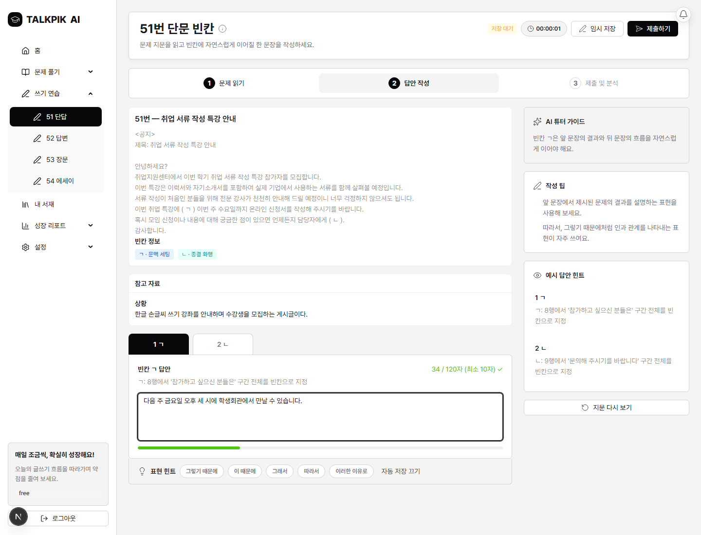
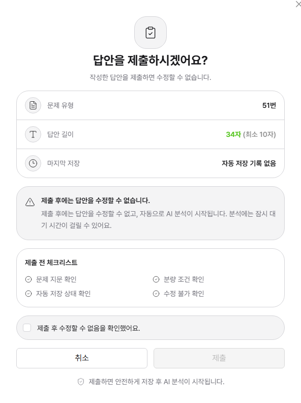
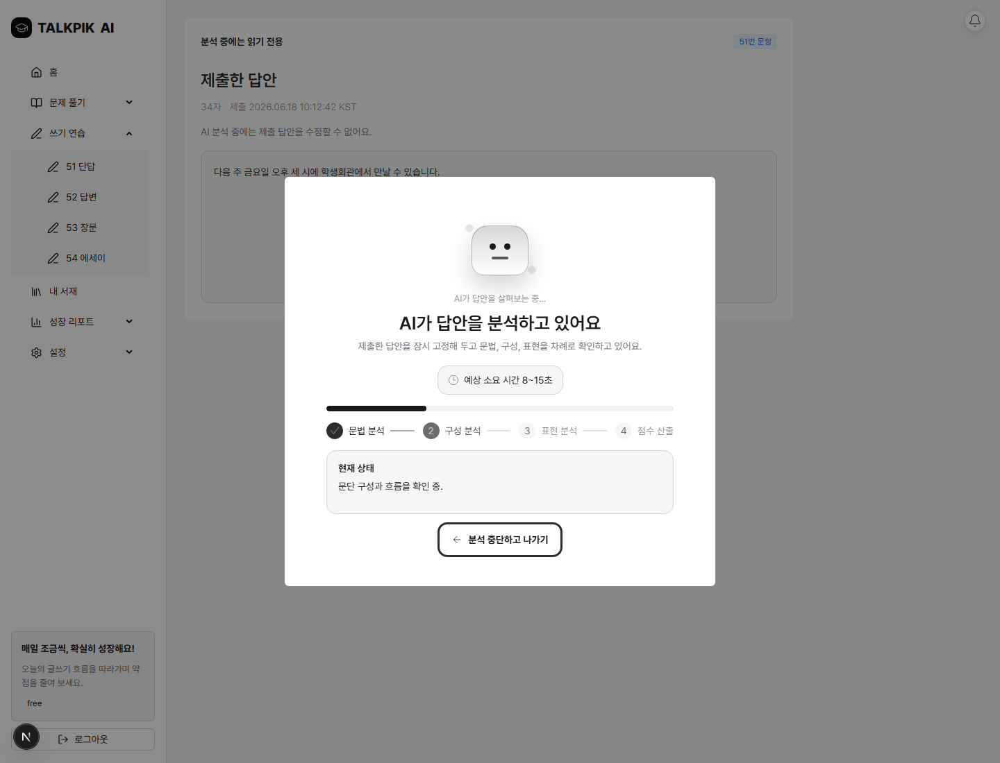
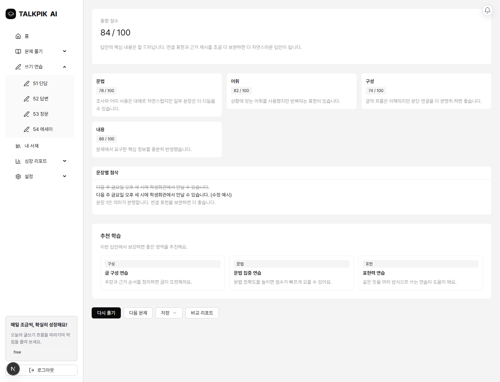
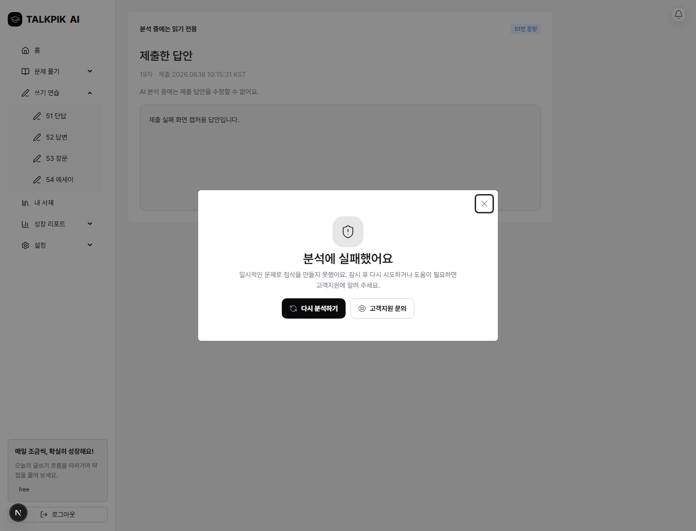

# 51번 단답 작성

## 페이지 이동 흐름

## 상태별 UI 캡처

| 상태 | 설명 | 캡처 |
| --- | --- | --- |
| 기본 화면 | 문제를 읽고 답안을 쓰기 전 상태 |  |
| 작성 중 | 답안을 입력하고 글자 수와 저장 상태를 확인하는 상태 |  |
| 제출 확인 모달 | 제출 전 최종 확인, 글자 수, 저장 시각, 동의 체크를 확인하는 모달 |  |
| 분석 중 | 제출 후 피드백 생성 전 상태. pending/analyzing 상태 polling |  |
| 분석 결과 | 분석 완료 후 총평, 문장 피드백, 추천, 다음 행동 CTA 표시 |  |
| 분석 실패 | feedback_status가 failed이고 결과 데이터가 없을 때 실패 안내와 재시도 흐름 표시 |  |

## 정리

- 페이지: `/writing/short-answer-writing-51`
- 분석 페이지: `/writing/feedback/short/:id`
- 글자 수 기준: 10~120자
- 흐름: 지문과 빈칸 조건을 읽고, 짧은 단답을 작성한 뒤 제출 확인 모달을 거쳐 짧은 답안 분석으로 이동한다.
- 주요 모달: 제출 확인 모달, 분석 중 로딩 패널, 분석 실패 안내 상태
