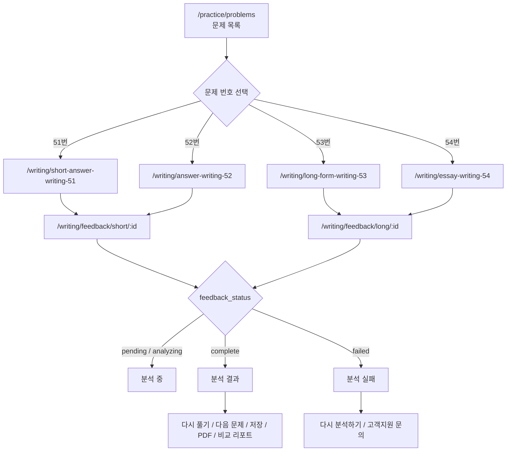

# Writing 51~54 Redesign Test

`/writing/*` 51~54 페이지의 페이지 이동 흐름, 상태별 UI, 제출 모달, 분석 상태 캡처를 모아 둔 확인용 문서입니다.

## 전체 이동 흐름

## 페이지별 문서

| 문제 | 문서 | 작성 페이지 | 분석 페이지 |
| --- | --- | --- | --- |
| 51번 | [51/README.md](./51/README.md) | `/writing/short-answer-writing-51` | `/writing/feedback/short/:id` |
| 52번 | [52/README.md](./52/README.md) | `/writing/answer-writing-52` | `/writing/feedback/short/:id` |
| 53번 | [53/README.md](./53/README.md) | `/writing/long-form-writing-53` | `/writing/feedback/long/:id` |
| 54번 | [54/README.md](./54/README.md) | `/writing/essay-writing-54` | `/writing/feedback/long/:id` |

## 캡처 상태

각 폴더는 동일한 파일 구성을 가집니다.

| 파일 | 상태 |
| --- | --- |
| `01-writing-default.png` | 작성 페이지 기본 화면 |
| `02-writing-filled.png` | 답안 작성 중 화면 |
| `03-submit-modal.png` | 제출 확인 모달 |
| `04-analysis-pending.png` | `pending` / `analyzing` 분석 중 화면 |
| `05-feedback-complete.png` | `complete` 분석 결과 화면 |
| `06-analysis-failed.png` | `failed` 분석 실패 화면 |
