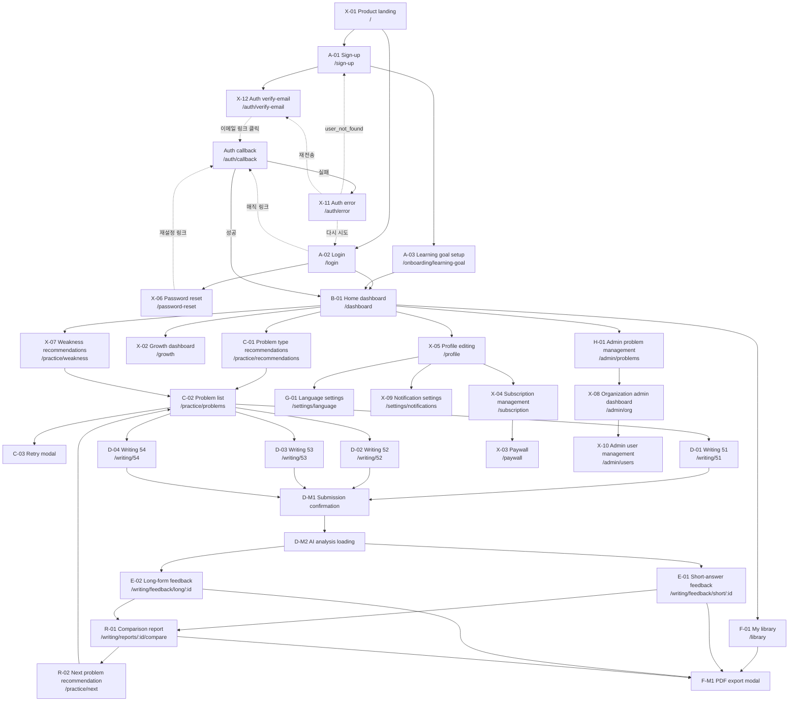

# TALKPIK AI Sitemap And Page Connections

> Status note (2026-05-19)
>
> This document is the route authority until production source exists. The route
> map below is aligned to the Paper wireframe frame
> `01KQ6XQSNNNXSXWR2H4Q6SMMN3/1-0/4R1-0` and the current IA set in
> [docs/Wireframe/README.md](./Wireframe/README.md).

## Source Order

Use these documents together when implementing or reviewing page coverage:

1. [docs/sitemap.md](./sitemap.md) - route authority and page connection map.
2. [docs/Wireframe/README.md](./Wireframe/README.md) - current 32-screen IA inventory, with one `description.md` and one `wireframe.png` per screen.
3. [docs/flow/user-flow.md](./flow/user-flow.md) - user flow and screen dependency order.
4. [docs/ia-pages/README.md](./ia-pages/README.md) - legacy observed HTML crosswalk only.

Do not use the legacy `docs/ia-pages` files as the current screen inventory. They
remain useful for historical UI observations, but the Paper frame and `docs/Wireframe`
are the current baseline.

## Target React Route Map

| IA | Screen | React route | Route type | Notes |
| --- | --- | --- | --- | --- |
| X-01 | Product landing | `/` | page | Public entry point. Links to sign-up and login. |
| A-01 | Sign-up | `/sign-up` | page | Account creation. |
| A-02 | Login | `/login` | page | Existing user entry. |
| X-06 | Password reset | `/password-reset` | page | Password recovery flow. |
| A-03 | Learning goal setup | `/onboarding/learning-goal` | page | First-run onboarding before the dashboard. |
| B-01 | Home dashboard | `/dashboard` | page | Authenticated learning dashboard. |
| C-01 | Problem type recommendations | `/practice/recommendations` | page | Recommends writing/problem types. |
| C-02 | Problem list | `/practice/problems` | page | Problem candidates after recommendation/filtering. |
| C-03 | Retry modal | hosted by `/practice/problems` | modal | Retry/continue decision over the problem list context. |
| D-01 | Short-answer writing 51 | `/writing/51` | page | TOPIK writing question 51. |
| D-02 | Answer writing 52 | `/writing/52` | page | TOPIK writing question 52. |
| D-03 | Long-form writing 53 | `/writing/53` | page | TOPIK writing question 53. |
| D-04 | Essay writing 54 | `/writing/54` | page | TOPIK writing question 54. |
| D-M1 | Submission confirmation | hosted by `/writing/51`, `/writing/52`, `/writing/53`, `/writing/54` | modal | Confirm before final submission. |
| D-M2 | AI analysis loading | hosted by writing submission flow | modal/state | Transitional analysis state after submit. |
| D-M3 | Autosave warning | hosted by writing routes | modal/toast | Warns about autosave state while writing. |
| E-01 | Short-answer feedback | `/writing/feedback/short/:id` | page | Feedback for short-answer submissions. |
| E-02 | Long-form feedback | `/writing/feedback/long/:id` | page | Feedback for long-form/essay submissions. |
| R-01 | Comparison report | `/writing/reports/:id/compare` | page | Compares current and previous submissions. |
| R-02 | Next problem recommendation | `/practice/next` | page | Recommends the next problem after feedback/reporting. |
| F-01 | My library | `/library` | page | Saved work, feedback history, exports, and study records. |
| F-M1 | PDF export modal | hosted by `/library`, feedback, and report routes | modal | Exports a selected result/report. |
| G-01 | Language settings | `/settings/language` | page | App language settings. |
| H-01 | Admin problem management | `/admin/problems` | page | Problem/content management. |
| X-02 | Growth dashboard | `/growth` | page | Progress and growth analytics. |
| X-03 | Paywall | `/paywall` | page | Paywall/plan-selection shell. Payment provider integration is deferred. |
| X-04 | Subscription management | `/subscription` | page | Subscription status shell. Billing implementation is deferred. |
| X-05 | Profile editing | `/profile` | page | User profile editing. |
| X-07 | Weakness-based recommendations | `/practice/weakness` | page | Recommendations based on weak areas. |
| X-08 | Organization admin dashboard | `/admin/org` | page | Institution-level admin overview. |
| X-09 | Notification settings | `/settings/notifications` | page | Notification preferences. |
| X-10 | Admin user management | `/admin/users` | page | Admin user/account management. |
| —    | Auth callback | `/auth/callback` | route handler | Token-hash → `verifyOtp` 분기, code → `exchangeCodeForSession`. `next` query는 relative-only. 성공 시 `next` 또는 `/dashboard`로 redirect, 실패 시 `/auth/error?reason=<canonical>&retry_after_seconds=<n?>`로 redirect. raw `error_description`은 서버 로그에만. `export const dynamic = 'force-dynamic'`. **Phase 8 follow-up P0 fix(2026-05-27)**: page → Route Handler 전환 (Server Component cookies.set silent fail로 Set-Cookie 미발급되던 production 버그 해결). |
| —    | Auth callback fragment | `/auth/callback-fragment` | page | Implicit flow #fragment 처리. Route Handler가 query 없는 callback 요청을 이리 redirect → 브라우저가 RFC 7231로 fragment retain → client component `CallbackFragmentFallback`이 `window.location.hash` 파싱 → 정확한 `/auth/error?reason=…` 또는 `setSession` 후 `router.replace(next)`. |
| X-11 | Auth error | `/auth/error` | page | 11개 Supabase `error.code` 기반 reason 분기 (`otp_expired`, `flow_state_expired`, `flow_state_not_found`, `bad_code_verifier`, `user_not_found`, `over_email_send_rate_limit`, `over_request_rate_limit`, `email_not_confirmed`, `signup_disabled`, `access_denied`, `unknown`). rate-limit 계열은 `retry_after_seconds` countdown. Email prefill query는 untrusted (가시·편집 가능 input). |
| X-12 | Auth verify-email | `/auth/verify-email` | page | 가입 직후 인증 메일 발송 안내 + 60초 cooldown 재전송 (Supabase same-user 60s + project 30/hour OTP + 빌트인 SMTP 2/hour 한도). |
| —    | Auth sign-out | `/auth/sign-out` | route handler (POST) | 서버 사이드 세션 쿠키 정리. 본 phase 카탈로그만, 코드 도입은 후속 작업. |

## Route Audience Map

각 React route의 audience(UI/권한 분기) 분류. Light Spec의 `Audience` 필드, [`docs/agent-index.md`](agent-index.md) "Admin 화면" 라우팅 행, [`docs/ai-workflow/review-gates.md#architecture-pass`](ai-workflow/review-gates.md#architecture-pass)의 audience 경계 검증과 동일 분류.

| Audience | Routes | Page guard / RLS 기반 |
| --- | --- | --- |
| **public** (인증 전) | `/`, `/sign-up`, `/login`, `/password-reset`, `/auth/callback`, `/auth/callback-fragment`, `/auth/error`, `/auth/verify-email` | 없음 — 인증 미요구. middleware `PUBLIC_PATHS`에 명시 포함 필수 (없으면 익명 callback이 `/login`으로 튕겨 토큰 교환 자체가 실패) |
| **user** (인증된 일반 사용자) | `/onboarding/learning-goal`, `/dashboard`, `/practice/*` (recommendations, problems, weakness, next), `/writing/*` (51-54, feedback, reports), `/library`, `/settings/{language,notifications}`, `/profile`, `/growth`, `/paywall`, `/subscription` | 세션 인증 + `auth.uid()` 기반 자기 row RLS |
| **admin** (역할 분리된 관리자) | `/admin/problems` (H-01, content admin), `/admin/org` (X-08, org admin), `/admin/users` (X-10, platform admin) | `requireContentAdmin / requireOrgAdmin / requirePlatformAdmin` 페이지 가드 + `private.is_{content,org,platform}_admin(uid)` 기반 RLS + 모든 권한 변경/발행 토글은 `admin_audit_logs` 기록 |

`Audience: both`인 phase는 user 라우트와 admin 라우트를 동시에 다룬다. 그 경우 Light Spec과 plan task table의 각 task에 audience를 행별로 명시한다 ([`docs/ai-workflow/planning-contracts.md`](ai-workflow/planning-contracts.md)).

비대화형 audience(`cron`, `system`, `external partner` 등)는 현재 라우트 매핑 범위 밖이며, 도입 시 별도 축으로 추가한다.

## Overlay And Modal Surfaces

These screens are part of the Paper frame but should not become independent
top-level routes unless implementation constraints require it.

| IA | Surface | Host route(s) | Trigger |
| --- | --- | --- | --- |
| C-03 | Retry modal | `/practice/problems` | User chooses to solve a previously attempted or retry-eligible problem. |
| D-M1 | Submission confirmation | `/writing/51`, `/writing/52`, `/writing/53`, `/writing/54` | User submits a writing answer. |
| D-M2 | AI analysis loading | writing submission flow | Submission accepted and feedback/report generation is pending. |
| D-M3 | Autosave warning | `/writing/51`, `/writing/52`, `/writing/53`, `/writing/54` | Autosave failure, delay, or conflicting save state. |
| F-M1 | PDF export modal | `/library`, `/writing/feedback/short/:id`, `/writing/feedback/long/:id`, `/writing/reports/:id/compare` | User exports feedback or report content. |

## Main Flow

## Legacy HTML Route Map

The routes below are historical observations from `docs/ia-pages`. They are not
new implementation targets unless they map to a current Paper/IA screen.

| Legacy observed URL | Current route | Status |
| --- | --- | --- |
| `/home.html` | `/dashboard` | Replaced by B-01 Home dashboard. |
| `/home_v2.html` | `/dashboard` | Legacy dashboard variant; no separate current route. |
| `/practice_create.html` | `/practice/recommendations` | Replaced by C-01. |
| `/practice_solve.html` | `/practice/problems` | Replaced by C-02 problem list plus D-01 to D-04 writing routes. |
| `/writing_practice_create.html` | `/practice/recommendations` | Legacy setup folded into recommendation/list flow. |
| `/writing_51.html` | `/writing/51` | Current D-01. |
| `/writing_53.html` | `/writing/53` | Current D-03. |
| `/my_library.html` | `/library` | Current F-01. |
| `/my_vocabulary.html` | `/library` | No standalone Paper route; treat as library content/filter if retained. |
| `/writing_feedback_list.html` | `/library` | No standalone Paper route; feedback history belongs in library. |
| `/writing_feedback_detail_*.html` | `/writing/feedback/short/:id` or `/writing/feedback/long/:id` | Split by current E-01/E-02 feedback screens. |
| `/profile_settings.html` | `/profile`, `/settings/language`, `/settings/notifications` | Split by X-05, G-01, and X-09. |
| `/mock_exam_results.html` | no current route | Outside the current Paper frame. |
| `/mock_test_exam.html` | no current route | Outside the current Paper frame. |
| `/mock_exam_history.html` | no current route | Outside the current Paper frame. |
| `/mock_test_setup.html` | no current route | Outside the current Paper frame. |
| `/board.html` | no current route | Outside the current Paper frame. |
| `/notice_detail.html` | no current route | Outside the current Paper frame. |

## Coverage Rules

- Every Paper frame screen listed in `docs/Wireframe/README.md` must appear in the
  Target React Route Map, either as a page route or as a hosted modal/state.
- New production routes must not be added from legacy `docs/ia-pages` alone.
- `/paywall` and `/subscription` do not reopen billing implementation scope.
  Billing SDKs, payment provider choice, and real payment flows remain governed
  by `docs/development/deferred-scope.md`.
- If a route changes, update this file, `docs/Wireframe/README.md`, and
  `docs/flow/user-flow.md` together.
- Modal IA codes should stay hosted by their parent routes unless there is a
  product or implementation reason to deep-link them.
