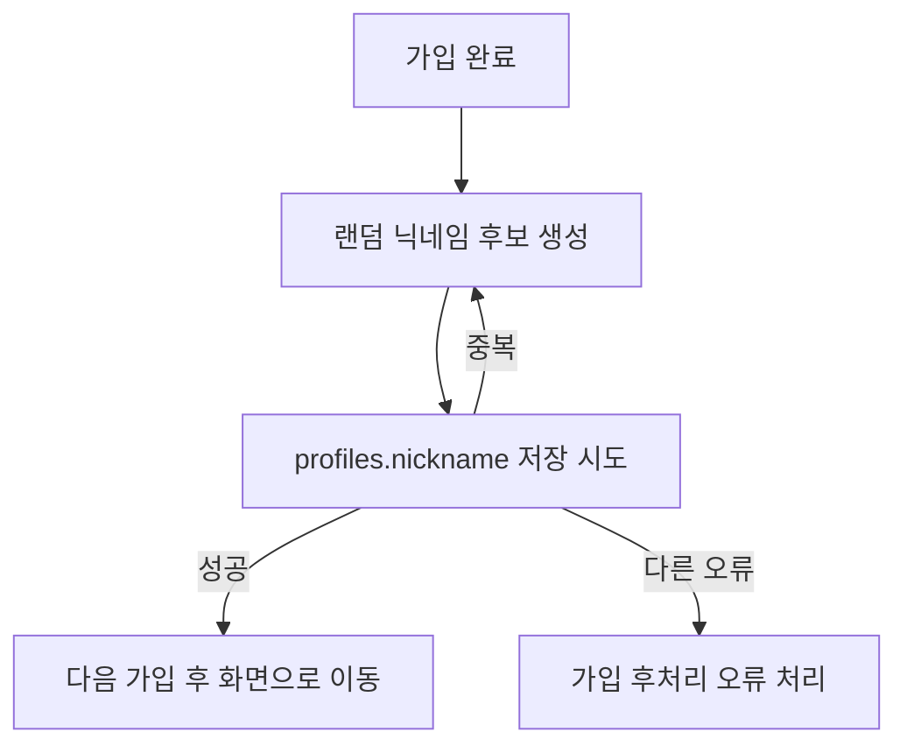

# SOT 변경 제안: 닉네임 필수 저장과 비식별 랜덤 기본값

## 결론

모든 회원은 `nickname`을 반드시 가지도록 한다. 소셜 가입에서 이름이나 닉네임을 제공받지 못해도 가입을 막지 않고, 이메일에서 만든 값이 아닌 비식별 랜덤 닉네임을 자동 저장한다.

예시:

- `talkpik-7f3k2a`
- `learner-8KQ2`

이메일의 `@` 앞부분, provider ID, 실명 추정값은 닉네임 자동 생성에 사용하지 않는다.

## 변경 이유

현재는 프로필 편집 화면에서 닉네임을 입력할 수 있고, 데이터베이스는 닉네임 중복을 막고 있다. 하지만 가입 직후 닉네임이 비어 있을 수 있다.

게시판 같은 공개 기능이 나중에 활성화되면 닉네임은 공개 식별자가 된다. 이때 닉네임이 비어 있으면 작성자 표시, 신고, 알림, 작성 이력, 차단 같은 기능의 기준이 흔들린다.

반대로 이메일 앞부분을 닉네임으로 쓰면 사용자가 공개 이름으로 의도하지 않은 이메일 ID가 노출될 수 있다. 그래서 기본값은 이메일과 무관한 랜덤 문자열이어야 한다.

## 정책

1. 신규 가입 사용자는 반드시 `profiles.nickname`을 가진다.
2. 이메일 가입과 소셜 가입 모두 같은 정책을 적용한다.
3. 소셜 provider가 닉네임을 제공해도 자동 확정하지 않는다.
4. `display_name`은 현재처럼 provider 이름 메타데이터가 있으면 보조로 저장한다.
5. `nickname` 자동값은 이메일, provider ID, 이름, 생년, 국가, 학교, 회사 같은 식별 가능 정보에서 만들지 않는다.
6. 자동 닉네임은 사용자가 프로필 편집 화면에서 바꿀 수 있다.
7. 닉네임 중복은 저장 전 후보 생성 단계에서 피하고, 데이터베이스 unique index로 최종 차단한다.
8. 동시에 같은 후보가 만들어져 충돌하면 새 랜덤 후보를 다시 시도한다.

## 허용 형식

처음 버전에서는 다음 중 하나로 정한다.

| 형식 | 예시 | 판단 |
| --- | --- | --- |
| `talkpik-<random>` | `talkpik-7f3k2a` | 추천 |
| `learner-<random>` | `learner-8KQ2` | 가능 |

권장 형식은 `talkpik-<random>`이다. 서비스 이름이 들어가 있어 자동 생성값임을 알기 쉽고, 이메일이나 실명과 연결되지 않는다.

랜덤 부분은 대소문자 혼합보다 읽기 쉬운 소문자/숫자 조합을 우선한다. 예: 6자리 base36.

## 중복 처리

`profiles.nickname`은 현재 case-insensitive unique index가 있다. 이 제약은 유지한다.

자동 생성 흐름:

권장 재시도 횟수는 5회다. 5회 모두 실패하면 가입 자체를 실패시키기보다 오류를 기록하고 사용자가 프로필에서 다시 저장할 수 있게 하는 방안을 검토한다. 다만 정책상 닉네임 필수 저장이 목표이므로, 실제 구현 시에는 서버 쪽에서 충분히 낮은 충돌 확률을 보장해야 한다.

## 화면 영향

- 가입 화면: 새 입력칸을 추가하지 않는다.
- 소셜 약관 동의 화면: 약관 동의 목적을 유지하고 닉네임 입력을 섞지 않는다.
- 학습 목표 설정 화면: 닉네임 때문에 진입을 막지 않는다.
- 프로필 편집 화면: 자동 생성 닉네임을 보여주고 사용자가 직접 변경할 수 있게 한다.
- 게시판 기능 활성화 시: 공개 작성자명은 `nickname`만 사용한다.

## 현재 구현과의 차이

현재 확인된 구현 기준:

- 이메일 회원가입은 `display_name`만 받는다.
- 소셜 가입 후처리는 `display_name/full_name/name`으로 `display_name`만 보강한다.
- `profiles.nickname`에는 case-insensitive unique index가 있다.
- 프로필 편집 화면은 닉네임 2~20자 검증을 한다.
- 저장 전 닉네임 중복 확인 버튼/API는 확인되지 않았다.

따라서 구현 시 다음이 필요하다.

1. 가입 직후 프로필 생성 또는 후처리 단계에서 랜덤 닉네임을 저장한다.
2. `profiles.nickname`이 없는 기존 사용자에 대한 보정 방식을 정한다.
3. 프로필 편집 저장 실패 중 닉네임 중복 오류를 사용자 문구로 고정한다.
4. 닉네임 허용 문자, 금칙어, 변경 제한 정책을 추후 게시판 활성화 전에 확정한다.

## 수용 기준

- 신규 이메일 가입자는 가입 후 `profiles.nickname`이 비어 있지 않다.
- 신규 소셜 가입자는 가입 후 `profiles.nickname`이 비어 있지 않다.
- 자동 닉네임은 이메일 `@` 앞부분과 무관하다.
- 자동 닉네임은 대소문자 차이만 다른 기존 닉네임과 충돌하지 않는다.
- 중복 후보가 발생하면 다른 후보로 재시도한다.
- 사용자는 프로필 편집 화면에서 닉네임을 바꿀 수 있다.
- 중복 닉네임으로 저장하면 알아듣기 쉬운 오류가 표시된다.

## 검토한 대안

| 대안 | 기각 이유 |
| --- | --- |
| 이메일 `@` 앞부분을 닉네임으로 사용 | 이메일 ID 일부가 공개 식별자로 노출될 수 있다. |
| provider nickname 자동 사용 | provider 닉네임은 사용자가 TALKPIK에서 공개 이름으로 쓰겠다고 확인한 값이 아니다. 중복 가능성도 있다. |
| 가입 단계에서 닉네임 직접 입력 필수 | 가입 마찰이 늘고 소셜 가입의 빠른 진입 장점을 줄인다. |
| 닉네임을 계속 선택값으로 유지 | 게시판 활성화 시 공개 작성자 식별 기준이 약해진다. |

## 관련 문서 후보

이 결정이 확정되면 다음 문서 갱신이 필요하다.

- `docs/Wireframe/01-A-01-sign-up/functional-spec.md`
- `docs/Wireframe/27-X-05-profile-editing/functional-spec.md`
- `docs/Wireframe/40-X-18-auth-consent/functional-spec.md`
- `docs/Wireframe/data-usage-index.md`
- `supabase/migrations/INDEX.md` if a migration is added

