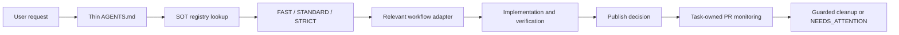

# Codex Workflow Overhaul Design

- Date: 2026-07-10
- Decision: approved
- Role: design record; not an active product SOT
- Source proposal: `docs/sot-change-proposals/2026-07-10-codex-workflow-overhaul.md`

## Goal

에이전트 정책의 중복과 충돌을 줄이고, Codex 작업이 독립 worktree에서 시작해 검증·게시·PR·안전한 정리까지 추적되도록 한다. UI 작업은 기존 레이아웃과 theme을 먼저 재사용하고 신규 page-specific global CSS를 만들지 않는 방향으로 전환한다.

## Approved architecture

### 1. Policy core

- root `AGENTS.md`는 정체성, 우선순위, 위험 등급, 안전 경계와 상세 문서 진입점만 가진다.
- `docs/sot-registry.json`이 문서 역할과 lifecycle을 관리하는 canonical registry다.
- `docs/INDEX.md`는 registry에서 생성되는 읽기 전용 색인이다.
- 상세 절차는 `docs/agent-workflow/core.md`, `codex.md`, `ui.md`가 소유한다.
- root `CLAUDE.md`와 `.claude/CLAUDE.md`는 공통 정책을 복제하지 않는 얇은 진입 문서로 정리한다. Claude 고유 adapter는 후속 범위다.

### 2. Codex lifecycle

```text
DISCOVERED → ISOLATED → SYNC_DECISION → WORKING → VERIFIED
→ COMMITTED → PUBLISHED → PR_OPEN → MERGE_VERIFIED
→ FINALIZING → CLEANED
```

- 하나의 task가 하나의 의미 있는 slug, branch, worktree를 소유한다.
- PR을 만든 task가 merge 감시 상태도 소유한다. 중앙 sweeper는 두지 않는다.
- 실제 cleanup은 대상 worktree 밖의 task-specific ephemeral supervisor가 수행한다.
- dirty, untracked, ignored-sensitive, unknown owner, active process, lock 충돌은 삭제하지 않고 `NEEDS_ATTENTION`으로 보존한다.
- `--force` cleanup은 제공하지 않는다.

Codex Desktop heartbeat와 native cleanup 수명주기는 아직 증명되지 않았다. Phase 0 spike가 실패하거나 증거가 부족하면 Desktop owner는 report-only로 유지한다.

### 3. UI ownership

UI 선택 순서는 다음과 같다.

1. 기존 공통 컴포넌트와 Page Recipe
2. Ant Design props
3. theme token 또는 scoped `ConfigProvider`
4. Tailwind layout utility
5. 사유·owner·만료 조건이 기록된 CSS exception

신규 page-specific `global.css`, broad `.ant-*` override, raw visual token은 diff-only 검사부터 차단한다. 기존 부채는 화면별 STRICT remediation lane에서 동작과 시각 회귀를 잠근 뒤 이관한다.

## Data and control flow



## Error handling

- Registry schema, missing path, duplicate active scope, generated index drift는 checker 실패로 드러낸다.
- Proposal은 `accepted_pending_promotion`이어도 active로 오인하지 않는다.
- Desktop lifecycle 미검증은 cleanup 추측 실행이 아니라 report-only downgrade로 처리한다.
- 기존 worktree 정리는 read-only inventory와 사용자 검토를 먼저 거친다.
- `collab`, production, remote Supabase, secret 관련 경계는 fail closed다.

## Verification strategy

- Registry와 index generator는 Vitest fixture로 schema, lifecycle, duplicate scope, missing path, drift를 검증한다.
- Phase 1 문서 변경은 link/path 검사와 policy conflict 검색을 함께 수행한다.
- lifecycle 도구는 별도 Phase 2에서 temp Git repository fixture로 검증한다.
- UI checker는 별도 Phase 4에서 허용/차단 fixture와 diff-only mode를 검증한다.
- 각 phase는 별도 rollback이 가능한 작은 변경 묶음으로 유지한다.

## Review-driven refinements

- canonical registry를 Markdown에서 JSON으로 바꾸고 Markdown은 생성물로 둔다.
- 초기 registry는 모든 문서를 active로 선언하지 않고 근거 있는 진입·우선순위 문서만 active로 등록한다.
- Desktop heartbeat/native cleanup spike를 lifecycle 구현보다 앞당겼다.
- legacy worktree read-only inventory와 수동 remediation을 초기 rollout으로 이동했다.
- 반복적인 global CSS 정리를 위한 사전 승인 STRICT remediation lane을 추가했다.
- 저장소에 정의되지 않은 전역 Lore 규칙 대신 프로젝트 소유의 가벼운 commit convention을 사용한다.
- 쉬운 결론 우선의 사용자 보고는 유지하고, 기술 보고의 자의적인 숫자 제한만 완화한다.

## Deferred decisions

- Claude 전용 lifecycle adapter
- cleanup enforce 활성화
- 대규모 `global.css` 이관
- 중앙 서비스 형태의 task registry

이 항목은 Phase 1에 포함하지 않는다.
