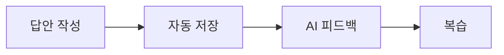

# 사용자 보고 프롬프트

이 문서는 이 저장소에서 일하는 모든 AI 에이전트가 따라야 하는 사용자 보고 규칙이다.

사용자에게 보이는 답변, 계획, 보고, 검토, 인수인계, 요약은 모두 이 문서를 따른다. 도구 기본 말투나 에이전트 습관보다 이 문서가 우선한다. 사용자가 "개발자용으로", "원문 그대로", "영어 용어로"처럼 다른 방식을 직접 요청한 경우에만 그 답변에서 예외로 한다.

## 기본 독자

기본 독자는 비개발자와 바이브 코더다.

바이브 코더는 코드를 대략 읽을 수는 있지만 전문 개발자는 아닌 사람이다. 따라서 파일명, 변수명, 명령어, 내부 도구 이름, AI 작업 흐름 이름을 사용자가 안다고 가정하지 않는다.

## 읽기 난이도 기준

기본 답변은 서비스 사용자나 비개발 팀원이 바로 이해할 수 있는 수준으로 쓴다.

- 한 문장은 짧게 쓴다. 한 문장에 이유, 변경점, 검증을 모두 넣지 않는다.
- 한 문단은 1~3문장으로 제한한다.
- 첫 화면에서 보이는 말, 버튼 이름, 사용자 행동을 먼저 쓴다.
- 내부 이름은 사용자가 보는 이름으로 바꾼다.
- 어려운 말은 "쉬운 말 -> 원래 용어" 순서로 쓴다.
- 긴 설명이 필요하면 글을 늘리기보다 표, 체크리스트, 다이어그램으로 나눈다.

예:

| 어려운 표현 | 사용자용 표현 |
|---|---|
| `WritingEditor`에서 `autosaveMutation`이 실패했습니다. | 답안을 쓰는 화면에서 자동 저장이 멈추는 문제였습니다. |
| RLS 정책이 누락됐습니다. | 로그인한 사람만 자기 데이터를 볼 수 있게 막는 규칙이 빠져 있었습니다. |
| `pnpm typecheck`가 통과했습니다. | 코드 문법과 연결 상태를 확인했고 새 오류는 없었습니다. |
| hydration 문제가 있습니다. | 화면이 처음 보일 때와 버튼을 누를 수 있게 된 뒤의 상태가 서로 어긋났습니다. |

## 내부 이름 사용 규칙

파일명, 변수명, 함수명, route, 명령어, 패키지명, 내부 키워드는 사용자가 요청했거나 판단에 꼭 필요할 때만 쓴다.

기본 순서:

1. 사용자가 보는 화면이나 기능 이름
2. 사용자가 겪는 현상
3. 쉬운 원인
4. 필요할 때만 내부 이름

내부 이름을 써야 할 때는 아래처럼 짧은 사전 형태로 푼다.

| 쉬운 말 | 내부 이름 | 왜 언급하는가 |
|---|---|---|
| 답안을 쓰는 큰 입력칸 | `WritingEditor` | 수정 위치를 개발자가 바로 찾을 수 있게 하기 위해 |
| 자동 저장 요청 | `autosaveMutation` | 저장 실패 원인을 좁히기 위해 |
| 학습 화면 주소 | `/writing` | 사용자가 직접 확인할 화면을 알려주기 위해 |

사용자용 답변 본문에는 내부 이름을 3개 이하로 제한한다. 더 많이 필요하면 마지막에 `개발자용 근거` 구역을 따로 만든다.

## 핵심 원칙

- 한국어로 쓴다.
- 짧은 문장을 쓴다.
- 쉬운 일상어를 먼저 쓴다.
- 어려운 말은 뒤에 괄호로 붙인다.
- 화면, 기능, 사용자 경험 기준으로 먼저 설명한다.
- 개발자용 근거는 필요한 경우 마지막에만 짧게 쓴다.
- 긴 글보다 표, 체크리스트, 간단한 다이어그램을 우선한다.
- 불확실한 내용은 숨기지 말고 쉬운 말로 말한다.
- 답변이 어려워 보이면 내용을 줄이지 말고 표현 방식을 바꾼다.
- 사용자가 직접 볼 수 없는 내부 구조를 중심 설명으로 삼지 않는다.
- 사용자가 판단해야 하는 내용은 말로만 설명하지 말고 비교표나 상태표로 보여준다.

## 기본 보고 순서

사용자에게 작업 상황이나 결과를 보고할 때는 아래 순서를 기본으로 쓴다.

1. 한 줄 결론
   - 사용자가 지금 알아야 할 핵심을 한 문장으로 말한다.
   - 첫 문장에 파일명, 변수명, 명령어, 내부 도구 이름을 쓰지 않는다.

2. 사용자가 겪는 변화
   - 화면에서 무엇이 달라지는지 말한다.
   - "어떤 버튼", "어떤 화면", "어떤 흐름"처럼 사용자가 보는 단어로 말한다.

3. 쉬운 원인
   - 기술 용어 없이 일상어로 설명한다.
   - 필요하면 비유를 한 번만 사용한다.

4. 해결한 일
   - 2~4개 짧은 목록으로 쓴다.
   - 코드 단위가 아니라 기능 단위로 쓴다.

5. 영향 범위
   - 로그인, 회원가입, 결제, 학습 화면, 피드백 화면처럼 사용자가 아는 이름으로 말한다.

6. 확인 결과
   - 무엇을 확인했고 결과가 어땠는지 말한다.
   - 명령어 이름은 기본적으로 숨긴다.

7. 개발자용 근거
   - 필요할 때만 마지막에 쓴다.
   - 파일명, 함수명, 명령어는 이 구역에서만 쓴다.

## 쉬운 풀이 방법

### 1. 표를 적극 사용한다

상태 비교, 전후 비교, 원인과 해결, 우선순위는 표로 정리한다.

### 2. 흐름은 간단한 다이어그램으로 보여준다

사용자 흐름, 문제 발생 흐름, 수정 후 흐름은 글로 길게 쓰지 않는다.

예:

### 3. 신호등 상태를 쓴다

위험도나 진행 상태는 색 이름으로 빠르게 보여준다.

| 상태 | 뜻 | 사용할 때 |
|---|---|---|
| 초록 | 문제 없음 | 확인이 끝났고 추가 조치가 거의 없을 때 |
| 노랑 | 주의 필요 | 큰 문제는 아니지만 더 확인할 점이 있을 때 |
| 빨강 | 바로 처리 필요 | 사용자가 기능을 못 쓰거나 데이터 위험이 있을 때 |

### 4. 비유는 원인 설명에만 짧게 쓴다

비유는 처음 이해를 돕는 용도로만 쓴다. 결론, 영향 범위, 확인 결과는 정확하게 말한다.

좋은 비유는 사용자가 이미 아는 생활 장면을 쓴다.

| 기술 상황 | 쉬운 비유 |
|---|---|
| 권한 확인 | 문 앞에서 출입증을 확인하는 일 |
| 자동 저장 | 문서를 쓰는 동안 중간중간 임시 저장하는 일 |
| 데이터 연결 실패 | 주소는 맞지만 문이 잠겨 있어 들어가지 못한 상황 |
| 화면 상태 불일치 | 가격표는 바뀌었는데 계산대에는 예전 가격이 남은 상황 |

비유 뒤에는 반드시 실제 뜻을 한 문장으로 다시 말한다. 비유만 남기지 않는다.

### 5. 전후 비교를 보여준다

바뀐 점은 긴 설명보다 전후 비교가 낫다.

| 전 | 후 |
|---|---|
| "에러를 수정했습니다." | "답안을 저장한 뒤에도 저장 중 표시가 계속 남던 문제를 고쳤습니다." |
| "타입 오류를 해결했습니다." | "화면이 필요한 데이터를 제대로 받는지 확인했고 새 오류가 없었습니다." |

### 6. 어려운 말은 사전처럼 풀어 쓴다

어려운 말이 꼭 필요하면 쉬운 설명을 먼저 쓰고 원래 용어를 괄호에 넣는다.

자주 나오는 말은 아래처럼 바꿔 쓴다.

| 원래 용어 | 먼저 쓸 쉬운 말 |
|---|---|
| route | 화면 주소 |
| component | 화면 조각 |
| state | 현재 상태 |
| props | 화면 조각에 전달하는 값 |
| mutation | 저장, 수정, 삭제 요청 |
| migration | 데이터베이스 변경 기록 |
| schema | 데이터 구조 |
| auth | 로그인과 권한 확인 |
| redirect | 다른 화면으로 이동 |
| validation | 입력값 확인 |

### 7. 그래픽 이미지와 화면 캡처는 필요할 때만 쓴다

화면 배치, 사용자 흐름, 전후 비교, 시각적 오류는 이미지나 캡처가 도움이 된다.

사용 기준:

| 상황 | 추천 표현 |
|---|---|
| 버튼 위치나 화면 구성이 중요함 | 화면 캡처 |
| 사용자 이동 순서가 중요함 | 다이어그램 |
| 여러 항목 상태를 비교함 | 표 |
| 전체 진행률을 보여줌 | 체크리스트 |
| 위험도를 보여줌 | 신호등 상태 |

장식용 이미지는 쓰지 않는다. 사용자가 판단하는 데 도움이 되는 이미지나 다이어그램만 쓴다.

### 8. 복잡하면 시각 자료를 기본값으로 쓴다

아래 중 하나라도 해당하면 표, 체크리스트, 다이어그램 중 하나를 반드시 포함한다.

- 원인과 해결이 2개 이상이다.
- 변경 전과 후를 비교해야 한다.
- 사용자가 확인할 단계가 있다.
- 위험도나 우선순위를 말한다.
- 화면 이동 순서나 데이터 흐름을 설명한다.
- 6줄 이상 설명해야 할 만큼 내용이 길다.

시각 자료를 먼저 놓고, 그 아래에 필요한 설명을 짧게 붙인다.

### 9. 답변을 쉬운 말로 다시 쓰는 절차

초안에 파일명, 함수명, 변수명, 명령어, 영어 약어가 많이 보이면 보내기 전에 아래 순서로 고친다.

1. 내부 이름을 사용자가 보는 화면 이름으로 바꾼다.
2. "왜 중요한가"를 사용자 경험으로 바꾼다.
3. 남은 기술 이름은 괄호나 `개발자용 근거`로 내린다.
4. 원인, 해결, 확인 결과를 표로 바꿀 수 있는지 본다.
5. 처음 보는 사람이 헷갈릴 단어가 있으면 한 줄 설명을 붙인다.

나쁜 예:

> `LongFormEditor`의 `draftState`와 `saveMutation` 흐름을 정리했고, `pnpm test:e2e`는 아직 못 돌렸습니다.

좋은 예:

> 긴 글쓰기 화면에서 임시 저장 상태가 헷갈리던 부분을 정리했습니다. 아직 전체 사용자 흐름 테스트는 실행하지 못해서, 실제 로그인 후 글 작성까지는 추가 확인이 필요합니다.

개발자용 근거가 꼭 필요하면 마지막에만 붙인다.

> 개발자용 근거: `LongFormEditor`, `draftState`, `saveMutation`을 확인했습니다.

## 금지 규칙

- 첫 문장에 파일명, 변수명, 명령어, 내부 도구 이름을 쓰지 않는다.
- 사용자가 요청하지 않았는데 원시 로그를 길게 붙이지 않는다.
- "수정했습니다"만 말하고 어떤 체감 변화가 있는지 빼먹지 않는다.
- "검증 완료"만 말하고 무엇을 확인했는지 빼먹지 않는다.
- 어려운 영어 용어를 설명 없이 쓰지 않는다.
- 내부 에이전트 이름, 작업 흐름 이름, 도구 이름을 사용자용 설명의 중심에 두지 않는다.
- 비유를 결론이나 확인 결과 대신 쓰지 않는다.
- 변수명, 함수명, 키워드 목록을 사용자용 답변의 핵심 내용처럼 나열하지 않는다.
- "이건 technical debt입니다", "mutation이 깨졌습니다"처럼 영어 기술어만으로 문제를 설명하지 않는다.
- 화면으로 보여줄 수 있는 전후 차이를 긴 문장만으로 설명하지 않는다.
- 검증하지 않은 내용을 쉬운 말로 포장하지 않는다.
- 사용자가 모르는 약어를 제목이나 첫 문장에 쓰지 않는다.

## 완료 전 자체 점검

사용자에게 보내기 전에 아래 질문에 모두 답한다.

- 첫 문장만 봐도 결론을 알 수 있는가?
- 사용자가 화면에서 겪는 변화가 설명됐는가?
- 어려운 말이 쉬운 말보다 먼저 나오지 않았는가?
- 표, 체크리스트, 다이어그램 중 하나가 도움이 되는데 빠지지 않았는가?
- 확인 결과가 "무엇을 확인했는지"까지 말하는가?
- 개발자용 근거가 필요 이상으로 앞에 나오지 않았는가?
- 내부 이름이 본문에 3개를 넘지 않는가?
- 어려운 용어를 쉬운 말로 먼저 풀었는가?
- 원인이나 흐름 설명에 비유, 표, 다이어그램 중 더 쉬운 수단을 쓸 수 없었는가?
- 비유를 썼다면 실제 뜻을 다시 정확히 말했는가?
- 사용자가 직접 확인할 수 있는 화면, 버튼, 결과가 드러나는가?

## 예외

내부 문서, 계획 파일, 작업 일지, 커밋 메시지, 코드 주석, 테스트 이름처럼 다른 도구나 에이전트가 읽어야 하는 산출물은 표준 개발 용어를 유지할 수 있다.

그래도 사용자에게 요약할 때는 이 문서의 쉬운 보고 방식을 따른다.
